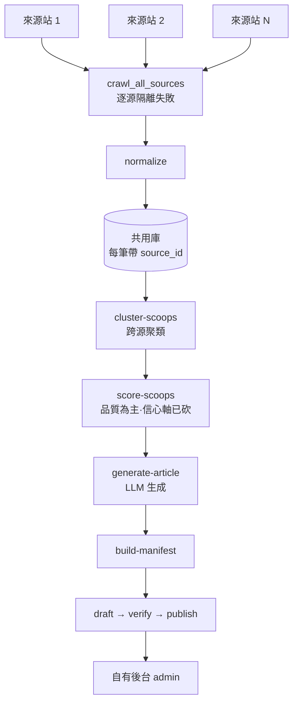

# 多來源匯整：成熟度與可複用性提升

## Problem Frame

擁有者其實已經在用這套工具跑多個來源站（`out/` 裡混著 51cg1.com + 51pornhub.com 的產出），但工具**沒有「多個來源餵進同一個庫」的一級概念**。多來源爬取的能力其實已經寫在程式裡（`core/pipeline.py` 的 `crawl_all_sources`），卻**搆不到**：`sources` 這個設定鍵不在 `webui_config` 的 DEFAULTS、不在 `configs/webui.yaml`、不在設定表單，而且 `webui_config.save()` 會把不認得的鍵直接丟掉——手動加進去的來源清單會被靜默清掉。同時主畫面的「立即爬取」按鈕仍只爬單一 `start_url`，只有 `/today` 流程用到多來源，造成**心智模型分裂**。

目標：把「爬 N 個自有/來源站 → 匯進同一個庫 → 跨源聚類打分 → 生成一篇稿 → 發到自己的後台」變成**一級、可靠、可重複**的工作流；並順手補掉讓「重複無人值守跑」變脆弱的成熟度缺口。

## Requirements

**A. 把「來源」做成一級概念（核心解鎖）**
- R1. `sources` 成為真正的設定欄位：出現在 `webui_config` DEFAULTS、`configs/webui.yaml`（一個 per-source dict 清單：`source_id`、`start_url`、`item_regex`/`allow`/`deny` 覆寫、`enabled`），並且被 `load()`/`save()` 保留（今天 `save()` 會丟掉不認得的鍵）。**附帶（經查碼）**：`min_text_chars` 是同一個 bug 的另一個受害者——已被 `pipeline.crawl_items` 讀取,卻不在 DEFAULTS/yaml,會被 `save()` 丟掉；修 `save()` 時一併把它加進 DEFAULTS。
- R2. 主爬取路徑（WebUI「立即爬取」按鈕 + 既有 `run_pipeline` 入口）改用 `crawl_all_sources` 爬**所有啟用的來源**，與 `/today` 流程一致；單一來源變成 N=1 的特例,不再是另一條路徑。單一來源失敗絕不中斷整批（沿用 `crawl_all_sources` 既有契約）。**待釐清的前置（見未決問題）**：① `sources` 一旦進 DEFAULTS,舊的「無 sources 就退回單 `start_url`」分支將永不觸發——須定義 `sources` 預設值與「N=1 對應什麼」,否則舊單站行為是**靜默退役**而非保留；② 按鈕的零來源/全停用前置擋與文案須重定（目前只擋空 `start_url`）；③ 操作者須看得到**逐來源**結果（哪個來源零產出/失敗）,不能只給一個合併總數。
- R3. （本輪,唯讀）WebUI **顯示**來源清單與各來源狀態（`source_id` / `start_url` / `enabled` / 上次爬取結果）,讓操作者看得到設定檔裡有哪些來源；本輪不提供網頁端編輯,新增/改/刪仍走 YAML。須明確定義唯讀清單與現有單來源表單的版面關係（取代、並列、或新頁——見未決問題）與空/全停用/失敗狀態。
- R3b. （下一輪）WebUI 完整來源 CRUD：網頁端新增 / 編輯 / 移除 / 啟用停用,不必手改 YAML。

**B. 來源身分（出處標示,供顯示/篩選——非佐證評分）**
- R4. 庫裡每一筆都帶非空、正確的 `source_id` 出處（PR #33 已修空 source_id；確保所有入庫路徑都保證這點）。**用途已改**:純粹給「這筆來自哪個來源」的顯示與篩選,**不再**餵進信心/佐證分數（見 Key Decisions「砍信心軸」）。
- ~~R5.~~ **【已砍,2026-06-22 拍板】** 原為「信心分數=獨立來源數、鏡像收斂」。決定移除:資料顯示實際幾乎單一來源（51cg1 30 包 vs 51pornhub 1 包）、來源多為同源轉載,跨源獨立佐證對本內容領域無意義;3 個審查員亦判此為最脆部分。**對應動作**:`score-scoops` 的**信心（confidence）維度停用或中性化**,只保留品質（quality）評分;`/today` 不以「來源佐證數」排序/把關;`cluster.py` 的 `source_count` 至多作資訊顯示,不作可信度訊號。
- R6. 來源層級的爬取抽取:允許在設定裡對各來源覆寫文章正文 / 圖片 / 發布時間的選擇器,因為不同來源站 HTML 結構不同,目前固定形狀的抽取器在非 `
`/`<li>` 版面會抽不全（先前以 YAGNI 推遲「等第二個來源出現再做」——它已經出現了）。

**C. 匯整軌的契約與一致性（scoop 軌是新的主幹）**
- R7. scoop / prep / generation 三個 orchestrator 回傳**有型別**的結果（`core/schema.py` 的 TypedDict）,與既有 legacy 軌一致,取代目前的臨時 dict。
- R8. `build_manifest` 這個匯流點給一份**明確、有文件**的「package input」契約,由兩條產出軌共用,取代目前隱性的 `caption`=正文 欄位約定與 `https://scoop.local/<cluster_id>` 合成 URL 的 hack。

**D. 共同地基的成熟度修補（無論方向都做——便宜、提升信任）**
- R9. 修 `examples/scheduling.md`：該檔**目前仍寫著**已從程式移除的 `select-cover`/`watermark-cover`（刪掉這些殘留引用是本輪**交付項**,不是前置條件）；並提供一份**跑得起來的多來源 cron 範本**（目前範本一跑就 command-not-found）。
- R10. 文件對齊現實：README/system-analysis 的測試數（273 → 381,並改為指向 `make test-full` 取即時數、避免再寫死）、重建過期的 `.coverage` 與 `egg-info`、補上 scoop/library/today/generate-article 指令的對外說明（目前約 1/3 已安裝指令零文件）。
- R11. SQLite 重疊執行的韌性：每條連線都設 `PRAGMA busy_timeout`,讓並行寫入者**等待**而非以「database is locked」崩潰。
- R12. 測 LLM 對外 HTTP（`core/llm.py` 的 `chat`）：注入假 transport 覆蓋 `urlopen`、HTTP/URL error→型別例外的映射、以及空/壞回應分支（目前 66% 覆蓋,81–112 行未測）。
- R13. 審計日誌與不覆寫寫檔改原子化：`audit.purge_before`/`record` 與 `filesystem.write_text_no_overwrite` 改用 temp 檔 + `os.replace`,避免崩潰或並行清理截斷耐久記錄、或讓半寫檔毒化「不覆寫」的冪等性。

**E. 可維護性（讓上面的事不會引發大量改動）— 次要**
- R14. 把 `run_auto_pipeline` 裡三段幾乎一樣的 draft/verify/publish 迴圈,收斂成單一參數化的 stage runner；把假裝 CLI 參數的 `SimpleNamespace`（在 4 處重建、欄位會漂移）換成單一型別化的後台呼叫契約。

## Success Criteria

- 從乾淨設定出發,加第 2/3 個來源**本輪 = 一次 YAML 設定編輯**（零改碼；網頁端點選新增屬 R3b 下一輪）——而且一次爬取就把它們全部匯進庫,`/today` 的瓜清單能列出**來自全部啟用來源**的項目且 `source_count` 正確。
- `examples/` 的每日 cron 範本能端到端跑完,不再 command-not-found,且會匯整所有啟用來源。
- ~~信心分數反映獨立來源佐證~~ **【已砍——見 Key Decisions「砍信心軸」】** 改為:`score-scoops` 的品質評分維持可用,且不因多來源匯入而退化（品質是保留下來的排序依據）。
- 兩個重疊執行（`auto_pipeline` + 手動）不會因 SQLite 鎖而崩潰。
- 文件對得上現實（測試數、指令清單）；新操作者光看 README 就能架起一個雙來源設定。

## Scope Boundaries

- **不做多租戶隔離（A 模型）**：這一輪不把狀態/輸出按獨立發布目標分區。一個共用庫、一個後台。
- **不做對外發佈（C 模型）**：這一輪不重構套件命名空間（`src`/`core`/`browser`/`webui` 維持原樣）、不上 PyPI、不加 LICENSE/對外英文文件。（註：命名空間撞名 + 缺 LICENSE 這兩個 blocker **依然真實存在**,若日後要對外散佈必須處理——此處只記錄為「延後」,非「已解決」。）
- **不改發布/後台模型**：仍是單一自有 admin,手動 `--approve` 閘門不動。
- **不做 i18n**：中文字串維持,不抽訊息層。
- **不做多來源「信心/佐證」評分（本輪拍板砍掉）**：跨源獨立佐證對本內容領域無意義（來源多同源轉載、且實際近單一來源）。保留品質評分;`source_count` 僅作資訊顯示。

## Key Decisions

- 「多站」= **匯整（N 來源 → 1 庫 → 1 篇稿）**,而非租戶隔離——擁有者拍板;與 scoop 軌既有走向、以及被埋住的 `crawl_all_sources` 接縫一致。
- scoop/匯整軌是往後的**主幹**;legacy 單來源轉貼路徑變成 N=1 特例。
- 共同地基的韌性/文件修補（D 組）一併納入,因為它們便宜且直接影響「重複無人值守的多來源執行」。
- **（假設,若不對請說）** R3 來源管理這一輪採「**設定檔優先 + WebUI 唯讀顯示**」,把完整 CRUD 編輯 UI 留到下一輪——較小的第一刀,符合既有 YAGNI 風格。
- **【2026-06-22 拍板】砍掉「多來源信心/佐證」軸（原 R5,及 R4 的佐證用途）**：依 `out/` 實證,實際近單一來源（51cg1 30 包 vs 51pornhub 1 包）、來源多同源轉載,跨源獨立佐證無意義。保留品質評分;R4 的 source_id 降級為純顯示/篩選出處。**連帶解掉** Review 的兩個 P1：「來源獨立性前提」與「信心顯示時序」皆因不做信心軸而消失。
- **產出品質的驗收（採用預設,可改）**：本輪用輕量人工驗收——「隨機看 5 篇生成稿,主觀沒比單來源差」即算過;不投資自動品質指標。

## Dependencies / Assumptions

- 假設自有後台（發布目標）不變且已能運作（`browser/backend_driver` + `backend.yaml`）。
- 假設私有 LLM 端點（`configs/llm.yaml`）維持;供應商本來就可設定切換。
- ~~R5（鏡像獨立性）依賴對「獨立來源」的明確定義~~ 已隨「砍信心軸」移除。

## Outstanding Questions

### Resolve Before Planning
- **（已清空,無剩餘阻斷項 → 可進 `/ce:plan`）** 原 3 項策略問題均已拍板：① 來源獨立性 → **砍信心軸**（見 Key Decisions）;② 信心顯示時序 → 隨①消失;③ 產出品質度量 → 採輕量人工驗收（看 5 篇沒變差,見 Key Decisions）。

### Deferred to Planning
- [Affects R3][Technical] 來源管理的設定 schema(per-source dict 清單)與 `load()/save()` 保留未知鍵的具體改法。
- [Affects R6][Technical][Needs research] 來源層級抽取設定(每來源的 CSS 容器選擇器)如何穿進 `crawl_posts.py` 裡那個子行程內的 Scrapy spider closure。
- [Affects R7/R8][Technical] 確切的 TypedDict 形狀與共用的 PackageInput 契約。
- [Affects R11][Technical] `busy_timeout` 設在哪(`core/db.py` 的 connect)與值。
- ~~[Affects R5] 跨網域近重複偵測門檻~~ 隨「砍信心軸」移除,本輪不需要。
- [Affects R8][Technical] 拔掉 `scoop.local` 合成 URL 後,匯整文章帶什麼 `canonical_url`（發布去重的主鍵就是它）?須給每個 cluster 一個**穩定唯一**識別,否則跨輪重生會誤判「已發布」或互撞。
- [Affects R3/版面][Technical] 唯讀來源清單在 `/settings` 的位置與和現有單來源表單的關係（取代/並列/新頁）,及空/全停用/失敗狀態。

## 建議分階段（供你在 handoff 時挑工程量）

- **第一刀(最小可用)**：R1 + R2 + D 組(R9–R13)。解鎖多來源 + 把地基修穩,多為小到中工程。**Review 提醒**:R11/R13 是並行/原子性修補,需整合測試,別當「零風險」。（信心顯示時序的提醒已隨「砍信心軸」失效。）
- **第二刀(B 完整,信心軸已砍)**：R3(唯讀顯示) + R4(出處顯示/篩選) + R6(來源層級抽取) + R7 + R8(契約收斂)。~~R5 已砍~~。
- **第三刀(可選)**：R14 可維護性重構。

## Next Steps

→ 三個策略問題均已拍板（砍信心軸 + 輕量品質驗收）,**無剩餘阻斷項**。建議 `/ce:plan`,從「第一刀」(R1+R2+D) 起;第二刀為 R3/R4/R6/R7/R8（R5 已砍）;第三刀 R14 可選。
