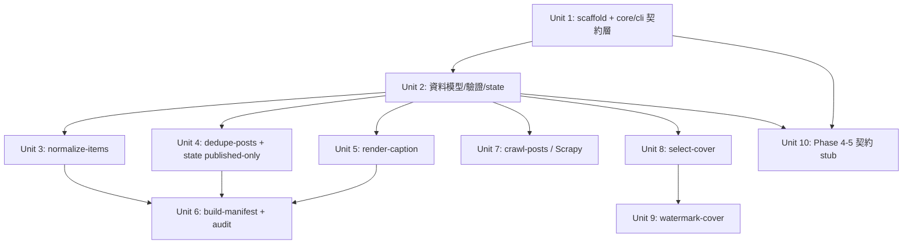

# feat: local-crawl-post-factory — Phase 1-3 pipeline + Phase 4-5 contracts

## Overview

建立一條 CLI-first、可 shell pipe 串接、stateless-by-default 的本地內容管線：爬取自有站台最新內容 → 標準化 → 去重 → 生成固定格式文案 → 下載/挑選封面 → 加浮水印 → 打包成 post package。

本次交付 **Phase 1-3**（資料 + 媒體管線，不碰瀏覽器），並**先定稿 Phase 4-5（draft/verify/publish）的契約**（CLI flags、manifest backend 欄位、`backend.yaml` selector schema、`--approve` gating stub），避免日後返工。瀏覽器自動化的「行為」留待後續版本。

技術 stack 由 origin doc 釘死：Python 3.11、Scrapy、Pillow、SQLite、pytest（Playwright 僅 Phase 4 依賴，本次只列契約）。

## Problem Frame

操作自有/私有網站時，要把自家內容最新 URL 重新打包成標準化貼文，再灌進**沒有 API、只能靠後台表單**的 admin。目前全靠人工，慢、易錯、無法批次/排程。需要把爬取、生成、媒體、建草稿、驗證、發布**用明確階段隔開**，且**爬完絕不直接發布**。(see origin: docs/brainstorms/2026-06-15-local-crawl-post-factory-requirements.md)

## Requirements Trace

- R1. 實作並測試七個 Phase 1-3 CLI：`crawl-posts`、`normalize-items`、`dedupe-posts`、`render-caption`、`select-cover`、`watermark-cover`、`build-manifest`。
- R2. 所有命令遵守 I/O 契約：成功→stdout 只輸出 JSON/NDJSON、stderr 空、exit 0；失敗→stdout 空、stderr 一行診斷、exit 碼 1–5（origin §2.3/§13）。
- R3. 命令可在 shell pipeline 無狀態串接（origin §12.1 整條 pipe 跑通）。
- R4. `select-cover` / `watermark-cover` 絕不覆寫原始檔；輸出檔名 deterministic。
- R5. 相同 normalized item + config → 相同 manifest 與輸出檔（deterministic package）。
- R6. Phase 4-5 的 CLI flags、manifest 狀態欄位、`backend.yaml` selector schema 本次定稿（只定契約不實作行為）。
- R7. 後台＝自家 admin：選擇器一律來自 `backend.yaml`，Python 零硬編碼 selector。
- R8. `publish-post` 無 `--approve` 或狀態非 `draft_verified` 時必須拒絕。
- R9. dedupe 只認 `published`：只有 SQLite 標記 published 的 `canonical_url`/`title_hash` 才算處理過並被跳過。
- R10. `crawl-posts` 不得寫 state；state 寫入時機依 origin §9。

## Scope Boundaries

- 首版**不實作**瀏覽器行為（draft/verify/publish 只定契約 + 拒絕性 stub）。
- 不做 WebUI、不做 LLM 文案（固定模板）、不依賴付費 LLM API。
- 不繞過 login/CAPTCHA/anti-bot；只操作自有/授權站台。
- 不做 `crawl-and-publish` 合併命令。

## Context & Research

### Relevant Code and Patterns

- Greenfield 專案（本次建立全部目錄與檔案），無既有 pattern 可循。專案結構採 origin §3 提案：`src/`（各 CLI 入口）、`core/`（共用：schema/validators/url_utils/audit/filesystem/manifest/state）、`browser/`（Phase 4 stub）、`configs/`、`templates/`、`state/`、`tests/`。
- **共用 CLI 契約層是地基**：所有命令的 stdin→stdout NDJSON、exit code 對映、例外→stderr 單行，集中在 `core/cli.py`，所有 `src/*.py` 一律走它，確保 R2 跨命令一致。

### Institutional Learnings

- 無 `docs/solutions/`（新專案）。

### External References

- 本次略過外部研究：stack 與用法由 origin doc 規定，且 greenfield 無本地 pattern 衝突。Scrapy 單次 CLI 輸出 NDJSON 的整合方式列為 Deferred（Unit 7）。

## Key Technical Decisions

- **集中式 CLI 契約層 (`core/cli.py`)**：用單一 decorator/runner 包住每個命令，統一捕捉例外並對映 exit code、保證成功時 stderr 全空。理由：R2 要求契約跨 13 個命令穩定，分散實作必漂移。
- **stdin/stdout 一律 NDJSON、逐行處理**：管線階段彼此無狀態、可 `|` 串接、可 cron/agent 批次。理由：R3。malformed 行立即 exit 2（origin §13.1）。
- **dedupe 只認 published（R9）**：`core/state.py` 的 `is_processed()` 只查 `status='published'`。副作用：首版（尚無 publish）dedupe 實質永遠放行 —— 預期行為，非 bug，需在程式註解與測試 fixture 明示。
- **selector 全 config-driven（R7）**：`backend.yaml` 載入後以 schema 驗證；`browser/selector_recipe.py` 只負責「讀 config + 提供 selector」，不含任何寫死字串。Phase 4 行為未實作，但 schema 與載入/驗證本次完成。
- **deterministic 輸出**：`post_id = YYYYMMDD_<slug(canonical_url)>`；`content_hash = sha256(canonical_url + title + caption)`；watermark 輸出檔名由 `content_hash` 前綴決定。理由：R5。
- **不覆寫原始檔（R4）**：`select-cover` 下載到 `cover_path`，`watermark-cover` 永遠輸出**新檔**；若目標檔已存在則跳過下載/沿用，不覆寫。

## Open Questions

### Resolved During Planning

- 後台類型 → 自家 admin，selector 純 config-driven（origin 決策）。
- 首版範圍 → Phase 1-3 + Phase 4-5 契約 stub（origin 決策）。
- dedupe 基準 → 只認 published（origin 決策）。

### Deferred to Implementation

- **Scrapy 單次 CLI 整合方式**（`CrawlerProcess` in-process vs `subprocess` 包 spider）：實作 Unit 7 時依「能乾淨把 item 寫 stdout NDJSON 且 log 全進 stderr」決定。
- **首版 dedupe 永遠放行的開發期驗證手段**：傾向純靠單元測試塞 SQLite fixture（預先 insert published 列）測跳過邏輯，不另加 `--seen-from` 旗標；若實作時發現不足再加。
- **`backend.yaml` 動態插值 selector**（`result_title: 'table >> text={title}'`）在真實自家後台 DOM 是否可靠：需有真實後台時驗證，屬 Phase 4。
- caption 模板的 hashtags/CTA 來源欄位細節，render-caption 實作時對齊 `templates/fixed-format.zh.yaml`。

## High-Level Technical Design

> *以下說明預期形狀，僅供審查方向參考，非實作規格。實作 agent 應視為脈絡，而非照抄的程式碼。*

管線資料流與狀態寫入點：

```text
crawl-posts ──NDJSON──> normalize-items ──> dedupe-posts ──> render-caption
   (不寫 state)            (驗證/清洗)      (讀 state:        (套模板 + content_hash)
                                            只跳 published)
   ──> select-cover ──> watermark-cover ──> build-manifest
       (下載,不覆寫)      (Pillow,輸出新檔)   (建 out/<post_id>/, 寫 manifest.json/
                                            caption.txt/preview.html;
                                            state insert package_built;
                                            audit.jsonl 記一筆)
   ───────────────[Phase 1-3 本次交付]───────────────
   ──> draft-post ──> verify-draft ──> publish-post --approve   [Phase 4-5: 僅契約 stub]
```

共用契約層（每個命令都套）：

```text
core/cli.run(handler):
    讀 stdin / args → try handler → 成功: 寫 stdout, exit 0
    例外分類 → stderr 單行診斷 + exit{1 usage,2 validation,3 dependency,
                                      4 external,5 internal}
    (成功路徑保證 stderr 為空)
```

## Implementation Units



### Phase A — 地基

- [ ] **Unit 1: 專案 scaffold + `core/cli` 契約層**

**Goal:** 建立目錄/封裝結構與統一 CLI 契約 runner，讓後續所有命令免費獲得 R2 行為。

**Requirements:** R2, R3

**Dependencies:** None

**Files:**
- Create: `pyproject.toml`（console_scripts 註冊 7+3 個命令）、`src/__init__.py`、`core/cli.py`、`core/errors.py`（exit-code 例外類別）、`core/io_ndjson.py`（逐行讀寫 helper）
- Create: 空目錄佔位 `configs/`、`templates/`、`state/`、`out/`、`logs/`、`inputs/`
- Test: `tests/test_cli_contract.py`

**Approach:**
- `core/errors.py` 定義 `UsageError(1)/ValidationError(2)/DependencyError(3)/ExternalError(4)`，未捕捉例外→5。
- `core/cli.run()` 包住 handler：成功寫 stdout、exit 0、stderr 必空；例外→`sys.stderr` 單行 + 對映碼。
- `io_ndjson.read_stdin()` / `write(obj)` 逐行 JSON。

**Patterns to follow:** 無（本 Unit 即建立全專案的 pattern 來源）。

**Test scenarios:**
- Happy path: handler 回傳 dict list → stdout 為合法 NDJSON、stderr 空、exit 0。
- Error path: handler raise `ValidationError` → stdout 空、stderr 恰一行、exit 2。
- Error path: handler raise 未預期例外 → exit 5、stderr 一行。
- Edge case: 空 stdin → 成功、stdout 空、exit 0（非錯誤）。

**Verification:** 用一個 dummy 命令驗證四種退出碼與 stdout/stderr 分流符合 origin §10。

- [ ] **Unit 2: 資料模型、驗證、SQLite state**

**Goal:** 定義 Crawled/Processed/Manifest 模型、URL 正規化與雜湊、SQLite `items` 表存取層。

**Requirements:** R5, R9, R10

**Dependencies:** Unit 1

**Files:**
- Create: `core/schema.py`（模型 + required/optional 欄位）、`core/validators.py`（canonical_url 合法性、title 非空）、`core/url_utils.py`（正規化、slug、title_hash、content_hash）、`core/state.py`（建表、`is_processed()`、`mark()`）
- Test: `tests/test_models_validators.py`、`tests/test_state.py`

**Approach:**
- 模型用 dataclass + 明確 required 欄位（origin §5）。
- `state.py` 依 origin §9 schema 建表；`is_processed(canonical_url, title_hash)` **只查 `status='published'`**（R9）；`mark(status, ...)` 供後續階段呼叫。
- 雜湊規則：`content_hash = sha256(canonical_url|title|caption)`，`title_hash = sha256(normalized_title)`。

**Test scenarios:**
- Happy path: 完整 crawled item 通過驗證、產出穩定 `post_id`/`content_hash`（同輸入→同輸出，驗 R5）。
- Edge case: title 為空白字串 → 驗證失敗。
- Edge case: canonical_url 缺失/非法 scheme → 驗證失敗。
- Integration: `state` 預插一列 `status='published'` → `is_processed` 回 True；插一列 `status='package_built'` → `is_processed` 回 **False**（驗 R9 只認 published）。
- Edge case: state 檔不存在 → 自動建表、`is_processed` 回 False。

**Verification:** 模型/雜湊純函數可重現；state published-only 語意有測試鎖定。

### Phase B — 資料管線

- [ ] **Unit 3: `normalize-items`**

**Goal:** 清洗/驗證 crawled NDJSON → normalized NDJSON。

**Requirements:** R1, R2

**Dependencies:** Unit 2

**Files:** Create `src/normalize_items.py`; Test `tests/test_normalize_items.py`

**Approach:** 正規化 URL、trim title、正規化 published 日期、清空白、移除空欄、確保 canonical_url 存在；malformed 行 → exit 2（origin §4.2/§13.1）。

**Test scenarios:**
- Happy path: 雜亂 item（多餘空白、trailing slash）→ 乾淨 normalized item。
- Error path: 非法 JSON 行 → stdout 空、exit 2、stderr 一行。
- Error path: 缺 title → exit 2。
- Edge case: 缺 canonical_url 但有 url → 由 url 補出 canonical。

**Verification:** origin §17(2) malformed 被拒。

- [ ] **Unit 4: `dedupe-posts` + state 讀取**

**Goal:** 過濾已 published 項目，只輸出新項。

**Requirements:** R1, R9, R10

**Dependencies:** Unit 2

**Files:** Create `src/dedupe_posts.py`; Test `tests/test_dedupe_posts.py`

**Approach:** `--state PATH`；對每行算 `title_hash`，呼叫 `state.is_processed`；命中則丟棄。只讀不寫 state（寫入屬 build-manifest 之後）。

**Test scenarios:**
- Happy path: state 為空 → 所有項皆通過（含「首版永遠放行」情境）。
- Integration: state 內有同 canonical_url 且 status=published → 該項被跳過。
- Integration: state 內有同 title_hash（不同 url）→ 被跳過。
- Edge case: 新 canonical_url → 輸出。

**Verification:** origin §14.5 三條去重測試全過。

- [ ] **Unit 5: `render-caption`**

**Goal:** 套固定格式模板生成 caption，加進 NDJSON。

**Requirements:** R1, R5

**Dependencies:** Unit 2

**Files:** Create `src/render_caption.py`、`templates/fixed-format.zh.yaml`; Test `tests/test_render_caption.py`

**Approach:** `--template PATH` 載入 YAML；以 `{title}/{description}/{canonical_url}/{hashtags}` 安全插值；強制 `max_chars` 截斷；保留來源 URL；不臆造事實（缺欄位以空字串處理）。

**Test scenarios:**
- Happy path: 完整 item → caption 含 title/description/canonical_url/CTA。
- Edge case: description 缺 → 不報錯、該段留空、其餘正常。
- Edge case: 超過 max_chars → 截斷且仍保留 canonical_url。
- Happy path: 同輸入同模板 → 同 caption（驗 R5）。

**Verification:** origin §17(4) caption 由模板生成。

- [ ] **Unit 6: `build-manifest` + audit log**

**Goal:** 把處理後 item 打包成 `out/<post_id>/`，寫 manifest.json/caption.txt/preview.html，state 標 `package_built`，audit 記一筆。

**Requirements:** R1, R5, R10

**Dependencies:** Unit 3, Unit 4, Unit 5（消費其輸出）

**Files:** Create `src/build_manifest.py`、`core/manifest.py`、`core/audit.py`、`core/filesystem.py`; Test `tests/test_build_manifest.py`、`tests/test_audit.py`

**Approach:** `--out PATH`；`post_id` deterministic；建穩定資料夾；manifest 結構依 origin §5.3，`backend.status` 初始 `package_built`；`audit.py` append JSONL 到 `logs/audit.jsonl`（origin §8）；`state.mark('package_built')`。

**Test scenarios:**
- Happy path: 一個 processed item → 完整 `out/<post_id>/` 含四檔，manifest 欄位齊全且 status=package_built。
- Edge case: 同 item 重跑 → 同 post_id 同內容（R5），不產生重複資料夾。
- Error path: 非法/缺欄位的 manifest 輸入 → exit 2。
- Integration: 建包後 `logs/audit.jsonl` 多一筆 `stage=package_built,status=ok`。

**Verification:** origin §17(7) 完整 package；§17(8) 為 draft 鋪路。

### Phase C — 爬蟲 + 媒體

- [ ] **Unit 7: `crawl-posts`（Scrapy）**

**Goal:** 同站爬最新內容頁，輸出 crawled NDJSON。

**Requirements:** R1, R2, R10

**Dependencies:** Unit 2

**Files:** Create `src/crawl_posts.py`、`configs/crawler.yaml`; Test `tests/test_crawl_posts.py`

**Approach:** 支援 origin §11.1 全部旗標（item/allow/deny-regex、max-pages、limit、depth、min/max-text-chars、source-id、user-agent、timeout、concurrency、no-robots）。**Scrapy 整合方式（in-process vs subprocess）為 Deferred**，但硬約束：item 寫 stdout NDJSON、Scrapy log 全導 stderr、不寫 state、不直連後台。逾時/站台不可用→exit 4。

**Execution note:** 先用本地 fixture HTML（`tests/fixtures/site/`）建小型可控站台做測試，避免依賴外網。

**Test scenarios:**
- Happy path: 對 fixture 站台 → 輸出符合 schema 的 crawled NDJSON，deny-regex 命中頁被排除。
- Edge case: `--limit N` → 至多 N 項。
- Error path: 不可達 URL → exit 4、stderr 一行、stdout 空。
- Integration: Scrapy log 不污染 stdout（stdout 僅 NDJSON）。

**Verification:** origin §17(1) 能爬並輸出 NDJSON。

- [ ] **Unit 8: `select-cover`**

**Goal:** 下載/挑選封面到本地，不覆寫既有檔。

**Requirements:** R1, R4

**Dependencies:** Unit 2

**Files:** Create `src/select_cover.py`; Test `tests/test_select_cover.py`

**Approach:** `--download-dir`、`--timeout-sec`；優先 `image_url`；驗副檔名/content-type；輸出 `cover_source`+`cover_path`；目標檔已存在則沿用不覆寫。

**Test scenarios:**
- Happy path: 有效 image_url → 下載到 download-dir、NDJSON 帶 cover_path。
- Edge case: 目標檔已存在 → 不重新下載、不覆寫、沿用路徑。
- Error path: 非圖片 content-type → 該項標記無封面（不中斷整批）或 exit 2（依 origin §13.1 image 驗證），實作時對齊契約。
- Error path: 下載逾時 → exit 4。

**Verification:** origin §17(5) 封面下載/挑選；R4 不覆寫。

- [ ] **Unit 9: `watermark-cover`（Pillow）**

**Goal:** 對封面加 logo/文字浮水印，輸出新檔，永不覆寫原圖。

**Requirements:** R1, R4, R5

**Dependencies:** Unit 8

**Files:** Create `src/watermark_cover.py`、`configs/watermark.yaml`、`assets/`（logo 佔位）; Test `tests/test_watermark_cover.py`

**Approach:** `--config`；依 origin §4.6 config（position/opacity/margin/max_width_ratio/format/quality）；輸出檔名由 content_hash 前綴 deterministic；輸出到 package build 目錄。

**Test scenarios:**
- Happy path: 有效封面 + logo config → 輸出浮水印新檔存在。
- Edge case: 原圖未被修改/覆寫（比對原檔 mtime+bytes，驗 R4）。
- Error path: logo_path 不存在 → exit 2。
- Edge case: 超大圖 → 正常處理不 OOM/不崩。

**Verification:** origin §14.4 四條 watermark 測試全過。

### Phase D — Phase 4-5 契約定稿

- [ ] **Unit 10: draft/verify/publish 契約 stub + `backend.yaml` schema**

**Goal:** 鎖定 Phase 4-5 的 CLI flags、manifest backend 欄位、selector schema、`--approve`/狀態 gating，**不實作瀏覽器行為**。

**Requirements:** R6, R7, R8

**Dependencies:** Unit 1, Unit 2

**Files:**
- Create: `src/draft_post.py`、`src/verify_draft.py`、`src/publish_post.py`（contract stub）、`browser/selector_recipe.py`（載入+驗證 backend.yaml，零硬編碼 selector）、`configs/backend.yaml`（範例，依 origin §7）
- Test: `tests/test_publish_gating.py`、`tests/test_backend_schema.py`

**Approach:**
- 三個命令完整解析 origin §11.8-11.10 旗標、載入 manifest 與 backend.yaml、驗 selector schema；瀏覽器動作本身回傳 `not_implemented`（明確而非靜默）。
- `publish-post`：缺 `--approve` 或 manifest 狀態非 `draft_verified` → 拒絕（exit 2），且**先於**任何「行為」檢查（R8）。
- `selector_recipe.py` 只從 config 取 selector；以測試保證沒有寫死字串。

**Execution note:** 純契約/gating，先寫 gating 的失敗測試再補實作。

**Test scenarios:**
- Happy path: `backend.yaml` 含 origin §7 全部 selector key → schema 驗證通過。
- Error path: backend.yaml 缺必要 selector → exit 2、stderr 一行。
- Error path: `publish-post` 無 `--approve` → 拒絕、exit 2。
- Error path: `publish-post` 帶 `--approve` 但 manifest 狀態=package_built → 拒絕、exit 2。
- Integration: `draft-post --dry-run` 驗證 manifest+backend config 但不提交、exit 0（origin §17(8)）。

**Verification:** origin §17(11) 無 --approve 必拒；契約穩定可供後續實作瀏覽器層直接接。

## System-Wide Impact

- **Interaction graph:** 唯一跨命令耦合點是 `core/cli`（契約）、`core/state`（SQLite）、`core/audit`（JSONL）。任何階段改動例外分類都會影響全管線退出碼一致性。
- **Error propagation:** 例外一律經 `core/errors` 對映 exit code；外部 I/O（爬取/下載）→4，輸入/設定→2，未預期→5。成功路徑保證 stderr 空。
- **State lifecycle risks:** state 寫入只發生在 build-manifest（package_built）與 publish（published）；dedupe 只讀。需避免 crawl/normalize 誤寫 state（R10）。SQLite 並發：cron/批次同時寫需用單一連線/WAL，列入實作注意。
- **API surface parity:** 13 個命令共用同一 CLI 契約；新增命令必須走 `core/cli.run`，不可自行 print/exit。
- **Integration coverage:** 端到端 pipe（origin §12.1）需一條整合測試串接 normalize→dedupe→render→build，確認資料逐段累積且 stdout 純淨。
- **Unchanged invariants:** Phase 4-5 行為本次不實作；其契約欄位（manifest.backend.*、backend.yaml schema）一旦定稿即為對後續版本的穩定介面。

## Risks & Dependencies

| Risk | Mitigation |
|------|------------|
| Scrapy log 污染 stdout，破壞 NDJSON 契約 | Unit 7 硬約束 log→stderr；整合測試斷言 stdout 僅含合法 JSON |
| 首版 dedupe 永遠放行被誤認為 bug | 程式註解 + 測試 fixture + 計畫/origin 明示為預期行為 |
| Phase 4-5 契約定稿後與真實後台 DOM 不合 | selector 全 config-driven；契約只鎖結構不鎖具體 selector，真實後台出現時只改 backend.yaml |
| `--approve` gating 被行為檢查搶先繞過 | gating 置於命令最前；專屬失敗測試鎖定順序 |
| 覆寫原始檔 | select/watermark 永遠輸出新檔；測試比對原檔 bytes/mtime |

## Documentation / Operational Notes

- README 需列每個命令的 I/O 契約與退出碼表、§12 端到端範例。
- `configs/*.yaml`、`templates/fixed-format.zh.yaml`、`configs/backend.yaml` 提供可用範例值。
- cron/agent 使用注意：stateless 串接、state 檔路徑、audit.jsonl 位置。

## Sources & References

- **Origin document:** [docs/brainstorms/2026-06-15-local-crawl-post-factory-requirements.md](docs/brainstorms/2026-06-15-local-crawl-post-factory-requirements.md)
- 完整 spec：本次 `/ce:brainstorm` 的 command 輸入（§1-§18）。
