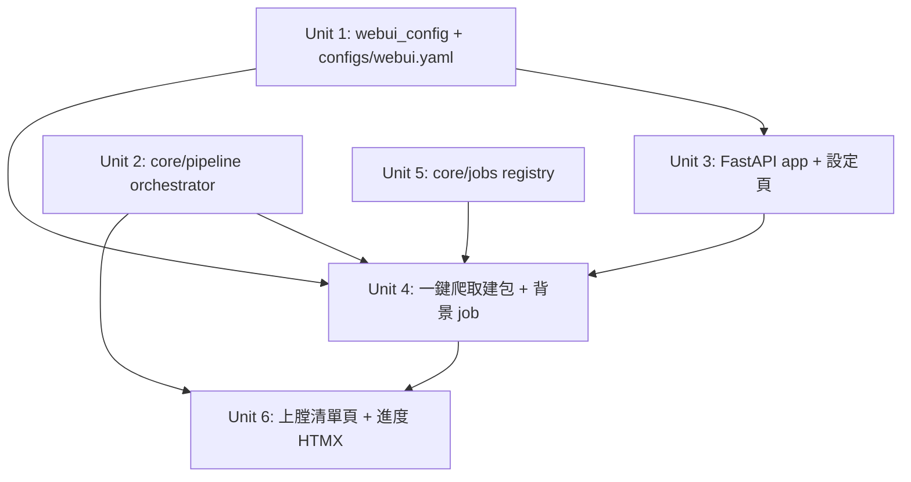

# feat: WebUI settings — input URL, crawl latest, stage post packages

## Overview

在既有 CLI 管線之上加一層**本機 WebUI**（FastAPI + HTMX，只綁 localhost）。使用者在設定頁填一個來源 URL（與少量爬取/模板參數）→ 按一鍵 →系統在背景跑 `crawl-posts → … → build-manifest`，把貼文包「上膛」（staged，待擊發）並列在頁面上。

**安全邊界不變**：WebUI 只自動準備到 `build-manifest`（origin 決策）。`draft-post / verify-draft / publish-post` 仍只走 CLI、發布永遠人工 `--approve`。WebUI 不引入任何發布路徑。

原 spec 刻意排除 WebUI（§2.1「WebUI can be added later, but the core must be usable from shell」）；本計畫即「later」，且維持 core 與 CLI 為唯一事實來源——WebUI 只是薄殼。

## Problem Frame

目前要產生貼文包必須手敲一長串 shell pipe。對非技術操作者不友善、易錯。需要一個「輸入 URL → 一鍵爬取建包 → 看到結果」的本機介面，但**不得**重寫或繞過既有管線邏輯，也不得新增自動發布。

## Requirements Trace

- W1. 設定頁可輸入來源 URL 與爬取/管線參數（item/deny-regex、limit、模板、浮水印 config、輸出/state 路徑），存到 `configs/webui.yaml`；既有 `configs/*.yaml`、`templates/*.yaml` 仍被沿用。
- W2. 一鍵動作在背景執行 `crawl → normalize → dedupe → render-caption → select-cover → watermark → build-manifest`，產出 `out/<post_id>/` 包。
- W3. 背景任務有狀態/進度回饋（pending/running/done/failed + 訊息），頁面以 HTMX 輪詢更新，不卡住瀏覽器。
- W4.「上膛」清單頁列出已建包：post_id、標題、backend.status、封面縮圖/連結、manifest 路徑。
- W5. 管線在程序內復用既有 `core/` 與各 stage 的純函式（`_normalize`/`_dedupe`/`_render`/`_watermark`/`_build` 等），不複製邏輯。
- W6. WebUI 絕不發布、不呼叫 publish-post；自動化止於 build-manifest（origin 決策、R8 精神）。
- W7. 只綁 `127.0.0.1`、無登入態/密碼面；不新增對外攻擊面。

## Scope Boundaries

- 不在 WebUI 做 draft/verify/publish（維持 CLI + 人工）。
- 不做多使用者、無帳號系統、不對外開放（localhost-only）。
- 不重寫管線邏輯；crawl 仍用既有子行程方式（Scrapy reactor 限制）。
- 不做即時 WebSocket；進度用 HTMX 輪詢即可。

## Context & Research

### Relevant Code and Patterns

- 既有 stage 純函式可直接復用（程序內呼叫，免 shell pipe）：
  - `src/normalize_items.py::_normalize(obj)`
  - `src/dedupe_posts.py::_dedupe(records, conn)` + `core/state.connect`
  - `src/render_caption.py::_render(record, cfg)`（模板由 PyYAML 載入）
  - `src/select_cover.py`（`_fetch` 可注入）、`src/watermark_cover.py::_watermark(record, cfg)`
  - `src/build_manifest.py::_build(record, out_dir, log_path)`
  - `src/crawl_posts.py`：以子行程跑 Scrapy 並回 NDJSON（reactor 不可在程序內重啟），WebUI 沿用其既有進入點。
- `core/cli`、`core/errors` 的退出碼語意可映射成 web 層的錯誤分類。
- `configs/backend.yaml`、`watermark.yaml`、`templates/fixed-format.zh.yaml` 為既有設定範例。

### External References

- FastAPI + Jinja2 + HTMX 為成熟技術，略過外部研究。新增依賴：`fastapi`、`uvicorn[standard]`、`jinja2`、`python-multipart`（表單）。歸入 `pyproject` 的 `webui` optional extra。

## Key Technical Decisions

- **薄殼 + 程序內 orchestrator（W5）**：新增 `core/pipeline.py`，把既有 stage 純函式串成一個 `run_pipeline(items, cfg, progress_cb)`，回傳建好的包清單。WebUI 與（未來可選的）一鍵 CLI 共用它。crawl 例外：仍呼叫既有子行程進入點取得 items，再進 orchestrator。理由：避免 NDJSON 在程序內自我管線化的彆扭，也不複製邏輯。
- **背景任務用執行緒 + 記憶體 job registry（W3）**：本機單使用者，毋須 Celery/Redis。`core/jobs.py` 提供 `submit(fn)->job_id` 與 `get(job_id)`（status/progress/result/error）。HTMX 輪詢 `/jobs/{id}` 局部更新。理由：最小相依、夠用。
- **設定集中 `configs/webui.yaml`（W1）**：只放 WebUI 專屬欄位（start_url、limit、regex、各 config 檔路徑、out/state 路徑）；爬蟲/浮水印/模板仍指向既有 yaml。CLI 與 WebUI 看同一份設定。
- **localhost-only（W7）**：uvicorn 綁 `127.0.0.1`，無 auth；文件明示勿暴露到公網。
- **發布絕緣（W6）**：web 路由不 import publish 邏輯；「上膛」清單只顯示，動作按鈕僅連到「如何用 CLI 發布」說明。

## Open Questions

### Resolved During Planning

- 技術棧 → FastAPI + HTMX（使用者決策）。
- 自動化止點 → build-manifest（使用者決策）。
- 設定存放 → `configs/webui.yaml` + 沿用既有 yaml（使用者決策）。

### Deferred to Implementation

- [W5][Technical] 個別 stage 純函式的確切簽名/回傳，實作 `core/pipeline.py` 時對齊（必要時對 src stage 做最小重構把純函式抽乾淨，不改 CLI 行為）。
- [W2][Technical] crawl 子行程的 items 如何串接進 orchestrator（直接讀其 stdout NDJSON vs 抽一個 `crawl_items()` 函式包住子行程）——實作時擇一，以不破壞 stdout 純淨契約為準。
- [W3][Technical] 進度粒度（每 stage 一次 vs 每 item 一次）依實作體感調整。

## High-Level Technical Design

> *以下說明預期形狀，僅供審查方向參考，非實作規格。實作 agent 應視為脈絡，而非照抄的程式碼。*

請求流（輸入 URL → 上膛）：

```text
[設定頁] --POST /settings--> 存 configs/webui.yaml
[一鍵]   --POST /crawl-----> jobs.submit(run_pipeline)  --> 回 job_id, 立即返回
[HTMX 輪詢] --GET /jobs/{id}--> {status, progress, built:[post_id...]}
[上膛清單] --GET /packages--> 掃 out/*/manifest.json --> 列表(post_id/title/status/cover)
                                         |
                          (發布仍走 CLI: draft/verify/publish --approve)
```

程序內 orchestrator（薄殼復用既有純函式）：

```text
core/pipeline.run_pipeline(start_url, webui_cfg, progress_cb):
    items = crawl_items(start_url, cfg)        # 既有 crawl 子行程
    items = [ _normalize(i) for i in items ]
    items = _dedupe(items, state_conn)         # 只認 published
    for i in items: i = _render(i, tmpl)
                    i = select_cover(i, dir)
                    i = _watermark(i, wm_cfg)
                    i = _build(i, out, log)     # -> out/<post_id>/
                    progress_cb(...)
    return built
```

## Implementation Units



- [ ] **Unit 1: WebUI 設定 schema + 載入/存檔**

**Goal:** 定義 `configs/webui.yaml` 結構與讀寫，CLI/WebUI 共用同一份設定。

**Requirements:** W1, W7

**Dependencies:** None

**Files:**
- Create: `core/webui_config.py`、`configs/webui.yaml`（範例）
- Test: `tests/test_webui_config.py`

**Approach:** 欄位 `start_url`、`item_regex`、`deny_regex`、`limit`、`template_path`、`watermark_config`、`download_dir`、`out_dir`、`state_path`、`audit_log`。`load(path)`/`save(path, cfg)`，缺檔回預設、非法 URL/結構 → `ValidationError`。沿用既有 `core.validators`。

**Patterns to follow:** `browser/selector_recipe.py` 的 yaml 載入+驗證風格。

**Test scenarios:**
- Happy: 合法 yaml → load 回 dict；save→load round-trip 一致。
- Edge: 缺檔 → 回預設且不報錯。
- Error: `start_url` 非法 → ValidationError。
- Error: 結構非 mapping → ValidationError。

**Verification:** CLI 與 WebUI 都能讀同一份設定。

- [ ] **Unit 2: 程序內管線 orchestrator**

**Goal:** 把既有 stage 純函式串成 `run_pipeline(...)`，供 WebUI（與未來 CLI）共用，不複製邏輯。

**Requirements:** W2, W5

**Dependencies:** Unit 1

**Files:**
- Create: `core/pipeline.py`
- Modify（如需把純函式抽乾淨，最小改動、不改 CLI 行為）: `src/normalize_items.py`、`src/select_cover.py` 等
- Test: `tests/test_pipeline.py`

**Approach:** `run_pipeline(items, webui_cfg, progress_cb=None) -> list[built]`，依序呼叫 `_normalize → _dedupe(state) → _render → select_cover → _watermark → _build`。crawl 另以 `crawl_items(start_url, cfg)` 包既有子行程（W2 deferred 擇一）。每 stage 後呼叫 `progress_cb`。stage 例外不吞——轉成結構化結果（該 item 標 failed，繼續其餘）。

**Execution note:** 先寫一條「假 items（跳過網路/crawl）跑到 build-manifest」的整合測試，再接 orchestrator。

**Patterns to follow:** 既有 stage 函式；`core/state.connect` 用法。

**Test scenarios:**
- Happy: 2 筆假 normalized items（image_url 空，走純文字路徑）→ orchestrator 產出 2 個 `out/<post_id>/` 包。
- Integration: dedupe 段真的查 state（預插 published 列 → 該 item 被跳過）。
- Error path: 某 item 缺 title → 該 item 標 failed，其餘照常建包（批次不中斷）。
- Edge: 空 items → 回空清單、不報錯。

**Verification:** 不經 shell、程序內就能把 items 跑成包，且復用既有純函式。

- [ ] **Unit 3: FastAPI app 骨架 + 設定頁**

**Goal:** 本機 web app，提供設定頁（GET 顯示、POST 存檔）。

**Requirements:** W1, W7

**Dependencies:** Unit 1

**Files:**
- Create: `webui/app.py`、`webui/__init__.py`、`webui/templates/base.html`、`webui/templates/settings.html`、`webui/static/htmx.min.js`
- Modify: `pyproject.toml`（新增 `webui` extra + console script `crawl-post-webui`）
- Test: `tests/test_webui_app.py`（FastAPI `TestClient`）

**Approach:** Jinja2 模板；`GET /` 導到設定頁；`GET /settings` 顯示現值；`POST /settings`（form）驗證後 `webui_config.save`，回成功片段。uvicorn 綁 `127.0.0.1`。HTMX 由本地 static 提供（不外連 CDN）。

**Patterns to follow:** 退出碼→HTTP 狀態的映射（ValidationError→400）。

**Test scenarios:**
- Happy: `GET /settings` 回 200 且含現有 start_url。
- Happy: `POST /settings` 合法 → 200/HTMX 片段，`configs/webui.yaml` 被更新。
- Error: `POST /settings` 非法 URL → 400 + 錯誤訊息，設定未被破壞。
- Integration: app 啟動只綁 127.0.0.1（檢查 uvicorn 設定/工廠函式）。

**Verification:** 能在瀏覽器看到並儲存設定。

- [ ] **Unit 4: 一鍵「爬取並建包」+ 背景 job**

**Goal:** 設定頁一鍵觸發背景管線，立即返回 job_id。

**Requirements:** W2, W3, W6

**Dependencies:** Unit 2, Unit 3, Unit 5

**Files:**
- Use: `core/jobs.py`（由 Unit 5 建立）
- Modify: `webui/app.py`（`POST /crawl`、`GET /jobs/{id}`）、`webui/templates/settings.html`（觸發按鈕 + 進度區）
- Test: `tests/test_webui_crawl.py`

**Approach:** `core/jobs.py` 記憶體 registry（執行緒）：`submit(fn)->id`、`get(id)`。`POST /crawl` 讀 webui_cfg、`submit(lambda: run_pipeline(...))`、回 job_id 片段。`GET /jobs/{id}` 回 status/progress/built。**絕不** import publish 邏輯（W6）。crawl 在測試用 mock/fixture 站台或注入假 `crawl_items` 避免外網。

**Patterns to follow:** Unit 2 的 progress_cb。

**Test scenarios:**
- Happy: `POST /crawl`（注入假 crawl_items 回 2 筆）→ 回 job_id；輪詢 `GET /jobs/{id}` 最終 status=done、built 含 2 個 post_id。
- Error path: pipeline 內拋例外 → job status=failed、帶錯誤訊息，HTTP 仍 200（錯誤在 job 內回報）。
- Integration: 跑完後 `out/` 真的有對應包。
- jobs 單元：submit→get 生命週期、失敗捕捉、並發兩個 job 互不干擾。

**Verification:** 輸入 URL 按一鍵，背景把包準備好。

- [ ] **Unit 5: 背景 job registry**

**Goal:** 提供執行緒背景任務與狀態查詢（被 Unit 4 使用）。

**Requirements:** W3

**Dependencies:** None

**Files:**
- Create: `core/jobs.py`
- Test: `tests/test_jobs.py`

**Approach:** `Job{id,status,progress,result,error}`；`submit` 起 daemon thread 跑 fn 並捕捉例外；`get` 回快照。執行緒安全用 `Lock`。

**Test scenarios:**
- Happy: submit 一個快速 fn → 最終 status=done、result 正確。
- Error: fn 拋例外 → status=failed、error 有訊息、不外漏例外。
- Edge: get 不存在 id → None/404 語意。
- Concurrency: 兩個 job 並發，各自結果不混。

**Verification:** Unit 4 可靠取得進度。

- [ ] **Unit 6: 「上膛」清單頁 + 進度即時更新**

**Goal:** 列出已建包並以 HTMX 顯示背景進度。

**Requirements:** W4, W6

**Dependencies:** Unit 4

**Files:**
- Create: `webui/templates/packages.html`、`webui/templates/_job_status.html`（HTMX 片段）
- Modify: `webui/app.py`（`GET /packages`）
- Test: `tests/test_webui_packages.py`

**Approach:** `GET /packages` 掃 `out/*/manifest.json`，讀 post_id/title/backend.status/cover，渲染表格。進度區用 HTMX `hx-get="/jobs/{id}" hx-trigger="every 1s"` 局部刷新，done 後停止輪詢並附「如何用 CLI 發布」提示（不提供發布按鈕，W6）。

**Test scenarios:**
- Happy: out/ 有 2 個包 → `GET /packages` 200 且列出兩個標題與 status=package_built。
- Edge: out/ 空 → 顯示「尚無上膛貼文」空狀態。
- Integration: 壞掉的 manifest.json → 該列略過/標示，不整頁崩。
- W6 守則: 清單頁原始碼不含任何 publish 觸發端點（測試 grep 斷言）。

**Verification:** 使用者看得到「上膛」結果與進度。

## System-Wide Impact

- **Interaction graph:** WebUI → `core/pipeline` → 既有 stage 純函式 / `core/state` / `core/audit`。新增 `core/jobs`、`core/webui_config`、`core/pipeline`、`webui/`。不動既有 `src/*` CLI 行為（如需抽純函式僅最小重構，CLI 測試須續綠）。
- **Error propagation:** stage 例外→job 內標 failed，不讓 web 進程崩；表單驗證錯→HTTP 400；其餘→500 + log。
- **State lifecycle risks:** orchestrator 的 dedupe 仍只認 published（R9）；WebUI 不寫 published（不發布），故不影響去重語意。背景 job 為記憶體態，進程重啟即丟（可接受、本機工具）。
- **API surface parity:** 同一管線現有兩個入口（shell pipe / WebUI orchestrator）——須共用 `core/pipeline`，避免兩套邏輯漂移。
- **Unchanged invariants:** `draft/verify/publish` 與發布閘門完全不變；WebUI 不觸碰它們。既有 70 測試須維持綠。

## Risks & Dependencies

| Risk | Mitigation |
|------|------------|
| 抽純函式重構意外改動 CLI 行為 | 重構最小化；既有 CLI/pipeline 測試全綠為門檻 |
| WebUI 變成第二套管線邏輯（漂移） | 強制走 `core/pipeline` 單一 orchestrator；W5 測試驗證復用 |
| 誤把發布能力帶進 UI | W6 明令；Unit 6 測試 grep 斷言無 publish 端點 |
| localhost 服務被暴露到公網 | 綁 127.0.0.1、README/文件警示、無 auth 即不可對外 |
| Scrapy reactor 不可在 web 進程內重啟 | crawl 維持子行程進入點，不在 FastAPI 進程內跑 reactor |
| 背景 job 進程重啟即遺失 | 記憶體態可接受；包本身已落地 out/，job 只是進度視圖 |

## Documentation / Operational Notes

- README 增「WebUI（本機）」段：`make install-browser`（含 web extra）、`crawl-post-webui` 啟動、開 `http://127.0.0.1:8000`、勿暴露公網。
- 明示：WebUI 自動化止於建包；發布請用 CLI `publish-post --approve`（連 `examples/scheduling.md`）。

## Sources & References

- **Origin document:** [docs/brainstorms/2026-06-15-local-crawl-post-factory-requirements.md](docs/brainstorms/2026-06-15-local-crawl-post-factory-requirements.md)
- 既有實作計畫：[docs/plans/2026-06-15-001-feat-local-crawl-post-factory-plan.md](docs/plans/2026-06-15-001-feat-local-crawl-post-factory-plan.md)
- 復用程式：`core/`、`src/*` stage 純函式、`configs/*.yaml`
