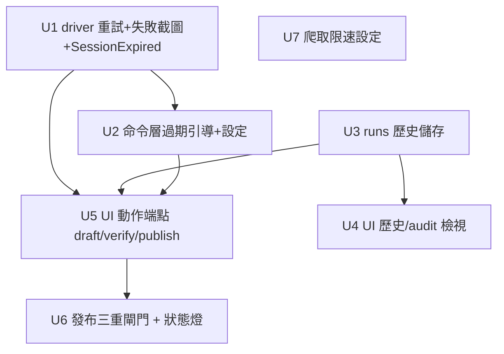

# feat: daily-ops hardening + WebUI control center

## Overview

把現有系統（CLI 管線 + Playwright 後台 + WebUI 審核，99 測試）硬化成可**日常營運單站**：瀏覽器層加重試與失敗截圖、把「登入態過期」變成一等公民錯誤、運行/發布歷史持久化、爬取限速，並把 WebUI 從「只審核」進化成**全控制台**——可在 UI 完成爬取→審核→發布，但發布鎖在「看過審核頁 + 狀態 draft_verified + 輸入標題確認 + `--approve` 語意」的三重閘門後。維持單站單後台、外部 cron、不破壞既有 CLI 契約。(see origin: docs/brainstorms/2026-06-15-full-upgrade-daily-ops-requirements.md)

## Problem Frame

要每天跑真實站台，三個缺口會痛：瀏覽器層遇暫時性失敗整批掛且難查、背景 job 重啟即丟無歷史、審核完仍要切終端機敲 CLI 才能發布。本計畫補這三塊並維持安全。

## Requirements Trace

- R1. 後台動作對暫時性失敗自動重試（可設定次數），耗盡才判失敗。
- R2. 後台動作失敗時於該包目錄存失敗現場（截圖 + URL + 可選 HTML 片段）。
- R3. 偵測「登入態過期/被導回登入頁」為可辨識錯誤，與一般逾時區分，給「請重跑 auth-login」引導。
- R4. UI 顯示登入態狀態燈（有效/過期/未設定）。
- R5. 審核頁新增三動作鈕（建草稿/驗證/發布），背景執行並回報。
- R6. 發布三重閘門：已審核 + 狀態 draft_verified + 輸入正確標題；仍走 --approve 語意。
- R7. 動作成功/失敗即時回饋；可辨識錯誤給對應引導。
- R8. UI 動作不繞過任何既有閘門。
- R9. 爬取/建包/建草稿/驗證/發布每次運行與結果持久化（跨重啟）。
- R10. UI 提供運行歷史與 audit.jsonl 瀏覽。
- R11. 已發布歷史可查，與去重狀態一致。
- R12. 可設定爬取限速/下載延遲/並發上限，並於設定頁調整。

## Scope Boundaries

- 不做多來源站/多後台/profile（維持單站單後台）。
- 不在 app 內跑長連線排程器（排程維持外部 cron）。
- 不依賴付費 LLM；不改固定模板生成方式。
- 不改既有 CLI 命令的 I/O 契約與退出碼語意（以新增/擴充為主，向後相容）。
- 不自動處理 CAPTCHA/反爬；登入仍人工 `auth-login`。

## Context & Research

無外部研究：技術棧（FastAPI/HTMX、Playwright、SQLite、Pillow、Scrapy）皆既有且模式一致，本地即最佳事實來源。

### Relevant Code and Patterns

- `browser/backend_driver.py`：`session()`、`create_draft/verify_draft/publish_draft`，目前把 `PlaywrightTimeout` 轉 `ExternalError`。重試/截圖/過期偵測在此擴充。
- `browser/auth.py` + `src/auth_login.py`：storage-state 產生；UI 重登引導復用。
- `browser/selector_recipe.py` + `configs/backend.yaml`：config-driven selector；新增過期偵測標記、重試設定欄位於此。
- `core/state.py`（`items` 表、`is_processed` 只認 published）、`core/manifest.py`（狀態機/write-back）、`core/audit.py`（audit.jsonl append）。
- `core/jobs.py`（記憶體背景 job + 進度）、`core/pipeline.py`（程序內 orchestrator）。
- `webui/app.py`（`/settings /crawl /jobs /packages /packages/{id}` + `_safe_pkg_dir`）、`webui/templates/*`。
- `src/draft_post.py / verify_draft.py / publish_post.py`：既有閘門（`--approve`、`require_status`），UI 動作復用其邏輯。
- `tests/mock_admin.py`：可注入失敗/過期情境做測試（origin §14.3 同模式）。

## Key Technical Decisions

- **重試集中在 driver、分類暫時 vs 永久（R1）**：`backend_driver` 對「暫時性」失敗（Playwright timeout、導航失敗）退避重試；「永久性」（ValidationError、selector schema 錯、缺檔）不重試直接拋。重試次數/間隔由 `backend.yaml` 設定 + CLI `--retries` override。理由：把脆弱點的韌性放在唯一進出後台的地方。
- **失敗截圖存包目錄（R2）**：失敗時寫 `<pkg>/failure_<stage>_<ts>.png` + `failure.json`（stage/url/error）。理由：最低成本、最高可查性；存在包旁邊便於對應。
- **SessionExpired 為專屬錯誤型別（R3）**：新增 `SessionExpiredError`（沿用 exit 4 的 external 類別但型別可辨識），由 driver 在「導回登入頁/出現登入標記」時拋出；CLI/UI 據型別給「重跑 auth-login」引導。過期訊號用 `backend.yaml` 的 `verify.login_required_url_contains` 設定（真實訊號待真後台驗證）。
- **運行歷史落地既有 sqlite 加 `runs` 表（R9/R11）**：不另開 DB；`runs(id, ts, stage, post_id, status, detail, error)`。`audit.jsonl` 保留為低階 append log，`runs` 表為可查歷史；published 真相仍以 `items` 表為準（避免重複真相來源）。
- **UI 動作＝背景 job 呼叫既有命令邏輯（R5/R8）**：`/packages/{id}/draft|verify|publish` 各 submit 一個 job，job 內呼叫既有 `draft/verify/publish` 的 `_run` 對應邏輯（headless）。閘門完全沿用既有 `require_status`/`--approve`，UI 不另寫繞道。
- **發布三重閘門（R6）**：① server 端記錄「已開啟審核頁」的 post_id 集合 ② manifest 狀態須 `draft_verified` ③ 發布表單須帶與 manifest 標題相符字串。三者皆通過才 submit publish job（內部仍以 `--approve` 語意執行）。理由：把不可逆動作的人為確認拉到最高。
- **重登走 localhost headed 子行程（R4）**：UI「重新登入」觸發 `auth.capture_login` headed（localhost 即在操作者機器開窗）；同時提供「或在終端跑 auth-login」文字備援。狀態燈以 storage-state 檔存在性 + 最近一次後台動作是否 SessionExpired 推斷。

## Open Questions

### Resolved During Planning

- 歷史儲存形式 → 既有 `state/*.sqlite` 加 `runs` 表；audit.jsonl 保留；published 以 items 表為準。
- UI 觸發後台動作 → 背景 job 呼叫既有命令邏輯、headless。
- 「已審核」記錄 → server 端記憶體 post_id 集合（審核頁 GET 時加入），publish 檢查。
- 重試分類 → 暫時性（timeout/導航）重試；永久性（驗證/設定/缺檔）不重試。

### Deferred to Implementation

- [R3][Needs research] 真實自家後台「session 過期/導回登入」的確切 DOM/URL 訊號——需真後台驗證；先用 `backend.yaml` 可設定標記。
- [R2][Technical] 失敗截圖是否含 HTML 片段、隱私遮罩；先存截圖+URL，HTML 片段設為可選旗標。
- [R1][Technical] 退避間隔具體值（固定 vs 指數）與上限，實作時依體感定預設。
- [R6][Technical] 「已審核」集合跨多分頁/重整/重啟的邊界（記憶體態可接受；必要時再持久化），實作時確認。

## High-Level Technical Design

> *以下說明預期形狀，僅供審查方向參考，非實作規格。實作 agent 應視為脈絡，而非照抄的程式碼。*

發布三重閘門（R6）決策流：

```text
審核頁 GET /packages/{id} ──> server 記 reviewed.add(id)
                                  │
POST /packages/{id}/publish (帶 title 欄位)
   ├─ id ∉ reviewed?            ─▶ 拒絕(400「請先開啟審核頁」)
   ├─ manifest.status≠draft_verified ─▶ 拒絕(400「尚未驗證」)
   ├─ title ≠ manifest 標題?    ─▶ 拒絕(400「標題不符」)
   └─ 三者皆過 ─▶ submit publish job(內部 --approve 語意) ─▶ 寫 runs + items(published)
```

後台動作韌性（R1/R2/R3）包在 driver：

```text
driver.action(...) :
    for attempt in 1..=retries:
        try: do_playwright_steps(); return ok
        except PermanentError: raise            # 不重試
        except SessionMarkerSeen: raise SessionExpiredError   # 不重試，要重登
        except TransientError:
            capture_failure(pkg, stage, url)     # 截圖+url
            if attempt==retries: raise ExternalError
            backoff()
```

## Implementation Units



### Phase A — 後台韌性

- [ ] **Unit 1: driver 重試 + 失敗截圖 + SessionExpiredError**

**Goal:** 把重試、失敗現場截圖、過期偵測集中進唯一進出後台的 driver。

**Requirements:** R1, R2, R3

**Dependencies:** None

**Files:**
- Modify: `browser/backend_driver.py`、`core/errors.py`（新增 `SessionExpiredError`）、`configs/backend.yaml`（新增 `retry` 與 `verify.login_required_url_contains`）
- Test: `tests/test_backend_driver_resilience.py`

**Approach:** `create_draft/verify_draft/publish_draft` 包一層重試迴圈（次數來自 cfg/參數）；暫時性失敗（PlaywrightTimeout、導航失敗）重試並在每次失敗 `_capture_failure(pkg_dir, stage, page)` 存截圖+`failure.json`；偵測 `page.url` 命中 `login_required_url_contains` 或登入標記時拋 `SessionExpiredError`（不重試）；永久性錯誤直接拋。需把 pkg 目錄傳入 driver（由命令層提供 manifest 路徑推導）。

**Execution note:** 先寫「注入第一次 timeout、第二次成功」的重試整合測試（用 mock admin + monkeypatch）再實作。

**Patterns to follow:** 既有 `backend_driver` 的 `_import_playwright`、`ExternalError` 轉換；`tests/mock_admin.py` 注入情境。

**Test scenarios:**
- Happy: 動作一次成功 → 無重試、無截圖。
- Edge: 第一次 timeout、第二次成功 → 重試後成功，且留下一張失敗截圖。
- Error: 重試耗盡 → `ExternalError`，截圖數=重試次數。
- Error: 永久性錯誤（缺 selector）→ 立即拋、不重試、不截圖。
- Integration: 偵測到登入標記 URL → 拋 `SessionExpiredError`（型別可辨識），不重試。

**Verification:** 暫時性失敗被重試吸收；失敗有截圖；過期可辨識。

- [ ] **Unit 2: 命令層過期引導 + 重試設定**

**Goal:** `draft/verify/publish` CLI 把 `SessionExpiredError` 轉成明確引導訊息，並支援 `--retries`。

**Requirements:** R1, R3

**Dependencies:** Unit 1

**Files:**
- Modify: `src/draft_post.py`、`src/verify_draft.py`、`src/publish_post.py`
- Test: `tests/test_backend_commands_session.py`

**Approach:** 三命令傳 manifest 目錄與重試設定給 driver；捕捉 `SessionExpiredError` → stderr 一行「session expired, re-run auth-login」+ exit 4（沿用 external 類別碼，訊息可辨識）。新增 `--retries INT`（預設取 backend.yaml）。不改既有閘門。

**Test scenarios:**
- Error: driver 拋 `SessionExpiredError` → 命令 exit 4、stderr 含 auth-login 引導。
- Happy: `--retries 2` 透傳到 driver。
- Integration: 既有發布閘門測試仍綠（不回歸）。

**Verification:** 過期時操作者看得到該重登；重試可調。

### Phase B — 可觀測 / 運行歷史

- [ ] **Unit 3: 運行歷史儲存（runs 表）**

**Goal:** 把每次運行與結果落地 sqlite，供查詢。

**Requirements:** R9, R11

**Dependencies:** None

**Files:**
- Create: `core/runs.py`（建 `runs` 表、`record_run`、`list_runs`）
- Modify: `core/pipeline.py`、`src/draft_post.py`、`src/verify_draft.py`、`src/publish_post.py`（在關鍵點呼叫 `record_run`）
- Test: `tests/test_runs.py`

**Approach:** `runs(id INTEGER PK, ts, stage, post_id, status, detail, error)`，與 `items` 同一 sqlite 檔（路徑來自設定）。pipeline 建包、各後台動作成功/失敗時記一列。published 真相仍以 `items` 表；`runs` 為時間序歷史。

**Test scenarios:**
- Happy: `record_run` 後 `list_runs` 回該列、欄位正確。
- Edge: 失敗動作記 status=failed + error 訊息。
- Integration: pipeline 跑兩包 → runs 表新增對應 build 列。
- Edge: 表不存在自動建立。

**Verification:** 跨重啟可查歷史。

- [ ] **Unit 4: UI 運行歷史 + audit 檢視**

**Goal:** WebUI 提供 `/history` 與 `/audit` 檢視。

**Requirements:** R10

**Dependencies:** Unit 3

**Files:**
- Modify: `webui/app.py`（`GET /history`、`GET /audit`）
- Create: `webui/templates/history.html`、`webui/templates/audit.html`
- Test: `tests/test_webui_history.py`

**Approach:** `/history` 讀 `runs` 表（最近 N 筆）渲染表格；`/audit` 讀設定的 `audit.jsonl`（尾端 N 行）渲染。導覽列加入連結。

**Test scenarios:**
- Happy: runs 表有資料 → `/history` 200 列出。
- Happy: audit.jsonl 有行 → `/audit` 200 顯示。
- Edge: 無歷史/無 audit 檔 → 空狀態、不崩。
- Edge: audit.jsonl 含壞行 → 略過不崩。

**Verification:** 營運者可回查某天/某篇發生什麼。

### Phase C — WebUI 全控制台 + 發布閘門

- [ ] **Unit 5: UI 後台動作端點（draft/verify/publish 為背景 job）**

**Goal:** 審核頁三動作鈕，呼叫既有命令邏輯為背景 job。

**Requirements:** R5, R7, R8

**Dependencies:** Unit 1, Unit 3

**Files:**
- Modify: `webui/app.py`（`POST /packages/{id}/draft`、`/verify`、`/publish`）、`webui/templates/detail.html`、`webui/templates/_job_status.html`
- Test: `tests/test_webui_actions.py`

**Approach:** 各端點驗證 post_id（`_safe_pkg_dir`）後 `jobs.submit` 呼叫對應後台邏輯（headless、帶設定的 storage-state 與 backend.yaml）；`SessionExpiredError`/`ExternalError` 於 job 結果回報，UI 顯示對應引導。發布端點受 Unit 6 閘門保護。

**Test scenarios:**
- Happy: `/draft` job → 成功後 manifest 狀態 drafted；UI 顯示完成。
- Error: driver 過期 → job failed、UI 顯示「請重跑 auth-login」。
- Integration: verify 後狀態 draft_verified。
- W8: 未驗證直接 `/publish` → 被閘門擋（見 Unit 6）。

**Verification:** 全程可在 UI 完成；錯誤有引導。

- [ ] **Unit 6: 發布三重閘門 + 登入態狀態燈**

**Goal:** 發布鈕鎖在「已審核 + draft_verified + 輸入標題」後；UI 顯示登入態狀態燈。

**Requirements:** R4, R6, R8

**Dependencies:** Unit 5

**Files:**
- Modify: `webui/app.py`（reviewed 集合、`/packages/{id}/publish` 閘門、狀態燈端點/context）、`webui/templates/detail.html`、`webui/templates/base.html`（狀態燈）
- Test: `tests/test_webui_publish_gate.py`

**Approach:** 審核頁 GET 時 `reviewed.add(post_id)`；發布鈕僅在 `status==draft_verified` 時出現，並要求輸入標題欄位。`POST /publish` 依序檢查 reviewed→status→title，任一不過回 400 明確訊息；皆過才 submit publish job。狀態燈：storage-state 檔存在且最近無 SessionExpired → 綠；過期 → 紅 + 重登入口；無檔 → 灰。

**Technical design:** 見上方 High-Level Technical Design 的閘門流程圖（directional）。

**Test scenarios:**
- Error: 未開審核頁直接 POST publish → 400「請先開啟審核頁」。
- Error: 已審核但狀態 package_built → 400「尚未驗證」。
- Error: 已審核+draft_verified 但標題不符 → 400「標題不符」。
- Happy: 三者皆過 → submit publish job（mock 後台發布成功、寫 runs/items published）。
- Edge: 狀態燈三態（綠/紅/灰）依 storage-state 與過期旗標正確呈現。
- W8: 閘門順序確保不可逆動作不被繞過。

**Verification:** 發布前必過兩道人工確認；過期一眼可見。

### Phase D — 爬取禮貌

- [ ] **Unit 7: 爬取限速 / 延遲 / 並發設定**

**Goal:** 設定頁可調爬取限速並透傳到 crawler。

**Requirements:** R12

**Dependencies:** None

**Files:**
- Modify: `core/webui_config.py`（新增 `download_delay`、`concurrency`）、`configs/webui.yaml`、`webui/templates/settings.html`、`core/pipeline.py`（`crawl_items` 透傳）、`src/crawl_posts.py`（確認 `download_delay` 進 Scrapy 設定）
- Test: `tests/test_webui_politeness.py`

**Approach:** webui_config 增 `download_delay`(秒)、`concurrency`；設定頁加欄位；`pipeline.crawl_items` 把這些併入 crawler opts；crawl worker 把 `download_delay` 映到 Scrapy `DOWNLOAD_DELAY`、concurrency 映到 `CONCURRENT_REQUESTS`。

**Test scenarios:**
- Happy: 設定 download_delay=1.0 → opts 帶該值、Scrapy 設定生效（worker opts 斷言）。
- Edge: 負值/非數 → ValidationError。
- Integration: 設定頁 POST 後 webui.yaml 含新欄位。

**Verification:** 可調限速避免壓垮自有站。

## System-Wide Impact

- **Interaction graph:** 新增 `core/runs`；擴充 `browser/backend_driver`（重試/截圖/過期）、`src/*` 後台命令、`webui/app.py`（動作+歷史+閘門+狀態燈）、`core/webui_config`、`configs/{backend,webui}.yaml`。`core/pipeline`、`core/jobs`、`core/state`、`core/manifest` 復用不改契約。
- **Error propagation:** 暫時性→driver 重試；耗盡→`ExternalError`(4)；過期→`SessionExpiredError`(4，型別可辨識)→命令/UI 引導重登；永久性→立即拋。job 內錯誤回報於 job 結果，不崩 web 進程。
- **State lifecycle risks:** `runs` 為純記錄、不影響去重；published 真相仍只在 `items` 表（R9 不引入第二真相來源）。reviewed 集合為記憶體態（重啟丟失可接受，最多要求重看審核頁）。失敗截圖寫包目錄，不覆寫既有產物。
- **API surface parity:** UI 後台動作與 CLI 後台命令須走同一份既有閘門邏輯（`require_status`/`--approve` 語意），避免兩套發布規則漂移。
- **Unchanged invariants:** 既有 CLI 命令 I/O 契約與退出碼不變；發布仍需 `--approve` 語意；selector 仍全 config-driven；dedupe 仍只認 published。既有 99 測試須維持綠。

## Risks & Dependencies

| Risk | Mitigation |
|------|------------|
| 過期偵測訊號因後台而異、誤判 | 訊號用 backend.yaml 可設定；型別與一般逾時區分；真後台驗證列 deferred |
| 無限重試放大對站台壓力 | 重試次數有上限+退避；與限速(U7)併用 |
| UI 發布繞過 CLI 閘門 | UI 發布走同一既有邏輯+三重閘門；測試斷言拒絕路徑與順序 |
| reviewed 記憶體態被多分頁/重啟繞過 | 閘門仍要求 status=draft_verified + 標題；最壞情況只是要求重看審核頁 |
| runs 表與 items/audit 真相重複 | 明確分工：items=published 真相、audit=低階 log、runs=時間序歷史 |
| 失敗截圖含後台敏感內容 | 存本機包目錄、gitignore；HTML 片段設為可選 |
| headed 重登在無桌面環境失敗 | 提供「終端跑 auth-login」文字備援；headed 失敗回明確錯誤 |

## Documentation / Operational Notes

- README 增「日常營運」段：重試/截圖位置、狀態燈、歷史頁、限速設定、過期重登流程。
- `examples/scheduling.md` 補：批次遇 `SessionExpiredError`(exit 4 可辨識訊息) 時的告警與重登動作。
- 失敗截圖與 `runs`/sqlite 已被 `.gitignore` 涵蓋（out/、state/*.sqlite、logs/）；確認新路徑也被涵蓋。

## Sources & References

- **Origin document:** [docs/brainstorms/2026-06-15-full-upgrade-daily-ops-requirements.md](docs/brainstorms/2026-06-15-full-upgrade-daily-ops-requirements.md)
- 既有計畫：001（CLI 管線+Playwright）、002（WebUI）。
- 復用程式：`browser/backend_driver.py`、`browser/auth.py`、`core/{jobs,pipeline,state,manifest,audit,webui_config}.py`、`webui/app.py`、`tests/mock_admin.py`。
