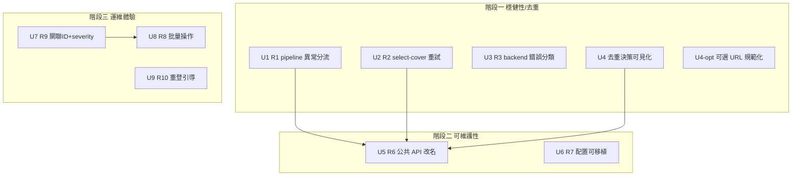

# 全面優化：穩健性 → 可維護性 → 運維體驗（分三階段）

## Overview

在「每天穩定跑真實站台」的定位下，分三階段把代碼審查找到的高槓桿改進落地：第一階段修穩健性與去重正確性（防靜默出錯），第二階段補可維護性（公共 API + 配置可移植），第三階段提升運維體驗（批量操作 + 可觀測性 + 重登）。每階段獨立可發布、向後相容、既有測試維持綠。

源文件全是內部模組（`core/`、`src/`、`browser/`、`webui/`），無新技術層；已跳過外部研究——本地模式充足（`browser/backend_driver.retry_kwargs`、`core/errors` 異常層級、`core/runs`/`core/audit` 皆已就位）。

## Problem Frame

原計畫範圍（基礎管線 + 日常營運硬化 + 全控制台）已落地、144 測試綠。本次不是補功能漏洞，而是挑高槓桿改進繼續加價值（見 origin: docs/brainstorms/2026-06-15-project-optimization-requirements.md）。三簇問題按「會不會靜默出錯」排序：穩健性/去重正確性最高、可維護性次之、運維體驗最後。

## Requirements Trace

- R1. 細分 `core/pipeline.py` 的裸 `except Exception`：驗證類錯誤跳過並記錄，系統類錯誤可辨識、不被靜默吞掉。
- R2. `select-cover` 圖片下載對瞬時失敗有限次重試，比照後台命令，不再一次超時就失敗。
- R3. 修正 `browser/backend_driver._run_with_retry` 的錯誤分類：明確區分可重試／不可重試／session 過期，非逾時的 Playwright 錯誤不再裸傳播且無失敗現場。
- R4. 修正去重判定，消除 `title_hash` 碰撞導致的靜默漏發。
- R5. 去重決策可審計：每次跳過/疑似重複記錄原因。
- R6. 將 pipeline 各 stage 操作從 `_` 私有名提升為穩定**公共函數名**（命名/可見性層）；CLI 與 WebUI 呼叫同一組公共函數。注意：本次只統一**函數命名**，不統一編排介面（編排雙寫見 U5b，獨立後續項）。
- R7. 配置可移植：相對路徑相對於設定檔位置解析，並支援環境變數覆蓋。
- R8. WebUI 批量「建草稿／驗證」（高頻可逆動作）；**發布維持逐篇單筆三重閘門**（批量化會結構性削弱閘門，見 U8 / Key Decisions）。
- R9. `audit.jsonl` / `runs` 增加 severity 與關聯 ID（貫穿一篇 post 生命週期）。
- R10. session 過期後 UI 提供更明確的重登引導/入口。

## Scope Boundaries

- 維持單站單後台、localhost-only、無帳號系統、外部 cron 排程。
- 不破壞既有 CLI I/O 契約與退出碼語意（§13：0/1/2/3/4/5）；優化以重構 + 新增為主、向後相容。
- 不依賴付費 LLM、不改固定模板文案生成。
- 不自動繞過 CAPTCHA / 反爬 / 登入；登入仍人工 `auth-login`。
- 不做增量爬蟲（人工審核前提下重複爬成本可接受）。

## Context & Research

### Relevant Code and Patterns

- `core/pipeline.py:59-64`（normalize 裸 except）、`:74-94`（build 裸 except）— 兩處 `except Exception` 把 `ValidationError` 與系統錯誤混為一談。
- `core/pipeline.py:61,69,77,81,82,83` — 直接呼叫 src 私有函數 `_normalize/_dedupe/_render/_select/_watermark/_build`（R6 目標）。
- `browser/backend_driver.py:23-27` `retry_kwargs` — 既有重試設定來源，R2 可比照其形狀。
- `browser/backend_driver.py:66-87` `_run_with_retry` — 只捕 `SessionExpiredError` 與 `PlaywrightTimeout`；其他 `PlaywrightError`（如導航失敗）會裸傳播、無失敗現場（R3 缺口）。
- `core/errors.py` — 完整退出碼異常層級（`ValidationError`=2、`ExternalError`=4、`SessionExpiredError` 為 `ExternalError` 子類）。R1/R3 重用，不新增碼。
- `core/state.py:54-60` `is_processed` — 現為 `status='published' AND (canonical_url OR title_hash)`；`title_hash` 碰撞會誤判（R4）。
- `src/select_cover.py:47-76` `_fetch` — `ExternalError` 一次即失敗、無重試（R2）；已正確區分 `ValidationError`（非圖片）vs `ExternalError`（網路）。
- `core/webui_config.py:12-28` `DEFAULTS` — 全相對路徑，依啟動目錄解析（R7）。
- `core/runs.py:18-30`（runs schema）、`core/audit.py:7-14`（audit record）— R9 擴充點，schema 用 `CREATE TABLE IF NOT EXISTS`。
- `webui/app.py:154-224` — `action_draft/verify/publish`、`_action_ns`、`_submit_action`、`_submit_job`、`_safe_pkg_dir`、三重閘門（`reviewed` set + `draft_verified` 狀態 + 標題確認）；R8 在此擴批量、R10 在 `_auth_light`（:236）擴重登。
- 測試慣例：`tests/conftest.py` 注入 root 到 sys.path；`tests/test_webui_publish_gate.py` 用 `TestClient` + `tmp_path`；`_fetch`/`_select` 設計為可 monkeypatch（select_cover docstring 明示）。

### Institutional Learnings

- origin 的 Key Decisions：去重「寧可重複處理也不靜默漏發」；失敗要留現場；歷史持久化避免重複真相來源（`items`=發布真相、`runs`=時序、`audit.jsonl`=低階日誌，見 `core/runs.py:1-9`）。

### External References

- 未使用（本地模式充足，內部重構為主）。

## Key Technical Decisions

- **R1 異常分流不中斷批次**：`ValidationError` → 記為 `failed` 項並標 `error_class="validation"`；其他非預期例外仍記入 `failed` 但標 `error_class="system"`（供 observability 區分），批次續跑不靜默。理由：保留「單筆壞不殺整批」的既有設計，同時讓系統錯誤可辨識、可告警。
- **R2 重試只吃 `ExternalError`，不吃 `ValidationError`**：在 `select_cover._fetch` 對網路/逾時類有限次重試 + 退避；新增 `--retries`/`--backoff-sec` CLI 旗標，pipeline 由 `webui_cfg` 傳入。理由：與 `backend_driver` 重試語意一致；非圖片（驗證錯）重試無意義。
- **R3 擴大重試涵蓋面但維持分類**：`_run_with_retry` 新增捕捉一般 `PlaywrightError`（視為可重試瞬時失敗、逐次截圖），`SessionExpiredError`/`ValidationError` 仍不重試。理由：真實站台的導航/暫時 selector 失敗多為瞬時；session 過期處置不同（要人重登）。「哪些 PlaywrightError 屬永久」留待真實後台校準（見 Deferred）。
- **R4 採「保留 OR 跳過 + 每次跳過皆可見」（Option A），放棄原「URL 唯一鍵 + title 降級」方案**：`is_processed` 維持現有 `status='published' AND (canonical_url OR title_hash)` 跳過邏輯**不變**；R4 的價值改由 R5「讓每次跳過都可見」承擔——dedupe 仍 **READ-ONLY**，由 **pipeline 在 dedupe 之後**（非在 dedupe 內）對每筆 skip 寫一筆 observability 記錄，operator 在運行歷史能看到「哪些被跳過、命中 url 還是 title」。理由（綜合 5 份審查的 P0 群）：原「URL 唯一鍵 + title 降級」方案有**三個結構性硬傷**——① 原子性不可達（`runs.record_run` 自開連接，無法與 dedupe 的 `state.connect` conn 同事務）；② 違反 `dedupe_posts` 文檔明示的 READ-ONLY 不變量；③ 不重算舊 published 行的 canonical_url + 拆掉 title_hash 安全網 → **每篇已發文章重爬時都重新冒出為 possible_duplicate**（與「published 後下輪跳過」直接矛盾）。Option A 一次避開三者：零新寫入路徑於 dedupe、re-crawl 跳過照舊、無 URL backfill 需求。
- **真正的 backstop 是 publish 前的人工審核，非去重層**：本專案每篇 publish 前都過控制台三重閘門（先開審核頁 + draft_verified + 標題），operator 看得到上膛清單。故「title 碰撞導致罕見漏發」的殘餘風險由人工審核兜底即可，不需在去重層做不可達的原子保證。罕見的真碰撞（不同文章同標題且其一已發）仍會被跳過，但**現在可見於運行歷史**（可接受的權衡，見 Risks）。
- **U4-opt（URL 規範化加固）為可選增益、與跳過鍵解耦**：因 Option A 不收斂唯一鍵，URL 加固不再是「防重發」的必須前置；它仍是獨立小改善（utm 變體歸一以提高 url 命中率），但**若做須一併一次性 backfill 既有 published 行的 canonical_url**，否則新舊不一致反降命中。鑑於 carrying cost，預設不做（見 Open Questions）。
- **R5 去重決策落地為 observability**：dedupe 對每筆 skip（記命中是 url 還是 title）各記一筆，由 **pipeline 在 dedupe 之後**寫入既有 `runs`（stage=`dedupe`, status=`skipped`）。理由：複用既有時序真相來源，不新增第四個 store，且不破壞 dedupe 的 READ-ONLY。
- **R6 公共 API 以薄包裝提取，僅解決命名、不解決邏輯耦合（審查發現 1/2/3）**：各 src 模組新增公共函數，`_xxx` 保留為帶刪除節點的別名一輪；CLI `_run` 與 `core/pipeline` 改呼叫公共名。**明確 non-goal**：不引入統一 Protocol/接口（六 stage 簽名本質不齊，統一會抽象降級）、不新增 `pipeline_ops.py`（YAGNI）。理由：真正的耦合是 `pipeline.run_pipeline` 手寫編排 vs CLI `_run` 的「編排雙寫」（兩套錯誤語意），改名碰不到它——故誠實把它拆為獨立後續項 U5b，不在 U5 驗收標準寫「降低耦合」以免誤導。
- **R7 相對路徑相對設定檔解析 + env 覆蓋**：`webui_config.load/save` 把 `DEFAULTS` 中相對路徑解析為相對於設定檔 parent；新增 `CPOST_STATE_PATH`/`CPOST_OUT_DIR`/`CPOST_DOWNLOAD_DIR`/`CPOST_AUDIT_LOG` 等 env 覆蓋（優先級：env > yaml > default）。理由：跨啟動目錄與 CI/容器可移植，且不破壞既有 yaml。
- **R8 批量只做 draft/verify，發布不批量化**：批量端點逐項複用 `_action_ns`（draft/verify），串行尊重限速。**發布刻意不提供跨篇批量**——其三重閘門中 `reviewed`（逐篇開審核頁才填）與逐項標題確認結構上無法批量化，硬做會削弱閘門（審查 feasibility P1）。理由：發布是最不可逆動作，便利性以「審核頁內順手三連」達成而非跨篇批量，閘門強度不打折。
- **R9 關聯 ID + severity 為新增欄位**：`runs` 加 `run_id`（一次 pipeline/批量動作的關聯）與 `severity`；`audit.record` 加 `severity` 與可選 `run_id`。schema 用 `ALTER TABLE ... ADD COLUMN`（冪等遷移）。理由：能用 post_id / run_id 撈整條生命週期，與既有 store 不衝突。

## Open Questions

### Resolved During Planning

- **R4 方案（經審查重訂）**：放棄「URL 唯一鍵 + title 降級」（有原子性不可達 / 違反 read-only / re-crawl 重新冒泡三個 P0），改採 Option A「保留 OR 跳過 + 每次跳過皆可見」，dedupe 維持 READ-ONLY。
- 去重原子性：不需要——可見化記錄是 observability，丟失不致漏發；不可逆動作由 publish 人工閘門兜底。
- R2 重試設定來源：新增 CLI 旗標 + pipeline 由 webui_cfg 傳入，沿用 backend retry 形狀。
- R9 歷史存放：沿用 `state/*.sqlite` 的 `runs` 表加欄，不新建 DB；`_SCHEMA` 與 ALTER 雙處同步、遷移移出熱路徑。
- R8 範圍：批量只做 draft/verify；發布不批量化（三重閘門結構上無法批量化，硬做會削弱）。
- R7 env 覆蓋範圍：收斂到 origin 點名三項（state/out/download_dir）；storage_state 視為憑證級。

### Deferred to Implementation

- [R3] 真實後台中哪些 `PlaywrightError` 屬永久（不該重試）的精確清單——需有真實 admin 時校準；先一律當瞬時重試 + 截圖。隨附 `backend.yaml` 範例是否設 `retry.count: 2`（否則重試在預設下 no-op）。
- [R4/possible_*] 是否要在審核 UI 主動標示「此篇曾被去重命中」給審核者看（目前跳過項根本不進清單；可見性在運行歷史）——本次以運行歷史為準，UI 標示留後續。
- [R4] 是否日後在「published 之後」用 content_hash 做二次嚴格去重（與 dedupe 階段分離）——本次不做。
- [R4/U4-opt] `normalize_url` 加固 + 既有 published 行 backfill——預設不做（carrying cost）；若做需黑名單清單與 backfill 命令。
- [R8] 跨篇批量發布若日後需要：設計「逐項標題確認網格 + 預先逐篇 reviewed」作為獨立提案。
- [R10] UI 重登具體機制：引導終端跑 `auth-login` vs localhost 後端開 headed 瀏覽器——先做明確引導文案 + 連結，headed 自動化留後續。
- [R6] `_xxx` 別名移除節點（本次保留一輪，標 `# deprecated: remove in vNEXT`）。
- [R6/U5b] 消除「編排雙寫」（pipeline 手寫流水 vs CLI `_run`）為獨立後續項——做法是抽 `pipeline.process_one(rec, ctx)` 讓 CLI/WebUI 共用，但會改 CLI 錯誤語意，超出本三階段範圍。

## Implementation Units

階段內各 unit 大致獨立。唯一硬依賴：**U5（改名）必須在 U1/U2/U4 全部 landed 到 main 後**才單獨開 PR（避免改名 diff 與行為 diff 混淆；"全部合入"＝已併入 main，非僅排隊）。U4-opt 與 U4 解耦、預設不做。U8（批量）依賴 U7 的 run_id 聚合。編排雙寫（U5b）為獨立後續項，不在本三階段。

### 階段一 — 穩健性與去重正確性

- [x] **U1: pipeline 異常分流（R1）**

**Goal:** `core/pipeline.py` 的 normalize/build 兩處不再用裸 `except Exception` 把驗證錯與系統錯混為一談；failed 項帶 `error_class` 供區分；批次仍不中斷。

**Requirements:** R1

**Dependencies:** None

**Files:**
- Modify: `core/pipeline.py`（:59-64 normalize 迴圈、:74-94 build 迴圈）
- Test: `tests/test_pipeline_exceptions.py`（新增）

**Approach:**
- 先捕 `ValidationError` → `failed.append({..., "error_class": "validation"})`；再捕其他 `Exception` → `error_class": "system"`，兩者都 `_report` 並（build 階段）`runs.record_run(status="failed", ...)`，批次續跑。
- build 階段的 system error 額外帶 severity 線索（與 U7 對接；U7 未做前先放欄位字串）。

**Patterns to follow:** 既有 `failed.append({...})` 結構（`core/pipeline.py:63,91`）；`core/errors.ValidationError`。

**Test scenarios:**
- Happy path：全部正常 → built 有值、failed 空。
- Edge：一筆 normalize 拋 `ValidationError` → 該筆入 failed 且 `error_class="validation"`，其餘照常 built。
- Error path：build 階段某筆拋非 `CliError`（如 KeyError）→ 入 failed 且 `error_class="system"`，批次不中斷、其餘 built。
- Integration：失敗筆同時寫入 `runs`（status=failed）。

**Verification:** 注入混合好/壞 item，built/failed 分類正確、批次完整跑完、runs 有對應失敗記錄。

- [x] **U2: select-cover 重試（R2）**

**Goal:** 圖片下載對 `ExternalError`（網路/逾時）有限次重試 + 退避；非圖片 `ValidationError` 不重試。

**Requirements:** R2

**Dependencies:** None

**Files:**
- Modify: `src/select_cover.py`（`_fetch`:47-76、`main`:127-135 加旗標、`_select`/`_run_factory` 傳遞參數）
- Modify: `core/pipeline.py`（`run_pipeline` 傳入 retries/backoff 至 `select_cover` 呼叫；`COVER_TIMEOUT_SEC` 附近）
- Test: `tests/test_select_cover.py`（擴充既有）

**Approach:**
- `_fetch` 包一層重試：捕 `ExternalError` 重試至上限、`backoff_sec*attempt` 退避，耗盡才拋；`ValidationError` 立即拋。
- `main` 新增 `--retries`（default 比照 `DEFAULT_RETRIES`）與 `--backoff-sec`；pipeline 由 `webui_cfg` 取（沿用 webui_config 既有欄位或新增，預設 0 重試以維持現行為）。

**Patterns to follow:** `browser/backend_driver._run_with_retry`:66-87 的重試/退避形狀；`select_cover._fetch` 既有 try/except 分類。

**Test scenarios:**
- Happy path：`_fetch` 首次成功 → 不重試、下載一次。
- Edge：retries=2，前一次拋 `ExternalError` 後一次成功 → 最終成功、呼叫兩次（monkeypatch urlopen 計數）。
- Error path：retries 耗盡仍 `ExternalError` → 最終拋 `ExternalError`（exit 4 不變）。
- Error path：非圖片 content-type → `ValidationError` 立即拋、**不**重試（呼叫一次）。
- Edge：retries=0（預設）→ 行為與現況一致（向後相容）。

**Verification:** monkeypatch 計數驗證重試次數與錯誤類型分流；既有 select-cover 測試維持綠。

- [x] **U3: backend 錯誤分類（R3）**

**Goal:** `_run_with_retry` 涵蓋一般 `PlaywrightError`（瞬時、逐次截圖、可重試），維持 `SessionExpiredError`/`ValidationError` 不重試，消除非逾時錯誤裸傳播且無失敗現場。

**Requirements:** R3

**Dependencies:** None

**Files:**
- Modify: `browser/backend_driver.py`（`_run_with_retry`:66-87、`_import_playwright` 已導出 `PlaywrightError`）
- Test: `tests/test_backend_driver_resilience.py`（擴充既有）

**Approach:**
- 在 `except PlaywrightTimeout` 之外新增 `except PlaywrightError`（一般錯誤）分支：同樣 `_capture_failure` + 重試 + 耗盡拋 `ExternalError`。維持 `except SessionExpiredError: raise` 在最前、`ValidationError` 不被捕（自然傳播）。
- **重試實際生效需 `retry.count > 1`（審查 feasibility P2）**：`DEFAULT_RETRIES=1` 時 `attempts=1`，新分支只截圖+立即拋、**不真重試**。本 unit 預設行為＝「失敗現場捕獲」（已是淨增益）；若要真重試，需 operator 在 `backend.yaml` 設 `retry.count>1`。計畫須明示此預設，並建議隨附的 `backend.yaml` 範例設 `retry.count: 2`，避免「韌性」在預設下是 no-op。
- 順帶處理 `verify_draft` 回傳不一致（origin 審查發現）：可選改回 `{"verified": True}` 以與 create/publish 對齊——**列為可選**，若改需同步 webui/CLI 呼叫端，否則留為 Deferred 不在本 unit 強制。

**Patterns to follow:** 既有 `_capture_failure`:45-63、`PlaywrightTimeout` 分支:80-86。

**Test scenarios:**
- Happy path：steps 首次成功 → 回傳值、無截圖。
- Edge：一般 `PlaywrightError` 一次後成功 → 重試成功、每次失敗有截圖。
- Error path：`PlaywrightError` 重試耗盡 → 拋 `ExternalError`、有 `failure_<stage>_<ts>.png` + `failure.json`。
- Error path：`SessionExpiredError` → 立即拋、**不**重試、**不**被當成一般錯誤。
- Edge：`ValidationError`（missing selector）→ 不被重試、自然傳播。

**Verification:** 用 fake page/steps 注入各類例外，驗證重試次數、截圖產生、session 過期短路。

- [x] **U4: 去重決策可見化（R5；R4 改由可見性承擔）**

**Goal:** dedupe 維持現有 `published AND (canonical_url OR title_hash)` 跳過邏輯與 **READ-ONLY** 不變量不變；新增「每次跳過皆可見」——由 pipeline/CLI 在 dedupe **之後**對每筆 skip 記一筆運行歷史（命中 url 還是 title），消除「靜默跳過」。不在 dedupe 內寫狀態、不收斂唯一鍵、不改 `normalize_url`。

**Requirements:** R4（經 R5 可見性達成）, R5

**Dependencies:** None

**Files:**
- Modify: `core/state.py`（`is_processed` 保持行為；新增**純查詢** `skip_reason(conn, canonical_url, title_hash) -> "url" | "title" | None` 供觀測歸因，不改 `is_processed` 語意）
- Modify: `src/dedupe_posts.py`（`_dedupe` 仍 READ-ONLY、仍 yield 通過項；新增可選 callback/回傳跳過原因供呼叫端記錄，**不在此寫 DB**）
- Modify: `core/pipeline.py`（dedupe 階段:66-71，對每筆 skip 呼叫 `runs.record_run(stage="dedupe", status="skipped", detail=canonical_url, ...)`，在 dedupe 之後、用 runs 自己的連接）
- Modify: `README.md`（「狀態與去重」段補「跳過皆記入運行歷史」）
- Test: `tests/test_dedupe_posts.py`、`tests/test_state.py`、`tests/test_pipeline_exceptions.py`（擴充）

**Approach:**
- 不改跳過鍵、不改 read-only。`_dedupe` 維持「命中 published 即 drop」；改為能向呼叫端報告**被跳過項與其原因**（如 yield 通過項、並用第二管道/回傳收集 skip 清單），呼叫端決定如何落庫。
- pipeline 在 `with state.connect(...)` 區塊外、dedupe 完成後，對每筆 skip 用既有 `runs.record_run(path=...)` 各記一筆（runs 自開連接，**無原子性需求**：observability 記錄丟失不致漏發，因為被跳過項本就不進下游、真正不可逆的 publish 另有人工三重閘門兜底）。
- **不引入** dedupe 內寫狀態、`dedupe_match` 返回 match-kind 兼具寫入、先落庫再 yield 等——前一版這些設計有原子性不可達 / 違反 read-only / re-crawl 重新冒泡三個 P0（見 Key Decisions 與 Risks）。

**Patterns to follow:** `core/state.is_processed` 既有 SQL（新增 `skip_reason` 純查詢同風格）；`core/runs.record_run` 既有自連接寫法；`src/dedupe_posts._dedupe` 既有 READ-ONLY 生成器。

**Test scenarios:**
- Happy path：無 published 列 → 全部通過、無 skip 記錄（向後相容）。
- Edge：同 canonical_url 已 published → drop（行為不變）、pipeline 記一筆 `stage=dedupe,status=skipped,reason=url`。
- Edge：不同 canonical_url 但相同 title_hash 已 published → drop（行為不變）、記 `reason=title`（**可見**，不再靜默）。
- Edge：`skip_reason` 對 url 命中回 `"url"`、僅 title 命中回 `"title"`、未命中回 `None`。
- Edge：CLI `dedupe-posts`（無 pipeline）→ 仍 READ-ONLY、行為與現況一致（skip 可見性是 pipeline 層增益，不改 CLI 契約）。
- Error path：record 缺 canonical_url/title → `ValidationError`（既有行為不變）。

**Verification:** 跳過不再靜默（運行歷史可查 reason）；dedupe 仍 read-only；既有 dedupe/state 測試零行為變更綠。

- [ ] **U4-opt（可選，預設不做）：加固 URL 規範化 + 一次性 backfill**

**Goal:** 若要提高 url 命中率（utm/順序/子域變體歸一），加固 `normalize_url`；但因會改既有 `canonical_url` 計算，**必須**同時一次性 backfill 既有 published 行，否則新舊不一致反降命中。

**Requirements:** R4（增益，非必須）

**Dependencies:** None（與 U4 解耦）

**Files:**
- Modify: `core/url_utils.py`（`normalize_url`:15-31）
- Add: 一次性 backfill 腳本/命令（recompute 既有 `items.canonical_url`）
- Test: `tests/test_url_utils.py`

**Approach:** 剝 utm/gclid/fbclid 黑名單、排序保留 query、歸一 host 子域大小寫；backfill 既有 published 行的 canonical_url。**Open Question 已決：預設不做**（carrying cost > 當前收益，Option A 不依賴它）。

**Test scenarios:** *(若實作)* utm 剝除、query 排序、子域歸一、純語意 query 保留、backfill 後新舊命中一致。

**Verification:** 若做，re-crawl 既有 published 內容仍由 url 命中跳過（無重新冒泡）。

### 階段二 — 可維護性

- [x] **U5: 公共 API 提取（R6）——純命名/可見性整頓**

**Goal:** 各 src 模組導出穩定公共函數、`core/pipeline` 與 CLI `_run` 都改呼叫公共名，把跨模組契約從 `_` 私有名升為公開名。**這只解決命名層的不雅，不解決邏輯耦合**（見下）。

**Requirements:** R6

**Dependencies:** U1, U2, U4（必須在所有行為修正**全部 landed 到 main 後**才動）

**Files:**
- Modify: `src/normalize_items.py`、`src/dedupe_posts.py`、`src/render_caption.py`、`src/select_cover.py`、`src/watermark_cover.py`、`src/build_manifest.py`（新增公共函數 + `_xxx` 別名）
- Modify: `core/pipeline.py`（改呼叫公共名）
- Test: `tests/test_pipeline_public_api.py`（新增）+ 既有各 stage 測試維持綠

**Approach:**
- 每模組：把 `_normalize`/`_dedupe`/`_render`/`_select`/`_watermark`/`_build` 提升為公共名，原 `_xxx = public_name` 留一輪別名，**別名上加 `# deprecated: remove in vNEXT` 並指定刪除節點**（避免別名永久沉澱成第二套公共 API）。
- pipeline 與各 CLI `_run` 改用公共名。**硬約束：不改任何輸入/輸出行為與簽名語意。**

**Non-goals（審查發現 1/2，明確排除）：**
- **不**為六個 stage 定義統一 `Protocol`/接口——它們簽名本質不齊（`_dedupe` 吃批 + 需 conn、`_select` 需 download_dir+timeout、返回 dict/str/path 各異），統一接口會用臃腫 ctx 換掉清晰顯式簽名，屬抽象降級。
- **不**新增 `core/pipeline_ops.py`——`core/pipeline.py` 已是單一編排源，再分層屬 speculative abstraction（YAGNI）。

**Execution note:** 純內部重構——U5 單獨成一個 PR/commit，**不與任何行為變更混提**；以既有 stage 測試為護欄，理想情況測試零改動即全綠（別名保留），以此作為「零行為漂移」的證據。

**Patterns to follow:** 既有模組 `_run` 與 `_xxx` 分工；`core/pipeline` 呼叫點:61-83。

**Test scenarios:**
- Happy path：公共函數與舊 `_xxx` 別名對同輸入回同輸出（逐 stage 對拍）。
- Integration：`run_pipeline` 經公共 API 跑完整 demo item，產出與重構前一致（built/failed/skipped 相同）。
- Edge：`_xxx` 別名仍可呼叫（向後相容一輪）。

**Verification:** 既有 31 測試檔在 U5 commit 中**零改動全綠**（必要但不充分證據）；**外加**新增對拍測試 + 顯式驗證「monkeypatch 舊私有名仍生效」——因為若內部改呼叫公共名、而測試/呼叫端 monkeypatch 舊私有名，patch 會靜默失效但測試仍綠（審查指出此陷阱，尤其 `select_cover._fetch/_select` 既有 monkeypatch 模式）。故別名須是**同一函式物件的引用**（`_fetch = fetch`），且新增測試斷言 patch 舊名能攔截內部呼叫。

> **後續 Backlog（非本三階段可交付項，不計入進度）— 消除編排雙寫（U5b）**

**Goal:** 記錄審查的真正耦合點——`core/pipeline.run_pipeline` 手寫的 per-item 編排（normalize→dedupe→render→content_hash→select→watermark→build + 錯誤歸集 + runs 寫入）與各 CLI `_run` 的單 stage 包裝是**兩套平行維護的編排語意**（CLI=一筆壞 fail 整命令；pipeline=一筆壞進 failed 不中斷）。U5 改名**碰不到這層**；`content_hash`（pipeline.py:79）等只存在於 pipeline 的步驟未來仍可能被手寫第二遍。

**Requirements:** R6（延伸，非本次承諾）

**Approach（方向，待獨立規劃）:** 若要消除，正確做法**不是**接口化，而是把 per-item 那段抽成 `pipeline.process_one(rec, ctx)`，讓 CLI 與 WebUI 都走它——但這會改 CLI 的錯誤語意，超出 U5「不改行為」硬約束。

**進度（2026-06-15，行為保持切片已交付）:** 已抽 `render_caption.render_record()` 作為 caption+content_hash 的單一來源，`render_caption._run` 與 `core/pipeline` 共用，消除唯一一處真實跨模組邏輯重複（content_hash 公式不再寫兩遍），**零行為變更**。剩餘部分——「讓 CLI `_run` 走 in-process pipeline 以統一『一筆壞→不中斷』語意」——**仍 deferred**，因為它確會改 CLI 退出碼行為，需獨立 brainstorm/plan。

- [x] **U6: 配置可移植（R7）**

**Goal:** `webui_config` 相對路徑相對設定檔解析，並支援 env var 覆蓋，跨啟動目錄/CI/容器可用。

**Requirements:** R7

**Dependencies:** None

**Files:**
- Modify: `core/webui_config.py`（`load`:34-54、`DEFAULTS`:12-28、新增解析 + env 邏輯）
- Test: `tests/test_webui_config.py`（擴充）

**Approach:**
- `load`：對**輸出/運行路徑欄位**（state_path/out_dir/download_dir/audit_log/storage_state）相對路徑解析為相對設定檔 parent 的絕對路徑——**這是達成「跨啟動目錄可移植」的承載部分**。
  - **實作期修正**：`template_path`/`watermark_config`/`backend_config` **不**做此解析——其預設值指向 repo 隨附資產（相對 run dir），改為相對設定檔目錄會讓隨附預設失效（U6 實作時被 `test_webui_crawl` 抓到）。
- env 覆蓋**收斂到 origin 點名的三項**：`CPOST_STATE_PATH`/`CPOST_OUT_DIR`/`CPOST_DOWNLOAD_DIR`（優先級 env > yaml > default）。其餘路徑欄位（template/watermark/backend/storage_state）暫不加 env 覆蓋——無當前消費者，避免投機性配置面（審查 scope P3）。
- env 路徑做 `expanduser`/`resolve` 正規化；非可解析路徑回 `ValidationError`（審查 security）。
- **storage_state 為憑證級資料（審查 security P2）**：解析後**不得**落入 `out_dir`/`download_dir` 或任何被 WebUI 服務/VCS 追蹤的路徑；任何情況下**不得**寫入 `audit.jsonl`/`runs`/logs；建議保持 0600 權限。`load` 若偵測 storage_state 解析進 out_dir/download_dir 應拒絕或告警。
- `validate`/`_coerce` 既有不變；非路徑欄位不受影響。

**Patterns to follow:** 既有 `load` 合併 DEFAULTS 流程；`Path` 解析。

**Test scenarios:**
- Happy path：相對 state_path + 設定檔在 tmp_path → 解析為 tmp_path 下絕對路徑。
- Edge：絕對路徑原樣保留。
- Edge：env `CPOST_STATE_PATH` 設定 → 覆蓋 yaml 值。
- Edge：無 env、無 yaml → default 相對設定檔解析。
- Error path：壞 yaml → `ValidationError`（既有不變）。
- Error path：env 路徑非可解析/格式錯 → `ValidationError`（審查 security）。
- Edge（security）：storage_state 解析後落入 out_dir/download_dir → 拒絕或告警。

**Verification:** 從不同 cwd 啟動，路徑解析穩定；env 覆蓋生效；既有 config 測試綠。

### 階段三 — 運維體驗

- [x] **U7: 關聯 ID + severity（R9）**

**Goal:** `runs` 加 `run_id`/`severity`、`audit.record` 加 `severity`/可選 `run_id`，能用 post_id/run_id 撈整條生命週期。

**Requirements:** R9

**Dependencies:** None（U1 的 error_class 可在此對接 severity）

**Files:**
- Modify: `core/runs.py`（schema:18-30 加欄、`record_run`:53-59、`list_runs`:62-73 加篩選）
- Modify: `core/audit.py`（`record`:7-14 加 severity/run_id）
- Modify: `core/pipeline.py`（一次 run 生成 run_id 並貫穿 record_run 呼叫）
- Modify: `webui/app.py`（`/audit` 視圖支援 post_id/severity 篩選；:230 附近）
- Test: `tests/test_runs.py`（新增/擴充）、`tests/test_audit.py`、`tests/test_webui_history.py`

**Approach:**
- **雙處 schema 須同步（審查指出）**：① 編輯 `_SCHEMA` 的 `CREATE TABLE IF NOT EXISTS` 加入 `run_id`/`severity`（新庫直接含欄）；② 對舊庫加 PRAGMA-guarded `ALTER TABLE ADD COLUMN`（冪等）。兩者必須一致，否則新庫與遷移庫 schema 漂移。
- **遷移時機（避免 per-call 成本）**：不要把 PRAGMA-check + ALTER 放進每次 `record_run` 的 `_connect`（每次寫都掃 table_info）；改為在啟動/首次連線時跑一次遷移（或單獨 `ensure_schema(path)`），`record_run` 路徑保持輕量。
- `record_run`/`audit.record` 增可選 `run_id`/`severity`（預設 None/"info"），向後相容。
- pipeline 每次 `run_pipeline` 生成 `run_id`，沿用 `core/runs._now` 的 `datetime.now(timezone.utc)` 模式（時間戳 + 計數/序號即可，不需隨機源），貫穿該批所有 record_run。
- `list_runs` 加 `post_id`/`severity` 可選篩選參數；`/audit` 視圖加篩選 UI。
- **並發注意（審查殘餘風險）**：WebUI 與 cron pipeline 可能同時開同一 sqlite；遷移用 `ADD COLUMN IF NOT EXISTS` 語意（PRAGMA 後判斷）+ 容忍 `OperationalError: duplicate column` 重試，避免併發 ALTER 競態（單站低機率但須容錯）。

**Patterns to follow:** `core/runs._SCHEMA`/`record_run`；`core/audit.record` 的 `**extra`；`webui/app.py` 既有 `/history`/`/audit` 視圖。

**Test scenarios:**
- Happy path：`record_run(run_id=..., severity=...)` 後 `list_runs` 回傳含新欄。
- Edge：舊 DB（無新欄）開啟 → 冪等遷移加欄、不報錯、舊列 run_id/severity 為 None。
- Edge（審查）：全新 DB（走 `_SCHEMA`）與舊 DB（走 ALTER 遷移）最終 `runs` 欄位**完全一致**（雙處 schema 同步驗證）。
- Edge：`list_runs(post_id=X)` 只回該 post；`list_runs(severity="error")` 只回 error。
- Integration：一次 `run_pipeline` 的多筆 runs 共用同一 run_id。
- Edge：`audit.record` 不傳 severity → 預設 info（向後相容）。

**Verification:** 用 post_id/run_id 能撈出整條生命週期；舊 sqlite 平滑升級；既有 history/audit 測試綠。

- [x] **U8: WebUI 批量操作（R8）**

**Goal:** 上膛清單多選 + 批量建草稿/驗證/發布，發布逐項走既有三重閘門，任一失敗不影響其餘。

**Requirements:** R8

**Dependencies:** U7（批量動作用同一 run_id 聚合）

**Files:**
- Modify: `webui/app.py`（新增 `/packages/batch/{stage}` 端點，複用 `_action_ns`/publish 閘門、`_submit_job`）
- Modify: `webui/templates/_packages_table.html`、`packages` 相關模板（多選 checkbox + 批量按鈕）
- Modify: `webui/static`（如需 htmx 互動）
- Test: `tests/test_webui_batch.py`（新增）

**Approach（範圍依審查 P1 收斂）:**
- **批量只涵蓋 draft / verify**（高頻、可逆、無人工二次確認需求）：端點收 post_id 列表，逐項複用 `_action_ns`；串行尊重限速；結果聚合「成功 N / 失敗 M（含原因）」、共用一個 run_id。
- **發布維持逐篇單筆，不做「一鍵批量發布」**。理由（審查 feasibility P1）：現有三重閘門中兩道結構上無法批量化——① `app.state.reviewed` 只在 GET `/packages/{id}` 逐篇開審核頁時填入，批量端點拿不到；② publish 要求逐項 `title` Form 精確匹配 manifest。要「批量發布」就得發明「逐項標題確認網格 + 預先把每篇灌進 reviewed」的新 UX，那等於削弱或重造閘門，與「不繞過任何閘門」矛盾。故**發布的便利改以「審核頁內一鍵建草稿→驗證→發布」順手化**達成，而非跨篇批量。
- 若日後確需批量發布：須設計「逐項標題確認網格」並要求每項已個別 reviewed+verified，作為獨立提案（見 Open Questions），不在本 unit。

**Patterns to follow:** `webui/app.py:154-224` 單筆動作與 `_submit_job`、`_safe_pkg_dir`；`tests/test_webui_publish_gate.py` 測試骨架。

**Test scenarios:**
- Happy path：批量 draft/verify 三個合法 post → 三個都提交、runs 共用 run_id。
- Edge（path 安全，審查 security P2）：批量逐項仍經 `_safe_pkg_dir`，須對 `../../etc`、絕對路徑、symlink 逃逸等 payload 回 None + skip——以顯式 traversal payload 測試（非僅泛化「非法 id」），確保 `_safe_pkg_dir` 的契約（拒絕 traversal/絕對路徑/symlink 逃逸、package root 為固定可信基底）在批量下被回歸覆蓋。
- Edge：空選取 → 友善提示、無副作用。
- （發布）：確認 UI **不提供**跨篇批量發布入口；發布仍逐篇走三重閘門（既有 `test_webui_publish_gate` 維持綠）。

**Verification:** 批量 draft/verify 部分失敗隔離、run_id 聚合；發布路徑與閘門零變更。

- [x] **U9: session 重登引導（R10）**

**Goal:** UI 偵測 session 過期時給明確重登引導（文案 + `auth-login` 指令/連結），取代空泛報錯。

**Requirements:** R10

**Dependencies:** None

**Files:**
- Modify: `webui/app.py`（`_auth_light`:236、`_note_session_expiry`:226、動作回報 SessionExpired 時的訊息）
- Modify: 相關模板（狀態燈旁加重登引導區塊）
- Test: `tests/test_webui_auth.py`（新增/擴充既有 auth 測試）

**Approach:**
- 後台動作捕到 `SessionExpiredError` 時，回報明確引導（顯示需重跑的 `auth-login` 指令；headed 自動化留 Deferred）。
- 狀態燈「過期(紅)」時在導覽列展開引導文案 + 複製指令。

**Execution note:** 機制取捨（引導 vs headed 自動化）見 Deferred；本 unit 只做引導文案 + 入口。

**Patterns to follow:** 既有 `_auth_light` 綠/紅/灰燈、`SessionExpiredError` 訊息（`backend_driver._check_session`）。

**Test scenarios:**
- Happy path：storage_state 有效 → 綠燈、無引導區塊。
- Edge：storage_state 過期/缺失 → 紅/灰燈 + 顯示 `auth-login` 引導文案。
- Error path：動作回傳 SessionExpired → UI 顯示對應引導而非空泛錯誤。
- Edge（security）：過期偵測只讀 storage_state 的 metadata（mtime/存在性），**不讀內容、不寫入任何 log**——斷言憑證內容不外洩。

**Verification:** 過期情境 UI 一眼可見引導；既有 auth-status 測試綠。

## System-Wide Impact

- **Interaction graph:** `core/pipeline.run_pipeline` 是 CLI 與 WebUI 共用入口（U1/U2/U4/U5/U7 都經此）；`webui/app` 動作端點複用 `backend_driver`（U3）與閘門（U8）。
- **Error propagation:** 維持退出碼契約（`core/errors`）；U1/U3 只細分**捕捉**面，不改對外 exit code；批次/批量單筆失敗隔離、不上拋殺整批。
- **State lifecycle risks:** U4 **不改** dedupe 跳過邏輯與 read-only（既有「published 後下輪跳過」原樣成立），僅加可見化記錄；U7 schema 遷移須冪等（雙處 schema 同步、移出熱路徑、容忍併發 duplicate-column）。
- **API surface parity:** U2 新增 CLI 旗標（向後相容、預設不改行為）；U6 新增 env 覆蓋（新增、非破壞）。
- **Integration coverage:** U5 需「公共 API 與舊別名對拍 + 全 pipeline 端到端產出一致」；U8 需「批量逐項閘門」的整合測試（mock 不足以證明閘門）。
- **Unchanged invariants:** CLI I/O 契約與退出碼（§13）、發布三重閘門強度、`items`/`runs`/`audit.jsonl` 三者真相分工、登入仍人工 `auth-login`——本計畫均不改。

## Risks & Dependencies

| Risk | Mitigation |
|------|------------|
| 罕見真碰撞（不同文章同標題、其一已 published）仍被跳過 | 接受的權衡：Option A 讓**所有跳過可見於運行歷史**，operator 可發現異常跳過；不可逆的 publish 另有人工三重閘門兜底。不在去重層做不可達的原子保證 |
| U4 可見化記錄（runs）寫入失敗 | 非關鍵：被跳過項本就不進下游，丟一筆 observability 不致漏發；無需原子性 |
| U4-opt 若實作，改 `normalize_url` 致新舊 canonical_url 不一致 | 預設不做；若做須一次性 backfill 既有 published 行，否則 re-crawl 重新冒泡 |
| U5 重構誤改 stage 行為 / monkeypatch 舊名靜默失效 | 別名須為同一函式物件引用；新增「patch 舊名仍攔截」測試；既有 31 測試零改動全綠 + 對拍測試；U5 單獨成 PR |
| U5 被順手「優化」成接口/新層 | 計畫明列 non-goal；別名加 `# deprecated: remove in vNEXT` |
| U7 雙處 schema 漂移 / per-call PRAGMA 成本 / 併發 ALTER | `_SCHEMA` 與 ALTER 同步並測試一致；遷移移出 record_run 熱路徑；容忍 duplicate-column 競態 |
| 行號錨點漂移致改錯區域（審查殘餘） | 計畫以「路徑 + 函式/符號名」為主錨，行號僅輔助；實作前以符號定位 |
| U7 sqlite 加欄在舊 DB 報錯 | 冪等遷移（先查 PRAGMA table_info 再 ADD COLUMN）；新欄可空、向後相容 |
| U8 批量繞過閘門風險 | 逐項複用單筆閘門邏輯，不另寫放寬路徑；整合測試覆蓋拒絕路徑 |
| U2/U3 重試在真實站台過度重試拖慢 | 重試上限可設定、預設保守（U2 預設 0 維持現行為）；U3 永久錯誤清單留待真實後台校準 |

## Documentation / Operational Notes

- U4：更新 README「狀態與去重」段——跳過邏輯不變，新增「每次跳過皆記入運行歷史」。
- U2：README/`examples/scheduling.md` 補 `select-cover --retries` 說明。
- U6：README 補環境變數覆蓋與啟動目錄說明。
- U7/U8：README「運行歷史」段補 run_id/severity 篩選與批量操作說明。

## Sources & References

- **Origin document:** [docs/brainstorms/2026-06-15-project-optimization-requirements.md](docs/brainstorms/2026-06-15-project-optimization-requirements.md)
- Related plans: `docs/plans/2026-06-15-003-feat-daily-ops-hardening-control-center-plan.md`、`docs/plans/2026-06-15-004-feat-webui-comprehensive-optimization-plan.md`
- Related code: `core/pipeline.py`、`core/state.py`、`browser/backend_driver.py`、`core/webui_config.py`、`core/runs.py`、`core/audit.py`、`webui/app.py`
