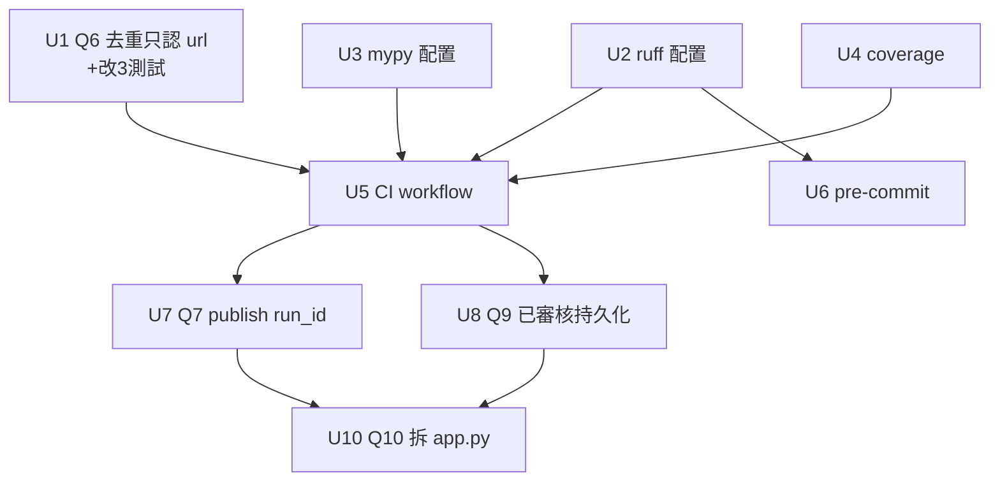

# 質量提升：自動守護 + 正確性收口 + 可維護性（分三階段）

## Overview

把一個功能成熟的項目推進成「質量更高的版本」，分三階段：**自動守護**（CI/ruff/mypy/coverage/pre-commit 全套，讓質量從「靠人記得跑 pytest」變「機器自動擋」）、**正確性收口**（修掉讀碼+審查抓到的去重誤跳、生命週期斷鏈、批量寫入、已審核持久化）、**可維護性**（把 417 行的 `webui/app.py` 拆成 APIRouter）。每階段獨立可發布、向後相容。

源文件全是內部模組（`core/`、`src/`、`browser/`、`webui/`）+ 新增工具配置；已跳過外部研究——CI/ruff/mypy 是標準工具，修正皆 repo 內部，無高風險外部 API（see origin: docs/brainstorms/2026-06-15-quality-uplift-requirements.md）。

> **關鍵排序**：U1（去重修正）會修改一條鎖定舊行為的既有測試，故必須**先於或同階段於 CI** 落地，否則 CI 會把舊的錯誤去重行為鎖成綠燈基線（see origin: Key Decisions）。

## Delivery Status (2026-06-15)

- ✅ **U1（Q6 去重）** — 已交付：去重只認 `canonical_url`，4 個鎖定舊行為的測試更新。
- ✅ **U2 / U4 / U5（ruff / coverage / CI）** — 由 ci-safety-net 切片（plan 006）交付並提交。
- ✅ **U7（Q7 publish run_id）** — 已交付：run_id 經 manifest 串接、`list_runs`/`/history` 加 run_id 篩選、WebUI 不雙寫、CLI 記 None。
- ✅ **U8（Q9 已審核持久化）** — 已交付：content-subtree 綁定、fail-closed、發布當下 opt-in 重驗、跨重啟持久、6 個安全測試。
- ✅ **U10（部分）** — 交付高價值部分：穿越 + 閘門順序 characterization 錨、純函數 `check_publish_gates`（可單測）。**路由檔案拆分降級不做**（YAGNI：430 行單人 app 的純搬移、高 churn 低值；真正價值已入袋；錨點保護日後若要拆）。
- ✅ **U3（mypy）** — 已交付：`[tool.mypy]`（`ignore_missing_imports`、`files`、`core.*` 高訊號嚴格旗標）、dev 加 `mypy`+`types-PyYAML`、`make typecheck`、CI `lint` job 加 mypy step（`continue-on-error` 非阻斷）。基線 **9 errors / 8 files**（`disallow_untyped_defs` 會暴出 50+ annotation 缺口，刻意延後到專門的 typing pass）。
- ✅ **U6（pre-commit）** — 已交付：`.pre-commit-config.yaml`（`astral-sh/ruff-pre-commit` v0.15.10，與 `[tool.ruff]` 同源）、dev 加 `pre-commit`、README 安裝指引。`pre-commit run --all-files` 綠。
- ⏸ **U9（Q8 批量連線）** — 維持暫緩（measure-first、預設 WONTFIX，見 Open Questions；達門檻才實作）。
- ⏸ **U10 路由拆分** — 維持降級不做（YAGNI，見 U10）。

測試：129 → **201 passing**（U3/U6 為純工具配置，無新增測試）。交付於分支 `feat/ci-safety-net`。

## Problem Frame

前兩輪功能性優化（基礎管線、日常營運硬化、全控制台）已落地。本輪不補功能，而是兩件事：① 把質量自動守住（目前無 CI/lint/型別/覆蓋率，全靠開發者記得本機 `pytest`）；② 收口代碼裡幾個便宜但會靜默出錯的缺口。去重缺口尤其關鍵——plan 005 雖把「R4 修去重」標為 completed，但 `core/state.py:57` 仍是 `canonical_url OR title_hash`、`tests/test_dedupe_posts.py:48` 仍斷言「同標題不同 URL 要跳過」，**該修正實際從未落地**。

## Requirements Trace

**Phase 1 — 自動守護**
- Q1. CI（GitHub Actions）每次 push/PR 跑 `pytest`，失敗即紅燈；測試基線子集明確、憑證級資料不外洩。
- Q2. ruff 配置鎖定 + `make lint` + CI `ruff check`。
- Q3. mypy 漸進式、CI 非阻斷基線。
- Q4. coverage 量測（不設硬門檻）。
- Q5. pre-commit hook（commit 前跑 ruff）。

**Phase 2 — 正確性收口**
- Q6.（決定：甲案）去重只認 `canonical_url`，移除 `title_hash` 跳過，消除「同標題不同文章被靜默漏發」。
- Q7. publish 階段的 `runs.record_run` 帶 `run_id`/`severity`；經 manifest 串接 build 的 run_id 以兌現跨進程生命週期。
- Q8.（效益待確認）`run_pipeline` 的 runs 寫入不再每筆開連線。
- Q9. 發布閘門①「已審核」持久化，且綁定被審核的內容版本（內容變更即失效）。

**Phase 3 — 可維護性**
- Q10. 拆 `webui/app.py` 成 FastAPI APIRouter，保留 `_safe_pkg_dir` 與三重閘門順序等安全不變量。

## Scope Boundaries

- 不破壞既有 CLI I/O 契約與退出碼語意（§13：0/1/2/3/4/5）；以新增（工具）+ 內部重構 + 小修為主、向後相容。
- 不把 `src/` 改名為命名空間套件（高 carrying cost、不發佈 PyPI，YAGNI；see origin）。
- coverage 不設硬門檻；mypy 非阻斷。
- 沿用單站單後台、localhost-only、外部 cron、人工 `auth-login` / `--approve` 等既有邊界。

## Context & Research

### Relevant Code and Patterns

- `core/state.py:54-79` `is_processed`/`skip_reason` — 現為 `status='published' AND (canonical_url OR title_hash)`；Q6 改點。`content_hash` 欄保留（`upsert`、watermark 檔名決定性用），但退出去重判定。
- `core/url_utils.py:60,64` — `title_hash(title)`、`content_hash(canonical_url,title,caption)`（含 URL，故無法做跨 URL 去重）。
- `src/dedupe_posts.py:26-48` `dedupe(records, conn, on_skip)` — 讀 `state.skip_reason`，reason 目前回 `'url'|'title'`；Q6 後只 `'url'|None`。READ-ONLY 不可變。
- `tests/test_dedupe_posts.py` — **三個測試鎖定舊行為**，Q6 須改：`test_same_title_hash_different_url_skipped:48`、`test_skip_reason_url_title_none:85`、`test_on_skip_callback_reports_reason:94`。
- `core/runs.py:53-61,98-106` `new_run_id`/`record_run` — `record_run` 每次經 `_connect` 開連線 + `_ensure_schema`（Q8 改點）；支援 `run_id`/`severity` 參數。
- `core/pipeline.py:63,87-90,106-116` `run_pipeline` — dedupe-skip 迴圈與 build 迴圈各自每筆 `record_run`（Q8）；`run_id = runs.new_run_id()`（Q7 串接來源）。在背景執行緒中跑（`jobs.submit`）。
- `src/publish_post.py:60-66,79-90` — `record_run(... )` **缺 run_id/severity**（Q7）；`_mark_published` 的 `upsert` 不傳 content_hash（Q6 後無關緊要，content_hash 不入去重）。
- `core/schema.py:27-64` `empty_manifest` — 無 `run_id` 欄；Q7 在 `backend` 加 `run_id`。
- `src/build_manifest.py:55-105` `build` — 由 pipeline 與 CLI 共用；Q7 經 `record`/`empty_manifest` 串 run_id。
- `webui/app.py` — `create_app` 閉包（26-417，近 300 行邏輯）；`app.state.reviewed`(:31)、`_safe_pkg_dir`(:376)、三重閘門(:262-269)、`_submit_job`(:233 publish 另生 run_id → Q7 雙寫風險)、`_cfg`/`jobs` 共用閉包（Q10 拆分需處理）。
- `tests/conftest.py` — 注入 root 到 sys.path（CI 需可 import 頂層 `core`/`src`）。測試慣例：`TestClient` + `tmp_path`（`test_webui_*`）；`select_cover._fetch` 可 monkeypatch。
- `Makefile` — 有 `install/test/demo/webui` 等；無 `lint`（Q2 新增）。`pyproject.toml` — 無 `[tool.ruff]`/`[tool.mypy]`/cov 設定（Q1-Q4 新增點）。

### Institutional Learnings

- 無 `docs/solutions/`（無既有 learnings）。
- origin Key Decisions：去重「寧可重複處理（人工可攔），不可靜默漏發」；真相來源分工 `items`=發布真相、`runs`=時序、`audit.jsonl`=低階日誌（`core/runs.py:1-9`）。
- plan 005 的 R4「修去重」checkbox 為 stale（標 completed 但未落地）——本計畫真正完成它。

### External References

- 未使用（本地模式充足、標準工具）。

## Key Technical Decisions

- **Q6 採甲案（去重只認 `canonical_url`）**：`title_hash` 跳過是「同標題不同文章靜默漏發」的根因；content_hash 含 URL、無鑑別力。直接移除 title 跳過最簡、零 schema 變動。「同文換 URL 重貼」交人工審核（每篇本就過審）。
- **U1 先於 CI**：去重修正改測試，須在 CI 前就位以免鎖死舊行為基線。
- **Q7 經 manifest 串 run_id**：build 把 `run_id` 寫進 `manifest.backend.run_id`，publish 讀回 → 跨進程生命週期可關聯。CLI build/publish 無 pipeline run_id 時各自為 null/自生（可接受）。WebUI publish 統一由 `publish_post._run` 記錄、`_submit_job` 不重複寫 publish run（消除雙寫）。
- **Q8 最小化、且先量測**：只讓 `run_pipeline` 在**單一背景執行緒內**持有一條 runs 連線重用（同執行緒不觸 `check_same_thread`），不新建跨執行緒批次 API。若量測顯示數十筆規模無感，可降為非目標。
- **Q9 標記存營運者側 + 綁「內容子樹雜湊」**：`reviewed` 改存 state SQLite，記錄 `post_id + 被審核當下的 content-id`。**content-id = 對 manifest 的「內容子樹」即時計算的雜湊**（`content.title` + `content.body`/caption + `source.canonical_url`），**不可用 mtime、不可含 `audit.*`/`backend.*`、不可雜湊原始檔 bytes**。理由（審查驗證）：`draft/verify/publish` 每步都 `mf.save()` 重寫整個 manifest（動 mtime 與 bytes，含 `audit.updated_at`、`sort_keys`），若綁 mtime 或整檔 bytes，正常 draft→verify→publish 會把審核標記弄失效、卡死操作者。亦不依賴 manifest 內的 `content_hash` 欄（該欄目前不存在於 manifest）。閘門①：marker 存在 **且** `stored content-id == 即時重算 content-id` 才過；marker 缺失/content-id 為 null/DB 讀取錯 → **fail-closed（400）**。單一共用 helper 由「審核頁寫入」與「發布檢查」共同呼叫，避免兩處算法漂移。
- **Q9 威脅模型 = 可信本機操作者的「防誤發」**：localhost-only、無 per-request auth、manifest 只有本機操作者能改（`build_manifest` 用 no-overwrite，不會被重爬覆寫）。閘門防的是「操作者誤發出與審核時不同的內容」，非並發攻擊者。**主要強制點＝請求受理時的閘門①**（content-id 相符才過）。發布執行當下的二次重驗為**選配的縱深防禦、且 opt-in**：僅 WebUI 把「已審核的 content-id」傳入 `publish_post._run` 時才比對；CLI publish 不傳、不受此檢查（否則 CLI 無 reviewed 標記會被 fail-closed 卡死，`--approve` 語意須不變）。鑑於威脅模型無並發攻擊者，此重驗非必要，可視為低成本保險。
- **Q10 保 app.state + APIRouter**：共用可變狀態（`reviewed`/`session_expired_mtime`/`config_path`）續留 `app.state`，handler 經 `request.app.state` 取用；`_cfg()` 改 FastAPI dependency。URL 與行為不變。
- **CI 測試基線拆 job**：core+webui job 恆跑（不需瀏覽器）；browser E2E job 獨立、裝 chromium，可標記。避免每次 push 裝 300MB 瀏覽器又不靜默漏跑。

## Open Questions

### Resolved During Planning
- Q6 修法：甲案（去重只認 canonical_url）——已定。
- Phase 1 範圍：全套一次到位——已定。
- CI 基線子集：拆「核心+webui（恆跑）／browser E2E（獨立可標記）」——已定。
- mypy CI 政策：非阻斷、記基線錯誤數——已定。
- Q9 標記與內容綁定：存 state SQLite 新表 `reviewed`（營運者側）；content-id = **內容子樹雜湊**（`content.title`+caption+`canonical_url`），**非** mtime、**非** manifest `content_hash` 欄（不存在）、**非**整檔 bytes；fail-closed；發布當下重驗——已定。
- Q7 join key：經 `manifest.backend.run_id` 串接——已定。

### Deferred to Implementation
- Q3 mypy 各模組 strict 邊界與 `ignore_missing_imports` 對 Scrapy/Playwright 的精確清單——實作時依首次跑出的錯誤量定。
- Q8（原 U9）是否實作：**measure-first，預設不做**。明確門檻——量一筆真實「數十筆」run，若 `record_run` 累計佔該 run 牆鐘 >X%（建議 X=5）或可感知延遲才實作單連線重用；否則關為 WONTFIX。不為此預設建 unit。
- Q9 content-id 雜湊的精確輸入欄位組合（是否納入 tags/category）——實作時定；界線為內容子樹、排除 `audit.*`/`backend.*`。
- Q10 `_cfg()` dependency 的精確注入形狀、router 檔案切分顆粒度——實作時定。
- CI 是否加多 Python 版本矩陣——先單版（3.11），有需要再加。

## High-Level Technical Design

> *以下說明意圖與形狀，是審查用的方向性指引，非實作規格；實作 agent 應視為脈絡，不是要照抄的程式碼。*

**Q7 run_id 跨進程串接（資料流）：**

```text
WebUI 爬取→建包 job (背景執行緒)
  run_id = new_run_id()                     # core/pipeline.run_pipeline
  rec["run_id"] = run_id  ──▶ build_manifest.build
                                 └─▶ manifest.backend.run_id = run_id   # 落盤（Q7 新增欄位）
  ...（人工審核 / draft / verify）...
WebUI 發布  publish_post._run(manifest)
  run_id = manifest.backend.run_id          # 讀回同一 run_id
  runs.record_run(stage="publish", run_id=run_id, severity="info")
  →  /history 以 run_id 撈出 build…publish 整條
```

**Q9 已審核閘門（綁內容子樹雜湊，fail-closed）：**

```text
content_id(manifest) = hash(content.title + content.body/caption + source.canonical_url)
                       # 共用 helper；不含 audit/backend、不用 mtime、不雜湊原始 bytes

開審核頁 GET /packages/{id}
  reviewed_store.mark(post_id, content_id(manifest))            # 存 state DB（營運者側）

發布 POST /packages/{id}/publish  （請求受理）
  gate①: stored = reviewed_store.get(post_id)
         stored 存在 且 stored == content_id(manifest) ?  否/null/err → 400 (fail-closed)
  gate②: status == draft_verified ?                          否→400
  gate③: 輸入標題 == manifest.title ?                          否→400
  三者皆過 → publish_post._run(..., expected_content_id=stored)  （背景執行緒，--approve）
            └─ (opt-in) mf.load 後再驗 content_id == expected   # WebUI 才傳；CLI 不傳→略過
```

## Implementation Units



### Phase 1 — 自動守護（含先行的去重修正）

- [ ] **U1: Q6 去重只認 canonical_url**

**Goal:** 移除 `title_hash` 跳過，消除同標題不同文章的靜默漏發。

**Requirements:** Q6

**Dependencies:** 無（須在 U5 之前）

**Files:**
- Modify: `core/state.py`（`is_processed`、`skip_reason`）
- Modify: `src/dedupe_posts.py`（docstring：reason 只 `'url'|None`）
- Test: `tests/test_dedupe_posts.py`（改 3 個測試）、`tests/test_state.py`（改 `test_title_hash_collision_is_processed`）
- **前置 grep**：`grep -rn is_processed tests/` 確認全部 `is_processed`/`skip_reason` 斷言點；已知 `tests/test_state.py:34` 斷言「同 title_hash 不同 URL → True」（將翻為 False）；`tests/test_browser_flow.py:107` 也以 title_hash 引數呼叫 `is_processed`，須確認其資料是 canonical_url 命中（否則為第 4 個待改測試）。

**Approach:**
- `is_processed` → `WHERE status='published' AND canonical_url=?`（去掉 `OR title_hash`）。
- `skip_reason` → 回 `'url'`（命中）或 `None`；移除 `'title'` 分支與相關排序。
- `content_hash` 留在 schema/`upsert`（watermark 檔名決定性），不進去重；`title_hash` 欄仍可寫入（保留 schema），只是不再用於跳過。

**Patterns to follow:** `core/state.py` 既有參數化 SQL 與 `PUBLISHED` 常數。

**Test scenarios:**
- Happy：published `canonical_url` 命中 → 跳過（沿用 `test_same_canonical_url_published_skipped`）。
- 迴歸（核心）：同標題、不同 URL → **放行**（改寫 `test_dedupe_posts.py::test_same_title_hash_different_url_skipped` 與 `test_state.py::test_title_hash_collision_is_processed`，後者斷言 `is_processed(...,'https://x.com/b', th) is False`）。
- `skip_reason`：url 命中回 `'url'`；僅 title 命中回 `None`（改寫 `test_skip_reason_url_title_none`）。
- `on_skip`：seed url-dup + title-dup，僅 url-dup 被跳（reason `['url']`），title-dup 放行（改寫 `test_on_skip_callback_reports_reason`）。
- Error：缺 `canonical_url`/`title` 仍 raise（不變）。

**Verification:** 全測試套件綠（grep 確認所有 `is_processed` 斷言點都已更新，無遺漏）；新斷言證明同標題不同 URL 會放行。

- [ ] **U2: ruff 配置 + make lint**

**Goal:** 鎖定 lint 規則並可本機/CI 執行。

**Requirements:** Q2

**Dependencies:** 無

**Files:**
- Modify: `pyproject.toml`（新增 `[tool.ruff]`）、`Makefile`（`lint` target）、`pyproject.toml` dev extras 加 `ruff`

**Approach:**
- `line-length=100`、`select=["E","F","I","B"]`（既有程式已依賴 `BLE001`）；以 `ruff check --statistics` 對 main 跑出現存違規，用 per-rule `ignore` 收編，**不為過 lint 改既有程式**。
- `make lint` → `ruff check .`。

**Test scenarios:** Test expectation: none — 純工具配置；驗證以 `make lint` 在現有程式上零報錯（透過 ignore 收編）為準。

**Verification:** `make lint` 在乾淨工作樹回 0。

- [x] **U3: mypy 配置（非阻斷基線）** — 已交付（基線 9 errors / 8 files；CI continue-on-error）

**Goal:** 建立型別檢查機制與基線。

**Requirements:** Q3

**Dependencies:** 無

**Files:**
- Modify: `pyproject.toml`（`[tool.mypy]`、dev extras 加 `mypy`）

**Approach:**
- `ignore_missing_imports=true`（Scrapy/Playwright 無 stub）；先對 `core/` 較嚴、其餘寬鬆。CI 以 continue-on-error 跑、記錄基線錯誤數、不擋 build。具體 strict 邊界實作時依首次錯誤量定。

**Test scenarios:** Test expectation: none — 配置；驗證以 mypy 可跑出基線、不崩潰為準。

**Verification:** `mypy` 在本地跑得起來並輸出錯誤計數。

- [ ] **U4: coverage 量測**

**Goal:** CI 輸出覆蓋率基線（不卡 merge）。

**Requirements:** Q4

**Dependencies:** 無

**Files:**
- Modify: `pyproject.toml`（dev extras 加 `pytest-cov`、`[tool.coverage]` 可選）

**Approach:** `pytest --cov=core --cov=src --cov=browser --cov=webui`；輸出 term 摘要，不設 `--cov-fail-under`。

**Test scenarios:** Test expectation: none — 量測設定；驗證以 CI 顯示覆蓋率數字為準。

**Verification:** 本地 `pytest --cov` 印出覆蓋率。

- [ ] **U5: CI workflow（GitHub Actions）**

**Goal:** push/PR 自動跑 lint/型別/測試/覆蓋率。

**Requirements:** Q1（+ Q2/Q3/Q4 在 CI 串起）

**Dependencies:** U1（正確去重基線）、U2、U3、U4

**Files:**
- Create: `.github/workflows/ci.yml`

**Approach:**
- Job A（恆跑，無瀏覽器）：setup Python 3.11 → `pip install -e '.[dev,webui]'` → `ruff check` → `mypy`(continue-on-error) → `pytest --cov`（排除 browser 標記）。
- Job B（browser E2E）：加 `pip install -e '.[browser]'` + `playwright install chromium`，跑 browser 標記測試；可設不阻斷或必跑（實作時定）。
- **憑證安全（強化）**：① 測試僅用合成 `tmp_path` storage_state；不對 storage_state 內容做 print/assert。② **log 防洩漏**：Job B 用 `--tb=short`、不 `-vv` dump session 物件。③ **secret 範圍**：真實登入態只在 Job B 的特定 step `env:` 引用（不放 workflow 層級），Job A 無 secret 存取；第三方 action 釘 SHA（非浮動 tag）。④ **artifact 白名單**：預設不上傳 run 產物；若上傳（如 `coverage.xml`）採明確 allowlist、絕不 `path: .`；**僅當日後真的上傳 run 產物時**再加 grep-guard step（出現 `storage_state`/`*.sqlite`/`audit.jsonl` 即 fail）——目前管線只可能上傳 `coverage.xml`，grep-guard 非必要（scope 審查）。
- **marker 管線（審查更正）**：browser 測試（`test_browser_flow`/`test_webui_actions`/`test_auth_login`/`test_backend_driver_resilience`）目前用 `pytest.importorskip` + `chromium.launch` 探測後 `pytest.skip(allow_module_level=True)`，所以**無瀏覽器時本來就 self-skip、不會 FAIL**——Job A 不靠 marker 也會綠。marker 的價值在「顯式排除、避免靠 skip 機制」：repo 目前**零 marker**，需新增——在 `pyproject` `[tool.pytest.ini_options]` 註冊 `markers=['browser: requires chromium']`、在上述模組加 `pytestmark = pytest.mark.browser`、Job A 跑 `-m "not browser"`、Job B 跑 `-m browser`。須擇一：marker **取代**既有 importorskip/skip，或並存（避免兩套分歧的 skip 機制）。
- **基線校準**：本機實跑 **183 passed**（非 144）；但此數含 chromium-gated 模組。CI Job A（無瀏覽器）會 self-skip 這些 → Job A 的「綠」是**非瀏覽器子集**，browser 路徑只在 Job B 被實際執行。

**Patterns to follow:** 標準 GitHub Actions Python workflow；`pyproject` optional extras 分組。

**Test scenarios:**
- Integration：開一個故意弄紅測試的分支 → CI 紅燈擋下。
- Integration：lint 違規 → `ruff check` job 紅。
- Edge：無瀏覽器環境下 Job A 全綠（browser 模組 self-skip／被 `-m "not browser"` 排除，非靜默漏跑）。
- 安全（僅在上傳 run 產物時）：grep-guard step 在即將上傳的 artifact 集出現 `storage_state`/`*.sqlite`/`audit.jsonl` 時 fail。

**Verification:** PR 上看到 CI 跑、紅綠正確；Job A 綠＝非瀏覽器子集；憑證級檔案不出現在 artifact/log。

- [x] **U6: pre-commit hook** — 已交付（ruff-check hook，與 [tool.ruff] 同源；pre-commit run 綠）

**Goal:** commit 前本機跑 ruff，與 CI 一致。

**Requirements:** Q5

**Dependencies:** U2

**Files:**
- Create: `.pre-commit-config.yaml`；Modify: `README.md`（安裝指引一行）

**Approach:** ruff hook 指向同一 `[tool.ruff]` 配置。

**Test scenarios:** Test expectation: none — 開發工具；驗證以 `pre-commit run --all-files` 與 `make lint` 結果一致為準。

**Verification:** `pre-commit run` 在乾淨樹回 0。

### Phase 2 — 正確性收口（CI 護欄下）

- [ ] **U7: Q7 publish run_id + manifest 串接**

**Goal:** 發布記錄帶 run_id/severity，並能用一個 run_id 撈出 build…publish 整條。

**Requirements:** Q7

**Dependencies:** U5（在護欄下改）

**Files:**
- Modify: `core/schema.py`（`empty_manifest` 的 `backend` 加 `run_id`——**新欄位**，目前不存在）、`src/build_manifest.py`（`build` 收整個 record，把 `record.get("run_id")` 寫進 `manifest.backend.run_id`，單一處寫入避免漂移）、`core/pipeline.py`（build 前 `rec["run_id"]=run_id`）、`src/publish_post.py`（讀 manifest run_id、`record_run` 帶 run_id/severity）
- Modify（兌現可查性，審查補）：`core/runs.py`（`list_runs` 加 `run_id` kwarg + WHERE 過濾）、`webui/app.py`（`/history` 收 `run_id` query 參數並傳入；publish 的 `_submit_job` 不重複寫 publish run）
- Test: `tests/test_publish_gating.py` 或新增、`tests/test_pipeline.py`、`tests/test_runs.py`

**Approach:**
- pipeline build 時把 run_id 帶入 record → 落進 `manifest.backend.run_id`（`mf.save` 用 `set_backend` 只動 status/url，不會刪此欄，審查已確認跨 draft/verify/publish 保留）。
- `publish_post._run` 讀 `manifest.backend.run_id`，`record_run(run_id=…, severity="info"/"error")`。
- **CLI publish 無 manifest run_id 時 `record_run(run_id=None)`，不自生**——自生會在 `/history` 分組視圖產生「看似關聯鍵、實則孤兒」的誤導記錄（審查）。
- WebUI publish：由 `publish_post._run` 為單一記錄者，`_submit_job` 不再另寫 publish run（避免雙寫）。
- 注意 `publish_post._run` 現有 `if args.state:` 才 record——若要 publish 失敗也記 severity=error，需確認 state 路徑存在（實作時定是否放寬）。

**Patterns to follow:** `core/pipeline.py` 既有 `record_run(... run_id=run_id, severity=…)` 用法；`list_runs` 既有 `post_id`/`severity` kwarg 過濾形狀。

**Test scenarios:**
- Happy：pipeline build → manifest 帶 run_id；publish 後 `list_runs(path, run_id=rid)` 同時回 build 與 publish 兩列。
- Integration：WebUI 走完 publish，runs 表該 run_id 只一筆 publish 列（非兩筆）。
- Edge：CLI 直接 publish 無 manifest run_id → 記 `run_id=None`（非自生 uuid）、不崩。
- Error：publish 失敗（有 state）記 severity=error 且帶 run_id。

**Verification:** `list_runs(run_id=rid)`/`/history?run_id=` 撈出含發布的整條（單一 run_id 一列 publish，非兩筆）；CLI 無 manifest run_id 時記 None。

- [ ] **U8: Q9 已審核持久化 + 綁內容版本**

**Goal:** 重啟後仍記得已審核，且內容變更後該審核失效。

**Requirements:** Q9

**Dependencies:** U5

**Files:**
- Create: `core/reviewed.py`（持久 reviewed-store，存 state SQLite，`CREATE TABLE IF NOT EXISTS reviewed(post_id PK, content_id, ts)`）
- Modify: `webui/app.py`（`/packages/{id}` 寫標記、publish 閘門①改讀持久標記 + 比對 content-id）、`src/publish_post.py`（發布執行當下再驗一次 content-id）
- Test: `tests/test_webui_publish_gate.py`、新增 `tests/test_reviewed_store.py`

**Approach:**
- **content-id 算法（共用 helper）**：對 manifest 的內容子樹計算雜湊——`content.title` + `content.body`/caption + `source.canonical_url`；**不含** `audit.*`/`backend.*`、**不用** mtime、**不雜湊**原始檔 bytes（理由見 Key Decisions：lifecycle `mf.save` 會動 mtime/bytes，整檔綁定會被 draft/verify 正常步驟弄失效）。同一 helper 由「審核頁寫入」與「發布檢查」共同呼叫，杜絕兩處算法漂移。
- **開審核頁**：寫 `(post_id, content_id)` 到 state SQLite（營運者側，不寫 manifest）。
- **閘門①（fail-closed）**：marker 存在 **且** `stored == 即時重算 content-id` 才過；marker 缺失 / content-id 為 null / DB 讀取錯 → 400。閘門順序維持 ①→②→③。
- **發布執行當下重驗（opt-in、選配）**：僅 WebUI 把已審核的 content-id 作為顯式參數傳入 `publish_post._run`，於 `mf.load` 後比對；**CLI 不傳此參數即略過**，保 `--approve` 語意不變、不會被 fail-closed 卡死（審查：`_run` 為 CLI+WebUI 共用入口）。此為縱深防禦，非主要強制點（主要強制＝閘門①）。
- **執行緒親和**：閘門①寫入在主請求緒；publish 重驗在背景緒（`jobs.submit`）。reviewed-store 比照 `runs.record_run` **每次呼叫開一條連線**（不跨緒共用，避開 `check_same_thread`）。
- **post_id 跨 out_dir 碰撞**：`reviewed` 以 `post_id` 為鍵、存於 `state_path`，而 manifest 在 `out_dir`（兩者 R7 後可獨立設定）。content-id 相等檢查正是讓「換 out_dir 但 post_id 碰撞」安全的機制（內容不同→雜湊不同→400），屬縱深防禦、需在 Approach 明示。

**Patterns to follow:** `core/runs.py` 的 SQLite 連線/schema 慣例（每呼叫開連線）；`webui/app.py` 既有閘門結構。

**Test scenarios:**
- Happy（mtime 陷阱迴歸，核心）：開審核頁 → **draft → verify**（兩次 `mf.save` 動了 mtime/bytes）→ publish 仍過閘門①（證明綁的是內容子樹、非 mtime/整檔）。
- Happy：開審核頁 → 重啟 app（reviewed-store 來自持久 SQLite）→ 閘門①仍過。
- Error（安全核心）：已審核 → 內容子樹被改寫（title/caption/url 變）→ publish 回 400。
- Error（fail-closed）：marker 存在但 content-id 欄為 NULL/空 → publish 回 400。
- Error：未開審核頁 → publish 400（不變）。
- Edge：同 post 多次開審核頁冪等；多分頁/重整一致。

**Verification:** draft/verify 後仍可發布；內容變更/缺 content-id 被拒；重啟後可發布；既有閘門測試綠。

- _**U9（原 Q8 批量連線）已降級為 measure-first 的 Deferred**_——見 Open Questions › Deferred to Implementation。理由（scope 審查）：在單人本機、「數十筆」規模、且 migration 是近乎 no-op 的 `CREATE TABLE IF NOT EXISTS`，每筆開連線幾乎無感；不應預設建一個帶連線生命週期複雜度的 unit。**僅當量測達到明確門檻才實作**（門檻見 Deferred）。預設交付為 9 個 unit（U1–U8、U10）。

### Phase 3 — 可維護性

- [ ] **U10: Q10 拆 webui/app.py 成 APIRouter**

**Goal:** 降低改動成本、行為與 URL 不變；可單測的收益來自**抽出純決策函數**（非「handler 可獨立單測」——見下）。

**Requirements:** Q10

**Dependencies:** U7、U8。**順序：U10 最後**。理由（審查）：U7/U8 都是**局部編輯**（U7 動一個 `_submit_job`、U8 動 `package_detail` + 閘門），在 monolith 改成本低；先拆會逼得每次 U7/U8 再 re-touch + 重新 characterize 拆出來的區塊。且 U8 已把 `reviewed` 從 in-memory `app.state` 移到 path-addressed store → 拆分時 `reviewed` 由 import 共用、非 `app.state`，縮小共用可變面（剩 `session_expired_mtime`/`config_path`）。

**Files:**
- Create: `webui/routers/packages.py`、`webui/routers/actions.py`、`webui/routers/history.py`、`webui/routers/settings_auth.py`（顆粒度實作時定）；`webui/_fs.py`（純 helper 之家：`_safe_pkg_dir`/`_scan_packages`/`_filter_packages`/`_read_failure`/`_tail_audit`/`_move_to_trash`）
- Modify/Extend（前置 characterization）：`tests/test_webui_packages.py` 已覆蓋 `/packages/{id}`、`/delete`、`/failure-image` 與 `.trash` 的穿越拒絕（3/7）——**補足其餘** `/cover`、`/draft`、`/verify`、`/publish`，可在既有檔擴充或新建 `tests/test_webui_traversal.py`（避免重複既有 3 條斷言）。**須放 chromium-free（TestClient-only）模組**，確保 Job A 跑得到（`test_webui_actions.py` 是 chromium-gated、在 Job A 會 skip，不能當錨）。
- Modify: `webui/app.py`（`create_app` 只組裝 + `include_router`）
- Test: 既有 `tests/test_webui_*.py` 原封通過 + 新增閘門純函數單測 + 閘門順序斷言

**Approach:**
- **共用狀態用 `app.state`（被測試 seam 強制，非隨意預設）**：`test_webui_auth.py:43-55` 直接 `app.state.session_expired_mtime = …` 當設定 seam；改用 lifespan/DI 容器會破壞既有測試、違反「原封通過」硬門檻。故 `session_expired_mtime`/`config_path` 續留 `app.state`，handler 經 `request.app.state` 取用。`templates` 本就是模組級（:23），免搬。
- **`_cfg()` 改 dependency，但僅作用於 handler 邊界**：`_action_ns`/`_submit_job` 部分在背景執行緒跑（`jobs.submit`、無 `Request`），故它們**維持普通函數、以參數收 `cfg`**（現碼 `_submit_job(request, stage, post_id, cfg, call)` 已是此形），不可把它們做成 dependency。
- **閉包 helper 改為顯式參數函數**：`_action_ns`→`make_action_ns(cfg, post_id, stage)`（移除內部隱式 `_cfg()`）；`_submit_action`/`_note_session_expiry`/`_auth_light` 皆顯式收 `cfg`/狀態。
- **可單測的真正收益＝抽純函數**：把發布閘門決策抽成純函數，**簽名須含 U8 的 content-id 比對**（非布林 reviewed_ok）：`check_publish_gates(stored_content_id, current_content_id, status, submitted_title, manifest_title) -> str|None`（回拒絕訊息或 None），直接單測；`_safe_pkg_dir` 本就純、直接單測。handler 本身仍走 `TemplateResponse`+`app.state` 耦合，維持 `TestClient` 整合測試。**此函數於 U8 落地後才定稿**（U8 改寫閘門①為 content-id 相等），U10 只做抽取、不重定義語意。
- 逐 router 搬移、每搬一組立即跑既有測試。

**Execution note:** Characterization-first——**先**（在 monolith 上）補足穿越拒絕（其餘 4 條，既有已覆蓋 3 條）與「閘門順序」斷言（後者目前不存在），放在 chromium-free 模組作為 Job A 也跑得到的行為錨；再開始拆，每搬一個 router 立即重跑。

**Patterns to follow:** FastAPI `APIRouter` + `Depends`；既有 handler 簽名。

**安全不變量（no-divergence）：** `_safe_pkg_dir`（路徑穿越唯一關卡，**7 個呼叫點**）、發布三道閘門（順序 reviewed→draft_verified→title、閘門①恆為首）、`_auth_light` 的「只讀 metadata、不洩 storage_state 內容」契約——三者搬移後不得重複定義或漂移。

**Test scenarios:**
- 前置 characterization（補足，既有覆蓋 3/7）：補 `/cover`、`/draft`、`/verify`、`/publish` 的穿越拒絕（`post_id` 為 `..`/`a/b` 時回 404/拒絕），與既有 `/packages/{id}`、`/delete`、`/failure-image`、`.trash` 合計覆蓋全部 7 個 `_safe_pkg_dir` 點；放 chromium-free 模組。
- 前置 characterization（核心，目前缺）：閘門順序——「未審核 **且** 標題錯」時回的是**審核**訊息（證明閘門①在最前），而非標題訊息。
- Integration：所有既有 `test_webui_*` 對拆分後 app 原封通過（URL/行為不變）。
- Happy（純函數單測）：`check_publish_gates(stored_content_id, current_content_id, status, …)` 各分支（content-id 不符/未驗證/標題不符/全過）直接單測，不啟 app。
- 後置檢查：`grep` 確認拆分後 `_safe_pkg_dir` 呼叫點數不變（6 處呼叫 + 1 定義）、零 inline `out_dir / post_id` 拼接。

**Verification:** 既有 webui 測試全綠；新增的 traversal + 閘門順序測試（先寫於 monolith）對拆分後 app 仍綠；`check_publish_gates` 有純函數單測；grep 後置檢查通過。

## System-Wide Impact

- **Interaction graph:** Q7 動到 pipeline→manifest→publish 與 WebUI `_submit_job`；Q9 動到 `/packages/{id}`（寫標記）與 publish 閘門；Q10 搬移所有路由但不改 URL。
- **Error propagation:** publish 失敗須記 severity=error+run_id（Q7）；閘門拒絕回 400（Q9）；CI 紅燈擋 merge（Q1）。
- **State lifecycle risks:** Q9 的 reviewed 標記須與內容版本同步（內容變即失效），避免過期審核放行；Q8 連線須正確 commit/close。
- **API surface parity:** Q10 後 WebUI URL 不變；CLI 契約不變（Q6/Q7 不改 CLI I/O 與退出碼）。
- **Integration coverage:** Q7 跨進程 run_id、Q9 重啟後狀態、Q10 拆分後路由——皆需整合測試（mock 不足以證明）。
- **Unchanged invariants:** CLI 命令 I/O 與退出碼語意、發布 `--approve` 語意、單站單後台/localhost-only 邊界、`content_hash` 的 watermark 檔名用途。

## Risks & Dependencies

| Risk | Mitigation |
|------|------------|
| CI 先於 U1 落地會鎖死舊去重行為基線 | 硬性排序：U1 在 U5 之前（見 Overview/Key Decisions） |
| CI Job A 的「綠」其實是非瀏覽器子集（browser 模組 self-skip） | 接受此前提並寫明；marker 顯式排除（`-m "not browser"`）取代隱式 skip；browser 覆蓋只在 Job B 由 chromium 真跑（Job B 是否阻斷待定） |
| Q9 持久化反而放鬆閘門（過期審核放行） | 綁**內容子樹雜湊**、內容變更即失效、fail-closed、發布當下重驗、標記存營運者側非 manifest；含「內容變更→400」「NULL content-id→400」測試 |
| Q9 content-id 綁 mtime/整檔會被正常 draft→verify 弄失效（卡死操作者） | 只雜湊內容子樹（title+caption+url），排除 `audit.*`/`backend.*`/mtime；含「review→draft→verify→publish 仍過閘門①」迴歸測試 |
| Q10 搬移路由漏掉 `_safe_pkg_dir` 或打亂閘門順序 | **traversal 測試與閘門順序測試目前不存在**——拆分前先在 monolith 補齊（覆蓋 7 個 `_safe_pkg_dir` 點 + 閘門①為首），作為行為錨；拆後 grep 確認 7 個呼叫點、零 inline 拼接 |
| Q7 WebUI publish 雙寫 run | 由 `publish_post._run` 單一記錄、`_submit_job` 不重複寫 |
| Q8 在小規模無實益、徒增複雜度 | 先量測；無感則降為非目標 |
| 憑證級 storage_state 經 CI artifact/log 外洩 | 測試用合成 tmp_path；artifact 排除敏感路徑；真實態僅遮罩 secret |

## Documentation / Operational Notes

- README 加：CI badge（可選）、`make lint` / pre-commit 安裝、測試 marker 說明（browser 測試如何跑）。
- 新增 dev 依賴：`ruff`/`mypy`/`pytest-cov`/（pre-commit）。

## Sources & References

- **Origin document:** [docs/brainstorms/2026-06-15-quality-uplift-requirements.md](docs/brainstorms/2026-06-15-quality-uplift-requirements.md)
- 相關代碼：`core/state.py`、`core/runs.py`、`core/pipeline.py`、`src/publish_post.py`、`src/build_manifest.py`、`core/schema.py`、`webui/app.py`、`tests/test_dedupe_posts.py`
- 前一輪計畫（含 stale R4）：`docs/plans/2026-06-15-005-refactor-project-optimization-phased-plan.md`
