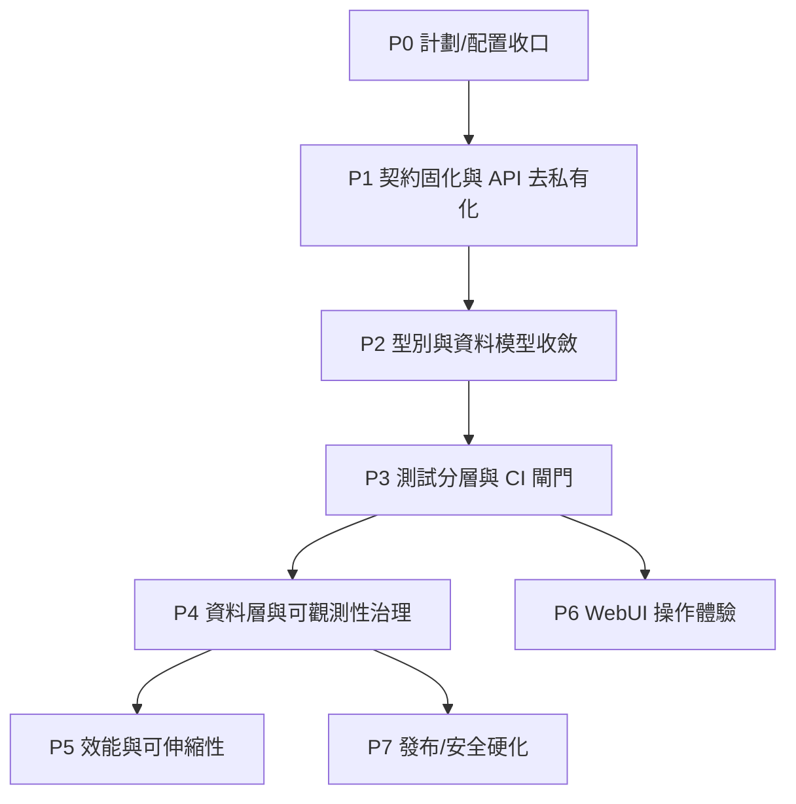

# 深度優化總計劃

> Superseded on 2026-06-18 by `docs/plans/2026-06-18-001-fix-workflow-pipeline-stabilization-plan.md`. This document remains historical context; the active execution queue is now the workflow stabilization plan, which rechecks the current checkout before acting on older unit statuses.

## Baseline Snapshot

截至 2026-06-16，專案已不是早期雛形，而是一個功能完整的本機內容管線：

- `webui/app.py` 已拆到 49 行，router 拆分實質完成。
- `python3 -m mypy core src browser webui` 已是 0 error。
- `python3 -m pytest -q`：273 passed，約 49 秒。
- `python3 -m pytest -m "not slow" -q`：262 passed / 11 deselected，約 17 秒。
- 覆蓋率：總體 82%；`core/`、`webui/` 多數高覆蓋，低點集中在 Scrapy child worker 與真瀏覽器/auth 路徑。
- `python3 -m ruff check .` 已通過。

這份計劃不再重做已完成的功能，而是把系統往「可長期穩定運行、好改、好查、好驗證」推進。

## Guiding Principles

- 先固化已達成的品質門檻，再擴張功能。
- 深度優化優先處理「文檔/配置/代碼實際行為不一致」與「未來會讓修改變慢的結構」。
- CLI I/O 契約不破：stdout/stderr/exit code 語意維持。
- 發布安全不降級：人工 gate、`--approve`、reviewed content binding 仍是核心不變量。
- 測試不追求單一總覆蓋率數字；重點是安全 gate、狀態流轉、資料層遷移、CLI 契約不可回歸。

## High-Level Roadmap

## Phase 0 — Plan And Config Hygiene

**Goal:** 把「已完成但文檔仍 active / 設定仍舊值 / Makefile 還寫 baseline」這類漂移先收掉。

Completion note (2026-06-16): P0 已落地。舊 active 計劃已收口為 completed；WebUI cover retry 預設與 `select_cover` 對齊；`make typecheck` 已阻斷化；本機生成物已加入 `.gitignore`。`src/crawl_posts.py` 的 `TELNETCONSOLE_ENABLED` 重複項在當前代碼中已不存在，無需改動。

### Units

- [x] **U0.1 更新已完成計劃狀態**
  - 將 router split 計劃標記為 completed，或在文檔頂部標明由本 master plan supersede。
  - 保留原 plan 作歷史，不刪除。
  - 驗收：`docs/plans` 中 active 計劃只剩真正未完成項。

- [x] **U0.2 修正 WebUI cover retry 預設漂移**
  - `src/select_cover.py` 預設已是 `DEFAULT_RETRIES=3`, `DEFAULT_BACKOFF_SEC=1.0`。
  - 已修正原先 `core/webui_config.DEFAULTS` 與 `configs/webui.yaml` 的 0/0.0 漂移，避免覆蓋模組預設。
  - 決策：WebUI 預設應與 CLI 一致，改為 3 / 1.0；保留使用者明確設 0 的能力。
  - 測試：補 `test_webui_config_default_cover_retry_matches_select_cover`。

- [x] **U0.3 清理小型配置/代碼重複**
  - `src/crawl_posts.py` settings 中重複 `TELNETCONSOLE_ENABLED`。
  - `README`、`pyproject`、`Makefile typecheck` 的「mypy 非阻斷 baseline」敘述已過期。
  - 驗收：文案與實際 0-error 狀態一致。

- [x] **U0.4 工作區生成物策略**
  - 明確 `configs/state/`、SQLite `-wal/-shm`、本機啟動 command、`.mimocode/`、`.omo/` 是否納入 `.gitignore`。
  - 不在本 unit 刪使用者檔案，只補策略與 ignore。

## Phase 1 — Contract Solidification

**Goal:** 讓 CLI、WebUI、core pipeline 對外契約清楚、穩定，降低後續重構成本。

Progress note (2026-06-16): U1.1/U1.2 已落地。六個 stage 級 `_xxx`
deprecated alias 已移除，測試改走公共函數；`draft_post` / `verify_draft` /
`publish_post` 已暴露 `run(args)`，core/WebUI 內部呼叫已遷到公共 API。
`_run = run` 暫留為外部兼容入口。

### Units

- [x] **U1.1 移除 vNEXT deprecated `_xxx` 別名**
  - 候選：`_normalize`, `_dedupe`, `_render`, `_select`, `_watermark`, `_build`。
  - 先掃全 repo 與 tests；若只有兼容測試依賴，改測公共 API 後移除。
  - 驗收：`tests/test_pipeline_public_api.py` 從「別名存在」改為「公共 API 被 CLI/WebUI 使用」。

- [x] **U1.2 後台命令公開 run API**
  - 目前 `core.pipeline.run_auto_pipeline` 與 WebUI action 仍呼叫 `draft_post.run` / `verify_draft.run` / `publish_post.run`。
  - 新增公共函數如 `draft_post.run(args)`, `verify_draft.run(args)`, `publish_post.run(args)`，CLI `main` 與 WebUI/core 共用。
  - 驗收：非測試代碼不再呼叫這三個模組的 `_run`。

- [ ] **U1.3 CLI flag 與設定檔 parity**
  - 檢查 `crawl_posts.CONFIG_DEFAULTS` 中可配置但 CLI 無 flag 的項，如 `download_delay`。
  - 檢查 WebUI 設定是否能覆蓋 pipeline 所有 runtime knobs。
  - 驗收：README 中列出 CLI/WebUI/config 三層覆蓋規則。

- [ ] **U1.4 錯誤契約 characterization**
  - 針對每個 console script 建立最小契約測試：成功 stdout、失敗 stderr、exit code。
  - 已有部分測試，補齊缺口即可。

## Phase 2 — Typed Models And Data Shape

**Goal:** 從「到處是 dict」逐步過渡到清楚的資料形狀，但不大改 I/O JSON。

### Units

- [ ] **U2.1 定義 TypedDict / dataclass 邊界模型**
  - `CrawledItem`, `NormalizedItem`, `PipelineBuiltItem`, `PipelineFailure`, `PipelineResult`, `WebuiConfig`。
  - 先用 `TypedDict(total=False)` 描述現有 JSON shape，不改序列化。
  - 驗收：`core/pipeline.py` 不再大量裸 `dict` / `list`。

- [ ] **U2.2 mypy 從 0-error 轉阻斷**
  - `Makefile typecheck` 移除 `|| true`。
  - `pyproject.toml` 註解更新為 blocking gate。
  - 若加 CI，CI mypy 必須作為阻斷式檢查。

- [ ] **U2.3 漸進提高 mypy 嚴格度**
  - 第一輪：`disallow_incomplete_defs = true` 只套 `core.*`。
  - 第二輪：`warn_return_any`, `no_implicit_optional` 擴到 `webui.*`。
  - 不一次全 repo strict，避免把類型修正變成噪音 PR。

- [ ] **U2.4 SQLite row/result 型別**
  - `core/runs.list_runs`, `reviewed.get`, `state.skip_reason` 回傳型別明確化。
  - 對 `sqlite3.Connection` 可用 `sqlite3.Connection` annotation。

## Phase 3 — Test Stratification And CI

**Goal:** 讓日常迭代有 5-10 秒 feedback loop，同時保留完整 e2e 信心。

### Units

- [ ] **U3.1 測試標記體系補齊**
  - 目前 `slow` 只標 11 個，但 `not slow` 仍約 17 秒。
  - 新增 markers：`browser`, `subprocess`, `integration`, `slow`。
  - 將 `tests/test_browser_flow.py::test_full_draft_verify_publish_flow`、WebUI 真 backend action 類測試標為 `browser` 或 `integration`。
  - 驗收：`pytest -m "not slow and not browser and not integration"` < 10 秒。

- [ ] **U3.2 Make targets**
  - `make test-fast`：core + webui pure tests，不跑 browser/subprocess slow。
  - `make test-full`：全部 273+。
  - `make test-slow`：只跑 slow/browser/integration。

- [ ] **U3.3 加 CI workflow**
  - `.github/workflows/ci.yml`：ruff、mypy、test-fast、test-full。
  - Playwright/browser 安裝若成本高，可將 browser tests 分 job。
  - 驗收：CI 紅綠與本地 Make targets 一致；mypy step 必須阻斷。

- [ ] **U3.4 覆蓋率策略**
  - 不設總覆蓋率硬門檻。
  - 可對 `core/`、`webui/` 設最低門檻（例如 90%），`src/crawl_posts.py` child worker 不納入硬門檻。
  - 驗收：coverage policy 寫入 README 或 `docs/`.

## Phase 4 — Storage, Jobs, And Observability

**Goal:** 將 SQLite、jobs、audit/run history 從「能用」提升到「可治理」。

### Units

- [ ] **U4.1 統一 SQLite schema lifecycle**
  - `core/state.py`, `core/runs.py`, `core/reviewed.py` 各自 `_connect`/schema。
  - 建立輕量 shared helper：connect + WAL + schema ensure + migration pattern。
  - 不強行合併三張表的所有邏輯，只消除重複連線與遷移樣板。

- [ ] **U4.2 schema version / migration audit**
  - 新增 `schema_meta` 或明確 migration helper，記錄 applied migrations。
  - 對既有 DB 保持無痛遷移。
  - 驗收：fresh DB 與 migrated DB schema 一致測試。

- [ ] **U4.3 jobs registry lifecycle**
  - `core/jobs.py` 現為 in-memory dict，無 pruning。
  - 加 `created_at`, `updated_at`, `finished_at`，保留最近 N 或 TTL 清理。
  - 加鎖保護 progress/current/result 寫入，避免多執行緒讀寫 snapshot race。

- [ ] **U4.4 audit/run history retention**
  - audit log 有 tail-read，但無 rotation。
  - 規劃 `CPOST_AUDIT_LOG_MAX_BYTES` 或 maintenance command。
  - run history 可加 `purge_runs_before(ts)` 或 UI 清理入口。

- [ ] **U4.5 history/audit TTL cache 條件實作**
  - 已有 latency DEBUG log。
  - 只有當實測 ≥ 5 ms 才做 30 秒 TTL cache。
  - 測試需覆蓋 cache key 含 filters，避免 history filter 汙染。

## Phase 5 — Performance And Scale

**Goal:** 保持 localhost 工具簡單，但讓數百包、長 audit、多圖下載時不拖慢。

### Units

- [ ] **U5.1 package scan cache / incremental scan**
  - `_scan_packages(out_dir)` 每次掃 `*/manifest.json`。
  - 當 out_dir 數百包時，packages/dashboard 會重複 JSON I/O。
  - 先量測；若 > 10 ms，再用 mtime+count key 做短 TTL cache。

- [ ] **U5.2 cover download concurrency guardrails**
  - 現有 `cover_download_concurrency` 可配置，需上限與文檔建議。
  - 避免使用者設太大導致本機或遠端壓力。
  - 驗收：validate 限制合理範圍，例如 1-16。

- [ ] **U5.3 crawl progress polling interval**
  - `crawl_items` progress polling 固定 0.5 秒，測試裡造成等待成本。
  - 增加內部可注入 `poll_sec`，測試用 0.05，CLI/WebUI 仍 0.5。
  - 驗收：crawl progress tests 縮短，但行為不變。

- [ ] **U5.4 backend retry strategy review**
  - `browser/backend_driver` 使用線性 backoff；`select_cover` 使用指數。
  - 決策是否統一或保持差異並文檔化。
  - 驗收：README/config comment 說清楚。

## Phase 6 — WebUI UX And Operator Workflow

**Goal:** WebUI 更像日常控制台，而不是功能堆疊。

### Units

- [ ] **U6.1 dashboard 作為第一屏**
  - 現有 router 有 dashboard，但 README 仍說設定頁 → 一鍵爬取。
  - 檢查 `/` 實際落點與主流程，讓第一屏顯示：auth 狀態、最近 run、待處理包、最後錯誤。

- [ ] **U6.2 action result 可追溯**
  - batch action 回傳 job，但包列表與 history 的跳轉關係可以更直接。
  - 增加 run_id link，到 `/history?run_id=...`。

- [ ] **U6.3 failure artifact viewer**
  - 已有 failure image endpoint；補 failure metadata 展示：stage、error、timestamp、retry count。

- [ ] **U6.4 settings validation UX**
  - `webui_config.validate` 已有錯誤；前端顯示應逐欄貼近。
  - 不引入大型表單框架，維持 HTMX。

## Phase 7 — Safety And Publish Hardening

**Goal:** 發布是不可逆動作，所有優化不得削弱 gate。

### Units

- [ ] **U7.1 publish gate threat model doc**
  - 用一頁文檔列出：reviewed content hash、draft_verified、title confirm、`--approve`、state DB binding。
  - 每個 gate 對應測試。

- [ ] **U7.2 credential exposure audit**
  - 已禁止 `storage_state` 在 `out_dir`/`download_dir` 下。
  - 補：WebUI 永不渲染 storage_state 文件內容；auth status 只讀 metadata。
  - 測試已有部分，補完整 threat cases。

- [ ] **U7.3 package file serving audit**
  - cover/failure image endpoints 只允許 package 內安全文件。
  - 增加對 symlink 的測試：不應可讀出 package 外文件。

- [ ] **U7.4 publish receipt and rollback story**
  - `publish_receipt.json` 已存在。
  - 規劃：發布後 UI 顯示 receipt，並提供人工 rollback 指引（不自動刪文）。

## Execution Order

建議按以下順序做，每步都應獨立提交/PR：

1. **P0**：文檔/配置漂移修正，成本最低，先把地圖校準。
2. **P1.1 + P1.2**：去私有 API，讓後面型別和重構有乾淨入口。
3. **P2.1 + P2.2**：TypedDict 與 blocking mypy，固化品質。
4. **P3.1 + P3.2**：測試分層與 Make targets，讓後續每輪更快。
5. **P3.3**：CI，將本地門檻搬到遠端。
6. **P4.1-P4.3**：資料層和 job lifecycle，治理長期運行問題。
7. **P5**：基於量測做性能優化，不預先加 cache。
8. **P6/P7**：UX 與安全文檔/測試同步推進。

## Non-Goals

- 不把本地工具改成多租戶服務。
- 不引入 Redis/Celery/Postgres。
- 不做批量發布。
- 不把 Scrapy child worker 改回同進程。
- 不追求 100% coverage。
- 不一次開啟全 repo strict mypy。

## Verification Matrix

每個階段至少跑：

- `python3 -m ruff check .`
- `python3 -m mypy core src browser webui`
- `python3 -m pytest -m "not slow and not browser and not integration" -q`

階段結束跑：

- `python3 -m pytest -q`
- `python3 -m pytest --cov=core --cov=src --cov=browser --cov=webui --cov-report=term-missing -q`

性能相關階段額外記錄：

- `python3 -m pytest --durations=20 -q`
- `/history`、`/audit`、packages scan 的本機 p50/p95 latency。
