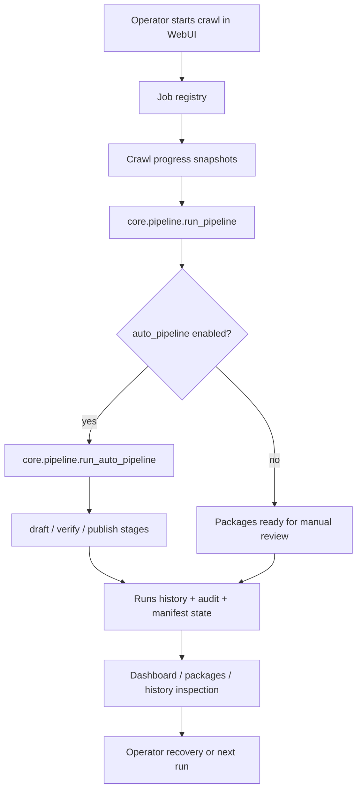

# fix: Stabilize the end-to-end workflow pipeline

## Summary

This plan turns the current crawl-to-publish system from a stack of partially stale plans into one executable stabilization sequence. The priority is to make the real workflow legible, then harden the crawl -> build -> draft -> verify -> publish chain, then improve storage, observability, and operator recovery around that chain.

---

## Problem Frame

The codebase has moved faster than its plans. Current code already contains auto-pipeline execution in `core/pipeline.py`, the WebUI adapter in `webui/_auto_pipeline.py`, router splitting, CI, typed schema definitions, and test markers. Several older plans and README statements still describe earlier boundaries, including "WebUI stops at build" and "never auto-publish," which now conflicts with the `auto_pipeline` feature.

The next repair should not repeat already-landed work. It should reconcile the current dirty worktree, make the true workflow contract explicit, and then stabilize the execution path users actually run from the WebUI.

---

## Requirements

- R1. The plan must begin with current-state reconciliation so stale plan text and stale analysis do not drive implementation.
- R2. Manual mode must remain conservative: review, verified status, title confirmation, and approve semantics continue to protect publish.
- R3. Auto mode must be explicit, visible, traceable, and recoverable because it intentionally changes the old "build only" WebUI boundary.
- R4. The pipeline orchestration layer must be the single source of workflow behavior for WebUI and CLI-facing backend stages.
- R5. Job progress and final results must let the operator see where the pipeline is now, what finished, what failed, and where to inspect the affected post.
- R6. Run history, audit logs, and SQLite schemas must support long-running daily operation without hidden drift or unbounded growth.
- R7. Fast local checks and full CI checks must map to the same workflow risk model so fixes can land without repeatedly paying the slowest feedback loop.

---

## Scope Boundaries

### In Scope

- Stabilize the existing single-site, localhost-only WebUI and CLI pipeline.
- Reconcile auto-pipeline documentation, warnings, and result rendering with current behavior.
- Harden the existing SQLite/run-history/job architecture without introducing a service dependency.
- Add characterization and integration coverage around the end-to-end workflow.

### Deferred to Follow-Up Work

- Multi-site management, remote hosting, accounts, role-based permissions, and external queue workers.
- Scheduled unattended runs beyond the existing external cron guidance.
- Notification channels such as Telegram, email, or macOS notifications.
- Broad visual redesign of the WebUI outside the operator surfaces needed for pipeline inspection.

### Outside This Product's Identity

- Bypassing CAPTCHA, anti-bot controls, or login requirements.
- Publishing to third-party systems the operator does not own or administer.
- Replacing local SQLite with a hosted database for scale that the product does not target.

---

## Assumptions

- The current dirty worktree contains intentional in-progress changes and must be preserved.
- `auto_pipeline` is an accepted direction because it exists in current code and changelog; this plan stabilizes that direction rather than removing it.
- The next executor will verify current test counts from the checkout instead of trusting older plan snapshots.

---

## Key Technical Decisions

- KTD1. **Current checkout is the source of truth:** Existing plans are inputs, not instructions to execute verbatim. Current files show several older "remaining" items are already done, while some documentation now contradicts shipped behavior.
- KTD2. **Pipeline core owns workflow semantics:** `core/pipeline.py` should remain the shared implementation point for build and auto publish orchestration. WebUI routers and adapters should translate UI/job concerns, not reimplement stage behavior.
- KTD3. **Auto mode is opt-in but first-class:** The plan treats auto mode as a supported workflow with its own warnings, result rendering, history links, and failure recovery instead of a hidden shortcut.
- KTD4. **Storage governance before more UX:** Runs, reviewed state, published state, audit, and jobs already form the operator's recovery surface. They need lifecycle and schema clarity before adding more high-level controls.
- KTD5. **Measure before caching:** Package scans, history/audit reads, and crawl polling should get measurement hooks before TTL or incremental caches are added.

---

## High-Level Technical Design

The desired shape is one shared workflow core with thin UI and CLI adapters. Every stage should emit enough state for the operator to understand the latest run without reading terminal logs.

---

## Implementation Units

### U1. Reconcile Current State and Plan Hygiene

**Goal:** Establish an accurate baseline before changing behavior, and prevent stale plans from driving duplicate or contradictory work.

**Requirements:** R1

**Dependencies:** None

**Files:**
- Modify: `docs/analysis/2026-06-18-system-analysis.md`
- Modify: `docs/plans/2026-06-16-004-deep-optimization-master-plan.md`
- Modify: `docs/plans/2026-06-16-001-feat-auto-pipeline-plan.md`
- Modify: `CHANGELOG.md`
- Test expectation: none -- documentation reconciliation only.

**Approach:** Update the current analysis and older active plans to distinguish completed, superseded, and still-open work based on the checkout. Keep historical plans as historical records, but add a clear pointer to this stabilization plan so future implementation follows one ordered source.

**Patterns to follow:** `docs/analysis/2026-06-18-system-analysis.md` already uses a plan-vs-code comparison table; keep that shape but refresh it against current files.

**Test scenarios:** Test expectation: none -- no runtime behavior changes.

**Verification:** A reader can open `docs/plans/` and identify this file as the current execution plan without mistaking older auto-pipeline or deep-optimization plans for the active queue.

### U2. Align Safety Policy, Documentation, and Auto Mode

**Goal:** Remove the contradiction between current auto-publish behavior and documents/UI text that still say WebUI automation stops at build.

**Requirements:** R2, R3

**Dependencies:** U1

**Files:**
- Modify: `README.md`
- Modify: `webui/templates/settings.html`
- Modify: `webui/templates/dashboard.html`
- Test: `tests/test_webui_config.py`
- Test: `tests/test_webui_publish_gate.py`
- Test: `tests/test_auto_pipeline.py`

**Approach:** Reframe the safety policy as "manual mode never publishes without the publish gates; auto mode is explicit opt-in and publishes through the same backend stage protections." The warning and documentation should say what auto mode bypasses, what it keeps, and where the operator inspects failures.

**Patterns to follow:** Existing settings warning for `auto_pipeline`; existing publish gate tests around `check_publish_gates`.

**Test scenarios:**
- Happy path: settings page with auto mode disabled communicates the manual build/review workflow.
- Happy path: settings page with auto mode enabled communicates that review is pre-satisfied while verify/publish protections remain.
- Edge case: manual publish still rejects unreviewed content, non-verified manifests, and mismatched titles.
- Integration: auto-pipeline test confirms publish uses the expected content id and approve semantics.

**Verification:** README, settings, dashboard, and tests all describe the same safety model.

### U3. Stabilize Auto-Pipeline Result Rendering and Recovery

**Goal:** Make one-click crawl -> publish observable from the WebUI job result, not just from terminal logs or low-level history.

**Requirements:** R3, R5

**Dependencies:** U2

**Files:**
- Modify: `core/pipeline.py`
- Modify: `webui/_auto_pipeline.py`
- Modify: `webui/routers/crawl.py`
- Modify: `webui/templates/_job_status.html`
- Test: `tests/test_auto_pipeline.py`
- Test: `tests/test_webui_crawl.py`
- Test: `tests/test_webui_actions.py`

**Approach:** Preserve the existing same-job execution model, but ensure the auto stage returns or attaches structured result data that the job template can render after completion. The completion view should distinguish built-only manual runs, auto-publish success, stage failures, skipped verify failures, and links to package/history inspection.

**Patterns to follow:** `_job_status.html` already branches on crawl build results and batch results; extend that result-shape branching instead of adding a second polling channel.

**Test scenarios:**
- Happy path: auto mode with two built packages renders crawl completion and auto-publish success counts.
- Edge case: zero built packages renders "no new packages" without draft/verify/publish attempts.
- Error path: draft failure after retries is visible in the final job result with stage and post id.
- Error path: verify failure is counted separately from publish failure and does not attempt publish for that item.
- Integration: `/crawl` job with auto mode enabled finishes with a result shape the template can render without falling through to the single-action branch.

**Verification:** Operators can see the outcome of a full auto run in the job panel and can navigate to the affected packages or history.

### U4. Unify Backend Stage Invocation Contracts

**Goal:** Remove remaining private backend-stage calls and make draft, verify, and publish use the same public execution contract everywhere.

**Requirements:** R4

**Dependencies:** U3

**Files:**
- Modify: `core/pipeline.py`
- Modify: `webui/routers/actions.py`
- Modify: `src/draft_post.py`
- Modify: `src/verify_draft.py`
- Modify: `src/publish_post.py`
- Test: `tests/test_pipeline_public_api.py`
- Test: `tests/test_webui_actions.py`
- Test: `tests/test_backend_commands_session.py`

**Approach:** Ensure non-test code calls the public `run` functions for backend stages. Keep private aliases only when needed for backward compatibility, and document their compatibility status where they remain. Manual single-item actions, batch actions, and auto-pipeline should all exercise the same public API surface.

**Patterns to follow:** `core/pipeline.run_auto_pipeline` already uses `draft_post.run`, `verify_draft.run`, and `publish_post.run`; mirror that in batch/manual paths.

**Test scenarios:**
- Happy path: batch draft and verify call public stage runners and continue to isolate per-item failures.
- Error path: `SessionExpiredError` still records a warning and triggers the WebUI auth-expiry hint.
- Compatibility: existing CLI entrypoints still dispatch through the public runner and preserve exit-code mapping.
- Regression: tests fail if non-test code reintroduces direct calls to private `_run` stage functions.

**Verification:** A repo search shows private stage runners are not called from production modules except as explicit compatibility aliases.

### U5. Govern Jobs, Run History, and SQLite Lifecycle

**Goal:** Make daily operation inspectable and durable without leaking memory or letting schema drift accumulate silently.

**Requirements:** R5, R6

**Dependencies:** U3, U4

**Files:**
- Modify: `core/jobs.py`
- Modify: `core/runs.py`
- Modify: `core/state.py`
- Modify: `core/reviewed.py`
- Modify: `webui/routers/history_audit.py`
- Modify: `webui/templates/history.html`
- Test: `tests/test_jobs.py`
- Test: `tests/test_runs.py`
- Test: `tests/test_state.py`
- Test: `tests/test_reviewed.py`
- Test: `tests/test_webui_history.py`

**Approach:** Add job timestamps, thread-safe mutation, and pruning rules to the in-memory job registry. Consolidate SQLite schema lifecycle patterns enough that `runs`, `state`, and `reviewed` use consistent connection, migration, and index expectations. Add run-history filtering paths needed to inspect a full workflow run by correlation id.

**Patterns to follow:** `core/runs.py` already separates `items`, `runs`, and `audit.jsonl`; preserve that division instead of merging all state.

**Test scenarios:**
- Happy path: completed jobs retain result snapshots until the pruning policy removes older entries.
- Edge case: concurrent progress/current updates do not produce partial snapshots or list mutation errors.
- Migration: a fresh database and an older database both expose the same required columns and indexes after open.
- Integration: history filter by post id, severity, and run id returns the expected subset without changing dedupe truth.
- Error path: invalid or missing SQLite files surface dependency or validation errors without corrupting existing data.

**Verification:** Long WebUI sessions do not grow job memory without bound, and history queries remain useful after repeated daily runs.

### U6. Complete Test Stratification and Workflow Smoke Coverage

**Goal:** Match local feedback loops and CI to the actual workflow risk: fast checks for iteration, full browser/backend checks before shipping.

**Requirements:** R7

**Dependencies:** U4, U5

**Files:**
- Modify: `pyproject.toml`
- Modify: `Makefile`
- Modify: `.github/workflows/ci.yml`
- Modify: `README.md`
- Test: `tests/test_cli_contract.py`
- Test: `tests/test_browser_flow.py`
- Test: `tests/test_webui_crawl.py`
- Test: `tests/test_auto_pipeline.py`
- Test: `tests/test_backend_driver_resilience.py`

**Approach:** Keep existing marker categories, but audit test files so each slow, browser, subprocess, and integration test is marked consistently. Add one end-to-end smoke scenario for the WebUI workflow that proves crawl, build, auto backend stages, job rendering, and history correlation stay connected under mocked backend execution.

**Patterns to follow:** Current CI already installs browser dependencies and fails if browser e2e is skipped; keep that fail-closed posture.

**Test scenarios:**
- Happy path: fast test selection excludes slow/browser/integration/subprocess tests while still covering core pipeline decisions.
- Integration: full workflow smoke builds packages, auto-runs backend stages through mocks, and records inspectable run history.
- Error path: CI fails loudly if browser e2e modules skip unexpectedly.
- Regression: README quality-check section stays aligned with Makefile targets and CI gates.

**Verification:** Developers can run a fast suite during repair work and rely on CI/full tests to cover browser and end-to-end workflow risk.

### U7. Add Operator-Facing Failure Inspection and Safety Notes

**Goal:** Give the operator a clear recovery path when a workflow stage fails.

**Requirements:** R3, R5, R6

**Dependencies:** U5, U6

**Files:**
- Modify: `webui/routers/packages.py`
- Modify: `webui/templates/detail.html`
- Modify: `webui/templates/history.html`
- Modify: `webui/templates/_history_table.html`
- Modify: `examples/scheduling.md`
- Test: `tests/test_webui_packages.py`
- Test: `tests/test_webui_history.py`
- Test: `tests/test_webui_auth.py`

**Approach:** Surface failure metadata, retry counts when available, latest stage, and run-history links from package detail and history pages. Document the operator recovery flow for session expiry, backend validation failure, image/download failure, and publish failure.

**Patterns to follow:** Existing `failure.json` reader in `webui/_helpers.py` and existing history/audit pages.

**Test scenarios:**
- Happy path: package detail with failure metadata shows stage, error, timestamp, and related history link.
- Edge case: corrupt or missing `failure.json` does not break package rendering.
- Error path: session-expired records show the auth-login recovery guidance without exposing storage-state contents.
- Integration: history page can filter to the lifecycle of a failed auto run and link back to the package.

**Verification:** A failed daily run can be diagnosed from WebUI pages and docs without reading raw SQLite or terminal output.

### U8. Measure and Then Tune Performance Hotspots

**Goal:** Improve smoothness only where measurements show operator-visible cost.

**Requirements:** R6, R7

**Dependencies:** U5, U6

**Files:**
- Modify: `webui/_helpers.py`
- Modify: `webui/routers/history_audit.py`
- Modify: `core/pipeline.py`
- Modify: `src/crawl_posts.py`
- Test: `tests/test_webui_packages.py`
- Test: `tests/test_webui_history.py`
- Test: `tests/test_crawl_posts.py`
- Test: `tests/test_pipeline.py`

**Approach:** Add lightweight measurements for package scanning, history/audit rendering, and crawl progress polling. Only add TTL caching, incremental scan caches, or test-only polling injection where the measurement crosses an agreed threshold.

**Patterns to follow:** Existing `_tail_audit` bounded-read strategy and the current `select_cover.select_all` concurrency control.

**Test scenarios:**
- Happy path: measured package scans below threshold do not enable cache complexity.
- Edge case: cache keys include filters so history/audit filters cannot bleed into each other.
- Integration: test-only crawl polling injection shortens tests without changing default runtime polling behavior.
- Error path: invalid package manifests still render as broken rows and do not poison a scan cache.

**Verification:** Any cache or polling change has a measured reason and does not obscure stale data during operator recovery.

---

## Risks & Dependencies

| Risk | Mitigation |
|---|---|
| Current dirty worktree contains user changes that overlap this plan | U1 requires baseline reconciliation before behavior edits and must preserve existing work. |
| Auto mode can publish more than the operator intended | U2 and U3 make auto mode visible, opt-in, and inspectable; manual mode gates remain strict. |
| Job registry changes introduce concurrency bugs | U5 adds focused job snapshot and mutation tests before relying on timestamps or pruning. |
| Storage lifecycle cleanup accidentally changes dedupe truth | U5 preserves separate `items`, `runs`, `reviewed`, and `audit` responsibilities and tests migrations separately. |
| Performance caches hide new package or history state | U8 is measurement-gated and must include filter/cache invalidation tests. |

---

## System-Wide Impact

This plan touches the main operator path from WebUI crawl start through final publish inspection. It also updates the shared quality contract around CI, local Make targets, plan status, and README guidance. The affected users are the local operator and future agents working from plans; the goal is to reduce ambiguity before adding more workflow features.

---

## Sources & Research

- Current workflow code: `core/pipeline.py`, `webui/_auto_pipeline.py`, `webui/routers/crawl.py`, `webui/routers/actions.py`
- Current operator surfaces: `webui/templates/settings.html`, `webui/templates/_job_status.html`, `webui/templates/history.html`, `webui/templates/dashboard.html`
- Current state and observability modules: `core/jobs.py`, `core/runs.py`, `core/state.py`, `core/reviewed.py`
- Current test surface: `tests/test_auto_pipeline.py`, `tests/test_webui_crawl.py`, `tests/test_jobs.py`, `tests/test_runs.py`
- Prior artifacts: `docs/analysis/2026-06-18-system-analysis.md`, `docs/plans/2026-06-16-001-feat-auto-pipeline-plan.md`, `docs/plans/2026-06-16-004-deep-optimization-master-plan.md`

---

## Verification Strategy

The implementation should advance one unit at a time. Documentation-only units verify by removing contradictions. Behavior-bearing units verify with focused unit tests first, then a WebUI workflow smoke test, then the full CI-equivalent suite. The final acceptance condition is that an operator can start a crawl from the dashboard or settings page, understand whether it is manual or auto mode, watch progress, inspect results, and recover from failures through WebUI/history without guessing which plan or terminal log is authoritative.
