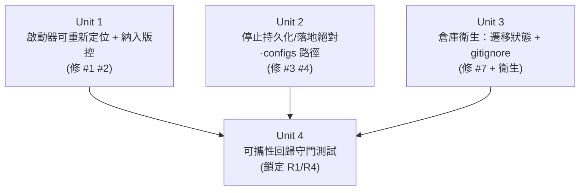

# refactor: 讓資料夾成為可重新定位的獨立專案

## Overview

讓 `local-crawl-post-factory` 這個資料夾可以被複製/搬移/clone 到**任何路徑或任何機器**，
在 `pip install` 後直接啟動運作，不依賴目前這台機器的特定位置與環境。

本計畫的**首要交付物**是一份「仍指向外部的功能性引用」完整清單（見
[External Reference Inventory](#external-reference-inventory)），以及把其中會破壞「搬走即能獨立跑」
的引用逐一修掉。可攜性標準訂在「**可重新定位即可**」——不做設定模板化、不產出可發布 wheel、
文檔另案掃描（皆為明確非目標）。

最關鍵的原則是**不漏**：除了 3 個顯而易見的硬編碼/環境假設外，還包含 1 條**隱性**引用——
WebUI 的「儲存設定」流程會把解析後的絕對機器路徑寫回 `configs/webui.yaml`，把外部引用重新種回去。
本計畫以一個回歸守門測試把「無外部引用」這個狀態鎖定，防止日後再被種回。

## Problem Frame

這個資料夾本身就是 git root，且 `pyproject.toml` 已支援 `pip install -e .` 與多個 console scripts，
專案大體已是自包含。但仍有少數功能性引用指向資料夾外部或綁定本機環境，導致「換個位置/換台機器就壞」：

- 桌面啟動器寫死了本機絕對路徑與 pyenv 佈局。
- WebUI 存檔流程會動態把絕對路徑寫進設定檔（latent，最易漏）。
- 執行期狀態因 config 路徑不一致而漏進 `configs/`，加上殘留備份與工具目錄，讓「打包後的資料夾」不乾淨。

> 邊界定義：「外部」= 指向本資料夾（git root）之外的位置，或綁定本機使用者/環境而無法隨資料夾搬移的引用。

## Requirements Trace

- **R1（首要）**：完整列出倉庫中所有仍指向外部的功能性引用，不漏；含隱性/動態產生者。（文檔另案，排除）
- **R2**：資料夾複製/搬移/clone 到任意路徑或機器後，`pip install` → 啟動可運作（可重新定位）。
- **R3（順帶清理，已納入）**：執行期產物不再漏進 `configs/`；殘留備份與工具目錄不進版控、不隨包散落。
- **R4**：以自動化守門鎖定「無硬編碼絕對機器路徑」，防止回歸（呼應 R1 的「不漏」精神）。

## Scope Boundaries

- **非目標**：把出貨預設 config 模板化（保留 `start_url: https://51cg1.com/` 原樣）。
- **非目標**：產出 wheel/sdist 或一鍵打包腳本（「可發布產物」檔位未選）。
- **非目標**：文檔/Markdown 內的外部連結掃描（使用者指示另案處理）。
- **非目標**：「從任意 CWD 啟動」——asset-config 預設（`./templates`、`./configs/*.yaml`）是
  **執行目錄相對**，本計畫只保證「從專案根啟動」可攜（啟動器會 `cd` 到專案根），不擴展為任意 CWD。
- **非目標**：修改 CI（`.github/workflows/ci.yml` 已可攜）、pre-commit 外部 repo（標準工具鏈，保留）。

## Context & Research

### Relevant Code and Patterns

- `core/webui_config.py` — `DEFAULTS` 與 `_resolve_paths(cfg, base=p.parent)`：路徑欄位以**設定檔所在目錄**
  為基底解析成**絕對路徑**。`_PATH_FIELDS = (download_dir, out_dir, state_path, audit_log, storage_state)`；
  `_ENV_OVERRIDES`（`CPOST_STATE_PATH` 等）提供環境覆寫（已是良好的可攜性出口）。
- `webui/routers/_ctx.py:30` — `cfg_from_request()` = `webui_config.load(...)`，回傳**已解析絕對路徑**的 cfg。
- `webui/routers/settings_auth.py:65` — `save(config_path, {**cfg_from_request(request), **incoming})`：
  把上面已解析的絕對路徑連同表單欄位一起 `save()` 回 yaml → **latent 外部引用來源**。
- `scripts/demo.sh:5`（`cd "$(dirname "$0")/.."`）、`webui/routers/_ctx.py:16`（`Path(__file__).parent.parent`）
  — 既有的「自我相對定位」良好範式，啟動器修正可比照。

### 已確認「不是」外部引用（免改，可攜）

- `configs/webui.yaml` 的 `../out`、`./state` 等：經 `_resolve_paths` 以設定檔目錄為基底 → 落在專案內。
- `scripts/demo.sh`（相對自身）、`webui/routers/_ctx.py`/tests 的 `parent.parent`（套件相對）。
- `webui/static/htmx.min.js` 已內置（48KB committed）→ `make vendor-htmx` 只是刷新，非執行/安裝依賴。
- 全樹無符號連結、無 `sys.path` hack、無對外部姊妹專案的 import（已 grep 驗證）。
- `.github/workflows/ci.yml`、`.pre-commit-config.yaml`：標準外部工具鏈，合法保留。

## External Reference Inventory

> **R1 交付物**。掃描範圍：全樹（排除 `.git`、各類 cache、`out/`、`htmlcov/`、`docs/`）。
> Tier 含義：T1=搬走即壞（必改）、T2=環境假設、T3=建置期觸點、T4=設定資料/衛生、T5=標準外部工具鏈（保留）。

| # | 位置 | 引用內容 | 類型 | Tier | 處置 |
|---|------|----------|------|------|------|
| 1 | `啟動本地服務.command:15` | `PROJECT_DIR="/Users/dex/YDEX/INPORTANT WORK/POST /0615 CPOST"` | 硬編碼絕對專案路徑 | **T1 硬** | 修：改自我相對解析 → Unit 1 |
| 2 | `啟動本地服務.command:11` | `export PATH="$HOME/.pyenv/shims:$HOME/.pyenv/bin:$PATH"` | pyenv 佈局假設 | **T2 環境** | 軟化：條件式追加 → Unit 1 |
| 3 | `settings_auth.py:65` + `_ctx.py:30` + `webui_config.py`（save 流程） | `save()` 把 `load()` 解析後的**絕對機器路徑**寫回 `configs/webui.yaml`（按一次「儲存設定」即種回 `/Users/...`） | **隱性/動態**外部引用 | **T1 隱性** | 修：存檔不得持久化絕對執行期路徑 → Unit 2 |
| 4 | `configs/webui.yaml`（`out_dir/download_dir=../out` 對比 `state_path/audit_log/storage_state=./`） | 執行期根不一致 → sqlite/log/auth 落進 `configs/` | 衛生/不一致 | T1 衛生 | 對齊到專案根 → Unit 2 |
| 5 | `Makefile:14`（`vendor-htmx`） | `curl -L https://unpkg.com/htmx.org@1.9.12/...` | 建置期 CDN 抓取（htmx 已內置） | T3 建置 | 保留（僅刷新用，已 pin 版本） |
| 6 | `configs/webui.yaml:14` | `start_url: https://51cg1.com/` | 出貨預設裡的真實爬取目標站 | T4 設定資料 | **保留**（依決策：可重新定位、不模板化） |
| 7 | `configs/webui.yaml.bak`（未追蹤） | 同上之殘留備份 | 衛生 | T4 衛生 | 移除 + gitignore → Unit 3 |
| 8 | `.pre-commit-config.yaml:5`、`.github/workflows/ci.yml` | ruff-pre-commit / actions@v6 / playwright apt | 標準外部工具鏈 | T5 | 保留 |

**衛生補充（隨 R3 一併處理，非「引用」但屬打包不潔）：**

- `啟動本地服務.command` 目前**未被 git 追蹤**（git status 顯示 `??`）→ 修正後應 commit，使其隨資料夾散布。
- `configs/state/published.sqlite`(+`-wal`/`-shm`)、`configs/logs/audit.jsonl`：**真實執行期狀態**（含已發布去重歷史）
  → 必須**遷移**到專案根 `state/`、`logs/`，**不可直接刪**。
- `configs/auth/`：經查為**空目錄**（無 `storage-state.json`，無憑證遺失風險）→ 可安全移除。
- `.omo/`、`.mimocode/`：本機工具目錄（未追蹤）→ gitignore，不隨包散布。

## Key Technical Decisions

- **啟動器以 `$0` 自我定位**（`PROJECT_DIR="$(cd "$(dirname "$0")" && pwd)"`）：`.command` 位於專案根，
  自我相對即得專案根；搬到任何路徑/機器皆正確。理由：與 `scripts/demo.sh` 既有範式一致、零外部依賴。
- **pyenv PATH 改為條件式**：僅當 `$HOME/.pyenv/shims` 存在時才追加；否則沿用既有 PATH。既有的
  `command -v "$SERVICE_CMD"` 檢查已會在找不到指令時印出安裝指引，故軟化後不降低可用性。
- **WebUI 存檔不得持久化絕對執行期路徑**（修 #3）：`save()` 寫回 yaml 時，路徑欄位必須維持可攜（相對或留給
  DEFAULTS），不得寫入 `_resolve_paths` 產生的絕對值。確切機制（存檔前以 raw 值還原 / save 略過 `_PATH_FIELDS` /
  存檔走未解析載入）屬執行期決定，但**契約固定**：存檔後磁碟上的 `configs/webui.yaml` 不含絕對機器路徑。
- **執行期根對齊專案根**（修 #4）：將 `configs/webui.yaml` 的 `state_path/audit_log/storage_state` 由 `./`
  改為 `../`，與 `out_dir/download_dir` 一致 → 全部落在已被 gitignore 的專案根 `state/`、`logs/`、`auth/`。
  須確認 `storage_state` 不落入 `out_dir/download_dir`（既有守門，`../auth` 不在 `../out` 內，通過）。
- **以守門測試鎖定 R1**：新增可攜性回歸測試，掃描追蹤檔中是否出現絕對家目錄/使用者路徑或本機專案路徑；
  同時斷言 `configs/webui.yaml` 路徑欄位維持相對。這是「不漏改」的長期保險。

## Open Questions

### Resolved During Planning

- 「打包/獨立操作」標準 → **可重新定位即可**（使用者決策）；故 #6 `start_url` 保留、不模板化、不產出 wheel。
- 順帶清理是否納入 → **納入**（使用者決策）；含 `configs/` 污染、`.bak`、工具目錄。
- `configs/auth/` 是否含憑證 → 否（空目錄，已驗證），可安全移除。
- htmx 是否為執行期外部依賴 → 否（已 vendored），`vendor-htmx` 僅刷新用。

### Deferred to Implementation

- 修 #3 的**確切落點**（`core/webui_config.save()` vs `settings_auth.py` 存檔流程 vs 兩者）：待動程式碼、
  看現有測試與 round-trip 行為後決定，以「存檔後 yaml 無絕對路徑」為驗收。
- 是否同步調整 `DEFAULTS`（`./state` → 與專案根一致）：視 #3 落點而定；若 save 不再寫路徑欄位，DEFAULTS 可不動。
- `configs/state/published.sqlite` 與專案根既有 `state/` 內容是否需合併（若兩處皆有歷史）：遷移時現場核對。

## High-Level Technical Design

> 此圖說明單元依賴關係，供審查理解計畫結構，非實作規格。

## Implementation Units

- [ ] **Unit 1：啟動器可重新定位 + 納入版控**

**Goal:** `啟動本地服務.command` 以自身位置解析專案根、不硬綁 pyenv，並 commit 進版控隨資料夾散布。

**Requirements:** R1(#1,#2), R2

**Dependencies:** 無

**Files:**
- Modify: `啟動本地服務.command`
- Modify: `.gitignore`（確認未忽略 `*.command`；如有需要顯式允許）
- Test: 行為由 Unit 4 守門 + 手動重定位煙霧驗證（shell 啟動器無單元測試載體）

**Approach:**
- 第 15 行：`PROJECT_DIR="$(cd "$(dirname "$0")" && pwd)"`，移除硬編碼絕對路徑（比照 `scripts/demo.sh:5`）。
- 第 11 行：pyenv PATH 改條件式（`[ -d "$HOME/.pyenv/shims" ] && export PATH="...:$PATH"`），否則沿用既有 PATH。
- 保留既有 `command -v "$SERVICE_CMD"` 檢查與安裝指引、`cd` 失敗的錯誤分支。
- 將檔案加入版控（目前未追蹤）。

**Patterns to follow:** `scripts/demo.sh`（`cd "$(dirname "$0")/.."` 自我相對）。

**Test scenarios:**
- Happy（手動/煙霧）：把整個資料夾複製到另一路徑後雙擊啟動器 → 正確 `cd` 到複製後的專案根並啟動服務。
- Error（保留行為）：`$SERVICE_CMD` 不存在 → 印出安裝指引並以非 0 退出。
- Edge：在無 pyenv 的機器執行 → 不因缺少 `~/.pyenv` 而報錯，PATH 退回既有值。
- 自動化斷言：見 Unit 4（追蹤檔不得含 `/Users/...` 絕對路徑）。

**Verification:** 複製資料夾到新路徑後，啟動器可開啟 WebUI；`git ls-files` 含該啟動器；檔內無任何 `/Users/` 絕對路徑。

---

- [ ] **Unit 2：停止持久化/落地絕對與 configs 局部的執行期路徑**

**Goal:** 修掉 #3（WebUI 存檔種回絕對路徑）與 #4（執行期根不一致污染 `configs/`），使設定檔在任何機器都維持可攜、執行期輸出統一落在專案根。

**Requirements:** R1(#3,#4), R2, R3

**Dependencies:** 無（與 Unit 1 獨立）

**Files:**
- Modify: `core/webui_config.py`（存檔流程不得寫入絕對路徑；落點見 Deferred）
- Modify: `webui/routers/settings_auth.py` 和/或 `webui/routers/_ctx.py`（若選擇在存檔前以未解析值還原）
- Modify: `configs/webui.yaml`（`state_path/audit_log/storage_state` 由 `./` 改 `../`，對齊 `out_dir`）
- Test: `tests/test_webui_config.py`、`tests/test_webui_actions.py`（或 `test_webui_auth.py` 的存檔路徑）

**Approach:**
- **#4 對齊**：`configs/webui.yaml` 三個執行期路徑欄位改 `../state/published.sqlite`、`../logs/audit.jsonl`、
  `../auth/storage-state.json`；經 `_resolve_paths(base=configs/)` 解析 → 落在專案根 `state/`、`logs/`、`auth/`。
- **#3 修正**：使 `save()` 寫回 yaml 時路徑欄位維持可攜（相對/留白給 DEFAULTS），不寫 `_resolve_paths` 的絕對值。
  保留 `_ENV_OVERRIDES`（`CPOST_*`）作為容器/CI 的覆寫出口。
- 維持 `storage_state` 不得位於 `out_dir/download_dir` 內的既有守門。

**Execution note:** 先補一個會失敗的 round-trip 測試（save→reload 後 yaml 不含絕對路徑）再動程式碼，鎖定 #3 契約。

**Patterns to follow:** `core/webui_config._resolve_paths` 既有的 base 相對解析與 `_ENV_OVERRIDES` 出口設計。

**Test scenarios:**
- Happy：`load(configs/webui.yaml)` 後 `state_path/audit_log/storage_state` 解析路徑位於專案根之下，**非** `configs/` 之下。
- Integration（#3 核心回歸）：對一份相對路徑設定執行 `save()` → 重讀磁碟 yaml，路徑欄位仍為相對、**不含** `/Users` 或前導 `/`。
- Integration：POST `/settings`（模擬 WebUI 儲存）後，`configs/webui.yaml` 不含任何絕對機器路徑。
- Edge：`storage_state` 經設定會落入 `out_dir` 內時 → 仍丟 `ValidationError`（守門未被破壞）。
- Edge：設定 `CPOST_STATE_PATH` 環境變數 → 覆寫生效且 `expanduser`（既有行為不回歸）。

**Verification:** 任何「儲存設定」操作後 `configs/webui.yaml` 仍可攜；新一輪 WebUI 執行的 sqlite/log/auth 出現在專案根 `state/`、`logs/`、`auth/`，`configs/` 不再生成這些目錄。

---

- [ ] **Unit 3：倉庫衛生——遷移殘留狀態 + 忽略工具/備份**

**Goal:** 清除已漏進 `configs/` 的執行期產物與殘留檔，並防止再生，使打包後的資料夾乾淨。

**Requirements:** R3

**Dependencies:** Unit 2（路徑對齊後，新狀態才會寫到專案根；先做 Unit 2 可避免遷移後又被 `configs/` 再生）

**Files:**
- Modify: `.gitignore`（新增 `*.bak`、`.omo/`、`.mimocode/`；保險性新增 `configs/state/`、`configs/logs/`、`configs/auth/`）
- Migrate/Remove（皆為未追蹤檔）：
  - 遷移 `configs/state/published.sqlite`(+`-wal`/`-shm`) → 專案根 `state/`（現場核對是否與既有 `state/` 重複）
  - 遷移 `configs/logs/audit.jsonl` → 專案根 `logs/`（append/合併）
  - 移除空目錄 `configs/auth/`
  - 移除 `configs/webui.yaml.bak`

**Approach:** 先遷移含資料者（sqlite/audit），再移除空殼與備份，最後補 `.gitignore` 防再生。

**Test expectation:** none —— 純衛生/設定。驗收以 `git status` 乾淨 + 跑一輪 WebUI 後 `configs/` 不再生成 state/log/auth 為準。

**Verification:** `git status` 無 `configs/state|configs/logs|configs/webui.yaml.bak|.omo|.mimocode` 殘留；去重歷史（published.sqlite）未遺失。

---

- [ ] **Unit 4：可攜性回歸守門測試（鎖定「不漏改」）**

**Goal:** 自動化偵測任何追蹤檔重新引入硬編碼絕對家目錄/使用者路徑或本機專案路徑，並斷言設定檔路徑欄位維持相對。

**Requirements:** R1, R4

**Dependencies:** Unit 1、Unit 2、Unit 3（守門應在清乾淨後轉綠）

**Files:**
- Create: `tests/test_portability_guard.py`
- Test: 同上（測試本身即守門）

**Approach:**
- 以 `git ls-files` 取追蹤檔清單，排除 `docs/`、二進位（如 `*.png`、`htmx.min.js`）。
- 斷言無檔案含絕對家目錄/使用者路徑樣式（`/Users/<name>/`、`/home/<name>/`）或本機專案路徑片段。
- 額外斷言 `configs/webui.yaml` 的 `_PATH_FIELDS` 值皆為相對（無前導 `/`、無 `~`）。
- 將掃描邏輯抽成可傳入「檔案清單」的函式，便於單元測試其偵測能力。

**Patterns to follow:** `tests/conftest.py`、`tests/test_webui_*` 既有的純函式 + tmp_path 測試風格。

**Test scenarios:**
- Happy：對清理後的當前樹執行守門 → 通過（零命中）。
- Error（偵測力）：對含 `/Users/someone/...` 的假檔案清單執行 → 守門失敗並指出該檔。
- Edge：`docs/` 與二進位檔在排除清單內 → 不誤報。
- Edge：`configs/webui.yaml` 任一路徑欄位被改成絕對路徑 → 守門失敗（直接攔截 #3 回歸）。

**Verification:** `make test`（或對應 pytest）下守門綠燈；人為注入絕對路徑時守門紅燈。

## System-Wide Impact

- **Interaction graph:** Unit 2 觸及 `webui_config.load/save` 與 `settings_auth` 存檔路徑，是 WebUI 設定的核心讀寫面；
  須確保既有 `_resolve_paths`、`_ENV_OVERRIDES`、`storage_state` 守門行為不回歸。
- **Relocation correctness:** 專案為「專案根相對」可攜，**非**任意 CWD 可攜——asset-config 預設
  （`./templates`、`./configs/watermark.yaml`、`./configs/backend.yaml`）是執行目錄相對。啟動器（Unit 1）會 `cd`
  到專案根，故此前提成立；`make webui`、直接於專案根跑 `crawl-post-webui` 亦同。此前提寫入 README 屬文檔另案。
- **State lifecycle risks:** Unit 3 涉及遷移 `published.sqlite`（去重歷史）；遷移而非刪除，避免重發已發布內容。
- **Unchanged invariants:** `pyproject.toml` 套件結構與 console scripts、CI、pre-commit、`start_url` 出貨值、
  htmx 內置資產皆不變；`CPOST_*` 環境覆寫機制保留。

## Risks & Dependencies

| Risk | Mitigation |
|------|------------|
| 修 #3 落點選錯，導致 `_ENV_OVERRIDES` 或 `storage_state` 守門回歸 | 先寫 round-trip 與 env-override 測試再動碼；保留既有守門斷言 |
| 遷移 `configs/state/published.sqlite` 時與專案根既有 `state/` 衝突，遺失去重歷史 | 遷移前現場核對兩處內容；以遷移/合併取代刪除（不可逆操作先確認） |
| 守門測試誤報（如二進位檔、合法 `example.com`） | 明確排除 `docs/`、二進位與佔位主機；偵測限定「絕對家目錄/使用者路徑」樣式 |
| 啟動器 pyenv 軟化後在某些雙擊情境找不到指令 | 保留既有 `command -v` 檢查與安裝指引；退回既有 PATH |

## Sources & References

- 啟動器：`啟動本地服務.command:11,15`
- 設定解析/存檔：`core/webui_config.py`（`DEFAULTS`、`_resolve_paths`、`save`）、
  `webui/routers/settings_auth.py:65`、`webui/routers/_ctx.py:30`
- 設定資料：`configs/webui.yaml`（:9,:12,:14）、`configs/webui.yaml.bak`、`configs/backend.yaml`
- 建置/CI/工具鏈：`Makefile:14`、`.github/workflows/ci.yml`、`.pre-commit-config.yaml:5`
- 既有可攜範式：`scripts/demo.sh:5`、`webui/routers/_ctx.py:16`
- 既有測試風格：`tests/conftest.py`、`tests/test_webui_config.py`
