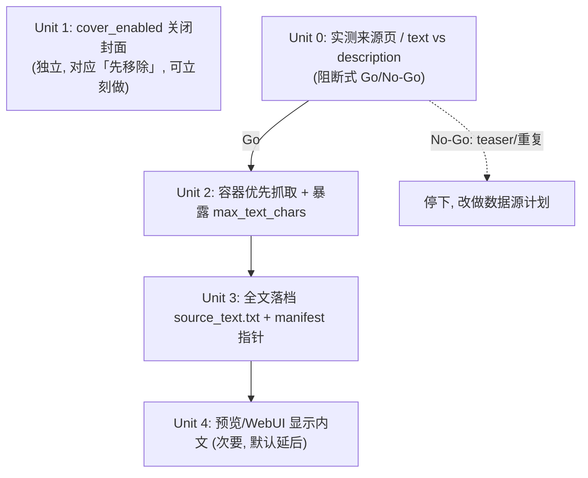

# feat: 完整抓取标题+内文、关闭千篇一律的封面

## Overview

优化内容抓取 pipeline,聚焦两件事:

1. **关闭封面抓取**:在抽样产物中观察到来源站文章的 `og:image` 都是同一张站点默认图,封面千篇一律、没有价值。用配置开关关掉(可逆;日后某来源若有意义封面可随时重启)。
2. **完整保留内文**:爬虫已抓了全文段落(`text` 字段),但它在 caption/manifest 这一步被整个丢弃了——manifest 的 `body` 实际只来自 `og:description`。本计划让**完整内文**端到端保留下来,落地成独立档案,供后续清洗/总结/判断可用性,并为日后接入更多讯号源打底。

> ⚠️ **关键前提(Unit 0 会先验证)**:本计划「保留完整内文」的价值,完全取决于来源页 HTML 是否**真的含完整正文**。实测产物显示 `og:description` 已带大段正文且以「查看完整內容:URL」结尾——这既可能是「页面只有 teaser、正文在下一跳」,也可能是「`text` 与 `description` 内容高度重叠」。两种情况都会让 Unit 2/3 收益大打折扣。**因此先做 Unit 0 实测,再决定是否值得做 Unit 2-4。**

> 用一句话比喻:现在 pipeline 把整篇文章读进来了,却只把「摘要」抄进了成品,正文随手扔了;封面则是每次都贴同一张贴纸。这次先确认正文是否真比摘要多,确认了就完整留底,顺手把没用的贴纸先撕掉。

## Problem Frame

来源是同站抓取(如 `https://51cg1.com/archives/<id>`),pipeline 流程为:
`crawl → normalize → dedupe → caption → cover → watermark → build-manifest → (draft → verify → publish)`。

两个痛点(从代码确认机制,从抽样产物 `out/.../manifest.json` 观察现象):

- **封面都一样**:`src/crawl_posts.py` 从 `og:image` 取 `image_url`,`src/select_cover.py` 下载、`src/watermark_cover.py` 盖水印。抽样产物中 `og:image` 表现为站点级默认图;「所有文章相同」属抽样观察(`image_url` 不留存于 manifest,无法从既有数据全量证实),但开关可逆,代价低。
- **内文不完整**:`src/crawl_posts.py:_extract` 已抓取 `text`(全文段落,默认 `max_text_chars=20000`),但全文从未进入成品:
  - `templates/fixed-format.zh.yaml` 的文案模板只用了 `{title}/{description}/{canonical_url}/{hashtags}`,**没用 `text`**;
  - `src/build_manifest.py:90` 把 `manifest.content.body = caption`;
  - `core/schema.py:empty_manifest` 的 manifest 结构里**根本没有承载全文的字段**。

  ⚠️ 注意:抽样 manifest 的 `body`(来自 `og:description`)已是多句、数百字的正文起头,并非手写摘要。**所以「`text` 比已发布的 `description` 多多少」是未经测量的**——这正是 Unit 0 要量的。若两者近乎重复,则保留 `text` 只是存了近似副本,Unit 2/3 需重新评估。

结果:全文 `text` 在 normalize 之后(normalize 保留了它)→ 到 caption/build 这一步被彻底丢弃。**前提成立时**(页面含完整正文且 `text` 显著富于 `description`),把它保留下来才有意义。

## Requirements Trace

- **R1**:封面抓取可被关闭,关闭后整条 pipeline(含草稿/发布/预览)正常运作,不再产生千篇一律的封面;开关可逆。
- **R2**:每篇文章的**完整内文**被完整保留并落地(档案 + manifest 指针),供后续程序化清洗/总结读取。*(前提:Unit 0 确认页面含完整正文且 `text` 富于 `description`。)*
- **R3**:内文抓取以**正文容器为主**(覆盖容器内嵌套/全部后代文本),长度上限可配;容器命不中再以 `<body>` 兜底并记录(完整优先,但不把站点 chrome 一股脑灌进来)。
- **R4**:**不破坏现有发布与去重/复核行为**——发布正文(caption)、复核指纹 `reviewed.content_id`、幂等/no-overwrite 全部维持原状。
- **R5**:多讯号源接入**本期不做、也不预建配置抽象**。容器选择器本期对 51cg1 **硬编码**;待真正接入第二个来源、有具体形状时,再引入按来源配置。*(遵循「不做投机性抽象」。)*

## Scope Boundaries

- **不做**:多讯号源接入,**也不预先搭建 per-source 配置 hook**(等第二个来源到位再加)。
- **不做**:对全文做清洗、去噪、摘要、AI 总结——这是用户后续要做的下游阶段,本期只负责「完整抓取并留底」。
- **不做**:改变现在发布出去的文案内容(caption 维持现状)。
- **不做**:删除封面相关代码(按用户选择,改为配置开关关闭,保留代码以便日后重启)。
- **不做**:更换爬虫引擎(仍用 Scrapy 子进程模型)。

## Context & Research

### Relevant Code and Patterns

- `src/crawl_posts.py:_extract`(209-255):抓 `title/description/image_url/published_at/text/canonical_url`;`text` 选择器为 `body p::text, body h1::text, body h2::text, body li::text`,只取这些标签的**直接文本节点**(漏掉嵌套 `<strong>`、`<div>`/`<article>` 容器文本),并按 `max_text_chars` 截断。`parse` 内 `if len(item["text"]) >= opts["min_text_chars"]` 会在入库前**整条丢弃**过短项。
- `core/pipeline.py:crawl_items`(35-55):把 webui 配置映射成 crawl opts;`opts.update({...})` 目前列了 `item_regex/deny_regex/limit/max_pages/download_delay/concurrency/source_id/start_urls`,**没有 `max_text_chars`/`min_text_chars`**——不补这两键,WebUI 的上限设定会静默失效(回退 `CONFIG_DEFAULTS` 的 20000)。
- `core/pipeline.py:run_pipeline`(58-158):**两个封面相关调用点**——(a) 第 113 行 Stage 3 的 `select_cover.select_all`;(b) 第 136-137 行逐篇 `if not cover_err: rec = watermark_cover.watermark(rec, wm_cfg)`。另外第 75 行**无条件** `watermark_cover.load_config(...)`,该函数在 watermark 配置缺失时抛 `ValidationError`。
- `src/normalize_items.py`:`_TEXT_FIELDS = ("title","description","text")` 已清洗并保留 `text`;空值会被丢弃(全文非空则保留)。✅ 全文能活着走到 build(CLI stdin 路径与 in-process 路径都带 `text`)。
- `src/build_manifest.py:build`(55-105):写 `caption.txt`、`preview.html`、`manifest.json`;`manifest.content.body = caption`;封面 `cover_path` 存在才拷贝、`has_cover` 才在 preview 放 ``——**无封面已能优雅处理**。`_preview_html(title, caption, has_cover)` 当前签名不含正文。
- `core/schema.py:empty_manifest`(131-169):manifest 骨架;`content` 段有 `title/caption_path/body/tags/category`,**新字段加在此处**。`CRAWLED_OPTIONAL` 已含 `"text"`。
- `browser/backend_driver.py:create_draft`(134-161):发布正文 `page.fill(body, content.get("body"))`;封面上传 `if cover:` **已是条件式**——无封面自动跳过。✅
- `core/reviewed.py:content_id`(36-54):复核指纹 = `content.title + content.body(caption) + source.canonical_url`(**已独立核实只吃这三项**)。**这是必须守住的不变量**:改 `content.body` 语义会导致复核失效、操作锁定。注意:`src/dedupe_posts.py` 的去重是 **URL-only**,与 `content_id` 是两套机制,别混为一谈。
- `webui/routers/packages.py:51`:预览读 `caption.txt`,回退 `content.body`;detail 模板目前只渲染 `{{ caption }}`。
- `core/webui_config.py`(14-40):`DEFAULTS` + `_BOOL_FIELDS = ("auto_pipeline",)` + `_INT_FIELDS`;新增开关/数值字段照此模式即可。
- `configs/webui.yaml`:本部署实际生效的配置(`cover_enabled`、`max_text_chars` 等要在这里落值)。

### Institutional Learnings

- `docs/solutions/` 目前为空,无既有解法可援引。

### External References

- 未使用外部研究:本仓库对应模式(Scrapy 抽取、NDJSON 阶段、manifest 落档、config 开关)都已有强本地范例,直接照搬即可。

## Key Technical Decisions

- **先验证、再建造(Unit 0 阻断式前置)**:body-capture(U2/U3/U4)的价值取决于来源页是否含完整正文、且 `text` 是否显著富于 `description`。这是一次 5 分钟的实抓即可证伪的承重前提,**不应推迟到实作中途**。故新增 Unit 0 作为 Go/No-Go 闸门。
- **封面用配置开关关闭,而非删码**(用户选定):新增布尔字段 `cover_enabled`。**代码内默认 `True`**(向后兼容:老配置缺该键时行为不变),**`configs/webui.yaml` 设为 `false`**(本部署默认关闭)。理由:可逆、改动小,日后换更好的封面策略只改一个值。
- **全文保存在新字段/档案,绝不复用 `content.body`**:新增 `content.source_text_path`(指向包内 `source_text.txt`),镜像现有 `caption_path`/`caption.txt` 模式。理由:`content.body` 同时是**发布正文**(backend_driver 填入)与**复核指纹**(reviewed.content_id)的输入,复用它会污染发布内容并破坏复核(见 System-Wide Impact)。
- **发布文案(caption)维持现状**:全文只「留底供后续处理」,不进入本期发布内容,符合用户「后续清洗/总结」的意图。
- **内文抓取以「正文容器」为主、`<body>` 兜底**:容器内取全部后代文本(覆盖嵌套);命不中容器才回退 `<body>` 并**记录**该 record 供复查。理由:把整页 chrome(相关推荐/评论/侧栏/标签云,这些不匹配 nav/footer)一股脑压成一行,会让下游清洗**更难**而非更易;容器优先才让「后续清洗」真正可行。
- **不预建 per-source 配置抽象(YAGNI)**:本期只有 51cg1 一个来源,容器选择器**硬编码**;待第二个来源带着真实形状到位时再引入配置。(遵循用户「不做投机性抽象」。)
- **`max_text_chars` 由实测定值,不拍脑袋**:抽样产物正文均 < 1KB,远未触及现有 20000 上限;**在 Unit 0 量到有正文逼近上限前,不擅自提到 50000**。上限是否要调、调多少,以 Unit 0 数据为准(可能根本不用动)。
- **全文以「档案 + manifest 指针」存放,而非内联进 manifest.json**:保持 manifest 精简,且镜像 caption 既有模式;下游清洗/总结按 path 读档即可。

## Open Questions

### Resolved During Planning

- **封面是删码还是开关?** → 配置开关 `cover_enabled`(用户选定)。
- **全文放哪、会不会动到发布?** → 新增 `source_text.txt` + `content.source_text_path`;`content.body`/caption/`content_id` 全不动。
- **要不要现在就把全文塞进发布文案?** → 不要;本期只留底。
- **要不要预建多源配置 hook?** → 不要;硬编码 51cg1,等第二来源再说(无投机抽象)。

### Resolved by Unit 0 (Go/No-Go,实作起点,不是中途)

- **来源页 HTML 到底有没有完整正文?** 还是只有 teaser、正文在「查看完整內容」下一跳?
- **`text` 比已发布的 `description` 富多少?** 若近乎重复,Unit 3 只是存副本 → 需重新评估甚至砍掉。
- **51cg1 正文的稳定容器选择器**(`article` / `.entry-content` / `#content`?)与**实测正文长度**(决定 `max_text_chars` 是否要动)。
- **抽样 5-10 篇的 `og:image` 是否真的相同?**(为关闭封面的理由补证;不影响开关可逆性。)

### Deferred to Implementation

- 排除噪声标签的具体 Scrapy CSS/XPath 写法(容器 `::text` 全量 vs 后过滤),实作时据真实 DOM 定。

## High-Level Technical Design

> *以下为方向性示意,供审阅验证设计走向,非实作规格。实作者应将其当作上下文,而非照抄的代码。*

数据流变化(✚=新增字段/档案,「维持」=不变但需守住的不变量):

```
crawl_posts._extract
  title ───────────────────────────────► manifest.content.title        (维持)
  description(og摘要) ─► render_caption ─► manifest.content.body=caption (维持,守住 content_id)
  text(完整内文) ✚保留─► build_manifest ─► source_text.txt ✚
                                        └─► manifest.content.source_text_path ✚
  image_url(og:image) ──[cover_enabled?]─► select_cover→watermark        (可关闭)
```

单元依赖关系(U0 为 body-capture 的 Go/No-Go 闸门;U1 与 body-capture 互不依赖):



## Implementation Units

- [ ] **Unit 0(阻断式前置):实测来源页,决定 body-capture 是否值得做**

**Goal:** 用一次真实抓取证实/证伪整个 body-capture 的承重前提,产出 Go/No-Go。

**Requirements:** R2 的前提条件

**Dependencies:** 无(body-capture 的第一步;U1 不依赖它,可并行)

**Files:**
- 无生产代码改动(一次性勘察;可写临时脚本或手动 `crawl-posts` 单 URL,结果记录在本计划或一则 `docs/solutions/` 笔记)

**Approach:**
- 实抓 2-3 篇真实 archive 页,**dump 原始 HTML**,确认正文是否在页面内(而非 teaser+下一跳)。
- 对同几篇打印并比较 `len(text)` vs `len(description)`,判断 `text` 是否**显著**更丰富。
- 顺带:抽样 5-10 篇比较 `og:image` URL 是否真相同;记录正文字符长度分布。
- 定位正文容器选择器候选(`article`/`.entry-content`/`#content`/…)。

**Execution note:** 这是执行期的勘察步骤(planning 阶段不连网/不跑站点);它是 `/ce:work` 的**第一个动作**,不是 U2 中途的旁注。

**Test scenarios:** Test expectation: none —— 一次性勘察,无行为代码,产出是结论与数据。

**Verification(Go/No-Go):**
- **Go**:页面含完整正文 **且** `text` 显著富于 `description` → 继续 U2→U3(→U4)。
- **No-Go**:teaser-only,或 `text ≈ description` → **停下**,把「跟进下一跳/换数据源」单独立计划,不在本计划继续建 `source_text` 持久化。

---

- [ ] **Unit 1:以 `cover_enabled` 开关关闭封面抓取与水印**

**Goal:** 提供可逆开关;关闭后 pipeline 跳过下载封面与盖水印,且草稿/发布/预览/manifest 全部正常(无封面)。

**Requirements:** R1, R4

**Dependencies:** 无(与 U0 互不依赖,可最先落地,直接回应「先帮我移除」)

**Files:**
- Modify: `core/webui_config.py`(`DEFAULTS` 加 `cover_enabled: True`;`_BOOL_FIELDS` 加 `"cover_enabled"`)
- Modify: `configs/webui.yaml`(加 `cover_enabled: false`)
- Modify: `core/pipeline.py`(**三个点**,见 Approach)
- Test: `tests/test_pipeline.py`、`tests/test_webui_config.py`

**Approach:**
- `run_pipeline` 读 `cover_enabled = bool(webui_cfg.get("cover_enabled", True))`,据此 gate **两个调用点**:(a) 跳过第 113 行 `select_cover.select_all`;(b) 把第 136-137 行改为 `if cover_enabled and not cover_err: rec = watermark_cover.watermark(...)`。
  - ⚠️ 仅跳过 (a) 是不够的:跳过 select_all 后 record 既无 `cover_path` 也无 `cover_error`,`if not cover_err` 仍为真,`watermark()` 仍会被调用(虽是 `watermarked_cover_path=None` 的良性 no-op)。要省掉这次调用必须显式 gate (b)。
- **第三个点(去耦)**:第 75 行 `watermark_cover.load_config(...)` 目前无条件执行,watermark 配置缺失会抛错。把它也放到 `cover_enabled` 之后(关闭封面时不加载),这样「无封面部署」可以不带 `watermark.yaml`,真正达成开关解耦。
- 不删除 `select_cover` / `watermark_cover` 任何代码。
- 复核下游零改动即可工作:`build_manifest`(无 cover_path 已 OK)、`backend_driver.create_draft`(`if cover:` 已条件式)、`preview.html`(`has_cover=False` 已处理)。

**Patterns to follow:** `auto_pipeline` 布尔开关在 `webui_config._BOOL_FIELDS` 的既有处理(表单 "on"/缺省)。

**Test scenarios:**
- Happy path:`cover_enabled=false` 跑 `run_pipeline`,产出 manifest `media.cover_path` 与 `watermarked_cover_path` 皆为 `None`,且 `built` 正常。
- Integration:`cover_enabled=false` 时 monkeypatch `select_cover.select_all` **与** `watermark_cover.watermark`,断言**两者都未被调用**。
- Edge:`cover_enabled=true`(或老配置缺该键 → 默认 True)时,封面/水印行为与现状一致。
- Edge:`cover_enabled=false` 且 `watermark.yaml` 缺失时,pipeline 不因 `load_config` 抛错(验证去耦)。
- Config:`load_*` 能把表单 "on"/缺省正确解析为 `True/False`(照 `auto_pipeline` 现有测试加一例)。

**Verification:** 关闭后 `out/<post>/` 不再出现 `cover.jpg`/`watermarked_cover.jpg`,`manifest.media.*` 为 null,草稿仍能只填正文成功。

---

- [ ] **Unit 2:容器优先抓取内文,并把 `max_text_chars` 暴露到 pipeline/配置**

**Goal:** 让 `text` 抓到**完整正文**(容器内全部后代文本),长度上限可配,为「完整内文」打底。

**Requirements:** R2, R3

**Dependencies:** **Unit 0 = Go**(容器选择器与上限取自 U0 实测)

**Files:**
- Modify: `src/crawl_posts.py`(`_extract` 的 `text` 抽取)
- Modify: `core/pipeline.py`(`crawl_items` 的 `opts.update({...})` **补上** `max_text_chars`/`min_text_chars` 两键)
- Modify: `core/webui_config.py`(`DEFAULTS` 加 `max_text_chars`;并入 `_INT_FIELDS`)
- Modify: `configs/webui.yaml`(落 `max_text_chars` 值——若 U0 显示无需调整则维持 20000)
- Test: `tests/test_crawl_posts.py`(用本地 HTML fixture,**不连网**)

**Approach:**
- 抽取改为「**正文容器为主**」:对 U0 定出的容器(对 51cg1 **硬编码**,不做 per-source 配置)取**全部后代文本**(容器 `::text` 全量 `getall()`,覆盖嵌套行内标签);命不中容器才回退 `<body>` 并**记录**该 record 供复查。沿用现有 `re.sub(r"\s+"," ")` 归一与 `max_text_chars` 截断。
- `crawl_items` 在 `opts.update` 补 `max_text_chars`/`min_text_chars`,使 WebUI 能控完整度。⚠️ `min_text_chars` 调高会在 `parse` 阶段**整条丢弃**短文,影响 U3 的留底数量——保持默认 0 或在配置旁注明。
- `max_text_chars`:U0 数据若显示正文远低于 20000,则**不动**;确有需要再调(或设 0=不限,`_extract` 第 237 行已支持 0 语义)。

**Patterns to follow:** `_extract` 现有 Scrapy CSS 抽取与归一;`CONFIG_DEFAULTS`→opts→子进程 的既有透传链。

**Test scenarios:**
- Happy path:fixture HTML(含 `<article>` 容器 + 多段 `<p>`)→ `text` 含容器内全部正文段落。
- Edge:嵌套行内标签(`<p>看 <strong>这里</strong> 完整</p>`)→「这里」不被漏掉(覆盖现有 `::text` 直接节点的缺陷)。
- Edge:页面无目标容器 → 回退 `<body>` 仍能抓到正文(并打上回退标记)。
- Edge:`max_text_chars` 设定时按上限截断;设 0 时不截断。
- Integration:`crawl_items` 传入的 `max_text_chars` 确实作用到子进程(经 opts 断言或小型端到端)。

**Verification:** 对一篇真实文章,`text` 长度显著大于 `description`,且肉眼可见包含正文主体而非站点 chrome。

---

- [ ] **Unit 3:把完整内文端到端保留进 manifest + 落档 `source_text.txt`**

**Goal:** 完整 `text` 不再被丢弃——写成包内 `source_text.txt`,并在 manifest 加 `content.source_text_path` 指针;**完全不动** `content.body`/caption/`content_id`。

**Requirements:** R2, R4

**Dependencies:** **Unit 0 = Go**;建议在 Unit 2 之后(留底的是容器版完整内文)

**Files:**
- Modify: `core/schema.py`(`empty_manifest` 的 `content` 段加 `source_text_path`;`ManifestContent` TypedDict 同步加可选字段)
- Modify: `src/build_manifest.py`(有 `text` 时 `write_text_no_overwrite(folder/"source_text.txt", text)`,并设 `manifest.content.source_text_path = "./source_text.txt"`;无 `text` 则置 `None`)
- Test: `tests/test_build_manifest.py`、`tests/test_reviewed.py`(守 `content_id` 不变)

**Approach:**
- `build` 从 `record.get("text")` 取全文(CLI stdin 与 in-process 两条路径都带 `text`);镜像 caption 的 `write_text_no_overwrite` 落档(幂等/no-overwrite)。
- manifest 仅**新增**字段,`content.body` 仍 `= caption`,保持向后兼容(旧 manifest 缺该字段仍合法,`total=False`)。
- 命名刻意区分:**发布正文** = `content.body`/`caption.txt`(不变);**原始全文(内文)** = `content.source_text_path`/`source_text.txt`(新增,与 caption 同包目录)。

**Patterns to follow:** `build_manifest` 写 `caption.txt` + `manifest.content.caption_path` 的既有写法;`empty_manifest` 字段填充模式。

**Test scenarios:**
- Happy path:record 带 `text` → 包内生成 `source_text.txt`(内容=全文),`manifest.content.source_text_path == "./source_text.txt"`。
- 不变量:同一 record 下 `manifest.content.body` 仍等于 caption;`reviewed.content_id(manifest)` 与未加全文前**完全一致**(新增字段不入指纹)。
- Edge:record 无 `text`/空 → 不生成档案,`source_text_path` 为 `None`,不报错。
- Edge(幂等):重复 build 同一 record → 复用既有 `source_text.txt`,不覆写、不报错。

**Verification:** `out/<post>/source_text.txt` 存在且为完整正文;`manifest.json` 含 `content.source_text_path`;既有去重/复核流程行为不变。

---

- [ ] **Unit 4(次要,默认延后):在 preview.html 与 WebUI 包列表显示内文**

**Goal:** 让用户能直接「看到」抓到的完整内文,以判断「哪些可以使用」。

**Requirements:** R2(可用性可视化)

**Dependencies:** Unit 3

**Files:**
- Modify: `src/build_manifest.py`(`_preview_html` **签名增参** `source_text=""`,并在唯一调用点 `build()`(第 86 行)传入 `record.get("text", "")`)
- Modify: `webui/routers/packages.py`(镜像 `:51` 读 `caption.txt` 的回退模式,新增读 `source_text.txt`)及 detail 模板(现仅渲染 `{{ caption }}`,加内文区块)
- Test: `tests/test_build_manifest.py`(preview 含内文片段);WebUI 既有测试相应补充

**Approach:**
- `_preview_html` 增加一个 `<pre>` 区显示 `source_text`(`escape` 处理);无内文则不渲染该区。
- packages 预览与模板镜像现有 caption 读取/渲染逻辑。

**Patterns to follow:** `_preview_html` 现有 `escape` + `<pre>` 写法;`packages.py:51` 读档回退模式。

**Test scenarios:**
- Happy path:有内文 → preview.html / 包预览包含内文片段。
- Edge:无内文 → 不渲染内文区,页面正常。

**Verification:** 打开某篇 preview 或 WebUI 包详情,可见完整内文。

> 备注:用户首要目标是「抓到并留底」(U0-U3),且其判断可用性的途径是**程序化清洗/总结**(读 `source_text.txt`),不一定需要 in-app 浏览。**本单元默认延后到后续**,除非用户明确要在 WebUI 里肉眼审阅。

## System-Wide Impact

- **Interaction graph**:封面关闭点在 `run_pipeline`(select_all + 逐篇 watermark + 顶部 load_config 三处);下游 `build_manifest`/`backend_driver`/`preview.html` 对「无封面」**已天然兼容**。
- **复核 / `content_id` 不变量(关键)**:`reviewed.content_id` 只吃 `content.title + content.body(caption) + canonical_url`(已核实)。新增 `source_text_path` **不入指纹**,且 `content.body` 不变 → 复核(reviewed)行为零变化。Unit 3 必须有一条测试钉死。注:`dedupe_posts` 是 URL-only 去重,与此无关。
- **发布正文**:`backend_driver.create_draft` 仍填 `content.body`(caption),发布内容不变;封面上传已条件式,关闭封面不致草稿失败。
- **watermark 配置耦合**:`run_pipeline` 第 75 行 `load_config` 原本无条件;Unit 1 把它 gate 进 `cover_enabled` 后,无封面部署不再强依赖 `watermark.yaml`。
- **manifest 兼容性**:`source_text_path` 为**新增可选字段**(`total=False`),旧 manifest 无此字段仍合法;`empty_manifest` 默认填 `None`。
- **State lifecycle / 幂等**:`source_text.txt` 用 `write_text_no_overwrite`,与 `caption.txt` 一致,重跑不覆写;`edit_package` 流程不重写 source_text(留底为 build 期只读)。
- **Unchanged invariants**:`content.body`/caption、`content_id`/复核、URL-only 去重、no-overwrite 幂等、Scrapy 子进程模型、CLI stdout-only NDJSON 契约——均**不改变**。

## Risks & Dependencies

| Risk | Mitigation |
|------|------------|
| 来源页只含 teaser,或 `text` 与 `description` 近乎重复 → body-capture 收益为零 | **Unit 0 Go/No-Go 前置**:实抓 + 测量 `text` vs `description`,No-Go 则停下改做数据源计划 |
| 误改 `content.body` 导致复核失效 / 发布内容被污染 | 明确决策「新增字段、绝不复用 body」;Unit 3 加 `content_id` 不变量测试 |
| 全量 `<body>` 抓取灌入站点 chrome,反而让下游清洗更难 | **容器优先**为主路径,`<body>` 仅作记录式兜底 |
| `crawl_items` 漏传 `max_text_chars` → 配置静默失效 | Unit 2 在 `opts.update` 显式补键,并加透传断言测试 |
| `min_text_chars` 调高会在 crawl 阶段整条丢弃短文 → 留底变少 | 默认 0;配置旁注明该副作用 |
| 仅 gate select_all、漏 gate 逐篇 watermark | Unit 1 显式 gate 两处 + 「watermark 未被调用」测试 |
| 提高 `max_text_chars` 的磁盘担忧多为臆测(实测正文 <1KB) | 上限由 U0 数据定;无需要则不动;全文落档案非内联 |
| 关闭封面的「og:image 全同」理由仅抽样观察 | U0 抽 5-10 篇比对 `og:image`;开关可逆,代价低 |

## Documentation / Operational Notes

- `configs/webui.yaml` 新增 `cover_enabled`、`max_text_chars` 两键,README/配置说明需补一行。
- 关闭封面后既有 `out/<post>/` 旧包不受影响;新包不再含封面文件。
- 多讯号源待真正接入时再引入按来源配置,本期不预建。

## Sources & References

- 关键代码:`src/crawl_posts.py:_extract`/`parse`、`core/pipeline.py:run_pipeline`/`crawl_items`、`src/build_manifest.py:build`/`_preview_html`、`core/schema.py:empty_manifest`、`core/reviewed.py:content_id`、`src/dedupe_posts.py`、`browser/backend_driver.py:create_draft`、`src/watermark_cover.py:load_config`、`core/webui_config.py`、`templates/fixed-format.zh.yaml`、`configs/webui.yaml`
- 实测产物:`out/20260618_https_51cg1_com_archives_262236/manifest.json`(印证 body 来自 og:description、且以「查看完整內容:URL」结尾 → Unit 0 据此查证)
- 无对应 origin 需求文档;`docs/solutions/` 为空
- 本计划经 `document-review`(coherence / feasibility / scope-guardian / adversarial)深化:teaser 前提升级为阻断式 Unit 0、容器优先抽取、去除 per-source 投机抽象、Unit 1 三处 gate、软化封面前提。
