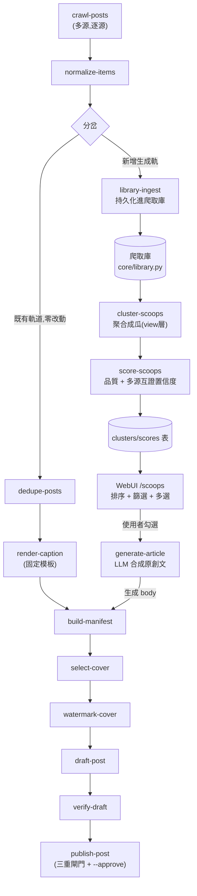
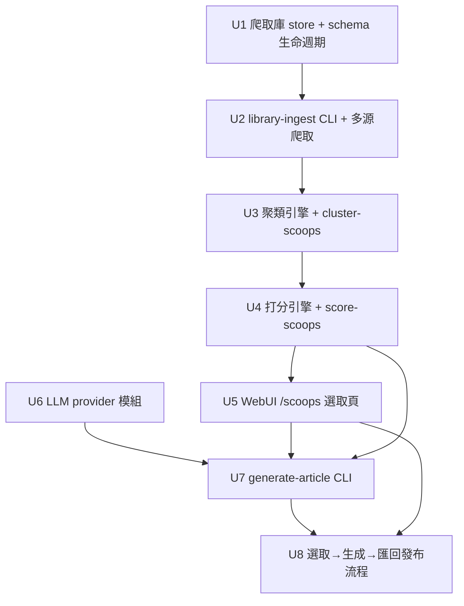

# feat: 爬取庫 → 聚合「瓜」打分 → 選取 → LLM 生成原創文章

## Overview

現有 pipeline 是「**單篇爬文 → 套固定模板文案 → 重發到自家後台**」（`crawl → normalize → dedupe → render-caption → cover → watermark → build-manifest → draft → verify → publish`），刻意**不用 LLM、不做打分**。

本計畫新增一條**並存的生成軌道**：在 `normalize` 之後分岔出「**持久化爬取庫 → 聚合成「瓜」(scoop/事件叢集) → 打分(品質 + 多源互證置信度) → WebUI 讓使用者挑高分高置信度的瓜 → 用 LLM 把選中的瓜合成一篇原創文章**」，生成的文章在 `build-manifest` 重新匯回既有發布流程，沿用 cover/watermark/draft/verify/publish 與**三重發布閘門**。

> 一句話比喻：現在 pipeline 像「把別人一篇文章換個版型重貼」；這次新增的是「把同一件事的好幾家報導收進一個資料庫，挑出被最多家證實、最有料的那件『瓜』，再請 AI 用這些素材寫一篇自己的稿」。原本那條重貼軌道完全不動，新軌道是另一條岔路。

**這是對既有「非目標」的明確反轉**：原 spec 與 daily-ops 那輪都把「LLM 文案／依賴外部 LLM API」列為非目標（見 origin 約束）。本計畫解禁 LLM，但**做成與固定模板路徑並存的新管道，不取代 `render-caption`**，並在下文交代當初排除它的理由（成本、外部依賴、可重現性）如何處理。

### 起點（本計畫之前已完成的部分）

⚠️ **重要**：LLM 生成原語**已存在**（2026-06-18，PR #27 後同 session 已建），本計畫**不重造、只擴充**：

- **`core/llm.py`**：OpenAI 相容 client，用 **stdlib `urllib`**（不加執行期依賴）；端點在 **Cloudflare** 後，預設 Python UA 會被擋（error 1010），故**已內建瀏覽器 User-Agent**；金鑰從 `CPOST_LLM_API_KEY` 讀、放 `auth/llm.env`（gitignored，啟動腳本自動 `source`）。
- **`configs/llm.yaml`**（`base_url`/`model`/`api_key_env`/`prompt_path`/`user_agent`）+ **`configs/article_prompt.zh.md`**（單篇生成用的排版 system prompt）。
- **`POST /packages/{post_id}/generate`**（`webui/routers/packages.py:95`）：**單篇**生成——讀該包 `source_text.txt`（fallback caption）→ 套 `article_prompt.zh.md` → 寫回 `caption.txt` + `manifest.content.body`。

換言之，現狀已能「**一篇爬文 → AI 生成一篇文章**」。**本計畫補的是缺的中間層**：把多筆爬文**持久化進庫 → 聚合成「瓜」→ 打分（含多源互證置信度）→ 使用者選取 → 用選中瓜的「多源」素材合成一篇原創文**（與既有單篇生成是兄弟模式，共用 `core/llm.py`）。

## Problem Frame

使用者要的不是「重發既有文章」，而是「**情報聚合 + 原創產出**」：

1. 從**多個外部授權來源**爬取內容（不只自家站）。
2. 把爬到的東西**留在一個可查詢的庫**裡（現在 crawl 是 stateless NDJSON，跑完即丟，無法回看、無法跨批比對）。
3. 把講同一件事的多筆內容**聚合成一個「瓜」**，並**打分**：哪件瓜「料最足」(品質)、「最可信」(被越多獨立來源報導 = 置信度越高)。
4. 使用者在 WebUI **瀏覽排序後的瓜、勾選**高分高置信度的。
5. 系統用選中那件瓜的**多源素材**請 LLM **合成一篇原創文章**，再走既有發布流程上稿。

目前 pipeline 完全沒有「庫 / 聚類 / 打分 / 生成」任何一塊；演算法層(相似度聚類、置信度公式、prompt)是本專案**首次定義的空白區**（無既有 `docs/solutions/` 可援引）。

## Requirements Trace

- **R1（爬取庫）**：normalize 後的爬取項目持久化進一個**獨立的新 SQLite store**，保留全文(`source_text`)、來源、時間戳，可被聚類/打分/生成讀取；批次落庫共用單一連線。**絕不污染 `items` 發布真相表，也絕不挪用 `content.body`/caption。**
- **R2（多源爬取）**：能對**多個授權來源**各自爬取並全部入庫，每筆帶可區分的 `source_id`；沿用「只授權、禮貌、不繞反爬」邊界。
- **R3（聚合成瓜）**：把庫中講同一件事的項目**聚合成叢集(瓜)**，聚合是**之上的 view/標記層**（寫 `cluster_id` / 叢集表），**不在庫底層丟資料**（守「寧可重複，不可靜默漏發」）。
- **R4（打分）**：每件瓜算出兩個獨立軸——**置信度 = 叢集內「獨立來源數」的函數**（多源互證）、**品質 = 內容完整度/時近度/素材豐富度的函數**——並提供可排序的綜合分。
- **R5（選取 UI）**：WebUI 新增頁面，依分數排序列出瓜，可按「最低置信度/最低分」篩選，**多選**後送出生成；沿用 HTMX + APIRouter、localhost 單人、無鑑權的既有形態。
- **R6（LLM 生成）**：對選中的瓜，用其**多源素材**呼叫**可插拔的 LLM provider**(預設 OpenAI 相容自訂端點)生成一篇**原創文章**(標題+正文)；金鑰只從環境變數讀、不入 git/manifest/log；生成失敗映射為 exit 4(外部服務錯)。
- **R7（接回發布）**：生成的文章 body 在 `build-manifest` 匯入既有 manifest，續走 cover→watermark→draft→verify→publish，**沿用三重發布閘門，不另開繞道、不自動發布**。
- **R8（schema 生命週期）**：所有新表附**冪等 migration + schema version**，新舊 DB 開啟後同形；對齊 stabilization plan U5 的 storage governance，不另立一套。

## Scope Boundaries

- **不取代 `render-caption` 固定模板路徑**：生成軌與模板軌並存；既有重貼流程零改動、既有測試維持綠。
- **不做自動發布生成的瓜**：生成文章一律停在「建包/草稿」，發布仍須人工 `--approve` + 三重閘門。`auto_pipeline` 的繞道**不延伸到生成軌**（除非未來明確 opt-in，本輪不做）。
- **不做向量/嵌入式聚類**（本輪）：先用可量測、決定性的字面/token 相似度 + 時間窗，量到不夠準再升級（沿用 fulltext plan「先量測再加複雜度」紀律）。
- **不做付費商用 LLM 的成本治理（quota/billing 儀表）**：本輪只接通自訂端點、把金鑰收進 env，成本控制靠「只在使用者明確選取時才生成」這個天然節流。
- **不繞 login/CAPTCHA/anti-bot**；只爬授權來源。
- **不做多站後台、不改 CLI 既有 I/O 契約與退出碼語意**（新增命令遵循同一契約）。
- **不把全文清洗/去噪做成獨立階段**：本輪聚類/生成直接讀 `source_text`，清洗交給 prompt 或留待後續。

## Context & Research

### Relevant Code and Patterns

- **CLI 契約**：`core/cli.py:run` / `main_wrapper(handler)`——每個命令 `main()` 委派給它；handler 成功寫 stdout、失敗丟 `CliError` 子類。新命令一律照此。
- **NDJSON I/O**：`core/io_ndjson.py:read_lines/write_line`——stdin 逐行 parse(malformed→`ValidationError`)、stdout 一行一物件(`ensure_ascii=False, sort_keys=True`)。
- **退出碼**：`core/errors.py`——`UsageError(1)/ValidationError(2)/DependencyError(3)/ExternalError(4)/InternalError(5)`。LLM 呼叫失敗→`ExternalError(4)`；缺金鑰/缺 SDK→`DependencyError(3)`；空叢集/壞輸入→`ValidationError(2)`。
- **持久化唯一原語（要照抄）**：`core/db.py::connect(path, schema, migrations=None, extra=None)`——單一 contextmanager：`mkdir` parent、連線失敗包成 `DependencyError(3)`、`PRAGMA journal_mode=WAL`、`executescript(schema)`(每連線跑，故基底表用 `CREATE TABLE IF NOT EXISTS`)、`_apply_migrations`(版本化 ledger `_schema_meta(schema_version, applied_at)`，每個 `(version, ddl)` 在 SAVEPOINT 內跑、吞 `duplicate column` 容忍重跑)、`extra` DDL(index)。**新表照此**：模組級 `_SCHEMA` + `_MIGRATIONS=[(v,ddl)]` + `_EXTRA=[index ddl]`，增量改動走版本化 `ALTER TABLE`、不破壞性重寫。
- **既有 store 範本**：`core/state.py`(表 `items`，`canonical_url` PK、upsert ON CONFLICT)、`core/runs.py`(表 `runs`、`open_run_conn` 批寫重用連線、`_MIGRATIONS`)、`core/reviewed.py`(表 `reviewed`、每次開新連線 thread-safe)。store API 用無前綴動詞(`upsert`/`get`/`list_*`/`record_*`)；跨表**不用 FK**，用共享字串鍵在 application code join；時戳 `datetime.now(timezone.utc).isoformat()` 存 TEXT。
- **真相分工不變量**：`items`(發布真相)/`runs`(時序)/`reviewed`(審核狀態)/`audit.jsonl`(日誌) **責任不得合併**。新 library/clusters/scores 是**新表**——強烈建議**放同一個 state DB 檔**(現有三表已共用一檔)，各自一個 module 帶 `_SCHEMA`+`connect` helper；除非要隔離備份才在 `webui_config` 加新 `CPOST_*` path 欄位。
- **既有 LLM 生成基礎設施（要重用，不重造）**：`core/llm.py`(stdlib urllib + Cloudflare 瀏覽器 UA + 金鑰從 `CPOST_LLM_API_KEY`)、`configs/llm.yaml`(base_url/model/api_key_env/prompt_path/user_agent)、`configs/article_prompt.zh.md`(單篇 system prompt)、`webui/routers/packages.py:95 POST /packages/{id}/generate`(單篇生成)。新「多源合成」生成**共用 `core/llm.py`**，只換 prompt + 組多源素材。
- **WebUI 多選批次範本（直接對應「選多個瓜再動作」）**：`webui/routers/actions.py::batch_action(request, stage, post_ids: list[str] = Form(default=[]))`——`<form id="batch-form">` 包 rows、每 row `<input type="checkbox" name="post_ids">`(同名→後端 list)、`hx-include="#batch-form"`、白名單 guard、per-item 隔離迴圈共享一個 `run_id`、包 `jobs.submit` 回 `_job_status.html`。**publish 故意不可批次**(`/batch/publish`→400，有測試守)。
- **長任務自我輪詢（LLM 生成必用）**：回 `_job_status.html`(`hx-get="/jobs/{id}" hx-trigger="every 1s" hx-swap="outerHTML"` 直到 done/error)；in-process job API 在 `core/jobs.py`(`submit/get/report`)。
- **WebUI 三層**：`webui/app.py:create_app(config_path)` 組裝(每 router 一行 `include_router`，**無 prefix**、路徑寫全)；`webui/routers/_ctx.py`(共用 `templates` 單例、`cfg_from_request`、`submit_job`、`submit_action`)；`webui/_helpers.py`(無 FastAPI 的純 I/O)。template 命名：整頁 `name.html`(`extends base.html`)、partial `_name.html`；nav 在 `base.html` 手動加連結。
- **schema 生命週期母計畫**：`docs/plans/2026-06-18-001-...stabilization-plan.md` U5(active, KTD4「Storage governance before more UX」)——新表的 migration/version/index 對齊它。
- **orchestrator（無 stage registry，命令式）**：`core/pipeline.py:crawl_items`(單一 `start_url`→raw items，唯一 subprocess) 與 `run_pipeline`(normalize→dedupe→cover(batch)→caption→watermark→build，單壞項 try/except 不中斷整批)、`run_auto_pipeline`(draft→verify→publish + `_retry` 3 次)。**沒有宣告式 stage list**——加 stage = 改這幾個函式體，頂部 `from src import (...)` 加 import、迴圈裡按純函式呼叫。**本輪沿用命令式、不引入 stage 抽象**(YAGNI，4 個新 stage 還不到抽象門檻)。
- **stage 三層結構（每個新命令必照）**：① 純函式(取/回 dict，無副作用，DB 連線靠參數傳入，供 orchestrator import) ② `_run()`(串 `read_lines`→純函式→`write_line`) ③ `main()`(argparse + `cli.main_wrapper`)。範本：無 flag `src/normalize_items.py`、有 flag `src/dedupe_posts.py`(`--state`)。CLI stage **不自己讀 `CPOST_*`**，DB 路徑用 flag 顯式傳入。
- **資料模型**：`core/schema.py`——`CrawledItem`(含 `source_id/url/canonical_url/title/discovered_at/published_at/text`)、`empty_manifest`(`content.body`/`source_text_path`)、`STATES`。`CRAWLED_OPTIONAL` 已含 `text`。
- **全文留底(本計畫的入口)**：`docs/plans/2026-06-18-003-...fulltext-capture-plan.md` 已把全文落地 `source_text.txt` + `content.source_text_path`，**明說是為「後續清洗/總結」打底**——就是本層的輸入。**絕不複用 `content.body`/caption**(發布正文 + `reviewed.content_id` 指紋雙重身份，`core/reviewed.py:36-54`)。
- **去重語意**：`src/dedupe_posts.py` **只認 `canonical_url`**(quality-uplift U1/Q6)；與 `reviewed.content_id` 是兩套機制。生成文章的 canonical 身份須與此相容(見 Key Decisions / Deferred)。
- **WebUI**：`webui/app.py:create_app` 組裝；`webui/routers/{dashboard,packages,crawl,actions,history_audit,settings_auth,trash}.py` + `_ctx.py`(共享 `app.state`/`_cfg`)；HTMX 互動；`packages.py` 的多選批次動作是「選取→送出」範本。新增 `webui/routers/scoops.py`。
- **WebUI 設定**：`core/webui_config.py:DEFAULTS` + `_BOOL_FIELDS`/`_INT_FIELDS`——新增開關/數值欄照此；`configs/webui.yaml` 落實際值。
- **可攜性守門**：`tests/test_portability_guard.py` 鎖「無外部絕對路徑」——新 library/DB 路徑**必須相對化**，別把絕對機器路徑種回 config。
- **測試契約**：`tests/test_cli_contract.py`(I/O 契約範本)、`tests/conftest.py`+`fixtures/`、marker `slow/browser/integration/subprocess`；store 測試見 `test_runs.py`/`test_reviewed.py`/`test_state.py`。

### Institutional Learnings

- `docs/solutions/` **不存在**(本專案用 plans/brainstorms/analysis 三件套)；演算法層(相似度/置信度/prompt)無既有經驗，本計畫首次定義。
- **決策不變量速查**（新功能必守）：
  - 去重只認 `canonical_url`，寧可重複不可靜默漏發 → 聚類是上層 view，不在 `items` 丟資料。
  - 四 store 真相分工不可合併 → library/clusters/scores 為獨立新 store。
  - `content.body`/caption 不可挪用 → 聚類/LLM 讀 `source_text`。
  - schema migration 須冪等、新舊 DB 同形 → 新表附 migration+version，對齊 U5。
  - 先量測再加 cache/抽象 → scoring/cluster 效能先量測；不預建多源抽象到用不到。
  - 發布走完整階段 + 三重閘門 → 生成文交棒給 build→draft→verify→publish。
  - LLM 曾是非目標 → 計畫明說範圍變更，與固定模板並存。

### External References

- 本輪聚類採決定性字面/token 相似度，無需外部研究即可起步；**若 deepening 決定升級到嵌入式聚類或要校準置信度公式，再引入 framework/best-practices 研究**（見 Open Questions）。
- LLM 端點為 OpenAI 相容(`/v1`)，可用 `openai` SDK 或 `httpx` 指向自訂 `base_url`；版本細節實作時以 context7 查證。

## Key Technical Decisions

- **新增「生成軌道」而非改既有軌道**：在 `normalize` 後分岔、`build-manifest` 匯回。模板重貼軌完全不動，符合「LLM 與固定模板並存」的 learnings 約束，回歸風險低。
- **新表放「同一個 state DB」、用 `core/db.py::connect` 建**：`library_items`/`clusters`/`cluster_members`/`scores` 與既有 `items`/`runs`/`reviewed` 共用同一 SQLite 檔(現有三表已共用一檔)，各自一個 module(`core/library.py` 等)帶 `_SCHEMA`+`_MIGRATIONS`+`connect` helper，**邏輯責任分清但物理同檔**。不碰 `items`/`content.body`。(已解既有 deferred：不另開獨立 DB 檔。)
- **聚類是 view/標記層**：庫保留所有項目；聚類只寫 `cluster_id` 關聯 + 叢集表，**永不刪庫資料**。重跑聚類是冪等覆寫關聯，不丟原始列。
- **置信度 = 叢集內「獨立 `source_id` 數」的函數**（使用者選定：多源互證）。品質為另一獨立軸(完整度/時近度/素材量)。**兩軸分開存、分開可篩**，再給綜合排序分；公式參數放 `configs/scoring.yaml`，門檻可調。
- **聚類本輪用決定性相似度 + 時間窗，不用嵌入**：先做可量測、可重現的最簡版(標題/正文 token 重疊 + 發布時間鄰近)，量到準度不足再升級(沿用 fulltext Unit 0 的 Go/No-Go 紀律)。
- **重用既有 `core/llm.py`，不重造**：LLM client(stdlib urllib + Cloudflare 瀏覽器 UA + 金鑰從 `CPOST_LLM_API_KEY`/`auth/llm.env`)、`configs/llm.yaml`、單篇 `POST /packages/{id}/generate` **皆已存在**。多源合成生成**共用同一 client**，只新增「多源素材組裝 + 合成 prompt(`configs/scoop_prompt.zh.md`)」。測試以 monkeypatch stub `core/llm.py` 的 HTTP 呼叫(不需真實網路)。
- **生成文章的 canonical 身份 = 合成身份**：原創文非單一 URL 重貼，採 `scoop://<cluster_id>` 之類的合成 `canonical_url`(或叢集代表 URL)，使既有「只認 canonical_url」的去重/state 仍適用、不會把同一件瓜重複發布。**此身份同時餵 `reviewed.content_id`**(=title+body+canonical_url)，須驗證指紋對生成文仍成立。
- **生成結果以 (叢集指紋 + model + prompt 版本) 做快取**：LLM 非決定性會破壞專案「相同輸入→相同輸出」(R5)不變量；用快取讓重跑穩定、省 API 成本，並把「生成內容非決定性、被刻意隔離在生成軌」明確記錄。
- **不自動發布生成內容**：瓜=未經查證的八卦，生成文可能含臆測/名譽風險；發布閘門(reviewed→draft_verified→title+`--approve`)是必守人工關卡，`auto_pipeline` 繞道**不延伸到生成軌**。

## Open Questions

### Resolved During Planning

- **置信度怎麼定義？** → 多源互證：叢集內獨立來源數越多越高(使用者選定)。
- **爬哪些來源？** → 多個外部授權來源(使用者選定)；守授權/禮貌/不繞反爬。
- **生成用哪個 LLM？** → 可插拔 provider，預設 OpenAI 相容自訂端點(`gemma4-31b-heretic` @ `la-sealion.inaiai.com/v1`)；金鑰走 env。
- **生成文去哪？** → 接回既有 build→draft→verify→publish(使用者選定)。
- **庫/叢集要不要塞進 `items`？** → 不要；新表但**放同一 state DB 檔**(現有三表已共用)，用 `core/db.py::connect` 建，守責任分工。
- **聚類會不會丟資料？** → 不會；view/標記層，庫保留全部。
- **LLM 要用什麼 client？** → **重用既有 `core/llm.py`**(stdlib urllib + Cloudflare UA)，不引入 `openai`/`httpx` 依賴；單篇生成 + `configs/llm.yaml` + `article_prompt.zh.md` 已存在。
- **要不要做 stage registry？** → 不要；沿用命令式(改 `run_pipeline` 函式體)，4 個新 stage 未到抽象門檻(YAGNI)。

### Deferred to Implementation

- **聚類相似度的具體特徵與門檻**：用標題 token、正文 shingle、或 title+前 N 句；相似度門檻與時間窗大小——需對真實多源樣本量測校準(建議 Unit 3 前置一個小型 Go/No-Go 抽樣，像 fulltext Unit 0)。
- **置信度/品質公式的確切權重與正規化**：來源數如何遞減加權、品質各因子權重、綜合分如何合成——以真實樣本調參，先給合理預設。
- **生成文 canonical 身份的最終形式**：`scoop://<cluster_id>` vs 代表來源 URL；對 dedupe 與 `reviewed.content_id` 的互動以實際 manifest 驗證。
- **多源合成 prompt(`configs/scoop_prompt.zh.md`)的事實約束強度**：如何約束「只用提供的多源素材、不杜撰、標注不確定、整合多源差異」——以實測輸出迭代(可參考既有 `article_prompt.zh.md` 風格)。
- **單篇生成與多源生成的關係**：多源生成產出新包後，是否還允許在包詳情頁用既有單篇 `/packages/{id}/generate` 再潤稿(兩模式可疊加)——實作時定 UI 取捨。

## High-Level Technical Design

> *以下為方向性示意，供審閱驗證設計走向，非實作規格。實作者應將其當作上下文，而非照抄的代碼。*

### 兩條並存的軌道

### 兩條軌道對照

| 面向 | 既有「模板重貼」軌 | 新增「瓜→生成」軌 |
|---|---|---|
| 輸入單位 | 單篇爬文 | 多源聚合的一件「瓜」(叢集) |
| 文案來源 | `render-caption` 固定模板 | LLM 用多源素材合成原創文 |
| 持久化 | stateless(只 dedup state) | 持久化進爬取庫 + 叢集/分數表 |
| 決定性 | 完全決定性(R5) | LLM 非決定性 → 用快取隔離穩定 |
| 來源範圍 | 自家/單站 | 多個外部授權來源 |
| canonical 身份 | 原文 URL | 合成 `scoop://<cluster_id>` |
| 發布閘門 | 三重閘門 | **同樣三重閘門(不繞道、不自動發)** |

## Implementation Units

> 依賴順序：Phase 1(庫) → Phase 2(聚類/打分) → Phase 3(選取 UI) → Phase 4(生成+匯回)。Phase 1–2 可純離線/pytest 驗證；UI 與 LLM 隔在後段。

---

- [x] **Unit 1：爬取庫 store + schema 生命週期** ✅ 2026-06-18(feat/scoop-library-ingest)

**Goal：** 建立持久化爬取庫(獨立新 SQLite store)，存 normalize 後項目(含全文)，附冪等 migration + schema version，對齊 U5。

**Requirements：** R1, R8

**Dependencies：** 無（前置基礎）

**Files：**
- Create: `core/library.py`
- Test: `tests/test_library_store.py`
- Modify:（沿用既有 `state_path`，**不新增 DB 路徑欄位**；若決定隔離才動 `configs/webui.yaml`/`core/webui_config.py`）

**Approach：**
- 用既有原語 `core/db.py::connect(path, schema, migrations, extra)`：模組級 `_SCHEMA`(`CREATE TABLE IF NOT EXISTS library_items ...`)、`_MIGRATIONS=[(v, ddl)]`(增量 `ALTER TABLE`)、`_EXTRA=[index ddl]`。schema version 走 `db.py` 既有 `_schema_meta` ledger(不自己管 `PRAGMA user_version`)。
- 表 `library_items`：`canonical_url TEXT PRIMARY KEY` + `source_id, url, title, source_text, description, published_at, discovered_at, ingested_at, content_fingerprint, cluster_id(nullable)`。`upsert(conn, *, ...)` 用 `INSERT ... ON CONFLICT(canonical_url) DO UPDATE`(`COALESCE` 選填、保留 `ingested_at` 首見值)——**upsert 而非丟棄**(守不刪資料)。
- **放同一 state DB 檔**(與 `items`/`runs`/`reviewed` 共用)；DB 路徑用參數傳入(store 內不解析 `CPOST_*`，比照既有 store)。
- `cluster_id` 預設 NULL，由 U3 寫入；本單元只建欄不用。

**Patterns to follow：** `core/db.py::connect`/`_apply_migrations`、`core/state.py`(upsert ON CONFLICT)、`core/runs.py`(`_MIGRATIONS`/`open_run_conn`)、`tests/test_state.py`/`tests/test_runs.py`。

**Test scenarios：**
- Happy path：upsert 一批項目 → 再查得回相同欄位(含 `source_text`)。
- Happy path：相同 `canonical_url` 二次 upsert → 更新而非新增列(列數不變、欄位更新)。
- Edge case：空批次 upsert → 不報錯、列數不變。
- Edge case：`source_text` 為空/超長 → 正常存取，不截斷成壞資料。
- Integration(schema 生命週期)：對「舊版無 `cluster_id` 欄的 DB 檔」開啟 → migration 冪等補欄、不丟既有列；fresh DB 與舊 DB 開啟後**同形**(同欄同索引)。
- Error path：指向損壞/非 SQLite 檔 → 報 `DependencyError`/`ValidationError`，不靜默損壞。
- Edge case(可攜性)：DB 路徑相對設定檔解析；`CPOST_LIBRARY_PATH` 覆寫生效；不寫入絕對路徑。

**Verification：** 新表能被建立/查詢；舊 DB 升級後同形且不丟資料；`test_portability_guard` 仍綠。

---

- [x] **Unit 2：`library-ingest` CLI 階段 + 多源爬取** ✅ 2026-06-18(feat/scoop-library-ingest；WebUI/run_pipeline 接線留待消費端 Phase 2-3)

**Goal：** 新增透明 NDJSON 階段把 normalize 後項目落庫；並讓 crawl 能對多個授權來源逐源爬取、全部入庫。

**Requirements：** R1, R2

**Dependencies：** Unit 1

**Files：**
- Create: `src/library_ingest.py`、`tests/test_library_ingest.py`
- Modify: `pyproject.toml`（`[project.scripts]` 註冊 `library-ingest = "src.library_ingest:main"`）、`core/pipeline.py`（多源 crawl 迴圈）、`configs/webui.yaml` / `configs/crawler.yaml`（多源來源清單，如 `sources: [{start_url, source_id, item_regex, ...}]`）
- Test: `tests/test_pipeline.py`（多源 crawl 整合）

**Approach：**
- `library-ingest`：`read_lines(stdin)` → 對每筆 `library.upsert` → **原樣 `write_line` 透傳**(透明階段，下游仍可接)；批次共用單一連線(避免 N+1，沿用 perf P1 學習)。`main` 委派 `core.cli.main_wrapper`。
- 多源：在 `core/pipeline.py` 加 `crawl_all_sources(cfg)`，對 `sources` 清單逐源呼叫現有 `crawl_items`(各帶自己的 `start_url`/`source_id`/regex)，累積 raw items；單源失敗不中斷其他源(記 `failed`)。
- 沿用「只授權、禮貌(`download_delay`/`concurrency`)、不繞反爬」邊界；每源可設自己的禮貌參數。

**Patterns to follow：** `src/dedupe_posts.py`(讀 store 的階段)、`src/normalize_items.py`(透傳階段)、`core/pipeline.py:crawl_items`、`tests/test_cli_contract.py`。

**Test scenarios：**
- Happy path：normalize NDJSON 從 stdin 餵入 → 全數入庫且**原樣透傳 stdout**。
- Happy path：兩個 `source_id` 的項目入庫 → 庫中各自可查、`source_id` 保留(供 U4 算來源數)。
- Edge case：malformed stdin 行 → `ValidationError`(exit 2)，stdout 空。
- Edge case：空 stdin → exit 0、庫不變、stdout 空。
- Integration(多源)：`sources` 清單兩源、其中一源 crawl 失敗 → 另一源仍入庫、失敗記 `failed`、整批不中斷。
- I/O 契約：成功 stderr 空 exit 0；失敗 stdout 空、stderr 一行。

**Verification：** 整條 `crawl(多源)→normalize→library-ingest` 跑完，庫中含多源項目且 stdout 仍是合法 NDJSON 可續接。

---

- [ ] **Unit 3：聚類引擎 + `cluster-scoops` CLI**

**Goal：** 把庫中講同一件事的項目聚合成「瓜」(叢集)，以 view/標記層落地，永不刪庫資料。

**Requirements：** R3

**Dependencies：** Unit 1, Unit 2

**Files：**
- Create: `core/cluster.py`、`src/cluster_scoops.py`、`tests/test_cluster.py`、`tests/test_cluster_scoops.py`
- Modify: `pyproject.toml`（註冊 `cluster-scoops`）、`core/library.py`（`clusters`/`cluster_members` 表 + 寫 `cluster_id` 的 API）

**Approach：**
- `core/cluster.py`：決定性相似度——標題/正文 token 重疊(如 Jaccard on normalized tokens 或 shingle) + 發布時間窗。同叢集需可跨 `source_id`(才有互證意義)。輸出叢集分派(item→cluster_id)。
- `cluster-scoops`(操作 store 的批次命令，像 dedupe 讀 state)：讀庫未聚類/全部項目 → 計算叢集 → **冪等覆寫** `cluster_id` 與 `clusters` 表(重跑得同結果，不新增重複叢集、不刪 item 列) → 輸出叢集摘要 JSON(叢集數/各叢集成員數/來源數)到 stdout。
- 門檻參數放 `configs/scoring.yaml`(相似度門檻、時間窗)。
- **建議前置**：對真實多源樣本做一次小型抽樣量測(像 fulltext Unit 0)，確認門檻能把「同事件」聚一起又不過度合併，再定預設值。

**Execution note：** 聚類門檻先以真實樣本量測校準(Go/No-Go 抽樣)，不拍腦袋定值。

**Patterns to follow：** `src/dedupe_posts.py`(讀 store + 決定性 + READ/WRITE 分清)、`core/runs.py`(store 寫入)。

**Test scenarios：**
- Happy path：3 筆來自 2 個 `source_id`、講同一事件 → 聚成 1 叢集，含 2 獨立來源。
- Happy path：兩件不相關的事 → 聚成 2 叢集，不互相污染。
- Edge case：單筆孤立項目 → 自成 1 叢集(來源數 1)，不報錯。
- Edge case(冪等)：同庫連跑兩次 `cluster-scoops` → 叢集數與分派完全相同，不重複建叢集、**item 列數不變**(不刪資料)。
- Edge case(邊界)：相似度剛好在門檻上下 → 行為決定性、可預期(由 fixture 鎖定)。
- Integration：聚類後庫中 `cluster_id` 正確標記、原始 `source_text`/列全保留(守不刪資料不變量)。

**Verification：** 同事件多源項目落入同叢集且跨來源；重跑冪等；庫資料零丟失。

---

- [ ] **Unit 4：打分引擎 + `score-scoops` CLI**

**Goal：** 對每件瓜算出「品質」與「多源互證置信度」兩軸 + 綜合排序分，存可查詢的分數表。

**Requirements：** R4

**Dependencies：** Unit 3

**Files：**
- Create: `core/scoring.py`、`src/score_scoops.py`、`tests/test_scoring.py`、`tests/test_score_scoops.py`
- Modify: `pyproject.toml`（註冊 `score-scoops`）、`core/library.py`（`scores` 表或叢集表加分數欄）、`configs/scoring.yaml`（權重/正規化參數）

**Approach：**
- **置信度 = 叢集內獨立 `source_id` 數的函數**(多源互證)：來源越多越高，可遞減加權(如 log 或封頂)避免單純線性。
- **品質 = 完整度(正文長度/段落數) + 時近度(發布時間) + 素材量(成員數)** 等因子的加權；各因子正規化到 0–1。
- 兩軸**分開存**(`confidence`, `quality`) + 一個**綜合 `score`**(可加權合成)供排序；公式參數全在 `configs/scoring.yaml`，純函數可單測。
- `score-scoops`：讀叢集 → 算分 → 冪等寫 `scores` → 輸出排序摘要 JSON。

**Patterns to follow：** `core/scoring.py` 設計成**純函數**(input 叢集 dict → 分數 dict)；`configs/` 載入比照既有 yaml；`tests` 用 fixture 鎖定公式。

**Test scenarios：**
- Happy path：叢集有 3 個獨立來源 vs 1 個來源 → 前者置信度明顯高。
- Happy path：正文長/新 vs 短/舊 → 品質分前者高。
- Edge case：同一 `source_id` 重複 3 筆 → 獨立來源數=1，置信度**不因重複虛高**(去重來源計數)。
- Edge case：所有因子為空/極端值 → 分數仍在 0–1、不 NaN、不爆。
- Edge case(決定性)：相同叢集輸入 → 相同分數(純函數)。
- Integration：`cluster-scoops`→`score-scoops` 後，能依綜合分 + 置信度排序撈出叢集(供 U5)。

**Verification：** 多源叢集置信度高於單源；品質/置信度可分開篩；公式決定性、參數可調。

---

- [ ] **Unit 5：WebUI `/scoops` 選取頁**

**Goal：** WebUI 新增頁面，依分數排序列瓜、可篩選、多選後送出生成。

**Requirements：** R5

**Dependencies：** Unit 4

**Files：**
- Create: `webui/routers/scoops.py`、`webui/templates/scoops.html`、`tests/test_webui_scoops.py`
- Modify: `webui/app.py`（註冊 router）、`webui/templates/`（導覽列加入口）、`core/webui_config.py`/`configs/webui.yaml`（預設篩選門檻欄位）

**Approach：**
- APIRouter 模式(比照 `packages.py`)：`GET /scoops` 列叢集(join 分數，按綜合分 desc)，顯示代表標題、置信度(N 來源)、品質、成員來源清單；`?min_confidence=&min_score=` 篩選。
- HTMX 多選(checkbox + 一個「生成選取的瓜」按鈕)，比照 `packages.py` 批次動作的「選取→POST」範本；POST 暫先導向 U8 的生成動作(本單元可先到「已收到選取」佔位，生成在 U8 接通)。
- localhost 單人、無鑑權，沿用 `_ctx.py` 共享 `app.state`/`_cfg`。

**Patterns to follow：** `webui/routers/packages.py`(列表+多選批次)、`webui/routers/_ctx.py`、`webui/templates/*.html`、`tests/test_webui_packages.py`/`test_webui_batch.py`。

**Test scenarios：**
- Happy path：庫有數件已打分的瓜 → `/scoops` 依綜合分由高到低列出，顯示置信度與來源數。
- Happy path：`min_confidence=2` 篩選 → 只剩多源叢集。
- Edge case：庫空/無叢集 → 頁面正常空狀態，不 500。
- Edge case：多選 0 件就送出 → 友善提示，不觸發生成。
- Integration：勾選 N 件 → POST 帶正確 cluster_id 清單到生成端點(U8 接通後驗證)。
- 安全：頁面綁 `127.0.0.1`、無鑑權符合既有形態；不洩漏 LLM 金鑰。

**Verification：** 能瀏覽、排序、篩選、多選瓜並送出；空狀態與 0 選取不出錯。

---

- [ ] **Unit 6：多源合成 prompt + `core/llm.py` 重用驗證**

**Goal：** 既有 `core/llm.py`(單篇生成)已能呼叫 LLM；本單元只新增「多源合成」用的 system prompt，並確認同一 client 能以自訂 prompt 被 U7 重用。**不重造 LLM client / 不加依賴 / 不動金鑰機制。**

**Requirements：** R6

**Dependencies：** 無（與 U1–U5 平行可做；`core/llm.py`/`configs/llm.yaml` 已存在）

**Files：**
- Create: `configs/scoop_prompt.zh.md`（多源合成 system prompt）
- Modify: `core/llm.py`（若需要：讓 `generate` 能接收呼叫端傳入的 prompt 路徑/文字，而不只吃 `llm.yaml` 的 `prompt_path` 單一預設——確認既有簽名能否支援多 prompt；不行才小幅擴充）
- Test: `tests/test_llm.py`（若無則新增；以 monkeypatch stub urllib，不打真實網路）

**Approach：**
- 既有事實(沿用)：`core/llm.py` 用 stdlib urllib、已內建 Cloudflare 瀏覽器 UA、金鑰從 `CPOST_LLM_API_KEY`(放 `auth/llm.env`，gitignored，啟動腳本 source)；`configs/llm.yaml` 的 `prompt_path` 相對該檔目錄解析。
- `configs/scoop_prompt.zh.md`：指示模型「**用提供的多源素材合成一篇原創文**，整合各源共識、標注分歧與不確定、不杜撰、不複製單一來源原文」；風格可參考既有 `article_prompt.zh.md`。
- 確認 `core/llm.py` 能在「不改 `llm.yaml` 預設 prompt」下，由 U7 指定用 `scoop_prompt.zh.md`(單篇仍用 `article_prompt.zh.md`)。若既有 API 只吃單一預設 prompt，**最小擴充**讓呼叫端可覆寫。
- 錯誤映射沿用：缺金鑰→`DependencyError(3)`、HTTP/網路錯→`ExternalError(4)`(由 `core/llm.py` 既有處理)。

**Execution note：** 先以 monkeypatch stub `core/llm.py` 的 urllib 呼叫寫測試，不需真實網路；真實端點為手動/`slow` 驗證。

**Patterns to follow：** 既有 `core/llm.py`/`configs/llm.yaml`/`configs/article_prompt.zh.md`；錯誤映射 `core/errors.py`。

**Test scenarios：**
- Happy path(stub)：以 `scoop_prompt.zh.md` 為 system prompt 呼叫(stub urllib) → 回可預期文字、prompt 正確帶入。
- Edge case：環境變數未設金鑰 → `DependencyError(3)`，訊息提示設 `CPOST_LLM_API_KEY`。
- Error path(stub)：urllib 回 5xx/逾時 → `ExternalError(4)`，**例外訊息不含金鑰子串**(斷言)。
- Edge case：可在不改 `llm.yaml` 下由呼叫端指定 scoop prompt(單篇仍用 article prompt)。

**Verification：** 多源 prompt 可被 U7 使用；金鑰/錯誤映射沿用既有且金鑰不外洩；無新增執行期依賴。

---

- [ ] **Unit 7：`generate-article` CLI（瓜 → 原創文章）**

**Goal：** 對選中的瓜，用其多源素材呼叫 LLM 合成一篇原創文章(標題+正文)，產出可餵 build-manifest 的合成項目。

**Requirements：** R6, R7

**Dependencies：** Unit 4, Unit 6

**Files：**
- Create: `src/generate_article.py`、`tests/test_generate_article.py`
- Modify: `pyproject.toml`（註冊 `generate-article`）、`core/library.py`（讀叢集成員素材；可選 `generations` 快取表）

**Approach：**
- 輸入：cluster_id(或叢集 JSON)；從庫撈該叢集所有成員的 `title`/`source_text`/`source_id`/`published_at`。
- **重用既有 `core/llm.py`**(urllib + Cloudflare UA + 金鑰機制)，搭配 U6 的 `configs/scoop_prompt.zh.md`；組多源素材成 user message。與既有**單篇** `POST /packages/{id}/generate` 是**兄弟模式**(單源潤稿 vs 多源合成)，共用同一 client。
- Prompt：用**多源素材**合成一篇原創文，**只用提供素材、不杜撰、對未證實處標注謹慎**；輸出標題 + 正文(+可選 tags)。把「來源數/置信度」資訊帶進 prompt 當脈絡。
- 產出一個**合成 normalized item**：`title`=生成標題、`text`/`body`=生成正文、`canonical_url=scoop://<cluster_id>`(合成身份)、`source_id`=`scoop`、帶 `published_at`/`discovered_at`。輸出 NDJSON 供 build-manifest 接。
- **快取**：以 (叢集指紋 + model + prompt 版本) 為鍵存 `generations`，命中則不重打 API(穩定 + 省成本)。
- 失敗映射：LLM 錯→exit 4；空叢集→exit 2。
- ⚠️ **內容風險**：瓜=未證實八卦，prompt 須降臆測；**最終把關交給人工發布閘門(不在此自動發布)**。

**Execution note：** 先以 monkeypatch stub `core/llm.py` 的 HTTP 呼叫寫端到端測試(叢集→合成 item)，真實 LLM 為 `slow`/手動驗證。

**Patterns to follow：** `core/llm.py`(既有 client)、既有單篇 `webui/routers/packages.py:95 /packages/{id}/generate`、`src/render_caption.py`(產出 body 的階段，與本命令並存不取代)、`core/cli.py`/`io_ndjson.py` 契約。

**Test scenarios：**
- Happy path(stub)：給一個 3 成員叢集 → 產出含標題+正文的合成 item，`canonical_url=scoop://<id>`、`source_id=scoop`。
- Edge case：空叢集/不存在的 cluster_id → `ValidationError(2)`。
- Edge case(快取)：相同叢集二次生成 → 命中快取、不重打 provider(以 spy 斷言呼叫次數)。
- Error path：provider 失敗 → exit 4、stdout 空。
- 安全：輸出/log 不含 API 金鑰；prompt 帶來源脈絡。
- Integration：產出的合成 item 能被 `build-manifest` 接收，`manifest.content.body` = 生成正文。

**Verification：** 叢集→原創文 body 成立；合成身份與快取運作；失敗映射正確；金鑰不外洩。

---

- [ ] **Unit 8：選取 → 生成 → 匯回既有發布流程**

**Goal：** 把 U5 的選取、U7 的生成、與既有 build→draft→verify→publish 串起來，沿用三重閘門、不繞道、不自動發布。

**Requirements：** R7

**Dependencies：** Unit 5, Unit 7

**Files：**
- Create: `tests/test_generation_pipeline.py`
- Modify: `core/pipeline.py`（新增 `run_generation_pipeline(selected_cluster_ids, cfg)`：逐叢集 generate-article→build-manifest→cover→watermark，產出 `out/<post_id>/` 包）、`webui/routers/scoops.py`（接 U5 的 POST 到生成動作，沿用 `jobs`/`jobs.report()` 串流進度）、`webui/routers/actions.py`/`packages.py`（生成的包進入既有審核/發布控制台）

**Approach：**
- `run_generation_pipeline`：對每個選中 cluster_id → `generate_article`(得合成 item) → `build_manifest`(body=生成正文，**不走 render-caption 模板**) → cover/watermark(沿用，封面開關仍適用) → 包落 `out/<post_id>/`，狀態 `package_built`。
- **不串 dedupe-posts**(合成身份非單一 URL 重貼)；但發布階段仍經既有 `publish-post --state` 用合成 `canonical_url` 防止同瓜重複發。
- **發布完全沿用既有路徑**：生成的包進 packages/審核控制台，由人工走 reviewed→draft_verified→title+`--approve` 三重閘門；`auto_pipeline` 繞道**不延伸到生成軌**。
- 進度沿用現有 `jobs` + `jobs.report()`，WebUI 即時看到「生成第幾件瓜」。
- **驗證 `reviewed.content_id`**：生成文的 (title+body+canonical_url) 指紋在審核鎖下正常運作(改 body=生成正文不破壞既有審核機制)。

**Patterns to follow：** `core/pipeline.py:run_pipeline`(逐項隔離、單壞項不中斷)、`webui/_auto_pipeline.py`(階段串接)、`webui/routers/packages.py`(包→審核→發布控制台)、`core/reviewed.py`(指紋)。

**Test scenarios：**
- Happy path(stub LLM)：選 2 件瓜 → 生成 2 個 `out/<post_id>/` 包，狀態 `package_built`，body=生成正文。
- Integration：生成的包能在 packages 頁出現、可走 draft→verify→publish 三重閘門。
- Edge case：某叢集生成失敗 → 該件記 `failed`、不中斷其他件(逐件隔離)。
- 安全(發布閘門)：生成的包**未經三重閘門不得發布**；缺 `--approve`/狀態非 `draft_verified` → 拒絕(沿用既有 publish gating 測試形態)。
- 安全(不自動發)：`auto_pipeline` 開啟時，生成軌仍**不**自動發布(斷言生成軌不繞 reviewed gate)。
- Integration(指紋)：生成包的 `reviewed.content_id` 正確、審核鎖正常；同瓜重複生成發布被既有 canonical_url 去重攔。

**Verification：** 選取→生成→建包→(人工)發布全程跑通；三重閘門對生成文原封有效；生成失敗逐件隔離；不自動發布。

## System-Wide Impact

- **Interaction graph：** 新 routers(`scoops.py`)接入 `webui/app.py`；新 store(`core/library.py`)被 ingest/cluster/score/generate 讀寫；orchestrator 新增 `crawl_all_sources`/`run_generation_pipeline`；生成包匯入既有 packages/actions 審核發布控制台與 `jobs` 進度。
- **Error propagation：** 新命令一律經 `core/cli.run` 映射退出碼(LLM→4、缺金鑰/SDK→3、壞輸入→2)；多源 crawl 與逐叢集生成皆**單件失敗不中斷整批**(沿用 `run_pipeline` 形態)。
- **State lifecycle risks：** 三個新表須有冪等 migration + schema version(對齊 U5)；聚類/打分**冪等覆寫**不累積垃圾；**絕不刪庫 item 列**；生成快取避免重複 API。
- **API surface parity：** 新增 4 個 console-scripts(`library-ingest`/`cluster-scoops`/`score-scoops`/`generate-article`)遵循同一 I/O 契約；WebUI 與 CLI 仍共用 orchestrator。
- **Integration coverage：** mock 證不了的——多源 crawl 累積入庫、聚類跨來源、生成包進審核控制台走三重閘門——須整合測試(`test_pipeline.py`/`test_generation_pipeline.py`/`test_webui_scoops.py`)。
- **Unchanged invariants（必守）：**
  - `items` 發布真相表、`content.body`/caption、`reviewed.content_id` 語意**不動**——聚類/生成讀 `source_text`，不挪用 body。
  - dedupe 仍**只認 canonical_url**；模板重貼軌(`render-caption`)零改動、既有測試維持綠。
  - 發布三重閘門 + `--approve` 不放鬆；`auto_pipeline` 繞道不延伸到生成軌。
  - 所有新路徑相對化，`test_portability_guard` 維持綠。

## Risks & Dependencies

| Risk | Likelihood | Impact | Mitigation |
|------|-----------|--------|------------|
| LLM 對未證實八卦杜撰/含名譽風險內容 | Med | High | prompt 限「只用提供素材、不杜撰、標注不確定」；**人工三重閘門把關**、不自動發布；置信度低的瓜在 UI 可被篩掉 |
| API 金鑰外洩(已在對話出現) | High | High | 金鑰只從 `CPOST_LLM_API_KEY` 讀、放 `auth/llm.env`(已 gitignored)、不入 manifest/log；計畫不硬編碼；**強烈建議使用者立即撤換重發** |
| LLM 端點在 Cloudflare 後擋預設 UA(error 1010) | High | Low | **既有 `core/llm.py` 已內建瀏覽器 User-Agent**，本計畫沿用；換端點時須確認 UA 仍適用 |
| 聚類過度合併/漏合(把不同事件併一起或同事件拆散) | Med | Med | 門檻先抽樣量測校準(Go/No-Go)；決定性公式 + fixture 鎖邊界；聚類是 view 可重跑修正、不丟資料 |
| 置信度被同源重複灌高 | Med | Med | 置信度按**獨立 source_id 去重**計數，非成員數；測試覆蓋同源重複 |
| LLM 非決定性破壞「相同輸入→相同輸出」(R5) | High | Low | 用 (叢集指紋+model+prompt) 快取穩定重跑；非決定性隔離在生成軌、不影響模板軌 |
| 新 schema 與 U5 storage governance 各搞一套產生 drift | Med | Med | 直接沿用 `core/runs.py` migration 模式、對齊 U5;冪等 migration + 新舊 DB 同形測試 |
| 外部來源爬取觸法/違反 robots/反爬 | Med | High | 只爬授權來源、禮貌參數、不繞 login/CAPTCHA/anti-bot(沿用既有邊界) |
| 生成 API 成本失控 | Low | Med | 只在使用者明確選取時生成 + 快取命中不重打;本輪不做自動批量生成 |

## Dependencies / Prerequisites

- Python 3.11；**LLM client 沿用既有 `core/llm.py`(stdlib urllib，零新增執行期依賴)**。
- 環境變數 `CPOST_LLM_API_KEY`(生成時必需，放 `auth/llm.env`)；`configs/llm.yaml`/`article_prompt.zh.md` 已存在，本計畫新增 `configs/scoop_prompt.zh.md`/`configs/scoring.yaml`。
- 多個**授權**外部來源可供爬取。
- 對齊 stabilization plan U5(schema lifecycle)——建議 U1 的 migration 模式與 U5 收斂。

## Phased Delivery

### Phase 1 — 爬取庫(U1–U2)
持久化 + 多源入庫；純離線/pytest 可驗證，最穩、零 LLM/UI 風險，先打底。

### Phase 2 — 聚合打分(U3–U4)
聚類 view + 雙軸打分；建議 U3 前置一次真實多源抽樣量測校準門檻(Go/No-Go)。

### Phase 3 — 選取 UI(U5)
WebUI 瀏覽/篩選/多選；沿用 HTMX + APIRouter。

### Phase 4 — 生成 + 匯回(U6–U8)
LLM client 已存在(重用 `core/llm.py`)→ 加多源合成 prompt → cluster-level `generate-article` → 匯回既有發布流程；發布閘門全沿用。外部依賴最小、隔在最後。

## Documentation / Operational Notes

- README 增「生成軌道」一節，**明說 LLM 文案為對既有非目標的範圍變更、與固定模板並存**、金鑰走 env、生成內容不自動發布。
- 更新 `examples/` 增多源爬取 + 生成軌的端到端範例。
- 安全運維：金鑰只入 env、定期輪替；爬取來源清單以授權為前提記錄在案。

## Sources & References

- **無對應 origin 需求文件**：本計畫由 `/ce:plan` 直接輸入 + 規劃前 4 問 bootstrap 產生(置信度=多源互證、多源爬取、可插拔 LLM 預設自訂端點、接回既有發布)。
- 鄰近/打底文件：
  - `docs/plans/2026-06-18-003-feat-fulltext-capture-drop-cover-plan.md`(全文留底=本層入口)
  - `docs/plans/2026-06-18-001-fix-workflow-pipeline-stabilization-plan.md`(U5 schema lifecycle，本計畫新表對齊)
  - `docs/plans/2026-06-15-007-feat-quality-uplift-plan.md`(去重只認 canonical_url=必守不變量)
  - `docs/plans/2026-06-16-002-perf-...plan.md`(SQLite 連線批次化=批次入庫照辦)
  - `docs/brainstorms/2026-06-15-local-crawl-post-factory-requirements.md`(LLM/付費 API 原為非目標、發布安全邊界)
- 相關程式：`core/{cli,io_ndjson,errors,schema,pipeline,db,runs,reviewed,state,webui_config,llm,jobs}.py`、`src/{normalize_items,dedupe_posts,render_caption,build_manifest}.py`、`webui/routers/{packages,actions,_ctx}.py`、`configs/{llm.yaml,article_prompt.zh.md}`、`pyproject.toml [project.scripts]`、`tests/test_cli_contract.py`。
- 既有 LLM 生成功能(本計畫起點)：見專案記憶 `ai-article-generation`(單篇生成 + `core/llm.py` + Cloudflare UA + `auth/llm.env`)。
