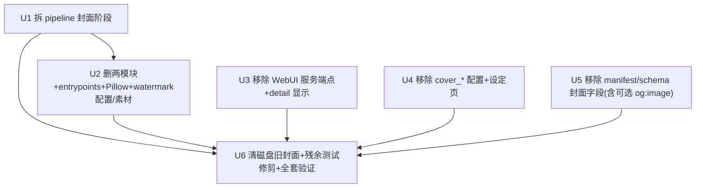

# refactor: Remove cover feature

## Overview

完整移除封面（cover）整条链路：抓取 → 下载 → 加浮水印（watermark）→ 存盘 → HTTP 服务 → WebUI 显示。PR #27 已用 `cover_enabled: false` 把「下载」关掉一半，但服务端点、WebUI 显示、磁盘旧档、以及 `core/webui_config.py` 里仍为 `True` 的预设值都还在，所以用户仍能看到一张张相同的封面。本计划把残留全部清掉，并移除随之无用的 Pillow 依赖。

## Problem Frame

封面来源唯一就是网页的 `og:image` meta 标签（`src/crawl_posts.py:220-224`）。51cg1 这个站的 `og:image` 是**全站共用的一张主题预设图**（`themes/Mirages/images/social-default.jpg`），因此每篇文章抓回来的 `image_url` 完全相同，下载出来张张一样。PR #27 之后虽然开始抓文章正文（`source_text.txt`），但只抓**纯文字**（`body p ::text` 选择器，`crawl_posts.py:235-238`），从未抓文章内的真实图片。

**结论：现有数据里不存在「每篇专属」的封面来源。** 要做出有意义的封面，必须改成去线上站抓正文第一张真实内文图、并为该源建 per-source 内容选择器与启发式（避开 logo/banner/lazy-load/防盗链）——这属于「改了上线反复试」的执行实验，无法在计划期保证成功；且产品价值已转移到 AI 生成文章（PR #28）。故按用户决定：**完整移除**（用户已在规划期明确选择「完整移除（推荐）」）。

## Requirements Trace

- R1. WebUI 不再显示任何封面（含旧 package 磁盘上残留的 `cover.jpg`/`watermarked_cover.jpg`）。
- R2. Pipeline 不再下载封面、不再加浮水印；端到端跑通后产出的 package 无封面，且流程不因缺封面而出错。
- R3. 移除封面相关的死代码与依赖：`src/select_cover.py`、`src/watermark_cover.py`、其 CLI entry points、Pillow 依赖、`configs/watermark.yaml`、`assets/logo.png`。
- R4. 配置与设定页移除 `cover_*` 字段；**读取旧的、仍含 `cover_*` 键的 `webui.yaml` 不得报错**（向后兼容）。
- R5. Manifest 不再写入封面字段；**读取旧的、仍含 `media.cover_path` 的 manifest 不得崩溃**（向后兼容）。
- R6. 测试套件在每个移除单元后保持绿灯；封面专属测试删除，附带提及封面的测试就地修剪。

## Scope Boundaries

- **不**尝试任何「修好封面」的方案（抓内文图 / per-source 选择器 / 启发式）——本计划是纯移除。
- **不**改动 caption / AI 文章生成 / publish / library 等无关链路。
- **不**为了兼容而在 config/manifest loader 里新增「严格拒绝未知键」的逻辑——相反，要确保旧键被**安静忽略**。
- 旧 package 目录本身（除封面图档外）保留不动；只删其中的 `cover.jpg` / `watermarked_cover.jpg`。

## Context & Research

### Relevant Code and Patterns

封面链路按数据流分布在以下位置（均经直接读码确认）：

- **抓取**：`src/crawl_posts.py:220-224` 从 `og:image` 取 `image_url`；正文文字 `:235-238`（不含图片）。
- **下载**：`src/select_cover.py`（整支模块）→ 产出 `cover_source` / `cover_path`。
- **浮水印**：`src/watermark_cover.py`（整支模块，**唯一**使用 Pillow 者）→ 产出 `watermarked_cover_path`。
- **Pipeline 编排**：`core/pipeline.py` 第 20/26-29 行从 `src` import 两模块；`:109,113,117-119,149-156,173-182` 是 `cover_enabled` 分支、下载阶段、浮水印阶段、`cover_*` 配置读取。
- **存盘 / Manifest**：`src/build_manifest.py:45-46,73-86,103-105`（复制 `cover.jpg`/`watermarked_cover.jpg`、写 `media.cover_path`/`watermarked_cover_path`、`preview.html` 的 ``）。
- **Schema**：`core/schema.py` —— `CRAWLED_OPTIONAL` 含 `image_url`（:16,27）；manifest 记录字段 `cover_path`/`watermarked_cover_path`（:89-90,158-159）；状态旗标 `cover_selected`/`watermarked`（:122-123）。
- **HTTP 服务**：`webui/routers/packages.py:149-159`（`GET /packages/{id}/cover` 端点）+ `:53,67`（detail 的 `has_cover`）。
- **显示**：`webui/templates/detail.html:24-27`（``）。列表页 `packages.html` / `_packages_table.html` **不**含封面（已确认）。
- **配置**：`core/webui_config.py:23-26,40-46,164-170`（`cover_*` 预设 + 校验，`cover_enabled` 预设仍为 `True`）+ `:29`（`watermark_config` 指向 `./configs/watermark.yaml`）；`configs/webui.yaml:5-7,20`。
- **设定页**：`webui/routers/settings_auth.py:54-62`（接收 `cover_*` 表单字段）+ `webui/templates/settings.html:42-51`（输入框）。
- **CLI / 依赖**：`pyproject.toml:15`（`Pillow>=10.0,<12`）、`:32-33`（`select-cover` / `watermark-cover` entry points）。
- **资产 / 配置档**：`configs/watermark.yaml`、`assets/logo.png`。
- **磁盘旧档**：`out/*/cover.jpg`、`out/*/watermarked_cover.jpg`（多个 package，含用户点的 `20230317_…31516`）。

### 引用关系（确认可安全删除）

- `Pillow` **只**被 `src/watermark_cover.py` 使用 → 可从依赖移除。
- `select_cover` / `watermark_cover` 仅被 `core/pipeline.py`（及各自测试）import → 删模块前先拆 pipeline 引用即可。

### Institutional Learnings

- 记忆 `pipeline-covers-off-fulltext-capture.md`：PR #27 刻意「保留代码、只翻 flag」是为可逆；但其可逆前提是「日后供应真实 per-article 封面源」——本计划已确认该源对此站不存在，故可逆理由失效，可直接删。
- 同源计划 `docs/plans/2026-06-18-003-feat-fulltext-capture-drop-cover-plan.md` 是本次移除的上游背景（drop-cover 的后续收尾）。

### External References

未做外部研究：本变更是基于直接读码的机械移除，本地证据充分（无 auth/payments/migration 等高风险面）。

## Key Technical Decisions

- **完整删除而非继续禁用**：理由——唯一封面源（og:image）结构上就是主题预设图，无法产出有意义封面；保留休眠代码只会成为已证无用的维护噪音；移除还能顺带去掉 Pillow 依赖。（用户已选「完整移除」）
- **向后兼容优先于洁癖**：旧的 `webui.yaml`（含 `cover_*`）与旧 manifest（含 `media.cover_path`）必须能被无错读取。移除的是「写入与消费」，不是「拒绝旧数据」。绝不新增严格键校验。
- **拆引用先于删模块**：先改 `core/pipeline.py`（消费方）再删 `src/*_cover.py`，避免任何中间状态 import 崩溃。
- **`og:image` / `image_url` 一并清除，但列为可延后尾项**：它是封面的数据源头，full-removal 立场下应清掉；但留着它也不会显示任何封面，故标为可延后，不阻塞主移除。

## Open Questions

### Resolved During Planning

- 封面为何全相同？→ `og:image` 是全站主题预设图，且正文只抓文字、未抓内文图。
- 为何 PR #27 关了还看得到？→ 只关了下载；服务端点、显示、磁盘旧档、`True` 预设值都还在。
- 能否修好？→ 需线上反复试的执行实验，不可靠且价值低 → 移除。
- Pillow 能否移除？→ 仅 watermark 使用 → 可移除。

### Deferred to Implementation

- `configs/watermark.yaml` 与 `assets/logo.png` 删除前，用 grep 再确认无其它消费者（预期仅 watermark 链路）。
- config/manifest loader 对「未知旧键」的实际行为需在改动时确认为「忽略」；若发现会报错，则在该 loader 增加忽略逻辑（属移除范围内的兼容修复）。

## High-Level Technical Design

> *以下仅说明移除的依赖顺序，是给审阅者校验方向的指引，不是实作规格。*

U3 / U4 / U5 互不依赖、不 import 被删模块，可并行；U2 必须在 U1 之后；U6 收尾，依赖全部。

## Implementation Units

- [ ] **Unit 1: 拆除 pipeline 的封面 / 浮水印阶段**

**Goal:** 让 `run_pipeline` 不再 import、不再调用封面与浮水印；产出的记录不带 `cover_path`/`watermarked_cover_path`。

**Requirements:** R2

**Dependencies:** 无（必须最先做，后续删模块依赖它）

**Files:**
- Modify: `core/pipeline.py`（移除 `select_cover`/`watermark_cover` import；删除 `cover_enabled` 分支、下载阶段、浮水印阶段、`cover_retries`/`cover_backoff`/`cover_concurrency`/`wm_cfg` 读取；更新 docstring 的 `normalize→dedupe→caption→cover→watermark→build` 描述）
- Test: `tests/test_pipeline.py`、`tests/test_pipeline_public_api.py`、`tests/test_auto_pipeline.py`（删除封面相关断言）

**Approach:**
- `cover_enabled` 分支整段删除；caption→build 的 per-item 循环保留，只去掉其中的 watermark 调用。
- 确认 `download_dir` 若仅服务封面则一并清理；若另有用途则保留。

**Patterns to follow:** 现有 stage 注释风格（`core/pipeline.py:149` 一带的 "Stage N" 注释）。

**Test scenarios:**
- Happy path：给定若干 normalized items，跑 `run_pipeline`，每个 package 产出 manifest 与 caption，且记录**不含** `cover_path`/`watermarked_cover_path`。
- Edge case：item 的 `image_url` 即使非空，也不触发任何下载（无网络调用）。
- Integration：pipeline 模块 import 时不再 import `select_cover`/`watermark_cover`（可断言 `sys.modules` 或以 import 不抛错为准）。

**Verification:** pipeline 相关测试全绿；`run_pipeline` 端到端跑通且无封面产物。

---

- [ ] **Unit 2: 删除封面模块、CLI entry points、Pillow 依赖、浮水印配置与素材**

**Goal:** 物理删除已无人引用的封面下载 / 浮水印代码与其支撑资产。

**Requirements:** R3

**Dependencies:** Unit 1（pipeline 不再 import 这两模块后才能删）

**Files:**
- Delete: `src/select_cover.py`、`src/watermark_cover.py`
- Delete: `tests/test_select_cover.py`、`tests/test_watermark_cover.py`
- Delete: `configs/watermark.yaml`、`assets/logo.png`（删前 grep 确认无其它消费者）
- Modify: `pyproject.toml`（移除 `Pillow>=10.0,<12` 依赖；移除 `select-cover` / `watermark-cover` 两个 `[project.scripts]` entry points）

**Approach:**
- 先 `grep -rn "select_cover\|watermark_cover\|logo.png\|watermark.yaml"` 全仓确认无遗漏引用，再删。
- 删 Pillow 后，确认无其它模块 `import PIL`（已确认仅 watermark 使用）。

**Patterns to follow:** `pyproject.toml` 现有 `[project.scripts]` 与 `dependencies` 区块格式。

**Test scenarios:**
- Happy path：删除后整套 `pytest` 收集（collection）不报 import 错。
- Integration：在未安装 Pillow 的环境（或卸载后）import 本包与跑 pipeline 不报 `ModuleNotFoundError: PIL`。

**Verification:** 两模块与其测试不存在；`pip install -e .` 不再拉 Pillow；`select-cover`/`watermark-cover` 命令不再注册。

---

- [ ] **Unit 3: 移除 WebUI 封面服务端点与 detail 显示**

**Goal:** 不再通过 HTTP 暴露或在页面显示任何封面（含旧 package 磁盘残档）。

**Requirements:** R1

**Dependencies:** 无（与 U1/U2 独立，可并行）

**Files:**
- Modify: `webui/routers/packages.py`（删除 `GET /packages/{post_id}/cover` 端点 `:149-159`；删除 `package_detail` 里的 `has_cover` 计算 `:53` 与传参 `:67`）
- Modify: `webui/templates/detail.html`（删除 `:24-27` 的 `……`）
- Test: `tests/test_webui_packages.py`、`tests/test_webui_traversal.py`、`tests/test_webui_app.py`、`tests/mock_admin.py`（删除/修剪 `/cover` 与 `has_cover` 相关断言；保留与封面无关的 traversal 安全测试）

**Approach:**
- detail 模板移除封面块后，确认版面无悬空标题/空白。
- traversal 测试里若有「`/cover` 路径穿越防护」用例，整体删除（端点已不存在），但**保留** `failure-image` 等其它端点的穿越测试。

**Test scenarios:**
- Happy path：对有 manifest 的 package 请求 detail，页面正常渲染且**无**封面 ``。
- Edge case（关键）：对磁盘上**仍有** `cover.jpg` 的旧 package 请求 detail，页面不显示封面、不报错。
- Error path：`GET /packages/{id}/cover` 返回 404（路由已移除）。

**Verification:** WebUI 测试全绿；浏览旧 package 不再出现相同封面。

---

- [ ] **Unit 4: 移除 `cover_*` 配置与设定页字段（保持旧配置兼容）**

**Goal:** 配置层与设定 UI 不再有封面开关；旧 `webui.yaml` 含 `cover_*` 时仍能无错加载。

**Requirements:** R3, R4

**Dependencies:** 无（可与 U3 并行）

**Files:**
- Modify: `core/webui_config.py`（移除 `cover_enabled`/`cover_retries`/`cover_backoff_sec`/`cover_download_concurrency` 预设与其在 `_INT_FIELDS`/`_FLOAT_FIELDS`/`_BOOL_FIELDS` 的登记；移除 `:164-170` 的 `cover_*` 校验；移除 `watermark_config` 预设键 `:29`）
- Modify: `configs/webui.yaml`（删除 `cover_backoff_sec`/`cover_enabled`/`cover_retries` `:5-7` 与 `watermark_config` `:20`）
- Modify: `webui/routers/settings_auth.py`（删除 `:54-56` 的 `cover_*` 表单参数与 `:61-62` 的写回）
- Modify: `webui/templates/settings.html`（删除 `:42-51` 的 `cover_*` 输入框）
- Test: `tests/test_webui_config.py`、`tests/test_webui_actions.py`、`tests/test_auth_login.py`（删除 `cover_*` 校验/表单断言）

**Approach:**
- **兼容性核心**：确认 `webui_config` 加载器对未知键是「忽略」而非「拒绝」。若发现会报错，在加载器加入忽略逻辑（属本单元范围内的兼容修复）。
- settings 表单删字段后，确认 POST 不再写 `cover_*` 回配置文件。

**Test scenarios:**
- Happy path：不含 `cover_*` 的 `webui.yaml` 正常加载，无校验错误。
- Edge case（关键）：**含**旧 `cover_enabled: false` / `cover_retries` 等键的 `webui.yaml` 加载成功，键被安静忽略，不抛 `ValidationError`。
- Happy path：设定页渲染与提交不含 `cover_*` 字段，保存成功。

**Verification:** 配置/设定测试全绿；新旧 `webui.yaml` 皆可加载。

---

- [ ] **Unit 5: 移除 manifest 构建与 schema 的封面字段（保持旧 manifest 兼容）**

**Goal:** 新产出 manifest 不含封面字段，且不再复制封面图档；读取旧 manifest（含 `media.cover_path`）不崩溃。

**Requirements:** R2, R5

**Dependencies:** 无（可与 U3/U4 并行；与 U1 互补）

**Files:**
- Modify: `src/build_manifest.py`（删除 `:73-86` 的 cover/watermarked 复制与 `has_cover`；删除 `:103-105` 的 `media.cover_path`/`watermarked_cover_path`；`_preview_html` `:45-46` 去掉封面 `` 参数）
- Modify: `core/schema.py`（删除 manifest 记录字段 `cover_path`/`watermarked_cover_path` `:89-90,158-159`；删除状态旗标 `cover_selected`/`watermarked` `:122-123`）
- Test: `tests/test_build_manifest.py`、`tests/test_backend_schema.py`、`tests/test_normalize_items.py`（删除封面字段断言）
- *(可选尾项，可延后)* Modify: `src/crawl_posts.py:220-224`（移除 `og:image` 抓取）+ `core/schema.py:16,27`（从 `CRAWLED_OPTIONAL` 移除 `image_url`）+ `tests/test_crawl_posts.py`

**Approach:**
- **兼容性核心**：确认 `reviewed.content_id(m)`（`webui/routers/packages.py:50` 调用）与 detail 渲染**不**依赖已删的 manifest 封面键；读取旧 manifest 的封面键应被忽略而非要求其存在。
- 可选尾项（og:image/image_url）独立成步：删它不影响任何显示，只是清掉死数据源；若想缩小本次 diff 可延后到后续提交。

**Test scenarios:**
- Happy path：`build_manifest` 产出的目录无 `cover.jpg`/`watermarked_cover.jpg`，manifest 的 `media` 无封面键，`preview.html` 无封面 ``。
- Edge case（关键）：加载一份**旧** manifest（含 `media.cover_path: "./cover.jpg"`）→ `reviewed.content_id` 与 detail 渲染正常，不抛 `KeyError`。
- Edge case：记录无 `image_url` 时（若保留该字段）build 仍正常。
- *(可选)* Happy path：移除 og:image 后，crawl 产出不含 `image_url` 键，`test_crawl_posts` 相应更新。

**Verification:** manifest/schema 测试全绿；新 manifest 无封面字段；旧 manifest 仍可读。

---

- [ ] **Unit 6: 清理磁盘旧封面、修剪残余测试、全套验证**

**Goal:** 删除磁盘上所有残留封面图档，扫净其它测试里附带的封面提及，跑全套确认绿灯。

**Requirements:** R1, R6

**Dependencies:** Unit 1-5 全部

**Files:**
- Delete (运营动作)：`out/*/cover.jpg`、`out/*/watermarked_cover.jpg`（保留各 package 其余内容）
- Modify (按需修剪)：`tests/test_library_store.py`、`tests/test_library_ingest.py`、`tests/test_runs.py`、`tests/test_browser_flow.py`、`tests/test_backend_driver_resilience.py`、`tests/test_crawl_posts.py`、`tests/test_webui_crawl.py`、`tests/test_webui_history.py`（仅删除/调整因封面移除而失效的断言；逐一确认是否真正涉及封面，不涉及则不动）

**Approach:**
- 先全套跑 `pytest`，按失败项定位仍提及封面的测试逐个修剪——以测试失败为驱动，避免误改无关测试。
- 磁盘清理用一次性脚本删两类档名；旧 manifest 里残留的 `media.cover_path` 字符串无害，可不动（Unit 5 已确保读取兼容）。

**Test scenarios:**
- Integration（全局回归）：`pytest` 全绿。
- Happy path：清理后 `find out -name "*cover*.jpg"` 为空。
- Edge case：清理脚本对**已无**封面图档的 package 目录幂等、不报错。

**Verification:** 全套测试绿；磁盘无封面图档；WebUI 浏览任意（含旧）package 均无封面。

## System-Wide Impact

- **Interaction graph:** 受影响入口——`run_pipeline`、`auto_pipeline`、`build_manifest`、WebUI `package_detail` / `/cover` / `settings`、CLI `select-cover`/`watermark-cover`。caption / AI 生成 / publish / library 链路不受影响。
- **Error propagation:** 移除后无新增失败路径；反而少一个下载/浮水印失败源。
- **State lifecycle risks:** 旧 package 磁盘档与旧 manifest/旧 webui.yaml 是主要兼容风险点——R4/R5 已用「忽略未知键、不要求封面键存在」覆盖。
- **API surface parity:** `GET /packages/{id}/cover` 端点移除属对外（浏览器）契约变更；无其它界面提供等价封面访问，移除后一致。
- **Integration coverage:** 必须由集成测试证明的两点——(a) 旧 manifest 经 `reviewed.content_id` + detail 渲染不崩；(b) 旧 `webui.yaml` 含 `cover_*` 仍可加载。
- **Unchanged invariants:** caption.txt / manifest `content.body` / `source_text.txt` / publish 流程 / `reviewed.content_id` 的非封面部分均不变；本计划不触碰它们。

## Risks & Dependencies

| Risk | Mitigation |
|------|------------|
| 旧 `webui.yaml`（线上部署）仍含 `cover_*`，移除预设/校验后加载报错 | R4 + U4：确保 loader 忽略未知键；专门测试旧配置加载 |
| 旧 manifest 含 `media.cover_path`，删 schema 字段后读取崩溃 | R5 + U5：读取路径不要求封面键存在；专门测试旧 manifest |
| `reviewed.content_id` 或 detail 隐式依赖封面字段 | U5 实作前先确认 `content_id` 组成不含封面（记忆显示 source_text 已排除，封面预期同样不在内） |
| 删 `assets/logo.png` 或 `configs/watermark.yaml` 时尚有未知引用 | 删前 grep 全仓确认（已知仅 watermark 链路使用） |
| 误删与封面无关的 traversal/测试逻辑 | U3/U6：以测试失败驱动修剪；保留 `failure-image` 等非封面端点的安全测试 |

## Documentation / Operational Notes

- 移除后建议在 `_CHANGELOG` / 版本说明记一笔「移除封面功能（og:image 结构性重复，价值已转移到 AI 文章生成）」。
- 部署侧：线上 `webui.yaml` 可顺手删掉 `cover_*` 与 `watermark_config`（非必须，loader 已兼容）。
- 记忆 `pipeline-covers-off-fulltext-capture.md` 的「可逆/保留代码」说明在本计划落地后已过时，宜更新或标记为「已完整移除」。

## Sources & References

- **上游计划：** [docs/plans/2026-06-18-003-feat-fulltext-capture-drop-cover-plan.md](docs/plans/2026-06-18-003-feat-fulltext-capture-drop-cover-plan.md)
- 抓取/根因：`src/crawl_posts.py:220-238`
- 下载/浮水印：`src/select_cover.py`、`src/watermark_cover.py`
- 编排：`core/pipeline.py:109-182`
- 服务/显示：`webui/routers/packages.py:149-159`、`webui/templates/detail.html:24-27`
- 配置：`core/webui_config.py:23-46,164-170`、`configs/webui.yaml:5-7,20`、`webui/routers/settings_auth.py:54-62`、`webui/templates/settings.html:42-51`
- Manifest/schema：`src/build_manifest.py:45-105`、`core/schema.py:16,27,89-90,122-123,158-159`
- 依赖/CLI：`pyproject.toml:15,32-33`
- 相关记忆：`pipeline-covers-off-fulltext-capture.md`
