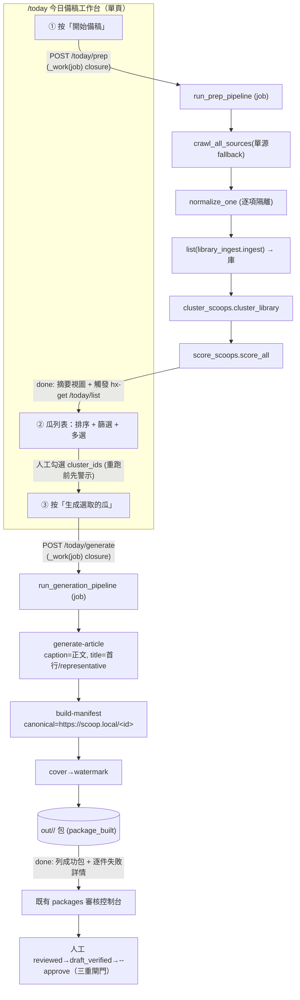
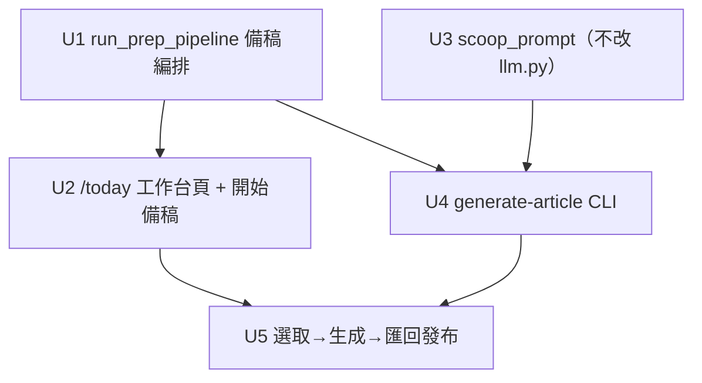

# feat: 今日備稿流程 — 一頁式爬取→聚瓜→選取→生成原創文

## Overview

把已完成的後端 Scoop 管線（庫 / 聚瓜 / 打分，plan 004 Phase 1+2 已 `[x]`）接成一個**使用者可操作的「今日備稿」端到端流程**：在一頁式工作台按「開始備稿」→ 系統跑 `爬取最新資訊 → 落庫 → 聚瓜 → 打分` → 列出排序後的「瓜」讓使用者**勾選** → 對選中的瓜用 LLM **合成原創文章** → 匯回既有發布控制台走三重閘門。

> 一句話比喻：plan 004 把「情報庫 + 聚瓜 + 打分」的引擎都造好了，但**沒裝方向盤**——目前 WebUI 的爬取鈕只會跑舊的「模板重貼軌」，完全沒碰生成軌。本計畫裝上方向盤：一個「今日備稿」頁，讓操作者按一下就把引擎跑起來、看到排好序的瓜、勾選後生成。

**本計畫 = plan 004 的 Phase 3（選取 UI / U5）+ Phase 4（生成匯回 / U6–U8），外加 plan 004 U2 刻意延後的「WebUI 消費端接線」**（把多源爬取→落庫→聚瓜→打分串成一個可在 WebUI 觸發的 in-process job）。難決策（聚類演算法、置信度公式、LLM client、發布閘門）plan 004 已定，本輪只做**編排 + UI + 生成接線**，不重造後端。

> **本輪先以單源上線**（使用者選定，見「來源範圍」決策）。單源下「多源互證置信度」這個賣點**暫時空轉**（`source_count` 恆為 1），故本計畫**據實把這輪的價值定位為「單源聚合去重 + LLM 原創改寫 + 人工選取上稿」**，置信度軸與其篩選器明確標示「待多源才有區分力」，不過度宣稱互證。見 Key Technical Decisions「單源價值誠實化」。

### 起點（已存在，本計畫直接消費，不重造）

- **後端 Phase 1+2（已完成）**：`core/library.py`（庫 store，`upsert`/`list_clusters(by_score=True)`/`get_cluster_members`/`assign_clusters`/`set_cluster_scores`）、`core/cluster.py`（字元 n-gram Jaccard + 時間窗 + union-find）、`core/scoring.py` + `core/scoring_config.py`（置信度=獨立來源數、品質=完整度+時近度+素材量）；三個 CLI `library-ingest` / `cluster-scoops` / `score-scoops`，皆有**乾淨的 in-process 純函式**（`library_ingest.ingest`、`cluster_scoops.cluster_library`、`score_scoops.score_all`）可被 orchestrator 直接呼叫。
- **clusters 表已含展示所需欄位**：`representative_title` / `representative_url` / `member_count` / `source_count` / `confidence` / `quality` / `score`——瓜列表頁**不需再動後端查詢**，`library.list_clusters(conn, by_score=True)` 直接給排序結果。
- **多源爬取（已完成、未接線）**：`core/pipeline.py:crawl_all_sources(webui_cfg)` 是 `crawl_items` 的**外層包裝**——讀 `webui_cfg["sources"]` 逐源呼叫 `crawl_items`、單源失敗不中斷、**無 `sources` 清單時 fallback 為單次 `crawl_items(start_url)`**（兩者共用同一單源實作，非另一條 code path）。目前**無人呼叫**（`webui/routers/crawl.py` 只用單源 `crawl_items` + 模板軌 `run_pipeline`）。
- **LLM 生成基礎（已存在）**：`core/llm.py`——`chat(cfg, system_prompt, user_content) -> str`（stdlib urllib + Cloudflare 瀏覽器 UA + 金鑰從 `CPOST_LLM_API_KEY`/`auth/llm.env`）。**注意實際契約**：`chat()` 已把 `system_prompt` 當參數收，呼叫端可自行讀任意 prompt 檔傳入（**不需改 client**）；缺金鑰丟 `ValidationError`（exit 2）、HTTP/網路錯丟 `ExternalError`（exit 4）。另有 `configs/llm.yaml`、`configs/article_prompt.zh.md`、單篇 `POST /packages/{id}/generate`（`webui/routers/packages.py`，把整塊 blob 寫入 `content.body`、沿用既有 title、**未拆標題**）。
- **建包契約（生成必須對齊）**：`src/build_manifest.py:build` 的 `_REQUIRED = ("title", "canonical_url", "caption")`，且 **`manifest.content.body = caption`**；記錄的 `text` 欄只寫進 `source_text.txt`、**不會進 `content.body`**。`core/validators.py:valid_url` **只接受 `{http, https}` scheme**。

## Problem Frame

使用者要的不是「再按一次爬取重貼模板」，而是一條**日常備稿動線**：

1. **先爬取最新資訊** → 多源（先單源）爬取並落進可查詢的庫。
2. **把瓜做成列表讓使用者選** → 同事件聚成「瓜」、依「料多/可信」排序，操作者瀏覽勾選。
3. **才能去生成文章** → 對選中的瓜用其素材請 LLM 合成原創文，再走既有發布流程。

現狀的落差：**引擎都在、方向盤不在**。WebUI 沒有任何入口能觸發生成軌（落庫/聚瓜/打分一行都沒被 WebUI 呼叫），也沒有瓜列表頁、沒有 `generate-article`、沒有多源合成 prompt。本計畫補的就是這條「人能按、能看、能選、能生」的操作流。

**單源上線時的價值邊界（誠實聲明）**：單源下置信度恆定、互證不成立，本流程相對既有單篇 `/packages/{id}/generate` 的**增量價值**在於：① 把同一來源近重複的列表頁**聚合去重**成事件級「瓜」、② 依**品質**排序讓操作者一眼挑料足的、③ 用**多成員素材**（同事件多頁）合成而非單頁改寫。互證置信度的價值**待第二來源配置後才兌現**。

## Requirements Trace

- **R1（一頁式今日備稿入口）**：WebUI 新增一個專屬「今日備稿」工作台頁，把「開始備稿 → 瓜列表勾選 → 生成」三段串在同一頁；導覽列加入口。
- **R2（備稿編排：爬取→落庫→聚瓜→打分）**：「開始備稿」觸發一個 in-process job，依序跑 `多源爬取 → normalize → library-ingest → cluster-scoops → score-scoops`，沿用 plan 004 已完成的後端純函式；即時回報進度。**這補上 plan 004 U2 延後的 WebUI 消費端接線（編排層在 Unit 1、UI 觸發在 Unit 2）。**
- **R3（先單源、可擴多源）**：用 `crawl_all_sources`（無 `sources` 清單時 fallback 單源）；多源結構保留但**本輪不新增 `sources` 設定欄位**（fallback 已涵蓋單源，待第一個第二來源出現再加）；單源下置信度據實標示為「暫不具區分力」。
- **R4（選取）**：瓜列表依綜合分 `score` 排序，可按「最低置信度 / 最低分」篩選（**單源預設 `min_confidence=0`，避免清空列表**），**多選**後送出生成；沿用 HTMX + APIRouter、localhost 單人、無鑑權既有形態。
- **R5（生成原創文）**：對選中的瓜，用其多成員素材呼叫**可插拔 LLM**（重用 `core/llm.py:chat` + 新增 `configs/scoop_prompt.zh.md`，**不改 client**）合成標題+正文；金鑰只走 env、不入 git/manifest/log/**到瀏覽器的 job 錯誤訊息**；以（叢集指紋+model+prompt 版本）快取穩定重跑；缺金鑰→`ValidationError(2)`、LLM 失敗→`ExternalError(4)`。
- **R6（匯回發布）**：生成文 body 以 **`caption` 欄**進 `build-manifest` → cover/watermark → 落 `out/<post_id>/` 包 → 進**既有 packages 審核控制台**，由人工走 reviewed→draft_verified→title+`--approve` **三重閘門**；不自動發、不繞道。
- **R7（守既有不變量）**：不取代模板重貼軌（`render-caption` 零改動、既有測試維持綠）；不污染 `items`/`content.body`/caption 真相（聚類/生成讀 `source_text`）；dedupe 仍只認 `canonical_url`；新表沿用冪等 migration；所有路徑相對化（`test_portability_guard` 綠）。

## Scope Boundaries

- **不重造後端**：庫/聚類/打分/CLI（plan 004 U1–U4）已完成，本輪只**消費**，不改其演算法與 schema（除非生成快取需新增 `generations` 表，附冪等 migration）。
- **不取代模板重貼軌**：既有 `webui/routers/crawl.py` 的單源爬取→`run_pipeline`→（可選 auto_pipeline）**零改動**並存；今日備稿是另一條入口。
- **不做自動發布生成文**：發布一律停在「建包/草稿」，須人工三重閘門；`auto_pipeline` 繞道**不延伸到生成軌**。
- **本輪不配多來源清單、不加 `sources` 設定欄位**：保留 `crawl_all_sources` 的多源結構與單源 fallback，實際多源由日後加碼；置信度先以單源資料計算並據實標示。
- **不做向量/嵌入式聚類、不做成本治理儀表、不繞 login/CAPTCHA/anti-bot**（沿用 plan 004 邊界）。
- **不改 CLI 既有 I/O 契約與退出碼語意**；新增命令遵循同一契約。
- **不跨刷新保存勾選狀態的複雜實作**：採「重跑備稿前先警示 + 換列表時保留已勾 `cluster_ids`」的輕量處理（見 Unit 2），不做 server-side 選取 session。

## Context & Research

### Relevant Code and Patterns

- **備稿編排骨架**：`core/pipeline.py:run_pipeline`（normalize→dedupe→cover→caption→watermark→build，逐項 try/except、單壞項不中斷、`progress_cb` 回報、`runs.new_run_id` 關聯）是 `run_prep_pipeline` 的範本；`crawl_all_sources`（多源、單源 fallback、逐源隔離，內部呼叫 `crawl_items`）直接重用。
- **三個後端純函式（in-process 直呼，免 shell）**：
  - `src/library_ingest.py:ingest(records, conn, now)`——**generator**，每筆 upsert 後 yield；**必須被消費（`list(...)` 或 for 迴圈）才會真正寫庫**，共用單一連線批寫。`to_library_fields(record)` 為純映射。
  - `src/cluster_scoops.py:cluster_library(conn, cfg, now) -> clusters`、`summary(clusters)`。
  - `src/score_scoops.py:score_all(conn, cfg, now) -> scored(已排序)`、`summary(scored)`。
  - `cfg` 由 `core/scoring_config.py:load()` 一次給出含 cluster（ngram/相似度門檻/時間窗）與 score（各權重）的合併 dict。
- **庫查詢 API（給瓜列表頁）**：`core/library.py:list_clusters(conn, by_score=True)`（依 `score DESC, confidence DESC, cluster_id` 回 cluster 摘要 dict，已含 `representative_title`/`source_count`/`confidence`/`quality`/`score`）、`get_cluster_members(conn, cluster_id)`（給來源清單顯示 + 生成素材）。**篩選（min_confidence/min_score）在 application code 過濾即可。**
- **打分公式現況（單源影響）**：`core/scoring.py` 置信度 = `source_count / confidence_source_cap`（單源 `source_count=1` → 恆為常數）；綜合分按 `configs/scoring.yaml` 的 `weight_confidence`/`weight_quality` 加權。**單源下置信度項是固定偏移，綜合排序實質等同品質排序**——本計畫據此調整 UI 與預設篩選（見 KTD）。
- **WebUI 爬取 job 範本**：`webui/routers/crawl.py`——`jobs.submit(_work)`（`jobs.submit` 收**單參 `fn(job)`**，故 pipeline 須包進 `_work(job)` closure 綁 cfg、把 `progress_cb` 接到 `jobs.report`）→ 回 `_job_status.html`（`hx-get="/jobs/{id}" hx-trigger="every 1s" hx-swap="outerHTML"` 自我輪詢到 done/error）。**注意**：現有 `_job_status.html` 只認 `built/batch/single-stage` 結果形狀 + 寫死「前往上膛清單」連結——備稿/生成的新結果形狀需各自的 done 視圖（見 Unit 1/2/5）。
- **WebUI 多選批次範本**：`webui/routers/packages.py` / `webui/routers/actions.py:batch_action(..., post_ids: list[str] = Form(default=[]))`——`<form>` 包 rows、每 row `<input type="checkbox" name="post_ids">`（同名→後端 list）、`hx-include`、白名單 guard、per-item 隔離。瓜列表「勾選→送出生成」照此，`name="cluster_ids"`。`packages.html` 的篩選用 input 上的 `hx-trigger`（live 換列表）——瓜列表篩選沿用此式。
- **WebUI 三層 + 組裝**：`webui/app.py:create_app` 每 router 一行 `include_router`（**無 prefix、路徑寫全**）；`webui/routers/_ctx.py`（`templates` 單例、`cfg_from_request`、`submit_job`）；template 命名整頁 `name.html`（`extends base.html`）、partial `_name.html`；nav 在 `base.html:42` 手動加 `<a>`。
- **既有 LLM 生成（重用不重造）**：`core/llm.py:chat`、`configs/llm.yaml`、`configs/article_prompt.zh.md`、單篇 `webui/routers/packages.py` 的 `/packages/{id}/generate`。多源合成只新增 `configs/scoop_prompt.zh.md` + 組多源素材並由呼叫端傳入 `chat()`，client 與金鑰機制完全沿用。
- **生成→建包→發布範本**：`core/pipeline.py:run_pipeline`（建包逐項隔離）、`src/build_manifest.py`（`caption`→`content.body`）、`webui/_auto_pipeline.py`（階段串接）、`src/publish_post.py`（三重閘門、讀 `canonical_url`）、`core/reviewed.py`（`content_id` = title+body(=caption)+canonical_url 指紋）。
- **金鑰外洩面（已驗證大致安全，仍須守）**：`core/jobs.py` 失敗時 `job.error = str(exc)` 會渲染到 `_job_status.html`；`core/llm.py` 例外只內嵌上游回應 body（`exc.read()[:300]`）與 reason、**不含 Authorization header**，故金鑰不入例外字串。U5 須加斷言守此面（見 Unit 5）。
- **共享 state DB**：庫與 `items`/`runs`/`reviewed` 共用同一檔，路徑 `webui_cfg["state_path"]`；`library.connect(cfg["state_path"])` 自帶冪等 schema（`CREATE TABLE IF NOT EXISTS`），與發布真相表共存無虞。
- **設定**：`core/webui_config.py:DEFAULTS` + `_BOOL_FIELDS`/`_INT_FIELDS`（新增 `min_confidence`/`min_score`，**`min_confidence` 預設 0**）；`configs/scoring.yaml` 已存在。
- **可攜性守門**：`tests/test_portability_guard.py` 鎖「無外部絕對路徑」——新增設定欄/路徑必須相對化。

### Institutional Learnings

- `docs/solutions/` 不存在；本專案用 plans/brainstorms 三件套。**plan 004 即本層的研究彙整與決策來源**，所有不變量（去重只認 canonical_url、四 store 責任不合併、不挪用 content.body、新表冪等 migration、先量測再加複雜度、發布走完整三重閘門、LLM 與模板並存）沿用。
- **並行 git 自動化警示**（專案記憶）：本 repo 背景會移 refs/換 PR 內容；本計畫只新增檔案 + 接線，落地前重抓最新，盡量不覆寫他人正在改的共享檔（`webui/app.py`/`base.html` 只做一行增量）。

### External References

- LLM 端點為 OpenAI 相容（`/v1`），`core/llm.py:chat` 已用 stdlib urllib 接通並內建 Cloudflare 瀏覽器 UA；本輪不引入新依賴、不需外部研究即可起步（與 plan 004 同判斷）。

## Key Technical Decisions

- **一頁式工作台，三段同頁**（使用者選定）：新增專屬 `/today` 頁（router 檔仍命名 `scoops.py`），內含「開始備稿」鈕（觸發 R2 編排 job）、瓜列表（排序/篩選/多選）、「生成選取」鈕（觸發 R5 生成 job）。各段用既有 `jobs` 自我輪詢；中間「勾選」是天然人工關卡，故三段是「兩個 job 夾一個人工選取」，不是單一 job。
- **備稿編排 = in-process `run_prep_pipeline`，不 shell-out**：比照 `run_pipeline` 直呼三個後端純函式（**`list(library_ingest.ingest(...))` 消費 generator** → `cluster_library` → `score_all`），共用 `library.connect(state_path)` 連線、單一 `run_id`、逐源/逐項隔離。
- **先單源、結構保留多源、不加 `sources` 欄位**（使用者選定）：編排用 `crawl_all_sources`（無 `sources` 自動 fallback 單源）。多源是「日後加 config 即生效」，本輪不預建空欄位（避免無消費者的設定面）。
- **單源價值誠實化（新增，回應審查）**：單源下 `source_count≡1` → 置信度恆定、約六成綜合分是固定偏移、排序實質=品質排序。故本計畫：① **`min_confidence` 預設 0**（否則任何非零門檻會清空整列表、看起來像壞掉）；② 瓜列表在「全部叢集 `source_count==1`」時顯示**列級提示**「單源資料：可信度暫不具區分力，排序以品質為主」並弱化置信度欄；③ 文件/README 不宣稱本輪有「多源互證」價值。多源配置後此三點自動回復正常。
- **瓜列表直接讀 clusters 表、不新增查詢層**：`list_clusters(by_score=True)` 已給排序與展示欄位，篩選在 application code 做。
- **生成文合成身份 = `https://scoop.local/<cluster_id>`（修正，回應 feasibility P0）**：原 plan 004 設想 `scoop://<cluster_id>`，但 `core/validators.py:valid_url` 只收 http/https，`normalize_one` 會以 exit 2 擋下、build 根本跑不到。改用 **`https://scoop.local/<cluster_id>`**（過驗證、有正規 host+path 利於 `slug()`/post_id 推導、**不動受保護的 scheme 白名單**），仍是可被「只認 canonical_url」去重/state 辨識的合成身份，同時餵 `reviewed.content_id`。
- **生成正文以 `caption` 欄承載、標題另行解析（修正，回應 feasibility/adversarial P0）**：`build_manifest` 的 `content.body = caption`（`text` 只進 `source_text.txt`），故合成 item 必須 `caption=生成正文`（可另存 `text=生成正文` 供留底）。標題從 LLM 輸出**結構化解析**（prompt 要求首行為標題、解析首行）；解析不到時**退回 `cluster.representative_title`**，確保 `build_manifest` 必填 `title` 不為空。
- **重用 `core/llm.py:chat`、不改 client（簡化，回應 adversarial P3）**：`chat(cfg, system_prompt, user_content)` 已收 `system_prompt` 參數，U4 自行讀 `configs/scoop_prompt.zh.md` 傳入即可，**U3 不需擴充 `core/llm.py`**。錯誤映射沿用既有：缺金鑰→`ValidationError(2)`（**非 DependencyError(3)**，對齊 `core/llm.py`）、HTTP/網路錯→`ExternalError(4)`。
- **生成結果以（叢集指紋 + model + prompt 版本）快取**：LLM 非決定性，用快取穩定重跑、省 API。**叢集指紋以成員 `canonical_url` 集合 + `source_text` 雜湊組成**（成員變動即失效），避免重新聚類後回傳對不上的舊內容（見 Deferred 的 cluster_id 穩定性）。
- **不串 dedupe-posts 進生成軌**：合成身份非單一 URL 重貼；發布階段仍用 `publish-post --state` 以合成 `canonical_url` 防同瓜重複發。

## Open Questions

### Resolved During Planning

- **今日備稿做成什麼形態？** → 一頁式工作台（使用者選定），三段同頁、兩 job 夾人工選取。
- **只有一個來源，置信度怎麼算？** → 先單源上線（使用者選定）；`crawl_all_sources` fallback，置信度據實標示為「暫不具區分力」、`min_confidence` 預設 0、不加 `sources` 欄位，待多源再啟。
- **`/today` vs `/scoops` 命名？** → **頁面/route 用 `/today`（操作語意），router 檔名 `scoops.py`（資料語意）**；不再延後。
- **生成文 canonical 身份？** → `https://scoop.local/<cluster_id>`（過 `valid_url`，不動 scheme 白名單）。
- **生成正文放哪個欄位？** → `caption`（`build_manifest` 映射 `content.body=caption`）；標題解析首行、退回 `representative_title`。
- **U3 要不要改 `core/llm.py`？** → 不用；`chat()` 已收 `system_prompt`，呼叫端傳入 scoop prompt 即可。
- **備稿編排要不要走 CLI subprocess？** → 不要；in-process 直呼後端純函式（記得 `list(...)` 消費 ingest generator）。

### Deferred to Implementation

- **`cluster_id` 跨重跑的穩定性 vs 合成去重**：union-find 重新聚類在新資料進來後可能重編 `cluster_id`，使「同事件」拿到新 `https://scoop.local/<新 id>` 而繞過去重。實作時須**驗證 cluster_id 穩定性**，不穩則改以**內容衍生指紋**（代表來源 URL / 成員 URL 集合）作合成 canonical 身份。加測試：重跑 prep 多進一個成員 → 同事件不產生可發布重複。
- **`generations` 快取與已建包冪等的互動**：`build_manifest` 的 post_id = date_prefix + slug(canonical_url)，跨日重生會得不同 post_id；快取命中（省 API）與包資料夾冪等是兩套機制，實作時釐清重生時的覆寫/略過語意。
- **多源合成 prompt 的事實約束強度**（沿用 004）：如何約束「只用提供素材、不杜撰、標注不確定」+ 首行標題格式——以實測輸出迭代。
- **單篇潤稿與多源合成是否可疊加**（沿用 004）：生成包後是否仍允許用 `/packages/{id}/generate` 再潤稿（該路由會覆寫 `content.body` 與 `caption.txt`，注意不破壞 `reviewed.content_id` 鎖）——實作時定 UI 取捨。
- **生成內容資料留存**：`out/<post_id>/`、`generations` 快取中的生成文（源自未證實八卦、可能含具名臆測）的清除/留存路徑——沿用既有包刪除，於文件註明。

## High-Level Technical Design

> *以下為方向性示意，供審閱驗證設計走向，非實作規格。實作者應將其當作上下文，而非照抄的代碼。*

### 今日備稿操作動線（一頁式，兩 job 夾人工選取）

### 兩條 WebUI 入口對照（並存，不互相取代）

| 面向 | 既有「爬取」入口（`/crawl`） | 新增「今日備稿」入口（`/today`） |
|---|---|---|
| 觸發 | 單源 `crawl_items` | `crawl_all_sources`（單源 fallback；本輪實際單源） |
| 後段 | `run_pipeline`（模板重貼軌） | `run_prep_pipeline`（落庫→聚瓜→打分） |
| 產物 | 直接建包（模板文案） | 排序後的「瓜」供勾選 → 選後才生成 |
| 文案 | `render-caption` 固定模板 | LLM 用多成員素材合成原創文（`caption` 承載） |
| 排序信號 | 無 | 綜合分（**單源下實質=品質**，置信度暫標示不具區分力） |
| 發布 | 三重閘門（可選 auto_pipeline） | 三重閘門（**生成軌不延伸 auto_pipeline**） |

## Implementation Units

> 依賴順序：Phase A（備稿動線 U1→U2）先讓「爬取→瓜列表勾選」可跑（純後端+UI，零 LLM 風險）；Phase B（生成 U3∥→U4→U5）接 LLM 與發布匯回。U3 可與 Phase A 平行。

---

- [ ] **Unit 1：`run_prep_pipeline` 今日備稿編排（爬取→落庫→聚瓜→打分）**

**Goal：** 新增 in-process 編排函式，把「多源爬取 → normalize → library-ingest → cluster-scoops → score-scoops」串成一個可被 WebUI job 觸發的流程，產出排序後的瓜；補上 plan 004 U2 延後的消費端接線。

**Requirements：** R2, R3

**Dependencies：** 無（後端 U1–U4 已完成）

**Files：**
- Modify: `core/pipeline.py`（新增 `run_prep_pipeline(webui_cfg, progress_cb=None)`）
- Test: `tests/test_pipeline_prep.py`（新增）
- Modify: `core/webui_config.py` / `configs/webui.yaml`（新增 `min_confidence` 預設 **0**、`min_score` 預設值——供 Unit 2 篩選用；**不新增 `sources` 欄位**）

**Approach：**
- 比照 `run_pipeline`：`crawl_all_sources(webui_cfg, progress_cb)` 取 raw items → 逐筆 `normalize_items.normalize_one`（單壞項記 `failed` 不中斷）→ `with library.connect(webui_cfg["state_path"]) as conn:` 內 **`list(library_ingest.ingest(normalized, conn, now))`（必須消費 generator 才會寫庫）** → `cluster_scoops.cluster_library(conn, cfg, now)` → `score_scoops.score_all(conn, cfg, now)`。
- `cfg` 由 `scoring_config.load()` 一次載入（含 cluster 與 score 參數）；`now` 用 `core/timeutil` 既有 UTC isoformat helper。
- 回傳 summary：`{"ingested": N, "clusters": M, "scored": K, "single_source": bool（是否全部 source_count==1）, "top": [前數件 {cluster_id, representative_title, source_count, confidence, quality, score}], "failed": [...]}`，供 job done 摘要視圖與單源提示判斷。
- `progress_cb` 在各階段回報（「爬取 X 篇」「落庫 X 筆」「聚成 M 個瓜」「打分完成」）。
- **不動 `run_pipeline`、不串 dedupe**（備稿軌不走發布去重）。

**Patterns to follow：** `core/pipeline.py:run_pipeline`（逐項隔離 + progress + run_id）、`crawl_all_sources`、`src/library_ingest.py:ingest`（注意 generator）、`src/cluster_scoops.py:cluster_library`、`src/score_scoops.py:score_all`、`tests/test_pipeline.py`。

**Test scenarios：**
- Happy path：餵入多筆同事件 raw items（stub crawl）→ 跑完庫中有已打分叢集，summary `clusters>=1`、`scored>=1`、`top` 依 score 排序。
- Happy path（單源 fallback）：`webui_cfg` 無 `sources`、只有 `start_url` → 走單源、流程正常完成，`single_source=True`。
- Edge case（generator 消費）：斷言 `ingest` 被消費後庫**確有**對應列數（防「裸呼叫 generator → 零寫入」回歸）。
- Edge case：crawl 回空 → `ingested=0`、`clusters=0`、不報錯、summary 合法。
- Edge case：某筆 raw item normalize 失敗 → 記 `failed`、其餘照常落庫聚瓜（單壞項不中斷）。
- Edge case（冪等）：同資料連跑兩次 → 叢集數/分派/分數一致，**庫 item 列數不變**（不刪資料）。

**Verification：** WebUI 可用單一函式跑完「爬取→落庫→聚瓜→打分」並拿到排序 summary；ingest generator 確實寫庫；單源可跑；重跑冪等不丟庫資料。

---

- [ ] **Unit 2：`/today` 今日備稿工作台頁 + 開始備稿觸發**

**Goal：** 新增專屬「今日備稿」頁，承載「開始備稿（觸發 U1 job）→ 瓜列表（排序/篩選/多選）→ 生成（送出）」三段；導覽列加入口。完成「先爬取最新資訊 + 把瓜做成列表讓使用者選」。

**Requirements：** R1, R3, R4

**Dependencies：** Unit 1

**Files：**
- Create: `webui/routers/scoops.py`、`webui/templates/today.html`、`webui/templates/_scoop_list.html`、`webui/templates/_prep_done.html`（備稿 job 完成摘要 partial）、`tests/test_webui_scoops.py`
- Modify: `webui/app.py`（`include_router`）、`webui/templates/base.html`（nav 加 `<a href="/today">今日備稿</a>`）

**Approach：**
- APIRouter（無 prefix、路徑寫全，比照 `packages.py`）：
  - `GET /today` → 整頁 `today.html`：「開始備稿」鈕 + 篩選控制 + 瓜列表區（首入以現有庫資料渲染，空庫顯示空狀態「按開始備稿」）。
  - `POST /today/prep` → 把 `run_prep_pipeline` 包進 `_work(job)` closure（綁 cfg、`progress_cb`→`jobs.report`）交 `jobs.submit`，回 `_job_status.html` 自我輪詢；**done 狀態渲染 `_prep_done.html`**（顯示 ingested/clusters/scored 摘要 + 一個 `hx-get /today/list` 觸發把最新瓜列表換入列表區，**不沿用寫死的「前往上膛清單」分支**）。
  - `GET /today/list?min_confidence=&min_score=` → partial `_scoop_list.html`：`library.list_clusters(conn, by_score=True)` → application code 過濾 → 顯示 `representative_title`、置信度（`source_count` 來源數）、`quality`、`score`、成員來源清單（`get_cluster_members`）；**當全部叢集 `source_count==1` 時，頂部顯示「單源資料：可信度暫不具區分力，排序以品質為主」並弱化置信度欄**。每列一個 `<input type="checkbox" name="cluster_ids">`，整體包在 `<form>` 內，底部「生成選取的瓜」鈕（`hx-include`，POST 到 `/today/generate`——本單元先佔位回「已收到選取 N 件」，生成在 U5 接通）。
- **篩選互動**：`min_confidence`/`min_score` 為 number input，沿用 `packages.html` 形態 `hx-get="/today/list" hx-trigger="change delay:300ms" hx-include`（live 換列表）；**`min_confidence` 預設 0**（單源不被清空）。
- **備稿執行中列表區狀態**：job pending/running 時，列表區顯示「更新中…」佔位或將選取表單禁用/淡化，done 才換入新列表（避免操作者對即將被重聚類的舊資料下選）。
- **重跑備稿 vs 已勾選**：再次按「開始備稿」前，前端先警示「重新備稿會刷新列表」；換列表時盡量保留仍存在的已勾 `cluster_ids`（輕量處理，不做 server-side session）。
- localhost 單人、無鑑權，沿用 `_ctx.py` 的 `cfg_from_request`/`templates`。

**Patterns to follow：** `webui/routers/packages.py`（列表+多選批次+live 篩選）、`webui/routers/crawl.py`（`_work(job)` closure + `jobs.submit` + `_job_status` 自我輪詢）、`webui/routers/actions.py:batch_action`（checkbox 同名→list、白名單 guard）、`webui/routers/_ctx.py`、`tests/test_webui_packages.py`/`tests/test_webui_batch.py`。

**Test scenarios：**
- Happy path：庫有數件已打分的瓜 → `GET /today/list` 依 `score` 由高到低列出，顯示置信度（來源數）與品質。
- Happy path（單源預設不清空）：全部 `source_count==1` + 預設 `min_confidence=0` → 列表**非空**且顯示單源提示。
- Happy path（多源篩選）：`min_confidence=2` → 只剩 `source_count>=2` 的叢集（多源情境）。
- Happy path（觸發）：`POST /today/prep` → 回 `_job_status.html`、closure 提交成功（以 stub/monkeypatch `run_prep_pipeline` 斷言被呼叫）；done → 渲染 `_prep_done.html` 摘要而非「前往上膛清單」。
- Edge case：空庫/無叢集 → `/today` 與 `/today/list` 正常空狀態，不 500。
- Edge case：勾選 0 件送出 → 友善提示，不觸發生成。
- Integration：勾選 N 件 → POST 帶正確 `cluster_ids` 清單（U5 接通後驗證真正生成）。
- 安全：頁面綁既有 `127.0.0.1`、無鑑權符合既有形態；列表/錯誤訊息不洩漏 LLM 金鑰；nav 入口存在。

**Verification：** 能在一頁完成「開始備稿（看到進度與摘要）→ 瓜列表排序/篩選/勾選 → 送出」；單源不被預設篩選清空；空庫與 0 選取不出錯；執行中與 done 狀態都有明確視圖。

---

- [ ] **Unit 3：多源合成 prompt（`configs/scoop_prompt.zh.md`）**

**Goal：** 新增「多源合成」system prompt 供 U4 使用。**確認既有 `core/llm.py:chat` 已能由呼叫端傳入 system prompt，故本單元不改 client、不加依賴、不動金鑰機制。**

**Requirements：** R5

**Dependencies：** 無（與 Phase A 平行可做）

**Files：**
- Create: `configs/scoop_prompt.zh.md`（多源合成 system prompt）
- Test:（驗證放 U4 的 `tests/test_generate_article.py`；本單元無獨立行為，不單測 client）

**Approach：**
- `configs/scoop_prompt.zh.md`：指示模型「**用提供的多成員素材合成一篇原創文**，整合各源共識、標注分歧與不確定、不杜撰、不複製單一來源原文；**首行輸出標題**、其後為正文」；風格參考既有 `article_prompt.zh.md`。
- **不改 `core/llm.py`**：`chat(cfg, system_prompt, user_content)` 已收 `system_prompt` 參數，U4 自行 `Path(scoop_prompt).read_text()` 傳入即可（單篇仍用 `article_prompt.zh.md`）。`configs/llm.yaml` 的 `prompt_path` 預設維持單篇用，不需擴充。
- 錯誤映射由 `core/llm.py` 既有處理：缺金鑰→`ValidationError(2)`、HTTP/網路錯→`ExternalError(4)`。

**Patterns to follow：** 既有 `configs/article_prompt.zh.md`（風格）、`core/llm.py:chat`（既有簽名）。

**Test scenarios：**
- `Test expectation: none` — 本單元僅新增一個 prompt 文字檔、無程式行為；prompt 帶入與解析在 U4 的端到端測試覆蓋。

**Verification：** `scoop_prompt.zh.md` 存在且要求「首行標題 + 多源合成 + 不杜撰」；確認無需改 `core/llm.py`（`chat` 已收 system prompt）。

---

- [ ] **Unit 4：`generate-article` CLI（瓜 → 原創文章）**

**Goal：** 對選中的瓜，用其多成員素材呼叫 LLM 合成一篇原創文章（標題+正文），產出**符合 `build_manifest` 契約**的合成項目。

**Requirements：** R5, R6

**Dependencies：** Unit 1（庫資料）, Unit 3（scoop prompt）

**Files：**
- Create: `src/generate_article.py`、`tests/test_generate_article.py`
- Modify: `pyproject.toml`（`[project.scripts]` 註冊 `generate-article = "src.generate_article:main"`）、`core/library.py`（可選 `generations` 快取表 + 冪等 migration；讀成員用既有 `get_cluster_members`）

**Approach：**
- 輸入：`cluster_id`；`library.get_cluster_members(conn, cluster_id)` 撈成員 `title`/`source_text`/`source_id`/`published_at`。空叢集/不存在→`ValidationError(2)`。
- 組多源素材成 user message，**讀 `configs/scoop_prompt.zh.md` 傳入 `core/llm.py:chat`**；把「來源數/置信度」帶進脈絡。
- **解析輸出**：`chat()` 回單一 blob → 取**首行為標題**、其餘為正文；首行解析不到合理標題時**退回 `cluster.representative_title`**（保證 `build_manifest` 必填 `title` 不空）。
- 產出**合成 normalized item**：`title`=解析標題、**`caption`=生成正文**（`build_manifest` 用 caption→`content.body`）、可另存 `text`=生成正文供留底、`canonical_url=https://scoop.local/<cluster_id>`、`source_id="scoop"`、帶 `published_at`/`discovered_at`；輸出 NDJSON 供 build-manifest 接。
- **快取**：以（成員 canonical_url 集合 + source_text 雜湊 + model + prompt 版本）為鍵存 `generations`，命中不重打 API。
- 失敗映射：LLM 錯→exit 4；缺金鑰→exit 2（對齊 `core/llm.py`）；空叢集→exit 2。
- ⚠️ **內容風險**：瓜=未證實八卦，prompt 須降臆測；最終把關交給人工發布閘門（不在此自動發布）。

**Execution note：** 先以 monkeypatch stub `core/llm.py:chat` 寫端到端測試（叢集→合成 item），真實 LLM 為 `slow`/手動驗證。

**Patterns to follow：** `core/llm.py:chat`、單篇 `webui/routers/packages.py` 的 `/packages/{id}/generate`（整塊寫 body 的對照）、`src/build_manifest.py:_REQUIRED`/`content.body=caption`、`core/cli.py`/`core/io_ndjson.py` 契約、`src/dedupe_posts.py`（`--state` flag 範本）。

**Test scenarios：**
- Happy path（stub）：3 成員叢集 → 產出 `title`（解析自首行）+ `caption`=正文，`canonical_url=https://scoop.local/<id>`、`source_id=scoop`。
- Edge case（標題退回）：LLM 輸出無清楚首行標題 → `title` 退回 `representative_title`，不為空。
- Edge case：空叢集/不存在 cluster_id → `ValidationError(2)`。
- Edge case（缺金鑰）：未設 `CPOST_LLM_API_KEY` → `ValidationError(2)`（**非 3**），訊息提示設定金鑰、**不含金鑰子串**。
- Edge case（快取）：相同叢集二次生成 → 命中快取、不重打 provider（spy 斷言呼叫次數）。
- Error path：provider 5xx/逾時 → `ExternalError(4)`、stdout 空、**例外訊息不含金鑰**。
- Integration：合成 item 餵 `build-manifest` → `manifest.content.body` = 生成正文（**非空**，證明走 caption 欄）。

**Verification：** 叢集→原創文（caption 承載正文 + 解析/退回標題）成立；合成身份過 `valid_url`；快取與失敗映射正確；金鑰不外洩。

---

- [ ] **Unit 5：選取 → 生成 → 匯回既有發布流程**

**Goal：** 把 U2 的選取、U4 的生成、與既有 build→draft→verify→publish 串起來，沿用三重閘門、不繞道、不自動發布。完成「才能去生成文章」。

**Requirements：** R6

**Dependencies：** Unit 2, Unit 4

**Files：**
- Create: `tests/test_generation_pipeline.py`
- Modify: `core/pipeline.py`（新增 `run_generation_pipeline(selected_cluster_ids, webui_cfg, progress_cb=None)`）、`webui/routers/scoops.py`（`POST /today/generate` 把 pipeline 包 `_work(job)` closure 交 `jobs.submit` → `_job_status` 自我輪詢進度，done 渲染生成結果視圖）、`webui/templates/_generate_done.html`（成功包 + 逐件失敗詳情）

**Approach：**
- `run_generation_pipeline`：對每個選中 `cluster_id` → `generate_article`（得合成 item，`caption`=正文）→ `build_manifest`（`content.body=caption`，**不走 render-caption 模板**）→ cover/watermark（沿用）→ 包落 `out/<post_id>/`，狀態 `package_built`。**逐件隔離**：某件生成失敗記 `failed`、不中斷其他件。
- **done 視圖**：列出成功包（`post_id`+標題，連到 `/packages`）+ 可收合的**逐件失敗詳情**（`cluster_id` + error/stage），沿用 `_job_status.html` 的 failed-details 形態，讓操作者知道「選 5 件成 3 件、哪 2 件為何失敗」。
- **金鑰外洩守門**：`run_generation_pipeline` 不得把上游回應 body 原樣塞進 `job.error`；加測試斷言 done/error 渲染字串**不含金鑰子串**、LLM 細節有截斷。
- **不串 dedupe-posts**；發布階段仍經既有 `publish-post --state` 用合成 `canonical_url` 防同瓜重複發。
- **發布完全沿用既有路徑**：生成包進 packages/審核控制台，由人工走三重閘門；`auto_pipeline` 繞道**不延伸到生成軌**。
- 進度沿用 `jobs` + `jobs.report()`。
- **驗證 `reviewed.content_id`**：生成文的 (title+body(=caption)+canonical_url) 指紋在審核鎖下正常運作。

**Patterns to follow：** `core/pipeline.py:run_pipeline`（逐項隔離）、`webui/_auto_pipeline.py`、`webui/routers/packages.py`、`src/publish_post.py`（三重閘門）、`core/reviewed.py`（指紋）、`webui/routers/crawl.py`（closure + 進度）。

**Test scenarios：**
- Happy path（stub LLM）：選 2 件瓜 → 生成 2 個 `out/<post_id>/` 包，狀態 `package_built`，`content.body`=生成正文（非空）。
- Integration：生成的包能在 packages 頁出現、可走 draft→verify→publish 三重閘門。
- Edge case：某叢集生成失敗 → 該件記 `failed`、不中斷其他件；done 視圖列出失敗詳情。
- 安全（發布閘門）：生成的包**未經三重閘門不得發布**；缺 `--approve`/狀態非 `draft_verified` → 拒絕。
- 安全（不自動發）：`auto_pipeline` 開啟時生成軌仍**不**自動發布（斷言不繞 reviewed gate）。
- 安全（金鑰）：生成失敗時 `_job_status`/done 渲染字串**不含金鑰子串**。
- Integration（指紋）：生成包 `reviewed.content_id` 正確、審核鎖正常；同瓜重複生成發布被既有 canonical_url 去重攔（注意 cluster_id 穩定性，見 Deferred）。

**Verification：** 選取→生成→建包→(人工)發布全程跑通；三重閘門對生成文原封有效；逐件隔離 + 失敗可見；不自動發布；金鑰不外洩。

## System-Wide Impact

- **Interaction graph：** 新 router `scoops.py` 接入 `webui/app.py`；新 `run_prep_pipeline`/`run_generation_pipeline` 進 `core/pipeline.py`（皆由 POST handler 包 `_work(job)` closure 提交 `jobs.submit`），讀寫既有庫/叢集/分數表；生成包匯入既有 packages/actions 審核發布控制台；nav 新增 `/today` 入口。
- **Error propagation：** 生成命令經 `core/cli.run` 映射退出碼（LLM→4、缺金鑰→**2（ValidationError）**、空叢集/壞輸入→2）；多源爬取與逐叢集生成皆**單件失敗不中斷整批**。job 失敗訊息經 `job.error` 到瀏覽器——須確保不含金鑰、LLM 細節截斷。
- **State lifecycle risks：** 不新增庫/叢集/分數 schema（已存在）；若加 `generations` 快取表須冪等 migration + schema version（對齊 stabilization U5）；`run_prep_pipeline` 重跑冪等覆寫聚類/分數、**絕不刪庫 item 列**；快取指紋以成員內容組成（成員變動即失效）。
- **API surface parity：** 新增 1 個 console-script（`generate-article`）遵循同一 I/O 契約；WebUI 兩入口（`/crawl` 模板軌、`/today` 生成軌）並存，共用 orchestrator 與 packages 控制台。
- **Integration coverage：** mock 證不了的——備稿編排端到端落庫聚瓜打分、瓜列表 HTMX 多選/單源不清空、生成包 `content.body` 非空且進審核控制台走三重閘門——須整合測試（`test_pipeline_prep.py`/`test_webui_scoops.py`/`test_generation_pipeline.py`）。
- **Unchanged invariants（必守）：**
  - `items` 發布真相表、`content.body`/caption、`reviewed.content_id` 語意**不動**——聚類/生成讀 `source_text`，正文以 `caption` 進 manifest（既有契約，非挪用真相表）。
  - dedupe 仍**只認 canonical_url**；模板重貼軌（`render-caption`、`webui/routers/crawl.py`）零改動、既有測試維持綠。
  - 發布三重閘門 + `--approve` 不放鬆；`auto_pipeline` 繞道不延伸到生成軌。
  - 所有新路徑相對化，`test_portability_guard` 維持綠。

## Risks & Dependencies

| Risk | Likelihood | Impact | Mitigation |
|------|-----------|--------|------------|
| 單源下置信度恆定、「多源互證」名不副實、列表被非零門檻清空 | High | Med | `min_confidence` 預設 0；全單源時列級提示「可信度暫不具區分力」、弱化置信度欄；文件不宣稱本輪有互證價值；多源配置後自動回復 |
| `scoop://` 合成身份被 `valid_url` 擋、整條生成鏈斷 | — | — | **已修正**：改 `https://scoop.local/<cluster_id>`（過驗證、不動 scheme 白名單） |
| 生成正文放錯欄位（`text` 而非 `caption`）→ `content.body` 空 | — | — | **已修正**：合成 item `caption`=正文；整合測試斷言 `content.body` 非空 |
| `library_ingest.ingest` generator 未消費 → 靜默零落庫 | — | — | **已修正**：`list(ingest(...))` 消費；加「庫確有列數」回歸測試 |
| `cluster_id` 跨重聚類重編 → 同事件繞過去重重複發 | Med | Med | 驗證 cluster_id 穩定性，不穩則改用內容衍生指紋作 canonical；加「多進一成員不產生重複」測試 |
| LLM 對未證實八卦杜撰/含名譽風險內容 | Med | High | prompt 限「只用素材、不杜撰、標注不確定」；**人工三重閘門把關**、不自動發布 |
| LLM 失敗訊息把上游回應 body 渲染到瀏覽器 | Low | Med | `core/llm.py` 例外不含 Authorization header；U5 加斷言 job 錯誤字串不含金鑰、LLM 細節截斷 |
| API 金鑰外洩（曾在對話出現） | High | High | 金鑰只從 env 讀、`auth/llm.env` gitignored、不入 manifest/log；建議使用者輪替重發 |
| LLM 非決定性破壞「相同輸入→相同輸出」 | High | Low | （成員指紋+model+prompt）快取穩定重跑 |
| 並行 git 自動化改動共享檔（`webui/app.py`/`base.html`） | Med | Med | 只做最小增量（一行 include_router、一個 nav `<a>`）；落地前重抓最新 |

## Dependencies / Prerequisites

- Python 3.11；**LLM client 沿用既有 `core/llm.py`（stdlib urllib，零新增執行期依賴）**。
- 環境變數 `CPOST_LLM_API_KEY`（生成時必需，放 `auth/llm.env`）；`configs/llm.yaml`/`article_prompt.zh.md`/`scoring.yaml` 已存在，本計畫新增 `configs/scoop_prompt.zh.md`。
- 後端 plan 004 U1–U4（庫/聚瓜/打分）已完成。

## Phased Delivery

### Phase A — 備稿動線（U1 → U2）
讓「開始備稿（爬取→落庫→聚瓜→打分）→ 瓜列表排序/篩選/勾選」可在 WebUI 一頁跑通。純後端編排 + UI，零 LLM/發布風險，先打底並可單獨 demo（看到排序後的瓜 + 單源提示）。

### Phase B — 生成 + 匯回（U3 ∥ → U4 → U5）
U3（scoop prompt，不改 llm.py）可與 Phase A 平行；接著 `generate-article`（U4，caption/title/合成身份對齊既有契約）、選取→生成→匯回既有發布流程（U5）。LLM 與外部依賴隔在最後，發布閘門全沿用。

## Documentation / Operational Notes

- README 增「今日備稿」一節：說明這是 plan 004 生成軌的操作入口、與既有模板重貼軌並存、LLM 文案為對既有非目標的範圍變更、金鑰走 env、生成內容不自動發布；**並據實註明「本輪單源上線，置信度暫不具區分力、排序以品質為主，多源互證待配置第二來源後啟用」**。
- `examples/` 增「今日備稿」端到端範例（開始備稿→看到瓜→勾選→生成→進審核控制台）。
- **資料留存**：`out/<post_id>/` 與 `generations` 快取中的生成文源自未證實八卦、可能含具名臆測，為操作者本機、不自動發布，可經既有包刪除/快取失效清除；確認 `core/audit.py` 的 log extra 不收含金鑰的 prompt 素材。
- 安全運維：金鑰只入 env、定期輪替；多源來源清單以授權為前提記錄在案。

## Sources & References

- **基礎計畫（本計畫即其 Phase 3+4 的操作流落地）：** [docs/plans/2026-06-18-004-feat-scoop-library-scoring-generation-plan.md](docs/plans/2026-06-18-004-feat-scoop-library-scoring-generation-plan.md) — U1–U4 已完成（庫/聚瓜/打分），本計畫完成 U5–U8 + U2 延後的 WebUI 消費端接線。
- 鄰近/打底文件：
  - `docs/plans/2026-06-18-003-feat-fulltext-capture-drop-cover-plan.md`（全文留底 `source_text` = 生成軌輸入）
  - `docs/plans/2026-06-18-001-fix-workflow-pipeline-stabilization-plan.md`（U5 schema lifecycle，新快取表對齊）
  - `docs/plans/2026-06-15-007-feat-quality-uplift-plan.md`（去重只認 canonical_url = 必守不變量）
- 相關程式：
  - 後端（已完成、本計畫消費）：`core/{library,cluster,scoring,scoring_config}.py`、`src/{library_ingest,cluster_scoops,score_scoops}.py`、`configs/scoring.yaml`
  - 編排/UI/生成（本計畫新增或改）：`core/pipeline.py`（`crawl_all_sources` 已存在、新增 `run_prep_pipeline`/`run_generation_pipeline`）、`webui/{app.py,routers/crawl.py,routers/packages.py,routers/actions.py,routers/_ctx.py,templates/base.html}`、`core/{llm,jobs,reviewed,webui_config,validators,audit}.py`、`src/build_manifest.py`、`configs/{llm.yaml,article_prompt.zh.md}`、`pyproject.toml [project.scripts]`
  - 契約核對點（審查驗證）：`core/validators.py:valid_url`（http/https）、`src/build_manifest.py:_REQUIRED`/`content.body=caption`、`core/llm.py:chat`（system_prompt 參數、缺金鑰=ValidationError）、`src/library_ingest.py:ingest`（generator）、`core/jobs.py:submit`（fn(job)）。
- 既有 LLM 生成功能（生成軌起點）：專案記憶 `ai-article-generation`（單篇生成 + `core/llm.py` + Cloudflare UA + `auth/llm.env`）。
- **本輪 document-review（7 人格）auto-fix 已整合**：見上方「已修正」風險列與各 Unit 的契約對齊；殘留待判斷項見 Open Questions / Deferred。
