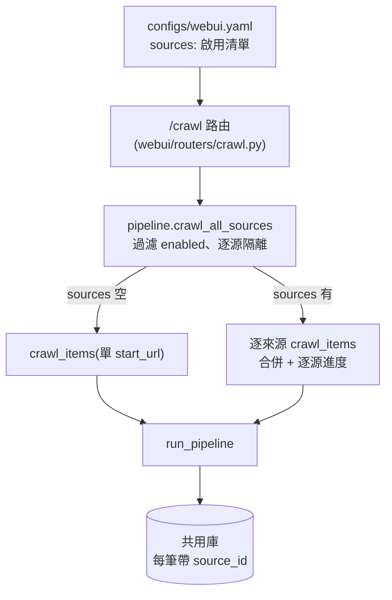
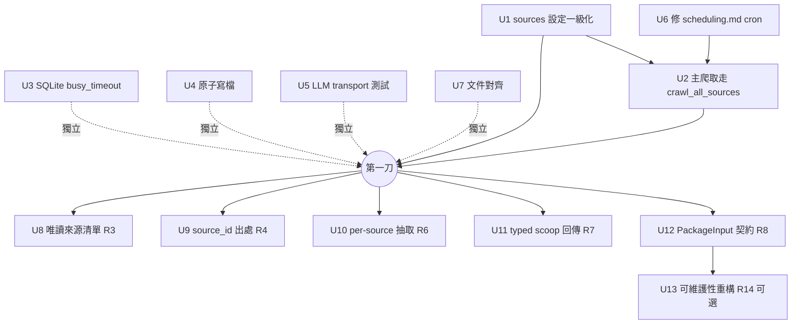

# feat: 多來源匯整（multi-source aggregation maturity）

## Overview

把 local-crawl-post-factory 從「事實上單一來源、手動換設定」變成「**爬 N 個來源 → 匯進同一個庫 → 跨源聚類 → 生成一篇 → 發自有後台**」的一級工作流,並順手把讓「重複無人值守跑」變脆弱的地基缺口補掉。**本輪明確砍掉「多來源信心/佐證評分」**（原 R5）——依 `out/` 實證實際近單一來源（51cg1 30 包 vs 51pornhub 1 包）、來源多同源轉載,跨源獨立佐證對本內容領域無意義（see origin: docs/brainstorms/2026-06-22-multi-source-aggregation-maturity-requirements.md「Key Decisions」）。保留品質評分;`source_id` 降級為純顯示/篩選出處。

分三刀交付,本計畫**詳述第一刀**（最小可用 + 地基穩）,第二刀（B 完整）與第三刀（可維護性）以較輕粒度列出。

## Problem Frame

多來源爬取能力其實已寫在 `core/pipeline.py:crawl_all_sources`,卻**搆不到**:`sources` 設定鍵不在 `webui_config.DEFAULTS`、不在 `configs/webui.yaml`、不在設定表單,而 `webui_config.save()` 只保留 DEFAULTS 內的鍵（`core/webui_config.py:138-139`）→ 手動加的 `sources` 會被靜默丟掉。主畫面「立即爬取」仍只爬單一 `start_url`（`webui/routers/crawl.py:27` → `pipeline.crawl_items`）,只有 `/today` 用到多來源,心智模型分裂。同時:`examples/scheduling.md` 的 cron 範本仍含已移除的 `select-cover`/`watermark-cover`（一跑就 command-not-found）;`core/db.py:connect` 沒設 `busy_timeout`（並行寫入直接崩）;`core/audit.py:purge_before` 與 `core/filesystem.py` 寫檔非原子;`core/llm.py:chat` 對外 HTTP 分支沒測。

## Requirements Trace

本輪交付（第一刀 + 第二刀）:
- R1. `sources` 成為真正的設定欄位（DEFAULTS/yaml/load/save 保留），附帶修 `min_text_chars` 同類漏洞。
- R2. 主爬取路徑改用 `crawl_all_sources` 爬所有**啟用**來源;單一來源 = N=1 特例;逐來源失敗不中斷整批、且結果可見。
- R3. （唯讀）WebUI 顯示來源清單與狀態;CRUD 留 R3b 下一輪。
- R4. 每筆庫項帶非空正確 `source_id`,**用途降級**為顯示/篩選（非佐證）。
- R6. 來源層級爬取抽取（per-source 正文/圖片/時間選擇器覆寫）。
- R7. scoop/prep/generation orchestrator 回傳有型別結果。
- R8. `build_manifest` 匯流點給明確「package input」契約,並解決拔掉 `scoop.local` 後的 `canonical_url` 識別。
- R9. 修 `examples/scheduling.md`（刪 cover 殘留 + 多來源匯整 cron 範本）。
- R10. 文件對齊現實（測試數 273→381 改指向 `make test-full`、重建 `.coverage`/`egg-info`、補 scoop/today 指令文件）。
- R11. 每條 SQLite 連線設 `PRAGMA busy_timeout`。
- R12. 測 `core/llm.py:chat` 對外 HTTP 與型別例外映射。
- R13. `audit.purge_before` 與 `filesystem.write_text_no_overwrite`/`copy_no_overwrite` 改原子（temp + `os.replace`）。
- R14.（第三刀,可選）收斂 `run_auto_pipeline` 三段重複迴圈 + 取代 `SimpleNamespace`。

成功標準（see origin）:加來源=YAML 編輯（零改碼）一次爬取全匯入並在 `/today` 列出全部啟用來源、`source_count` 正確;cron 範本端到端不再 command-not-found;兩個重疊執行不因 SQLite 鎖崩潰;文件對得上現實;**品質驗收採輕量人工（看 5 篇沒變差）**。

## Scope Boundaries

- **不做信心/佐證評分**（原 R5 已砍）:`score-scoops` 的 confidence 維度停用/中性化,只留品質評分;`source_count` 僅資訊顯示。
- **不做多租戶隔離（A 模型）**:一個共用庫、一個後台。
- **不做對外發佈（C 模型）**:不重構套件命名空間（`src`/`core`/`browser`/`webui` 維持）、不上 PyPI、不加 LICENSE。**註:命名空間撞名 + 缺 LICENSE 仍是真 blocker,只在日後對外散佈才處理。**
- **不改發布/後台模型**:單一自有 admin,手動 `--approve` 不動。
- **不做 i18n**。

## Context & Research

> 本計畫的 grounding 來自本 session 的 7-agent 讀碼 workflow + 6-persona 需求審查,均直接讀實際程式碼。外部研究跳過（成熟內部 codebase、本地模式充足）。`docs/solutions/` 不存在。

### Relevant Code and Patterns

- **設定層**:`core/webui_config.py` — `DEFAULTS`(14-40)、`load_raw`(63-88,只複製 DEFAULTS 內鍵)、`save`(133-147,只保留 DEFAULTS 內鍵)、`_coerce`(169-193)、`validate`(150-166)、`_PATH_FIELDS`/`_ENV_OVERRIDES`。已有 `min_confidence`/`min_score`（/today 篩選）作為 list 以外型別欄位的先例。
- **爬取編排**:`core/pipeline.py` — `crawl_items`(31-58,單 `start_url`)、`crawl_all_sources`(61-86,**已存在**,無 sources 即 fallback 單站;但**未過濾 `enabled`**,line 78 `for src in sources`)。
- **主爬取路由**:`webui/routers/crawl.py:start_crawl`(11-40),line 27 呼叫 `pipeline.crawl_items`;line 14-15 前置只擋空 `start_url`。
- **SQLite 生命週期**:`core/db.py:connect`(17-55),單一連線工廠,line 45 設 WAL;涵蓋 state/runs/reviewed/library。
- **審計/寫檔**:`core/audit.py:purge_before`(8-33,`p.write_text` 就地改寫)、`record`(36-52,append);`core/filesystem.py:write_text_no_overwrite`(30-36)、`copy_no_overwrite`(15-27)。
- **LLM**:`core/llm.py:chat`(`urlopen` + HTTPError/URLError → `ExternalError` 映射,目前未測)。
- **聚類/打分**:`core/cluster.py:_summarize`（`source_count = len({source_id})`）、`core/scoring.py`（confidence + quality;本輪中性化 confidence）。
- **匯流/合成 URL**:`src/build_manifest.py`（`_REQUIRED = ('title','canonical_url','caption')`）、`src/generate_article.py`（塞 `caption`=body、`canonical_url='https://scoop.local/<cluster_id>'`、`SCOOP_SOURCE_ID`）。
- **既有型別**:`core/schema.py`(`PipelineResult`/`PipelineItem`/`AutoPipelineResult`/`Manifest`/`ManifestSource`) — R7/R8 是**擴充既有 pattern**,非新抽象。
- **WebUI 設定面**:`webui/routers/settings_auth.py`、`webui/templates/settings.html`、`webui/routers/scoops.py`、`webui/templates/_job_status.html`（R3/逐來源顯示）。

### Institutional Learnings

- 記憶 [[project_scoop_pipeline]] / [[cpost-reuse-direction-2026-06-22]]:實證鏡像因共用 canonical 會塌縮 → confidence 需真獨立媒體;本輪據此砍信心軸。
- 記憶 [[feedback_concurrent_git_automation]]:本 repo 背景會移 refs / 換 PR 內容 — 別假設分支穩定、別碰非自己建的檔。

## Key Technical Decisions

- **`sources` 預設 `[]`**:讓 `crawl_all_sources` 的 fallback（無 sources → 單 `start_url`）自然保留單站行為,單站 = N=1 不是另一條路徑。（解掉需求審查 adversarial「N=1 對應什麼」的疑慮。）
- **`enabled` 過濾在 `crawl_all_sources`**:per-source dict 帶 `enabled`（預設 true）;crawl 時跳過 `enabled: false`。集中一處,CLI/WebUI 共用。
- **`sources` 驗證自成一段**:它是 list[dict],不走 `_coerce` 的 int/float/bool/path;新增 `_validate_sources`(每筆:`source_id` str、`start_url` 過 `valid_url`、regex 覆寫選填、`enabled` bool)。
- **`busy_timeout` 設在 `db.py:connect`（單點）**:WAL 之後加 `PRAGMA busy_timeout=5000`,一次覆蓋所有 SQLite 庫。值 5000ms 對本地單機足夠。
- **信心軸中性化的具體機制（deepen 校正,arch F5 / flow G2）**:在 `configs/scoring.yaml` 把 `weight_confidence: 0.6 → 0.0`、`weight_quality: 0.4 → 1.0`（純設定、零 schema/程式改動）。`combined()`（`core/scoring.py:88`）因此忽略 confidence;`library.py:163` 的 `score DESC, confidence DESC` 與 `score_scoops`/`scoop_pipeline` 的 confidence 次要排序自動變惰性。`confidence`/`source_count` 仍是被填的**資訊欄**。**正解是把權重設 0**（confidence 照算但乘 0）;**錯解**是把權重留 0.6、改去把 confidence 值釘成常數——那會讓 60% 總分變定值、品質被壓進剩下 40%、壓平 `/today` 排序。連帶更新 `core/scoring.py`、`core/cluster.py:74-75`、`core/webui_config.py:34-36`、`webui/routers/scoops.py` 四處 docstring/註解,一致改為「資訊性,非佐證」。
- **`min_confidence`/`source_count` 的真實上限（deepen 校正,flow G1）**:`library` 以 `canonical_url` 為主鍵 + `source_id=COALESCE(...)`——兩來源回傳**同一 canonical_url** 時庫只留一筆一個 source_id,`source_count=len({source_id})` 必然塌成 1。**現有資料模型無法表示「同 URL、2 來源」**(要表示得加 join table = 本輪 scope 外)。決策:**接受鏡像/同 URL 計為 1**;`min_confidence` 預設 0;不承諾「≥N 原始來源」語意。這正是砍信心軸的根本理由再次被證實。
- **R8 的 `canonical_url` 識別（deepen 定案,data-integrity F1/F3）**:`valid_url`（`core/validators.py:7,14`）**只收 `http(s)` 且要有 hostname**——`cpost-scoop:<id>` 會被擋、改 `valid_url` 又會放寬所有 stage。**定案**:canonical 維持 http(s)+hostname,只換成自描述合成域 `https://scoop.cpost.local/<cluster_id>`。`cluster_id` 內容衍生（`c_<hex>`）→ 同成員集合→同 canonical→跨輪去重正確(這是 cross-run dedup 的保證機制)。**額外約束(F2)**:`post_id=slug(canonical)`（slug 跑整個 URL 再截 60 字）。`cluster_id` 可用預算 = 60 − host 前綴 slug 長（`scoop.cpost.local` ≈ 23）≈ 37 字;現行 `c_<12hex>`=14 字安全。須確保 `cluster_id` 不溢出此預算（或乾脆 slug 原始 `cluster_id`）,否則兩 cluster 撞同資料夾被 `write_text_no_overwrite` 靜默吞→跨 cluster 污染。

## Open Questions

### Resolved During Planning

- 信心軸去留 → **砍**（origin Key Decisions 拍板）。
- 來源獨立性前提 / 信心顯示時序 → 隨砍信心軸消失（origin）。
- 產出品質度量 → 輕量人工驗收（origin）。
- R3 範圍 → 本輪唯讀顯示,CRUD 為 R3b（origin）。
- 單站行為是否保留 → 保留,`sources=[]` fallback（本計畫 Key Decisions）。
- `busy_timeout` 位置/值 → `db.py:connect`,5000ms（本計畫）。
- 信心軸中性化機制 → `weight_confidence=0`（deepen arch F5/flow G2）,非釘常數。
- canonical scheme → `https://scoop.cpost.local/<cluster_id>`（http+hostname;自訂 scheme 被 `valid_url` 擋,deepen 定案）。
- 同 URL 多來源能否表示 → 不能(canonical 主鍵 + COALESCE),接受計為 1、`min_confidence` 預設 0（deepen flow G1）。

### Deferred to Implementation

- `sources` 在 `configs/webui.yaml` 的確切 YAML 形狀與註解（per-source dict 欄位順序）。
- 逐來源結果在 `_job_status.html` 的呈現:`on_source` 的逐源摘要走 `jobs.report` append 到 `job.progress`（沿用既有 progress 迴圈、**無需改模板**;與 F1 保留給即時 dict-快照的 `jobs.set_current` 分流）;richer 表格屬 R3 第二刀。
- R6 per-source 選擇器如何穿進 `crawl_posts.py` 子行程內的 Scrapy spider closure（opts key 命名 + closure 讀取;CLI `_run` 是否同步支援）。
- R7 的 `PrepPipelineResult`/`GenerationPipelineResult` TypedDict 確切欄位。
- R8 canonical **scheme 已定案**為 `https://scoop.cpost.local/<cluster_id>`（見 Resolved）;此處僅待**實作期驗證**——U12 的跨輪重生 dedup round-trip 測試通過。
- [Affects U12/R8] **G5 出處決策**:匯整文章要不要保留各來源出處（`generate_article` 目前 `source_id` 硬編 `"scoop"`）——U12 落地時明文決定（屬第二刀,不阻斷第一刀）。
- R10 `.coverage`/`egg-info` 重建只需 `make clean` + 重跑;確切殘留以實跑為準。

## High-Level Technical Design

> *以下說明意圖方向,供審查驗證,非實作規格。實作者請當 context,不要照抄。*

第一刀的資料流（單站是 `sources=[]` 的特例）:



`sources` 一筆的形狀（概念,非規格）:
```yaml
sources:
  - source_id: 51cg
    start_url: https://51cg1.com/
    enabled: true
    item_regex: "archives/\\d+"   # 選填,覆寫 base
```

## Implementation Units



### 第一刀（最小可用 + 地基穩）

- [x] **U1：`sources` 設定一級化（+ `min_text_chars` 同類修補）**

**Goal:** 讓 `sources`（per-source dict 清單）與 `min_text_chars` 成為 `webui_config` 認得、`load`/`save` 保留的欄位。

**Requirements:** R1

**Dependencies:** 無

**Files:**
- Modify: `core/webui_config.py`（`DEFAULTS` 加 `"sources": []` 與 `"min_text_chars": 0`（**須維持 0=不裁切**;非 0 會悄悄開始丟短文 — arch F6）;`_INT_FIELDS` 加 `min_text_chars`;新增 `_validate_sources` 並在 `validate`/`_coerce` 流程呼叫）
- Modify: `src/crawl_posts.py`（`CONFIG_DEFAULTS` 加 `body_selector`/`image_selector`/`date_selector`（預設空=用既有硬編 fallback）讓 CLI 路徑不 `KeyError`;U10 才消費,鍵要先在）
- Modify: `configs/webui.yaml`（加 `sources:` 範例註解 + `min_text_chars`）
- Test: `tests/test_webui_config.py`

**Approach:**
- `sources` 不進 `_coerce` 的標量處理;新增 `_validate_sources(cfg)`:`sources` 必須是 list;每筆是 dict,`source_id` 為非空 str、`start_url` 過 `valid_url`、`item_regex`/`allow_regex`/`deny_regex`/`body_selector`/`image_selector`/`date_selector` 選填 str、`enabled` 預設 true 且為 bool。**白名單一次列全 R6 選擇器鍵**(雖 U10 才消費),否則 U10 得回頭再開 webui_config 驗證,形成 U1↔U10 隱藏回邊（arch F4）。
- `save()` 既有「只保留 DEFAULTS 內鍵」邏輯（line 138-139）→ 把 `sources` 放進 DEFAULTS 即自動保留;確認 `yaml.safe_dump` 能序列化 list[dict]（可）。
- `min_text_chars` 加進 DEFAULTS + `_INT_FIELDS`,解掉 `pipeline.crawl_items`（pipeline.py:54）讀取卻被 save() 丟掉的漏洞。

**Patterns to follow:** 既有 `min_confidence`/`min_score` 作為非標量以外欄位 + 在 `validate` 內檢查的寫法。

**Test scenarios:**
- Happy path：`load_raw` 於含 `sources:[{...}]` 的 yaml 後,回傳的 cfg 保留該 list 原樣。
- Happy path：`save` 後重新 `load`,`sources` round-trip 不丟失（先前會被丟）。
- Happy path：`min_text_chars` 設於 yaml → `load`/`save` 保留且被 `crawl_items` 讀到。
- Edge case：yaml 未設 `min_text_chars` → 生效值為 0、不新丟任何短文（行為保留,arch F6）。
- Edge case：`sources: []`（空）→ 合法,且不影響單站。
- Error path：`sources` 非 list、某筆缺 `source_id`、`start_url` 非合法 URL、`enabled` 非 bool → 各自 `ValidationError`。
- Edge case：`sources` 某筆只有 `source_id`+`start_url`（無 regex 覆寫）→ 合法。

**Verification:** 在 yaml 手加兩個 source、`save` 後再 `load`,兩筆都還在且型別正確;`make test-fast` 綠。

---

- [x] **U2：主爬取路徑改爬所有啟用來源**

**Goal:** 「立即爬取」與 `run_pipeline` 入口改走 `crawl_all_sources`,爬所有 `enabled` 來源;單站 = `sources=[]` 特例;逐來源失敗不中斷、結果可見。

**Requirements:** R2

**Dependencies:** U1（`sources` 需先可被讀到）

**Files:**
- Modify: `core/pipeline.py`（`crawl_all_sources`：line 78 迴圈過濾 `src.get("enabled", True)`;**新增獨立 `on_source(source_id, count|error)` 回呼**回報逐源結果——**不要**把字串塞進 dict-快照 `progress_cb`;路由端 `on_source` 走 `jobs.report` append 到 `job.progress`）
- Modify: `webui/routers/crawl.py`（line 27 `pipeline.crawl_items` → `pipeline.crawl_all_sources`,傳入 `on_source`;line 14-15 前置條件改為「無 `start_url` 且無任何啟用來源才擋」+ 零來源/全停用文案）
- Modify: `core/scoop_pipeline.py`（`run_prep_pipeline` line 48 **也呼** `crawl_all_sources`——**同樣 thread `on_source`**,否則 `/today` 路徑逐源失敗靜默、G3 在 prep 半套）、`webui/routers/scoops.py`（prep job 傳 `on_source`）
- Modify: `tests/test_library_ingest.py`（**既有** `test_crawl_all_sources_one_failure_does_not_abort` 斷言失敗訊息在 `progress_cb`——須改斷在新 `on_source`,否則 U2 落地此測試變紅 — feas P1）
- Test: `tests/test_pipeline.py`、`tests/test_webui_actions.py`（或 `tests/test_webui_crawl.py`,缺則建立）

**Approach:**
- `crawl_all_sources` 既有 fallback（無 sources → 單站,pipeline.py:73-75）保留;新增 `enabled` 過濾。
- **progress_cb 載荷衝突修正（arch F1,真 bug）**:`webui/routers/crawl.py:21-26` 的 `_crawl_cb(snap)` 預期 **dict 快照**（`snap['responses']`）,但 `crawl_all_sources:85` 既有 `progress_cb(f"source ... failed")` 是**字串**。今天因路由直呼 `crawl_items` 才沒爆;U2 一改呼 `crawl_all_sources`,字串進 dict-callback 會 `TypeError`。修法:逐源結果走**獨立 `on_source` 回呼**,dict-快照 `progress_cb` 只留即時爬取遙測。讓操作者看得到「哪個來源零產出/失敗」。richer 表格留 R3。
- 前置條件**在路由層**判斷（arch F2）:`crawl_all_sources` 會把「無 sources」與「全停用」都收斂成 crawl-or-empty、不告訴呼叫端是哪種,故路由須**直接讀 `sources`+`start_url`** 分三態:① 無 start_url 且無啟用來源 → 擋,「請先在設定新增至少一個來源」;② 有來源但全停用 → 擋,「所有來源都已停用」;③ 至少一個啟用來源或 start_url → 放行。

**Execution note:** 先寫一個「兩個 source、第一個故意失敗」的整合測試,鎖住「不中斷整批 + 逐源回報」的契約,再改路由。

**Patterns to follow:** `run_pipeline` 的 per-item try/except 隔離契約（`# noqa: BLE001`）。

**Test scenarios:**
- Happy path：`sources` 兩個啟用來源 → `crawl_all_sources` 回傳兩源合併 items;`on_source` 收到兩筆逐源計數。
- Happy path：`sources=[]` 且有 `start_url` → 等同舊單站行為（N=1,回傳單站 items）。
- Edge case：某來源 `enabled: false` → 被跳過,不出現在結果。
- Error path：一個來源 crawl 拋例外 → 其餘來源照常完成,失敗以 `on_source` 回報,整批不中斷。
- Error path（callback 不爆,arch F1 回歸）：逐源失敗訊息**不會**讓路由的 dict-快照 `_crawl_cb` `TypeError`。
- Error path（路由）：無 start_url 且無啟用來源 → 400 + 對應文案;有來源全停用 → 400 + 「全停用」文案。
- Edge case（flow G3,零 vs 錯可辨）：全部啟用來源各回 0 篇 → 每源一條「0 篇」;全部各拋錯 → 每源一條「失敗」;兩者操作者**可區分**,不是都顯示「爬取完成：0 篇」。
- Edge case（flow G4,重跑出處不誤導）：爬 A+B（共用 URL 標 B）→ 停用 B → 只重爬 A → cluster 顯示的 `sources` 不應仍宣稱 B 是當前出處（或文件註明出處是歷史值,COALESCE 不清空）。
- Integration：/crawl 觸發 → job 完成 → 庫內出現兩源項目（跨層,mock crawl）。
- Integration（flow G3）：`run_prep_pipeline`（`/today` 路徑,與 `/crawl` 不同入口）對空爬取結果乾淨收尾（normalize 0/ingest 0/top []）。

**Verification:** 設兩個來源跑「立即爬取」,job 面板逐源顯示、庫含兩源;停用其一再跑只剩一源;清空 sources 仍可單站跑。

---

- [x] **U3：SQLite `busy_timeout`（並行不崩）**

**Goal:** 每條 SQLite 連線在鎖競爭時等待而非立即 `database is locked`。

**Requirements:** R11

**Dependencies:** 無

**Files:**
- Modify: `core/db.py`（`connect`,WAL 那行 line 45 之後加 `conn.execute("PRAGMA busy_timeout=5000")`）
- Test: `tests/test_db.py`（缺則建立）

**Approach:** 單點插入,覆蓋 state/runs/reviewed/library 全部走 `db.connect` 的庫（**已查證**:`library.py` 用 `from core.db import connect`,`core` 內無其他直連 `sqlite3.connect`,故單點全覆蓋,含多來源入庫熱路徑）。**注意（data-integrity F6）**:`busy_timeout` 只界定**取鎖等待**,不縮短交易長度;WAL 下兩寫者仍序列化,若某呼叫端把 `db.connect` 的 context 撐過長 I/O,競爭寫者仍可能逾時。落地時順手檢查 `db.connect` 的 `with` body 沒包長 I/O。

**Patterns to follow:** 既有 `PRAGMA journal_mode=WAL` 設定處。

**Test scenarios:**
- Happy path：`connect` 後 `PRAGMA busy_timeout` 查得為 5000。
- Integration：兩條連線對同一檔重疊寫入,第二條等待後成功而非即時 `OperationalError`（可用短交易 + 競爭模擬;若難穩定則退為「pragma 已設」的單元斷言）。
- Edge case（界限,F6）：寫者持交易 > busy_timeout → 競爭者仍 `OperationalError`,記錄此為已知上限（非萬靈丹）。

**Verification:** `PRAGMA busy_timeout` 回 5000;並行重疊 job 不再因鎖崩潰。

---

- [x] **U4：原子寫檔（審計 + 不覆寫寫檔）**

**Goal:** `audit.purge_before` 與 `filesystem` 的不覆寫寫檔改 temp + `os.replace`,避免崩潰/並行截斷耐久記錄或毒化冪等。

**Requirements:** R13

**Dependencies:** 無

**Files:**
- Modify: `core/audit.py`（`purge_before`:寫**目標旁** temp → `flush` → `os.fsync` → `os.replace`）
- Modify: `core/filesystem.py`（`write_text_no_overwrite`/`copy_no_overwrite`:**不可用 `os.replace`**——它 last-writer-wins 會破壞「不覆寫」保證;改用**獨佔建立** `O_EXCL`）
- Test: `tests/test_audit.py`、`tests/test_filesystem.py`

**Approach:** **兩種寫檔是兩種食譜,別混用（data-integrity F7/F8）**:① `purge_before`（就地改寫,可覆蓋）→ temp（放**目標旁**,非來源旁,避免跨裝置 `os.replace` 失敗 — arch F7）+ `fsync` + `os.replace`;`fsync` 才有耐久性（崩潰後不留零長/舊檔;沿用 `crawl_posts.py:276` 既有 flush 模式）。② 不覆寫保證 → **獨佔建立**,**不是** `os.replace`(否則並行下靜默覆蓋他人剛建的目標):`write_text_no_overwrite` 用 `open(path, "x")`;`copy_no_overwrite` **不能**用 `open("x")`+`shutil.copy2`(copy2 自己開 dst),須 `os.open(dst, O_CREAT|O_EXCL|O_WRONLY)` 搶占後串入 src bytes、再 `shutil.copystat` 補 metadata。兩者都 catch `FileExistsError` → 回既有 Path(保留 return-existing 契約)。

**Test scenarios:**
- Happy path：`purge_before` 正常移除過期行、保留其餘,結果與原行為一致。
- Happy path：`write_text_no_overwrite` 對新路徑寫入成功;對已存在路徑不覆寫（回傳原檔）。
- Edge case：`copy_no_overwrite` 目標已存在 → 不覆寫;來源不存在 → `ValidationError`。
- Error path（原子性）：`purge_before` 寫入中途失敗（monkeypatch `os.replace` 拋例外）→ 目標審計檔維持原內容,不出現半寫。
- Error path（不覆寫並行,data-integrity F8）：兩個並行 `write_text_no_overwrite` 寫同一新路徑 → **剛好一個贏**,另一個回既有檔,**都不互相覆蓋**（O_EXCL 而非 replace 才過得了）。

**Verification:** 既有 audit/filesystem 測試全綠 + 新增原子性測試綠;`out/` 不再出現半寫 manifest 毒化「不覆寫」。

---

- [x] **U5：LLM 對外 HTTP 傳輸測試**

**Goal:** 覆蓋 `core/llm.py:chat` 的 `urlopen`、HTTP/URL error→型別例外映射、空/壞回應分支。

**Requirements:** R12

**Dependencies:** 無

**Files:**
- Test: `tests/test_llm.py`（缺則建立;注入假 transport / monkeypatch `urllib.request.urlopen`）

**Approach:** 注入假 transport 回傳可控 payload;不打真網路（沿用既有測試隔離準則）。

**Execution note:** 純測試單元,test-first 不適用;直接補覆蓋。

**Test scenarios:**
- Happy path：正常 200 回應 → 解析 `choices[0].message.content` 正確回傳。
- Error path：`HTTPError`（含 error detail）→ 映射為 `ExternalError`、訊息含診斷。
- Error path：`URLError`（reason）→ 映射為 `ExternalError`。
- Edge case：空 / 缺 `choices` / 壞 JSON 回應 → 對應例外或明確錯誤,不靜默回空字串。

**Verification:** `core/llm.py` 覆蓋率自 66% 顯著上升,81–112 行被執行;`make test-fast` 綠。

---

- [x] **U6：修 `examples/scheduling.md`（刪 cover 殘留 + 多來源匯整 cron 範本）**

**Goal:** cron 範本端到端可跑,並反映新的多來源**匯整**流（非舊單站轉貼）。

**Requirements:** R9

**Dependencies:** U2（觀念上多來源已是主路徑）

**Files:**
- Modify: `examples/scheduling.md`（刪 line 29-30 `select-cover`/`watermark-cover`;§1 範本改為逐來源匯整流）
- 可能 Modify/Create: `scripts/` 內對應範例腳本（若文件引用）

**Approach:** 新範本概念：對每個來源 `crawl-posts <url> --source-id <該源 id> ... | normalize-items | library-ingest --state ...`（**每次迭代帶該源自己的 `--source-id`**——`crawl-posts` 的 `--source-id` 是套到全部 items 的單一標量,arch F3;`library-ingest` 須保留之）,全部匯入後 `cluster-scoops` → `score-scoops` →（人工挑 /today 或 `generate-article`）→ `build-manifest` → 人工 `draft/verify/publish`。**否決的替代方案**:做一個讀 `sources` 的 CLI——會把 `crawl_all_sources` 的 enabled 過濾/隔離邏輯複製進 shell 或新進入點,破壞「single source of pipeline logic」不變式,故本輪採 shell 逐源迴圈。

**Test scenarios:** `Test expectation: none — 文件變更`。以人工/CI lint 確認範本不含已移除指令。

**Verification:** `grep -r select-cover examples/` 無命中;照範本逐行可跑通（至少 crawl→library-ingest→cluster→score 不 command-not-found）。

---

- [x] **U7：文件對齊現實**

**Goal:** 消除文件與程式的漂移,補上未文件化指令。

**Requirements:** R10

**Dependencies:** 無

**Files:**
- Modify: `README.md`（測試數 273→381,改為指向 `make test-full` 取即時數;補 `library-ingest`/`cluster-scoops`/`score-scoops`/`generate-article`/`/today` 說明）
- Modify: `docs/analysis/2026-06-18-system-analysis.md`（過時測試數/表格）
- 重建：`.coverage`、`local_crawl_post_factory.egg-info`（`make clean` + 重跑 `make test-full`）

**Approach:** 文件型單元;測試數改成不寫死,降低再漂移。

**Test scenarios:** `Test expectation: none — 文件/產物重建`。

**Verification:** `grep -rn '273' README.md docs/` 無殘留誤導;egg-info 版本與 pyproject 一致;新指令在 README 可查。

### 第二刀（B 完整,信心軸已砍）—— 較輕粒度

- [x] **U8：WebUI 唯讀來源清單（R3）** — `webui/routers/settings_auth.py` + `webui/templates/settings.html` + 新 partial。顯示 `source_id`/`start_url`/`enabled`/上次爬取結果;**須定案版面關係**（取代/並列/新頁,見 origin Deferred）。含空/全停用/失敗狀態。Test：`tests/test_webui_settings*.py`。場景:有來源列出、零來源空狀態、全停用提示、某源上次失敗標記。

- [x] **U9：`source_id` 出處完整性（R4,降級為顯示/篩選）** — 確保所有入庫路徑（`src/library_ingest.py`、`src/normalize_items.py`）寫入非空正確 `source_id`。**flow G1 校正**:`library` 以 canonical_url 為鍵 + COALESCE,**同 URL 多來源只留一個 source_id（計為 1）**,現有資料模型無法表示「同 URL 2 來源」,不加 join table（scope 外）。故:`min_confidence` 預設 0、語意改稱「跨**不同 canonical** 成員的來源數（best-effort,非佐證）」,並**同步更新 `core/webui_config.py:34-36`、`webui/routers/scoops.py`、`core/scoring.py`、`core/cluster.py:74-75` 四處 docstring/註解一致**。Test：`tests/test_library*.py`。場景:多來源入庫各帶正確 source_id、空 source_id 被拒/補、同 canonical 二度入庫依 COALESCE（記為 1,且重跑不誤導出處）。

- [x] **U10：來源層級爬取抽取（R6）** — `src/crawl_posts.py`（`_extract` 讀 opts 的 `body_selector`/`image_selector`/`date_selector`,現有硬編選擇器當 fallback）+ `core/pipeline.py:crawl_items`（opts 透傳）+ `crawl_all_sources` per-source 合併。**須研究**選擇器字串如何穿進子行程 spider closure（origin Deferred）。觀測:選擇器命中空正文時可見（接 U2 逐源回報）。Test：`tests/test_crawl_posts.py`。場景:自訂 body selector 抽到非 `<p>` 正文、選擇器命中空 → 可見而非靜默零內容。

- [x] **U11：typed scoop orchestrator 回傳（R7）** — `core/schema.py` 定義 `PrepPipelineResult`/`GenerationPipelineResult` TypedDict;`core/scoop_pipeline.py:run_prep_pipeline`/`run_generation_pipeline` 回傳型別化。Test：`tests/test_prep_pipeline.py`/`tests/test_score_scoops.py`（既有;`test_scoop_pipeline*.py` 不存在）。場景:回傳鍵齊全、mypy 通過。

- [x] **U12：PackageInput 契約 + canonical 識別（R8）** — `core/schema.py` 定義 `PackageInput`（最小 `title`/`canonical_url`/`caption`/`source_id`/`text`）;`src/build_manifest.py` 與 `src/generate_article.py` 共用。**canonical 定案(deepen)**:`https://scoop.cpost.local/<cluster_id>`（http+hostname 過 `valid_url`;自訂 scheme 會被擋）。**slug 撞庫約束(F2)**:`post_id=slug(canonical)` 截斷 60 字,須確保 `cluster_id` 落前 60 字內（或 slug 原始 cluster_id），否則兩 cluster 撞同資料夾被 `write_text_no_overwrite` 靜默吞。**G5 出處決策**:`generate_article` 目前 `source_id` 硬編 `"scoop"`——須明文決定匯整文章保留哪些來源（若僅正文提及則明說 R4 的 source_id 不流入 manifest;若要 manifest 欄位則加進 `PackageInput`）。Test：`tests/test_build_manifest.py`、`tests/test_generate_article.py`。場景:canonical 唯一且跨輪穩定、**重生不誤判「已發布」（manifest.source.canonical_url → publish 寫入 → 下輪 `is_processed` round-trip）**、兩不同 cluster_id → 不同 post_id 資料夾（slug 不塌）、legacy 軌 required 欄位仍滿足。

### 第三刀（可選）

- [x] **U13：可維護性重構（R14）** — `core/pipeline.py:run_auto_pipeline` 三段 draft/verify/publish 迴圈收斂為單一參數化 stage runner;以單一型別化後台呼叫契約取代 4 處重建的 `SimpleNamespace`。Test：`tests/test_pipeline.py` 既有 auto_pipeline 測試需全綠（行為不變）。場景:三階段行為與重構前一致（characterization）。**Execution note:** 先補 characterization 測試鎖住現有 draft/verify/publish 行為,再重構。

## System-Wide Impact

- **Interaction graph:** R2 改 `/crawl` 路由行為（單站→多源）會影響 `webui/_auto_pipeline._run_auto_pipeline`（吃 `result["built"]`）與 `/today`（`webui/routers/scoops.py`）所見的庫內容;`crawl_all_sources` 被 scoop 軌（`core/scoop_pipeline.py:48`）共用——新增的 `enabled` 過濾**也會影響 `/today` prep**,此為刻意決定（arch F2）,非副作用。
- **Error propagation:** 逐來源失敗以**獨立 `on_source` 回呼**報告（不混入 dict-快照 `progress_cb`,arch F1）、不升級為整批失敗（沿用 per-item 隔離）;CLI 退出碼語意不變。
- **State lifecycle risks:** R8 改 canonical 識別直接觸及 `state`/`dedupe` 的去重主鍵——最高風險點,須保證唯一+跨輪穩定,否則跨輪重生誤判已發布或互撞（見 U12 場景）。R11/R13 降低並行寫入與半寫檔風險。
- **API surface parity:** `sources` 目前只在 in-process（WebUI/run_pipeline）路徑生效;CLI `crawl-posts:_run` 無 sources 概念——R9 cron 範本因此走「逐來源迴圈 + library-ingest」而非單一 CLI 旗標。此不對等需在文件講清楚（已於 U6 處理）。
- **Integration coverage:** 多來源 → 庫 → /today 的跨層行為（mock crawl 的整合測試,U2）;canonical 去重跨輪行為（U12）。
- **Unchanged invariants:** 發布三重閘門 + `--approve`、單一後台、`storage_state` 防外洩守衛、退出碼 1–5、`core/*` 的 mypy 嚴格度——全不動。

## Risks & Dependencies

| Risk | Mitigation |
|------|------------|
| R8 改 canonical 識別破壞既有發布去重（state 主鍵） | U12 定案 `https://scoop.cpost.local/<id>`（http+hostname 過 valid_url）、canonical=cluster_id 純函數保證跨輪穩定、補 slug 不撞庫 + round-trip dedup 測試;實證現庫 0 published / 0 scoop.local（見 Docs） |
| U2 改路由後逐源失敗字串打爆 dict-快照 `_crawl_cb`（真 bug,arch F1） | 逐源結果走獨立 `on_source` 回呼,不混入即時遙測 `progress_cb`;補回歸測試 |
| 不覆寫寫檔誤用 `os.replace` 致並行覆蓋（data-integrity F8） | U4 拆兩食譜:不覆寫用 `O_EXCL` 獨佔建立,只有就地改寫用 temp+fsync+replace |
| 信心中性化若釘常數會壓平 `/today` 排序（flow G2） | 用 `weight_confidence=0` 而非釘常數;補「排序由品質單獨決定」斷言 |
| R2 把單站按鈕改多源,可能驚到只用單站的既有習慣 | `sources=[]` fallback 完整保留單站;前置三態文案明確;文件說明 N=1 |
| `busy_timeout` 並行測試易 flaky | 競爭測試難穩定時退為「pragma 已設」單元斷言（U3 已註明） |
| 信心軸「中性化」殘留半套邏輯造成混淆 | Scope Boundaries 明列;`source_count` 僅資訊欄,`/today` 篩選語意改註解;避免改 schema |
| 背景自動化會移 refs/換 PR（[[feedback_concurrent_git_automation]]） | 不假設分支穩定、不碰非自己建的檔;落地走正常 PR 流程 |

## Documentation / Operational Notes

- R9（cron 範本）、R10（README/分析/指令文件）本身就是文件交付。
- `egg-info`/`.coverage` 重建納入 release/clean 流程（`make clean`）。
- 無 schema migration;R11/R13 對既有 SQLite/檔案格式無破壞性變更。**已實證(deepen)**:現有 `state/*.sqlite` 有 0 筆 `published`、0 筆 `scoop.local` canonical → 改 canonical host 字串不孤立任何已發布列。**但** U12 須在第一篇 scoop **發布前**落地、其後凍結 canonical scheme（否則舊 `scoop.local` 已發布列會與新 key 重複發布）;日後若必須改 scheme 需 state backfill。

## Sources & References

- **Origin document:** [docs/brainstorms/2026-06-22-multi-source-aggregation-maturity-requirements.md](docs/brainstorms/2026-06-22-multi-source-aggregation-maturity-requirements.md)
- 關鍵程式:`core/webui_config.py`、`core/pipeline.py:crawl_all_sources`、`webui/routers/crawl.py`、`core/db.py:connect`、`core/audit.py`、`core/filesystem.py`、`core/cluster.py:_summarize`、`src/build_manifest.py`、`src/generate_article.py`、`core/schema.py`
- 相關 PR:#30（庫+聚瓜+打分）、#32（今日備稿+generate-article）、#33（修空 source_id）
- 記憶:[[cpost-reuse-direction-2026-06-22]]、[[project_scoop_pipeline]]、[[feedback_concurrent_git_automation]]
