# fix: Codebase bug sweep — 30 verified defects, sequenced by severity

## Overview

A multi-agent adversarial bug hunt over the whole codebase (~5,700 LOC) surfaced **30 confirmed defects** (36 raw findings → 35 deduped → 30 confirmed / 0 disputed / 5 rejected; every confirmed finding was traced to a concrete trigger by ≥1 independent verifier). The count narrows in two steps: **30 confirmed findings → 24 distinct defects** (multiple finders reported the same defect — `manifest.save` non-atomicity was found 3×, build-manifest staleness 3×, publish-retry 2×) **→ 20 implementation units** (two units bundle several same-file defects: U14 covers 2, U15 covers 4). The 20 units are sequenced into three severity phases so the project can stop after any phase and still have shipped the highest-value fixes first.

This is a **fix plan**, not a feature plan. It changes behavior only to restore documented/expected invariants; it adds no new product surface.

> **⚠️ Layout note (verify before editing).** The bug hunt ran against the pre-#36 layout where packages lived at the repo top level. During the planning session, **PR #36 (namespace refactor) merged into `main`**, relocating every package under `cpost/` — the CLI entry points now live in `cpost/cli/`, the core library in `cpost/core/`, the browser driver in `cpost/browser/`, and the web layer in `cpost/webui/`; `tests/` stayed at the repo root with imports rewritten to `from cpost.core …` / `from cpost.cli …`. **Every defect's logic is unchanged** by the move (pure relocation + import rewrites; verifiers confirmed the copies were byte-identical). All paths in this plan use the **current `cpost/` layout**. Pre-flight: confirm `git ls-files cpost/core/manifest.py` resolves before starting.

Three root causes account for ~half the findings:

| Root cause | Symptom | Units |
|---|---|---|
| `post_id = date + slug(url)` is content-blind, and package files use `write_text_no_overwrite` (silent no-op on existing file) | Distinct or edited articles silently collapse onto stale files; success is reported | U1 |
| Critical state files saved via `Path.write_text` (truncate-then-write, non-atomic) | A crash / ENOSPC mid-write corrupts the manifest / auth state | U13, U14 |
| The publish tail (browser publish → manifest save → receipt → state → run/audit) is non-transactional, and `_run_stage` blindly `_retry`s the whole publish runner | Already-published posts reported as failed; cross-run duplicate publishes; double run records | U3, U4, U9 |

The repo already contains the correct atomic-write pattern (`cpost/core/audit.py:_atomic_write_text`, tempfile + `fsync` + `os.replace`) and the correct dict-callback pattern (`cpost/webui/routers/crawl.py:_crawl_cb`); several fixes are "apply the pattern that already exists here" rather than novel design.

## Problem Frame

The cpost pipeline is a local-first crawl → normalize → cluster → score → generate → build → draft → verify → publish chain plus a FastAPI WebUI. It is operated by a single human against owned/private sites, with state in NDJSON files, per-package `manifest.json` folders, and a SQLite state/runs DB. Because runs are unattended (`run_auto_pipeline`) and the most expensive action (browser publish) is irreversible, **silent data loss and idempotency gaps are the highest-stakes failure class** — they ship wrong content or duplicate live posts with a green status. The bug hunt confirms several such defects on live code paths, plus a tail of lower-severity correctness/robustness issues.

## Requirements Trace

Each requirement is an invariant a fix must restore without regressing existing green tests.

- **R1 — No silent content loss.** Every distinct article keeps its own package; operator caption/body edits reach the published body. (U1, U2)
- **R2 — Publish is idempotent and truthfully reported.** No already-published post is reported as failed; no crash in the publish tail causes a duplicate live post; no double run-history rows. (U3, U4, U9)
- **R3 — Stages fail safe per-record.** One malformed input record does not abort an entire batch, and the emitted stream never diverges from committed DB state. (U7, U8)
- **R4 — Computed outputs are correct.** Scoring/clustering timestamps order chronologically; the generation cache reflects current source material; canonical URLs are well-formed. (U5, U6, U16)
- **R5 — External I/O is bounded and classified.** Network/LLM timeouts surface as the intended `ExternalError`; the crawl child cannot hang the caller forever; the browser process is not leaked on init failure. (U10, U11, U15)
- **R6 — Durable state survives interruption.** Manifest, auth storage_state, and WebUI dual-writes are atomic (old-or-new, never truncated). (U13, U14)
- **R7 — State transitions are consistent.** Rollback clears `published_url`; multi-statement DB migrations apply fully or not at all. (U12, U20)
- **R8 — Operator-facing robustness.** Live telemetry/UX works on the generation track; failure screenshots load; odd titles don't cause false verify failures or opaque crashes. (U18, U17, U15)

## Scope Boundaries

- **In scope:** the 30 confirmed defects, fixed on the current `cpost/` layout, each with regression tests.
- **Out of scope (non-goals):**
  - The 5 rejected findings (verified false positives) — not addressed.
  - **Full backend-side publish idempotency** (asking the remote admin whether a post already exists before clicking publish) — recorded as a deferred open question under U4; this plan ships a best-effort mitigation only.
  - The `cpost/` namespace refactor itself — **already merged (PR #36)**; this plan targets that layout, it does not perform or revert the move.
  - Performance, styling, type-coverage, and ruff/import-sort tuning — separate passes.
  - New features, schema redesign, or changing the post_id scheme beyond collision-resistance.

## Context & Research

### Method

Findings come from an 8-finder fan-out (6 module clusters: orchestration, persistence, scoring, crawl-browser, cli-llm, webui; 2 cross-cutting: data-integrity, reliability). Each finding was independently re-verified by 1–2 skeptic agents (lens A: construct a trigger or prove it can't fire; lens B: is it a real defect vs intended/handled). Only findings both verifiers agreed were real are included (0 disputed → no split votes survived). Verifiers cited exact file:symbol:line and several reproduced the bug at runtime. The plan was then deepened with an architecture review of the publish-tail and atomic-write units and a coherence/scope review (see Sources).

### Relevant code and patterns to follow

- **Atomic write reference:** `cpost/core/audit.py:_atomic_write_text` — tempfile (created in the destination's own directory) + `flush` + `os.fsync` + `os.replace`. Reuse this for U13/U14. `cpost/cli/crawl_posts.py` also uses `.tmp` + `os.replace` for progress.
- **No-overwrite semantics:** `cpost/core/filesystem.py:write_text_no_overwrite` opens with `"x"`; on `FileExistsError` it returns the existing path **untouched** (silent no-op) — the mechanism behind U1.
- **Dedup keys on the state DB only:** `cpost/core/state.py` `is_processed`/`skip_reason` match `WHERE status='published'` only; `cpost/cli/dedupe_posts.py` is read-only — context for U4. `state.upsert` uses `ON CONFLICT(canonical_url) DO UPDATE`, preserving `first_seen_at` (genuinely idempotent).
- **Run records are append-only:** `cpost/core/runs.py:record_run` is a **bare `INSERT`** with no dedup — re-running it writes another row. Critical for U3/U9 (see Key Decisions).
- **Reviewed-gate content_id:** `cpost/core/reviewed.py:content_id` hashes `content.title + content.body + canonical_url` (excludes `caption.txt`) — context for U2.
- **Dict vs string progress callback:** `cpost/webui/routers/crawl.py:_crawl_cb` is the correct dict-shaped callback that calls `jobs.set_current`; the prep path wrongly forwards a string callback (U18). `cpost/core/pipeline.py` docstring documents the contract.
- **WebUI already guards the double run-record:** `cpost/webui/routers/_ctx.py:submit_job` skips the success record for `stage == "publish"` (comment cites the double-write); `run_auto_pipeline` omits the same exemption (U9).
- **Sibling that does it right:** `cpost/webui/routers/packages.py:generate_article` writes both `caption.txt` and `content.body` and documents the invariant `edit_package` violates (U2).
- **Shared retry primitive:** `cpost/core/pipeline.py:_retry` wraps **draft, verify, and publish** runners (3 attempts, catches all `Exception`, returns `last_exc`) — changing its error-selection affects all three stages (U3).

### Institutional learnings

No `docs/solutions/` directory exists yet. **Live learning from this session:** the repo's `main` advanced under background automation *mid-session* — `origin/main` fast-forwarded to PR #36 and local `main` was `reset` onto it (reflog `HEAD@{0}: reset: moving to origin/main`), silently changing the on-disk layout from flat to `cpost/`. Do not assume the tree is stable across a long task; re-verify paths before editing and don't touch files you didn't create.

### Tooling conventions

Python ≥3.11, pytest with markers (`slow`, `browser`, `integration`, `subprocess`), one `tests/test_<module>.py` per module (tests stayed at repo root after #36), `conftest.py` puts repo root on `sys.path`. `mypy` holds `cpost.core.*` to `disallow_untyped_defs` / `warn_return_any` / `warn_unreachable` — new core code must be fully typed. ruff selects `E4/E7/E9/F`.

## Findings → Units traceability

24 distinct defects (after merging duplicate findings) consolidated into 20 unit rows; rows U14 and U15 each bundle multiple same-file defects (2 and 4 respectively), so 20 rows cover 24 distinct defects. Severity = verifier-corrected severity (consensus), which in several cases is below the finder's claim.

| # | Defect (file:symbol) | Sev | Unit | Merged dups |
|---|---|---|---|---|
| 1 | build_manifest post_id collision / content-blind no-overwrite (`cpost/cli/build_manifest.py:build`) | High | U1 | +2 (stale-rebuild) |
| 2 | edit caption never updates `content.body` (`cpost/webui/routers/packages.py:edit_package`) | High | U2 | — |
| 3 | publish `_retry` re-runs after manifest flipped published → false failure / masked error (`cpost/core/pipeline.py:_run_stage`, `cpost/cli/publish_post.py`) | High | U3 | +1 |
| 4 | publish tail non-transactional → dedup row unmarked → cross-run duplicate publish (`cpost/cli/publish_post.py:_run`) | Med | U4 | +1 |
| 5 | cluster earliest/latest by lexical string sort (`cpost/core/cluster.py:_summarize`) | Med | U5 | — |
| 6 | generate-article stale cache when only `description` changes (`cpost/cli/generate_article.py:cache_key`) | Med | U6 | — |
| 7 | normalize aborts whole batch on one empty-title record (`cpost/cli/normalize_items.py`, `cpost/cli/crawl_posts.py`) | Med | U7 | — |
| 8 | library-ingest emits to stdout then DB rolls back on later bad line (`cpost/cli/library_ingest.py:ingest`) | Med | U8 | dup 2 |
| 9 | duplicate `ok` run record per publish in auto-pipeline (`cpost/core/pipeline.py:_run_stage`) | Med | U9 | — |
| 10 | LLM read-timeout / socket errors escape un-wrapped (`cpost/core/llm.py:chat`) | Med | U10 | — |
| 11 | crawl child joined with no timeout → hangs forever (`cpost/cli/crawl_posts.py:crawl_items`) | Med | U11 | — |
| 12 | `set_backend` can't clear `published_url`; rollback leaves it stale (`cpost/core/manifest.py:set_backend`) | Med | U12 | — |
| 13 | `manifest.save` non-atomic truncating write (`cpost/core/manifest.py:save`) | Med | U13 | +2 |
| 14 | storage_state non-atomic write (`cpost/browser/auth.py:capture_login`); webui dual-write non-atomic (`cpost/webui/routers/packages.py:generate_article`) | Low | U14 | 2 defects |
| 15 | backend_driver: session-expiry no-op on missing marker; `create_draft` KeyError on missing title; selector injection via title; browser leak on init fail | Low | U15 | 4 defects |
| 16 | `normalize_url` corrupts IPv6 host:port (`cpost/core/url_utils.py:normalize_url`) | Low | U16 | — |
| 17 | render-caption duplicates/fragments canonical_url over max_chars (`cpost/cli/render_caption.py:_enforce_max_chars`) | Low | U17 | — |
| 18 | prep pipeline forwards string callback as crawl dict-callback (`cpost/core/scoop_pipeline.py:run_prep_pipeline`) | Low | U18 | — |
| 19 | failure-image 404s on relative screenshot path (`cpost/webui/routers/packages.py:package_failure_image`) | Low | U19 | — |
| 20 | migration savepoint recovery skips rest of multi-statement migration (`cpost/core/db.py:_apply_migrations`) | Low (latent) | U20 | — |

## Key Technical Decisions

- **Sequence by severity, not by file.** "依序修復" → Phase 1 (High) ships first so the silent-data-loss and false-reporting defects are fixed before lower-impact polish. Within a phase, units that share a file are ordered to avoid merge churn.
- **Make the publish runner idempotent rather than disabling retry.** Treating an already-`published` manifest *or* state row as success on re-entry fixes both the in-run false-failure (U3) and lets a post-publish bookkeeping failure converge on retry, while keeping the (intended, test-covered) retry behavior for genuinely transient publish failures. Rationale: disabling retry would regress `test_retry_applied_per_stage` intent and lose resilience to transient browser errors.
- **Re-entry must forward-complete only what is *missing*, not replay the whole tail.** `cpost/core/runs.py:record_run` is a bare `INSERT` (no dedup) and `audit.record` is append-only. A blind replay of the publish tail on re-entry would write a *second* `ok` run row — re-introducing exactly the double-`ok` defect U9 fixes. So U3's re-entry computes the missing-vs-done set (manifest saved? receipt written? state row present? run recorded?) and completes only the gaps. U3 and U9 are coupled (see dependency note).
- **Fix data loss at the identity layer, not by overwriting.** For U1, prefer a collision-resistant `post_id` (full-url hash suffix) plus an explicit "folder belongs to a different url / different content" hard error over silently overwriting — silent overwrite would trade one data-loss mode for another. Rationale: a loud error is recoverable; silent loss is not.
- **Reuse the existing atomic-write helper; do not invent a new abstraction.** U13 extracts `cpost/core/audit.py`'s proven pattern into `cpost/core/filesystem.py:atomic_write_text` and reuses it. Three real call sites (manifest, auth, webui) justify the extraction (not speculative). **Non-negotiable invariant:** the temp file is created in `dest.parent` (same filesystem) so `os.replace` is atomic — a regression to the default temp dir would break atomicity with `Invalid cross-device link`.
- **Best-effort, honest idempotency for cross-run duplicate publish (U4).** Full protection needs backend-side dedup (deferred); ship a pre-publish state check (ordered *before* opening the browser session and authoritative over the manifest gate) + reordered durable marker + forward-completion of the manifest/receipt on re-entry, with a documented residual window.
- **Per-record resilience over fail-fast in normalize (U7).** Quarantine/skip the bad record with a stderr warning instead of aborting the batch — matches the "one operator, long batches" usage where losing all good items to one bad page is the worse outcome.

## High-Level Technical Design

> *Directional guidance for review, not implementation specification. The implementing agent should treat these as context, not code to reproduce.*

**Publish tail idempotency (U3 + U4).** Today the irreversible action precedes all durable bookkeeping, and retry re-enters the whole runner:

```
current:  publish_draft (LIVE) ─▶ mf.save(published) ─▶ receipt ─▶ _mark_published(state) ─▶ runs.record_run ─▶ audit
                ▲ irreversible        ▲ any failure here ──▶ _retry re-runs publish_post.run
                                                          ──▶ attempt 2: manifest now 'published' ──▶ Gate 2 raises ──▶ reported FAILED

two durable stores, two gates:
  - manifest.json    : backend.status, checked by mf.require_status (Gate 2, expects 'draft_verified')
  - state.db row     : status='published', read by dedupe (skip_reason / is_processed)
  reorder (U4): write the state row FIRST after publish_draft returns; pre-publish skip_reason check runs
                BEFORE backend_driver.session()/publish_draft and is authoritative over the manifest gate.
  re-entry (U3): success if manifest=='published' OR state row=='published'; then forward-complete ONLY the
                 missing steps (do NOT blindly re-INSERT runs.record_run — see U9 coupling).
  mixed-state window (state='published', manifest='draft_verified' after a crash between the two writes):
                 re-entry detects it and forward-completes manifest+receipt (closes the orphan), rather than
                 re-clicking publish (pre-publish skip_reason short-circuits the re-click).
  residual: a crash strictly between publish_draft return and the FIRST durable write can still duplicate on a
            later run — documented open question (needs backend-side dedup).
```

**Atomic write (U13/U14).** Replace `Path(path).write_text(data)` for durable state with: write a temp file **in `dest.parent`** → `flush` + `os.fsync` → `os.replace(tmp, path)`. A crash leaves either the complete old file or the complete new one. This is exactly `cpost/core/audit.py:_atomic_write_text`, lifted to `cpost/core/filesystem.py`. Callers serialize before calling (helper takes `text: str`), so `manifest.save`'s `sort_keys/ensure_ascii/indent` options are preserved.

## Dependency graph

```mermaid
flowchart TB
  subgraph P1[Phase 1 - High: silent loss / false reporting]
    U1[U1 build_manifest identity + drift guard]
    U2[U2 edit caption to body]
    U3[U3 publish retry idempotency]
  end
  subgraph P2[Phase 2 - Medium: correctness / reliability]
    U4[U4 publish dedup-state ordering]
    U5[U5 cluster timestamp sort]
    U6[U6 generate cache key]
    U7[U7 normalize per-record resilience]
    U8[U8 library-ingest emit/commit]
    U9[U9 dedupe publish run record]
    U10[U10 LLM timeout wrap]
    U11[U11 crawl child timeout]
    U12[U12 set_backend clear published_url]
    U13[U13 atomic-write helper + manifest.save]
  end
  subgraph P3[Phase 3 - Low: hardening]
    U14[U14 atomic storage_state + webui dual-write]
    U15[U15 backend_driver hardening x4]
    U16[U16 normalize_url IPv6]
    U17[U17 render-caption url dup]
    U18[U18 prep dict callback]
    U19[U19 failure-image rel path]
    U20[U20 db migration savepoint]
  end
  U3 --> U4
  U1 -.identity assumption.-> U4
  U3 <-.run-record reconciliation.-> U9
  U12 --> U13
  U13 --> U14
```



Hard edges: U3→U4 (U4 builds on U3's idempotent re-entry); U13→U14 (U14 consumes the helper U13 extracts). Semantic edges (added in deepening): **U1⇢U4** — U4's pre-publish dedup assumes `canonical_url` is a true identity, the property U1 hardens; land U1 first or accept the shared-canonical false-skip residual. **U3⇄U9** — U3's re-entry must not re-INSERT a run row that U9 is keeping singular. **Same-file sequencing:** U12 before U13 (`cpost/core/manifest.py`); U2 → U14 → U19 (`cpost/webui/routers/packages.py`).

## Implementation Units

### Phase 1 — High severity

- [x] **U1: Make build-manifest `post_id` collision-resistant and guard content drift** ✅ done (commit f18c2a3)

**Goal:** Stop silent loss when two distinct URLs collide on the 60-char-truncated slug, and when the same url+date is rebuilt with different content.
**Requirements:** R1
**Dependencies:** None
**Files:**
- Modify: `cpost/cli/build_manifest.py` (`build`), possibly `cpost/core/url_utils.py` (`slug` disambiguation)
- Test: `tests/test_build_manifest.py`
**Approach:**
- Make `post_id` depend on the full canonical_url, e.g. append a short stable hash of the full canonical_url to the truncated slug, so two URLs sharing the first 60 slug chars no longer collide.
- On an existing target folder, read its `manifest.json`: if its `canonical_url` differs from the incoming record, raise a clear error instead of `write_text_no_overwrite` silently reusing it. If the canonical_url matches but a content fingerprint differs (edited/re-rendered), either write to a content-addressed path or raise — never report `package_built ok` while keeping stale files.
- Keep true idempotency (identical record re-run) a no-op.
**Patterns to follow:** existing scoop-track `c_<12hex>` canonical scheme; `tests/test_build_manifest.py:test_two_cluster_ids_distinct_post_id_folders` documents the failure mode.
**Test scenarios:**
- Happy path: identical record built twice → same folder, no error, idempotent.
- Edge case: two same-date records whose canonical_url slugs agree in the first 60 chars (`.../part-1`, `.../part-2`) → two distinct folders, both contents preserved.
- Error path: same url+date, different caption/body → loud error (or distinct content-addressed folder), never a silent stale reuse reporting `ok`.
- Integration: piping the colliding pair through `_run` emits two records with distinct `manifest_path` values.
**Verification:** No input pair produces a single folder holding only the first record's content while reporting success; the documented cross-cluster-pollution test is extended to the general repost track.

- [x] **U2: `edit_package` must update `content.body`, not only `caption.txt`** ✅ done (commit a57d38d)

**Goal:** Operator caption edits reach the published body instead of being silently dropped at publish.
**Requirements:** R1
**Dependencies:** None
**Files:**
- Modify: `cpost/webui/routers/packages.py` (`edit_package`)
- Test: `tests/test_webui_packages.py`
**Approach:** When a non-empty `caption` is submitted, also set `m['content']['body'] = caption` before saving the manifest, mirroring `generate_article` (which documents the "displayed 文案 and publishable body stay in sync" invariant). Recompute/refresh the reviewed-gate `content_id` consistently so the gate reflects what the operator saw.
**Patterns to follow:** `cpost/webui/routers/packages.py:generate_article` (writes both).
**Test scenarios:**
- Happy path: POST `/edit` with `caption='新文案'` → both `caption.txt` and `manifest.content.body` updated.
- Integration: after a caption-only edit, the publish path (reads `content.body`) ships the new text, not the stale body.
- Edge case: title-only edit still works; empty caption leaves body unchanged.
- Regression: strengthen `test_edit_updates_caption` to assert the manifest body, not just `caption.txt`.
**Verification:** No caption edit can be displayed as saved while publishing stale body content.

- [x] **U3: Make the publish stage retry idempotent and stop masking the original error** ✅ done (commit e57a8e0; re-entry idempotency resolves the masked "draft not verified" error, so the `_retry` first-vs-last change was unnecessary and skipped)

**Goal:** A successfully published post is never reported as failed; the real error is surfaced, not a misleading "draft not verified"; re-entry never double-writes run history.
**Requirements:** R2
**Dependencies:** None (but reconcile with U9 — see below)
**Execution note:** Characterization-first — add tests that capture the current save-then-fail-then-reload behavior (the auto-pipeline tests currently mock `publish_post.run` and never exercise it) before changing the logic.
**Files:**
- Modify: `cpost/cli/publish_post.py` (`_run` re-entry / `_write_receipt`), `cpost/core/pipeline.py` (`_run_stage` / `_retry`)
- Test: `tests/test_auto_pipeline.py`, `tests/test_publish_gating.py`
**Approach:**
- On publish re-entry, treat the post as already published when **the manifest is `status=='published'` OR a `state` row for the canonical_url is `published`** (the crash window in U4 can leave only the state row set). Then **forward-complete only the missing bookkeeping** — do **not** blindly replay the tail.
- Specifically guard `runs.record_run` against a duplicate: only record an `ok` run row if one does not already exist for this publish (it is a bare `INSERT`; see U9). Make `_write_receipt` write-once on re-entry (or accept that `published_at` becomes "last bookkeeping time" and document it) so the receipt timestamp doesn't drift.
- For the genuinely all-failing case, capture and surface the **first** attempt's exception. `_retry` is shared by draft/verify/publish; add a "first-vs-last exception" parameter and use first-exc **only for publish**, or explicitly accept + test the change for draft/verify. (The success-path masking largely disappears once re-entry short-circuits to success; this exception-selection only governs the all-fail case — they are two distinct mechanisms.)
**Patterns to follow:** `mf.require_status` / Gate 2 in `cpost/cli/publish_post.py`; `_retry` / `_run_stage` in `cpost/core/pipeline.py`; `state.upsert` (idempotent) vs `runs.record_run` (not).
**Test scenarios:**
- Happy path: clean publish records exactly one success; no behavior change.
- Error path: browser publish succeeds, a post-publish step fails once → retry converges to **success**, item reported published (not failed), and **exactly one** `ok` run row exists (no double-write).
- Error path: a genuinely failing publish (browser action fails all attempts) → reported failed with the **first/real** error, not "draft not verified".
- Edge case (mixed state): only the state row is `published` (manifest still `draft_verified`) on re-entry → treated as success, manifest/receipt forward-completed, no re-click.
- Integration: run-history has no `failed` row for a post that is actually live.
**Verification:** No code path records a live-published post as a publish failure; re-entry never adds a second `ok` row; exhausted-retry errors reflect the true cause.

### Phase 2 — Medium severity

- [x] **U4: Reorder/idempotent-guard the publish tail to prevent cross-run duplicate publish** ✅ landed in commit 47fc969 (checkbox sync 2026-06-22)

**Goal:** A crash in the publish tail cannot cause a duplicate live post on the next run; shrink the unmarked-dedup window; leave no invisible orphan.
**Requirements:** R2
**Dependencies:** U3 (idempotent re-entry); **U1 (identity assumption — soft)**
**Note — high blast radius:** kept in Phase 2 but its failure mode is a duplicate **live** post (the highest-stakes class). Require the mixed-state test before merge.
**Files:**
- Modify: `cpost/cli/publish_post.py` (`_run`, `_mark_published`), possibly `cpost/browser/backend_driver.py` (`publish_draft` pre-check), `cpost/core/state.py`
- Test: `tests/test_publish_gating.py`, `tests/test_state.py`
**Approach:**
- Add a pre-publish `state.skip_reason`/`is_processed` check for the canonical_url that runs **before `backend_driver.session()`/`publish_draft`** and is authoritative over the manifest gate for the "already published" case (otherwise the manifest's `draft_verified` gate would wave a re-click through).
- Write the durable dedup/published state row as the **first** durable step after `publish_draft` returns. On a crash that leaves the mixed state (state `published`, manifest `draft_verified`), U3's re-entry forward-completes the manifest/receipt rather than re-publishing — closing the orphan window the reorder otherwise creates.
- Treat a post-publish bookkeeping failure as a recoverable "published-but-unmarked" state rather than a generic exit.
**Identity caveat:** the pre-publish dedup inherits U1's URL-is-identity assumption. Two distinct packages that legitimately share a `canonical_url` (mirror/shared-canonical) would have the second's publish skipped — accepted residual, consistent with the URL-as-identity decision; name it in the PR.
**Open question (deferred):** full idempotency needs the backend to report "already published for this canonical_url"; recorded under Open Questions, not shipped here.
**Test scenarios:**
- Error path: publish succeeds, process killed before `_mark_published` → a subsequent run for the same canonical_url does **not** re-publish (pre-publish check / state-first ordering catches it).
- Edge case (mixed state): state `published` + manifest `draft_verified` → next run forward-completes the manifest, does not re-click publish, and the operator-visible state is consistent (no silent orphan).
- Edge case: state DB transiently locked → publish does not silently skip the dedup marker without signalling.
- Integration: re-running the auto-pipeline over the same URL after a tail crash yields no second live post within the protected window.
**Verification:** The unmarked-dedup window is reduced to the documented residual; tests prove no duplicate within it and no invisible orphan.

- [x] **U5: Sort cluster timestamps chronologically, not lexically** ✅ landed in commit 47fc969 (checkbox sync 2026-06-22)

**Goal:** Correct `earliest_published`/`latest_published` (and thus recency scoring/ranking) when members carry mixed timezone offsets.
**Requirements:** R4
**Dependencies:** None
**Files:**
- Modify: `cpost/core/cluster.py` (`_summarize`)
- Test: `tests/test_cluster.py`
**Approach:** Sort `published_at` values by `timeutil.parse_iso(...)` as the key (aware datetimes), keep the original string for display. Mirror `_within_window`, which already uses `parse_iso`.
**Test scenarios:**
- Edge case: members `2026-06-18T08:00:00+08:00` (=00:00 UTC) and `2026-06-18T01:00:00+00:00` (=01:00 UTC) → `latest_published` is the +00:00 value (true latest instant), `earliest` is +08:00.
- Happy path: uniform-offset members sort identically to before (no regression).
- Edge case: missing/empty `published_at` entries are skipped as today.
**Verification:** `latest_published == max(parse_iso(m.published_at))`; recency score uses the true newest member.

- [x] **U6: Include all generation inputs in the generate-article cache key** ✅ landed in commit 47fc969 (checkbox sync 2026-06-22)

**Goal:** Stop serving a stale synthesized article when a member's `description` (the source text when `source_text` is empty) changes.
**Requirements:** R4
**Dependencies:** None
**Files:**
- Modify: `cpost/cli/generate_article.py` (`cache_key` / `build_material`)
- Test: `tests/test_generate_article.py`
**Approach:** Hash every field `build_material` actually feeds the model (title, description, source_id fallback) — or simplest and least brittle, hash the exact `build_material` output string — so any change to the LLM input changes the key. Honors the `cpost/core/library.py` docstring promise that membership/content changes change the key.
**Test scenarios:**
- Correctness: member with `source_text=''`, `description='A'` caches an article; re-ingest same url with `description='B'` (source_text still empty), re-cluster, regenerate → a **fresh** article is produced (LLM called), not the cached 'A'.
- Happy path: unchanged inputs → cache hit (no LLM call), as today.
- Edge case: `source_text` present → unchanged behavior.
**Verification:** No change to any `build_material` input returns a cached article built from different input.

- [x] **U7: Make normalize-items resilient to a single bad record** ✅ landed in commit 47fc969 (checkbox sync 2026-06-22)

**Goal:** One title-less crawled page no longer aborts the whole normalize stage and discards all subsequent good items.
**Requirements:** R3
**Dependencies:** None
**Files:**
- Modify: `cpost/cli/normalize_items.py` (`_run`); optionally `cpost/cli/crawl_posts.py` (skip emitting empty-title items)
- Test: `tests/test_normalize_items.py`, `tests/test_crawl_posts.py`
**Approach:** Wrap per-record normalization so a `ValidationError` on one record quarantines/skips it with a stderr warning and continues, instead of exiting the stage. Optionally also stop the crawler from emitting items with empty title (defense in depth). Preserve the CLI contract on whole-stream failure modes.
**Test scenarios:**
- Error path: stream `[good, empty-title, good]` → both good records emitted, bad one skipped with a stderr warning, exit 0 (or a documented partial-success signal), not exit 2 after the first good record.
- Happy path: all-valid stream unchanged.
- Edge case: all-invalid stream → clear non-zero outcome with no silent empty success.
**Verification:** A single malformed record cannot drop otherwise-valid records that follow it.

- [x] **U8: Keep library-ingest stdout output consistent with committed DB state** ✅ landed in commit 47fc969 (checkbox sync 2026-06-22)

**Goal:** Downstream stages never receive records the library DB rolled back.
**Requirements:** R3
**Dependencies:** None
**Files:**
- Modify: `cpost/cli/library_ingest.py` (`ingest` / `_run`)
- Test: `tests/test_library_ingest.py`
**Approach:** Either validate all records before any upsert/emit, or buffer emitted records and flush to stdout only after the transaction commits — so a later malformed line that rolls back the transaction does not leave already-emitted records on stdout (honoring `cpost/core/cli.py`'s "failure → stdout empty" contract).
**Test scenarios:**
- Error path: `[valid, valid, missing-source_id]` → exit 2, stderr set, **stdout empty**, DB committed nothing.
- Happy path: all-valid stream → all records emitted and committed.
- Integration: piping ingest → downstream never feeds never-persisted records.
**Verification:** Emitted stream and committed DB state agree on every partial-failure path.

- [x] **U9: Remove the duplicate publish success run-record in the auto-pipeline** ✅ done early (commit e57a8e0) — landed with U3 because re-entry idempotency requires a single authoritative run-recorder

**Goal:** One successful publish writes exactly one `stage='publish', status='ok'` run row.
**Requirements:** R2
**Dependencies:** Reconcile with U3 (both touch publish run-recording)
**Files:**
- Modify: `cpost/core/pipeline.py` (`_run_stage`)
- Test: `tests/test_auto_pipeline.py`
**Approach:** Mirror `cpost/webui/routers/_ctx.py:submit_job` — skip the on-success `runs.record_run` in `_run_stage` for the publish stage, since `publish_post.run` already records it when `args.state` is set. Ensure this composes with U3's re-entry guard so neither path double-writes.
**Test scenarios:**
- Integration: a successful auto-pipeline publish yields exactly one publish `ok` row (not two with different run_ids).
- Happy path: non-publish stages still record their success rows.
- Edge case: a failed publish still records exactly one failed row (after U3).
**Verification:** Run-history success counts are not double-counted for publishes.

- [x] **U10: Wrap LLM socket/read-timeout failures in `ExternalError`** ✅ landed in commit 47fc969 (checkbox sync 2026-06-22)

**Goal:** A stalled/hung LLM gateway surfaces as the intended `ExternalError` (exit 4 / localized message), not an opaque `TimeoutError`.
**Requirements:** R5
**Dependencies:** None
**Files:**
- Modify: `cpost/core/llm.py` (`chat`)
- Test: `tests/test_llm.py`
**Approach:** Catch `TimeoutError`/`socket.timeout` (and broadly `OSError`) around the `urlopen(...).read()` and wrap in `ExternalError`, alongside the existing `HTTPError`/`URLError` handling. Use connect-vs-read appropriate messaging.
**Test scenarios:**
- Error path: server sends headers then never sends the body → `chat` raises `ExternalError`, not `TimeoutError`.
- Error path: connection reset mid-read → `ExternalError`.
- Integration: `generate-article` maps it to exit 4 (per its docstring); the webui `/generate` returns the friendly 502, not a 500.
- Happy path: normal response unchanged.
**Verification:** No realistic network failure in `chat` escapes the `ExternalError` translation.

- [x] **U11: Bound the crawl child process with a wall-clock timeout** ✅ landed in commit 47fc969 (checkbox sync 2026-06-22)

**Goal:** A wedged Scrapy/Twisted child can no longer hang the caller (and the WebUI worker thread) forever.
**Requirements:** R5
**Dependencies:** None
**Files:**
- Modify: `cpost/cli/crawl_posts.py` (`crawl_items`)
- Test: `tests/test_crawl_posts.py` (mark `slow`/`subprocess`)
**Approach:** Give `proc.join(timeout=...)` a max-wall-clock budget and bound the `is_alive()` poll loop with the same deadline; on overrun, `terminate()`/`kill()` the child and raise `ExternalError`. Budget configurable with a sane default.
**Test scenarios:**
- Error path: a child that never exits → caller returns within budget with `ExternalError`, child is killed (no orphan).
- Happy path: a normal crawl completes well under budget, unchanged.
- Edge case: child exits exactly at the deadline boundary → no spurious kill of a finished process.
**Verification:** No input can make `crawl_items` block past the budget; the WebUI job fails cleanly instead of hanging "running".

- [x] **U12: Let `set_backend` clear `published_url` so rollback is consistent** ✅ landed in commit 47fc969 (checkbox sync 2026-06-22)

**Goal:** After rollback, the manifest does not report `status='draft_verified'` while still carrying a stale `published_url`.
**Requirements:** R7
**Dependencies:** None (sequence before U13 — same file)
**Files:**
- Modify: `cpost/core/manifest.py` (`set_backend`), `cpost/webui/routers/packages.py` (`rollback_package`)
- Test: `tests/test_models_validators.py` (or `tests/test_webui_packages.py`)
**Approach:** Introduce an `UNSET` sentinel default so callers can distinguish "leave unchanged" from "clear to None" — or have `rollback_package` explicitly set `manifest['backend']['published_url'] = None`. (`cpost/core/manifest.py` is `disallow_untyped_defs`; type the sentinel.)
**Test scenarios:**
- Correctness: publish (sets `published_url`) → rollback → manifest has `status='draft_verified'` **and** `published_url is None`.
- Edge case: `set_backend(..., published_url=UNSET)` leaves an existing url unchanged (back-compat for callers that mean "leave").
- Regression: existing `set_backend` callers (publish/draft/verify) unaffected.
**Verification:** No rolled-back manifest reports a non-null `published_url`.

- [x] **U13: Extract an atomic-write helper and use it for `manifest.save`** ✅ landed in commit 47fc969 (checkbox sync 2026-06-22)

**Goal:** A crash/ENOSPC mid-write can no longer corrupt `manifest.json` (the lifecycle source of truth).
**Requirements:** R6
**Dependencies:** U12 (same file ordering)
**Files:**
- Modify: `cpost/core/filesystem.py` (add `atomic_write_text`), `cpost/core/manifest.py` (`save`), optionally consolidate `cpost/core/audit.py:_atomic_write_text` to call the shared helper
- Test: `tests/test_filesystem.py`, manifest tests
**Approach:** Lift the proven tempfile + `flush` + `os.fsync` + `os.replace` pattern from `cpost/core/audit.py` into `cpost/core/filesystem.py:atomic_write_text`; rewrite `manifest.save` to use it. **Headline invariant:** the temp file MUST be created in `dest.parent` (same filesystem) — this is the single property that makes `os.replace` atomic; a regression to the default temp dir raises `Invalid cross-device link`. Helper takes pre-serialized `text: str` (callers keep their `json.dumps` options). No import cycle: `audit`/`filesystem` both depend only on stdlib/`cpost.core.errors`; the new edge is `audit → filesystem` (clean DAG).
**Patterns to follow:** `cpost/core/audit.py:_atomic_write_text`; `cpost/cli/crawl_posts.py` `.tmp`+`os.replace`.
**Test scenarios:**
- Happy path: `atomic_write_text` writes content; `manifest.save` round-trips via `load`.
- Edge case (invariant): the temp file's parent equals `dest`'s parent (assert it shares the destination directory).
- Edge case (simulated): a write that fails after the temp file is written (patch `os.replace` to raise) leaves the original manifest intact (old-or-new, never truncated).
- Integration: `save` then `load` across draft→verify→publish lifecycle unchanged.
**Verification:** No partial/truncated manifest is observable after a failed write; the temp file never lands on a different filesystem.

### Phase 3 — Low severity / hardening

- [x] **U14: Apply atomic writes to auth storage_state and the WebUI dual-write** ✅ landed in commit 47fc969 (checkbox sync 2026-06-22)

**Goal:** A valid saved login or a generate/edit write can't be replaced by a truncated file on interruption.
**Requirements:** R6
**Dependencies:** U13 (consumes the helper, inherits its same-filesystem invariant)
**Files:**
- Modify: `cpost/browser/auth.py` (`capture_login`), `cpost/webui/routers/packages.py` (`generate_article` dual-write; sequence after U2)
- Test: `tests/test_auth_login.py`, `tests/test_webui_packages.py`
**Approach:** Write `storage_state` to a temp sibling (in its own dir) then `os.replace`; write the webui `caption.txt`/`manifest.json` pair via the atomic helper and order so a failure leaves a consistent pair.
**Test scenarios:**
- Edge case (simulated): a failed second write in `generate_article` leaves `caption.txt`/manifest body consistent (no permanent desync).
- Happy path: normal login capture and generate writes unchanged.
**Verification:** No interrupted write leaves a truncated auth file or a desynced caption/body pair.

- [x] **U15: Harden the browser backend driver (4 fixes)** ✅ landed in commit 47fc969 (checkbox sync 2026-06-22)

**Goal:** Diagnosable, crash-free behavior on expired sessions, malformed manifests, odd titles, and init failures.
**Requirements:** R5, R8
**Dependencies:** None
**Files:**
- Modify: `cpost/browser/backend_driver.py` (`_check_session`, `create_draft`, `verify_draft`, `session`), `cpost/browser/selector_recipe.py`
- Test: `tests/test_backend_driver_resilience.py`, `tests/test_browser_flow.py`
**Approach (4 sub-fixes; split into separate commits if the diff is large):**
1. **Session-expiry no-op:** require `login_required_url_contains` in `selector_recipe` validation (or detect login via a positive success marker), so a missing marker is a config error, not a silent no-op that drives the login page.
2. **`create_draft` KeyError:** use `content.get('title')` and validate required manifest fields up front (raise `ValidationError` → exit 2) before driving the browser.
3. **Selector injection:** build the verify-title locator with a structured Playwright locator (`get_by_text(title, exact=...)`) or escape, so a title containing `>>` doesn't re-parse the selector into a false-failure.
4. **Browser leak:** move `new_context`/`new_page` inside the `try/finally` that closes the browser, so an init failure closes the browser explicitly.
**Test scenarios:**
- Error path: expired session + missing marker → clear `SessionExpiredError`/config error, not a Playwright timeout misclassified as transient.
- Error path: manifest missing `content.title` → clean `ValidationError`/exit 2, not exit-5 "internal error: 'title'".
- Edge case: title containing `>>` → verify matches correctly (or fails truthfully), not a false transient failure.
- Resource: `new_context` raising on corrupt storage_state → browser closed (no leaked process across repeated attempts).
**Verification:** Each of the four triggers produces the intended diagnostic/clean outcome.

- [x] **U16: Re-bracket IPv6 hosts in `normalize_url`** ✅ landed in commit 47fc969 (checkbox sync 2026-06-22)

**Goal:** IPv6-literal origins produce well-formed, round-trippable canonical URLs (determinism-critical).
**Requirements:** R4
**Dependencies:** None
**Files:**
- Modify: `cpost/core/url_utils.py` (`normalize_url`)
- Test: `tests/test_url_utils.py` (new)
**Approach:** When reassembling netloc from `parts.hostname`, wrap a host containing `:` in brackets before re-attaching the port.
**Test scenarios:**
- Edge case: `https://[2001:db8::1]:8443/path/` → `https://[2001:db8::1]:8443/path` (brackets preserved, port intact).
- Edge case: `http://[::1]/a` (no port) → brackets preserved.
- Happy path: ordinary DNS hostnames unchanged.
**Verification:** IPv6 canonical URLs round-trip and are unambiguous.

- [x] **U17: Stop render-caption from duplicating/fragmenting the canonical_url** ✅ landed in commit 47fc969 (checkbox sync 2026-06-22)

**Goal:** Over-budget captions don't emit the source link twice or as a fragment.
**Requirements:** R8
**Dependencies:** None
**Files:**
- Modify: `cpost/cli/render_caption.py` (`_enforce_max_chars` / `render`)
- Test: `tests/test_render_caption.py`
**Approach:** Build the caption as `[truncated-body-without-url] + url` rather than truncating a string that already contains the url, or strip the url from the truncated body before re-appending.
**Test scenarios:**
- Edge case: long trailing `hashtags` pushing over `max_chars=800` with the url mid-caption → url appears **exactly once**, intact.
- Happy path: empty hashtags (current in-repo flow) → unchanged single url at tail.
- Edge case: budget cut landing mid-url → no url fragment left in the body.
**Verification:** Rendered caption contains the canonical_url exactly once, never fragmented.

- [x] **U18: Give the prep pipeline a dict-shaped crawl progress callback** ✅ landed in commit 47fc969 (checkbox sync 2026-06-22)

**Goal:** `/today/prep` live crawl telemetry works (no stringified dicts in the log; the live status advances).
**Requirements:** R8
**Dependencies:** None
**Files:**
- Modify: `cpost/core/scoop_pipeline.py` (`run_prep_pipeline`), `cpost/webui/routers/scoops.py`
- Test: `tests/test_prep_pipeline.py`, `tests/test_webui_scoops.py`
**Approach:** Mirror `cpost/webui/routers/crawl.py:_crawl_cb` — pass a dedicated dict-shaped callback that maps crawl snapshots to `jobs.set_current`, and keep the string callback only for the normalize/ingest/cluster/score stage reports (or pass `progress_cb=None` to `crawl_all_sources`).
**Test scenarios:**
- Integration: prep run with an enabled crawl source → `job.progress` holds human-readable lines (no raw dict reprs); live status advances during crawl.
- Happy path: stage reports still appended as strings.
**Verification:** No dict is appended to `job.progress`; the live crawl status updates on the generation track.

- [x] **U19: Resolve failure-image paths against the package dir** ✅ landed in commit 47fc969 (checkbox sync 2026-06-22)

**Goal:** Failure screenshots load even when `failure.json` stores a relative path.
**Requirements:** R8
**Dependencies:** None (sequence after U2/U14 — same file)
**Files:**
- Modify: `cpost/webui/routers/packages.py` (`package_failure_image`)
- Test: `tests/test_webui_packages.py`, `tests/test_webui_traversal.py`
**Approach:** Resolve a relative `screenshot` against `pkg` before the traversal guard: `candidate = (pkg / shot).resolve() if not Path(shot).is_absolute() else Path(shot).resolve()`; keep the parent-equality traversal check against `candidate`.
**Test scenarios:**
- Edge case: `failure.json` with a relative `screenshot` inside the package dir → image served (not 404).
- Security: the traversal guard still rejects a path escaping the package dir.
- Happy path: absolute screenshot path unchanged.
**Verification:** Relative in-package screenshots load; traversal protection preserved.

- [x] **U20: Apply multi-statement migrations per-statement (savepoint correctness)** ✅ landed in commit 47fc969 (checkbox sync 2026-06-22)

**Goal:** A multi-statement migration where one statement hits "duplicate column" no longer silently skips the rest while marking the version applied.
**Requirements:** R7
**Dependencies:** None
**Files:**
- Modify: `cpost/core/db.py` (`_apply_migrations`)
- Test: `tests/test_db.py`
**Approach:** Apply each statement in its own savepoint (or make each `ALTER` individually idempotent / detect duplicate-column per statement) so a duplicate-column on one statement doesn't roll back and skip its siblings.
**Execution note:** Latent — no current multi-statement migration exists; this hardens the shared reusable helper before the first one is added.
**Test scenarios:**
- Error path: migration `ALTER ADD col_x; ALTER ADD col_y;` where `col_x` already exists → `col_y` is still added; version recorded only when fully applied.
- Happy path: single-statement migrations (the current `cpost/core/runs.py` set) behave exactly as today.
**Verification:** No migration is marked applied while leaving some of its statements unrun.

## System-Wide Impact

- **Interaction graph:** the publish-tail units (U3, U4, U9) touch the shared `run_auto_pipeline` / `submit_job` / `publish_post.run` triangle across **two durable stores** (manifest.json and the SQLite state/runs DB) — verify both the WebUI job path and the unattended auto-pipeline path, and both stores' consistency. U13's helper is consumed by U14 and (optionally) `cpost/core/audit.py`.
- **Cross-store consistency:** U4's reorder creates a new manifest/state mixed-state window (state `published`, manifest `draft_verified`); U3's re-entry forward-completion is what closes it. These two units must be reviewed and tested together, not independently.
- **Error propagation:** U7/U8/U10/U11/U15 change how failures surface (per-record skip vs stage abort; `ExternalError` vs raw exception; bounded vs hanging). Confirm exit-code mappings in `cpost/core/cli.py` and the WebUI 502/500 handling stay correct.
- **Run-history integrity:** U3 (re-entry) and U9 (auto-pipeline) both govern publish run-records; `runs.record_run` is a bare INSERT, so any path that records must be singular — assert "exactly one ok row per successful publish" across both.
- **State lifecycle:** U1/U13/U14 change durability and identity of on-disk packages; U4/U12 change state-DB and manifest consistency. Re-run lifecycle integration tests (`test_pipeline`, `test_generation_pipeline`, `test_prep_pipeline`, `test_scoop_isolation`).
- **API surface parity:** `set_backend` (U12) is shared by publish/draft/verify and the WebUI — the `UNSET` sentinel must be back-compatible with every caller.
- **Unchanged invariants:** the post_id scheme stays `<date>_<slug>`-shaped (U1 only adds disambiguation); the publish gates (`require_status`) remain; the CLI "failure → empty stdout" contract is preserved (U8) and strengthened; existing green tests must stay green.

## Risks & Dependencies

| Risk | Mitigation |
|------|------------|
| Publish-tail changes (U3/U4) are the highest-risk edits — they touch irreversible live actions across two stores | Characterization-first tests; idempotent re-entry rather than disabling retry; ship U3 before U4; review/test U3+U4+U9 together; cross-run dedup is best-effort with a documented residual window |
| `_retry` is shared by draft/verify/publish — changing error-selection affects all three | Parameterize first-vs-last and apply first-exc only to publish, or accept + test the change for all three |
| Blind re-entry replay would re-INSERT a run row (`runs.record_run` has no dedup), re-creating the U9 defect | U3 forward-completes only missing steps; assert exactly-one ok row; couple U3⇄U9 |
| **The tree changed under us mid-session** (#36 merged; `main` reset to `cpost/` layout) | Paths in this plan use the `cpost/` layout; pre-flight `git ls-files cpost/core/manifest.py`; work on a fresh branch off current `main`; do not assume branch stability; don't touch files you didn't create |
| `set_backend` sentinel (U12) could break callers passing `published_url=None` meaning "leave" | Audit all `set_backend` call sites; default `UNSET` preserves "leave unchanged" |
| Atomic-helper extraction could regress to a cross-filesystem temp dir | U13 makes "temp in `dest.parent`" a headline invariant with an explicit test |
| `cpost.core.*` mypy strictness (`disallow_untyped_defs`, `warn_unreachable`) | Fully type new core helpers (U13 sentinel/helper, U16, U20) |
| Edge-only fixes (IPv6, `>>` titles, mixed offsets) risk under-testing | Each unit's edge-case scenario names the exact triggering input from the verified finding |

## Documentation / Operational Notes

- No user-facing docs change. Bump `CHANGELOG.md` per phase (or per unit) noting the fixed defects.
- The deferred backend-side publish idempotency (U4 open question) should be tracked as a follow-up issue.
- After each phase, run the full pytest suite (the ~50 module test files) plus mypy/ruff gates before opening the PR.

## Open Questions

### Resolved during planning
- *Which layout to fix on?* → the current **`cpost/` layout** (#36 merged into `main` mid-session); flat paths are gone.
- *Disable publish retry or make it idempotent?* → idempotent re-entry that forward-completes only missing steps (keeps transient-failure resilience, fixes false-failure, avoids double run-records).
- *Overwrite stale package files or error?* → error/disambiguate (loud is recoverable; silent overwrite is not).
- *Where to capture the "first" publish exception?* → inside the existing `cpost/core/pipeline.py:_retry` loop (record first failure, return it), parameterized so only publish uses first-exc.

### Deferred to implementation
- Exact `post_id` disambiguation form (hash length/placement) — decide against real collision data while editing `build_manifest`.
- Crawl wall-clock budget default value (U11) — tune against observed normal crawl durations.
- Whether to split U15's four driver fixes into separate commits — decide at implementation time based on diff size.
- Full backend-side publish idempotency (U4) — needs a backend "already-published" probe; out of scope, track as follow-up.

## Sources & References

- Bug-hunt workflow result: run `wf_30771742-120` (30 confirmed / 0 disputed / 5 rejected; full per-finding verifier reasoning in the run transcript).
- Deepening reviews (2026-06-22): architecture-strategist on U1/U3/U4/U13/U14 (surfaced the U3⇄U9 run-record conflict, the U4 cross-store mixed-state window, the U1⇢U4 identity edge, the `_retry` shared-primitive caveat, and the U13 same-filesystem invariant); coherence-reviewer on defect-count labeling and terminology.
- Memory: `bug-sweep-2026-06-22`, `cpost-reuse-direction-2026-06-22`, `feedback_concurrent_git_automation`.
- Key code anchors (current layout): `cpost/core/audit.py:_atomic_write_text`, `cpost/core/filesystem.py:write_text_no_overwrite`, `cpost/core/pipeline.py:_run_stage`/`_retry`, `cpost/core/runs.py:record_run` (bare INSERT), `cpost/webui/routers/_ctx.py:submit_job`, `cpost/webui/routers/crawl.py:_crawl_cb`, `cpost/core/reviewed.py:content_id`, `cpost/core/state.py` published-row predicate + `upsert`.
