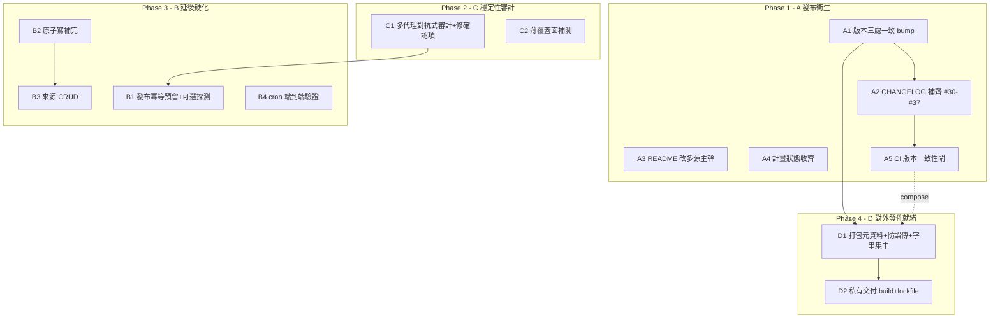

# feat: 成熟穩重化推進（maturity & release hardening）

## Overview

多來源匯整（plan `2026-06-22-001`，status `completed`）與 24 缺陷 bug 普查（plan `2026-06-22-002`，Phase 1 #37 + Phase 2+3 commit `47fc969`）**功能與修復都已落地**，552 測試綠。剩下的不是功能，而是把專案**收成一個成熟、可信、可重複交付的版本**。本計畫依操作者選定的**四條軌道**推進，**不新增產品功能以外的行為**（來源 CRUD 與 backend 冪等探測屬「補完既有承諾」而非新方向）：

| 軌道 | 缺口（證據） | 階段 |
|---|---|---|
| **A 發布衛生** | `VERSION`/`pyproject`/CHANGELOG 全卡在 `0.2.3.0`（6/18），#30–#37 + `47fc969` 完全沒記錄；bug-sweep 計畫 U4–U20 已做但 checkbox 沒打勾；README 仍以單來源為主幹 | Phase 1 |
| **C 穩定性回歸審計** | #34–#37 新增/改動面（多源爬取、聚瓜、`run_auto_pipeline` 重構、U4 發布重排、U20 savepoint）尚未經一輪對抗式審查；偵察已找到 9 個候選問題與 7 處薄覆蓋 | Phase 2 |
| **B 延後硬化** | backend 端發布冪等探測（U4 deferred）、WebUI 來源 CRUD（R3b）、`webui_config.save`/`edit_package` 仍非原子寫、cron 端到端未驗證 | Phase 3 |
| **D 對外發佈就緒** | dist-name `local-crawl-post-factory` 與 import 包 `cpost` 撞名且硬編在 `_ctx.py:20`；無防誤傳公開 PyPI 守門；無 build/lockfile/私有安裝路徑；版本三處易漂移 | Phase 4 |

**這是一份成熟化計畫**：絕大多數變更是恢復/強化既有不變量、補文件、加守門。唯二帶新行為的單元（B1 backend 冪等、B3 來源 CRUD）都補完 plan 001/002 明文記為「下一輪/follow-up」的承諾，不開新產品方向。

> **⚠️ 並行 git 自動化危害（硬約束，本 repo 已多次被燒）。** 本 repo 的 `main` 會在工作期間被背景自動化推動：bug-sweep 規劃期間 `origin/main` fast-forward 到 #36、local `main` 被 `reset` 上去，**檔案佈局從扁平變 `cpost/`**（reflog `reset: moving to origin/main`）；memory `[[feedback_concurrent_git_automation]]` 另記 PR #29 內容被掉包。**規則**：不要假設分支/樹在長任務中穩定；動工前先 `git ls-files cpost/core/manifest.py` 確認佈局；在**當前 main 開新分支**作業；**不碰非自己建立的檔**；走正常 PR 流程。本計畫所有路徑採 **`cpost/` 佈局**（plan 001/002 內文仍有 `core/`、`src/`、`webui/` 等前 #36 路徑，動工時心智重映到 `cpost/`）。

## Problem Frame

cpost 是單人、對自有/私有站運作的「爬取 → 正規化 → 聚瓜 → 打分 → 生成 → 建包 → 草稿 → 驗證 → 發布」管線加 FastAPI WebUI。最貴的動作（瀏覽器發布）**不可逆**，且 `run_auto_pipeline` 無人值守 → **靜默資料遺失與冪等性缺口是最高風險類別**（綠燈下發錯內容或重複上架）。功能已穩定，但「成熟穩重」要求三件事尚未滿足：(1) **誠實的發布記錄**——版本/CHANGELOG/README 必須反映實際落地的程式；(2) **經驗證的穩定**——新增的多源/重構面要經一輪對抗式審計，而非只靠文件好看；(3) **補完承諾並可安全交付**——把明文延後的硬化項收掉，並讓專案能以私有、可重現的方式安裝部署，同時硬性擋掉誤傳公開索引（授權為專有）。

## Requirements Trace

每條都是一個必須恢復/建立的不變量或交付物，且不得讓既有綠測退色。

- **R1 — 發布記錄誠實。** `VERSION`/`pyproject`/CHANGELOG 反映 #30–#37+`47fc969`；版本三處一致並有 CI 守門防再漂移。(A1, A2, A5)
- **R2 — 文件對齊現實。** README 以多來源聚瓜為主幹、14 個指令齊全、測試數指向 `make test-full`；過時計畫狀態收齊。(A3, A4)
- **R3 — 新增面經對抗式驗證。** #34–#37 改動面跑一輪多代理審計，確認問題修掉、薄覆蓋補測，並區分「真 bug」與「已記錄的刻意殘留」。(C1, C2)
- **R4 — 發布冪等性補強。** 收窄/關閉 U4 殘留重複發布視窗，最壞情況由「靜默重複上架」變成「停下等操作者確認」；保持 U3/U9 單一權威 run-recorder 不破。(B1)
- **R5 — 來源可從 WebUI 管理。** 新增/編輯/刪除/啟用停用來源，鏡像 `save_settings`，經 `_validate_sources` 把關，不寫回絕對路徑。(B3)
- **R6 — 耐久寫入全原子。** `webui_config.save`、`edit_package` 雙寫（含寫序/第三存儲一致）、`crawl_posts` status 終態寫改用原子寫；no-overwrite 用排他建立（既有正確，不回退）。(B2)
- **R7 — 排程範本可端到端跑。** 多來源 cron 範本實證跑通；CLI 與 WebUI 來源心智模型分裂明文化。(B4)
- **R8 — 可安全私有交付。** 防誤傳公開 PyPI 的硬守門、版本/dist-name 字串單一來源、`python -m build` 產物 + hashed lockfile 的可重現私有安裝路徑；維持專有授權隨產物散佈。(D1, D2)

## Scope Boundaries

- **不新增產品方向**：不做多租戶隔離、不改發布/後台模型（單一自有 admin、手動 `--approve` 不動）、不做 i18n（中文字串保留）、不改 `post_id`/canonical 方案（除碰撞抗性）、不重啟已砍的信心/佐證軸（`weight_confidence=0` 為正解，**不得復活**）。
- **對外發佈 = 私有可重現交付 + 防誤傳守門，不等於公開 PyPI**：授權為專有（all rights reserved），本計畫**不**上公開索引、**不**改成 OSS 授權（屬商業決策，明文 out of scope），只讓「能安全地私有安裝/部署、且不可能誤傳公開」。
- **dist-name 不重命名**（預設）：保留 `local-crawl-post-factory`，只把硬編字串集中化；重命名為 `cpost` 列為延後選項（見 Key Decisions），因為它是破壞性變更且本輪非公開發佈。
- **不碰已凍結的 canonical scheme**：`https://scoop.cpost.local/<cluster_id>`（plan 001 U12 已落地，state DB 目前 0 個 published scoop 列 → 改動仍安全，但本計畫不動它）。
- **審計只驗證+修確認項**，不借機重構未壞的程式；已記錄的刻意殘留（U1 鏡像身分、confidence 僅資訊性、URL-as-identity）**不得**被重新標為 bug。

## Context & Research

### 落地狀態（已驗證）

- 多來源匯整 plan 001 全 `[x]`（PR #30/#32/#33/#34/#35）；namespace 重構 #36；bug-sweep #37(P1) + `47fc969`(P2+3，U4–U20 全做，552 測試綠，**惟計畫 checkbox 仍 `[ ]`**）。
- `R11`（SQLite `busy_timeout`）**已完成且全覆蓋**：`state`/`runs`/`library` 三模組都委派 `cpost/core/db.py:connect`，統一設 `PRAGMA busy_timeout=5000` + `journal_mode=WAL`（`db.py:45-46`）。
- 原子寫**部分完成**：`manifest.save`（`manifest.py:54`）、`audit._atomic_write_text`、`generate_article` 雙寫（`packages.py:140-146`）、`auth.capture_login`（temp+`os.replace`，`auth.py:54-61`）、`write_text_no_overwrite`（排他建立 + 失敗清理，`filesystem.py:74`）均已原子。**仍非原子**：`webui_config.save`（`webui_config.py:156` 裸 `write_text`）、`edit_package`（`packages.py:88` caption、`:93` manifest）、`_write_receipt`（`publish_post.py:186`）、`backend_driver` failure.json（`:66`）。
- `examples/scheduling.md` 已**無** `select-cover`/`watermark-cover` 殘留，含可跑的多源 shell-loop（per-source `crawl-posts --source-id` → `library-ingest` → `cluster-scoops` → `score-scoops`）。已知缺口：CLI `crawl-posts` 讀不到 `sources` 設定，多源僅活在 WebUI/in-process `crawl_all_sources`。

### 關鍵程式錨點（current `cpost/` 佈局）

- **版本機制**：`pyproject.toml:7` version（setuptools 靜態）、頂層 `VERSION` 檔（手動鏡像）、`cpost/webui/routers/_ctx.py:19-24` 執行期 `importlib.metadata.version("local-crawl-post-factory")` → footer（讀**已安裝** egg-info，editable 安裝下與 live 檔可靜默分歧）。14 個 `[project.scripts]` 指向 `cpost.cli.*` / `cpost.webui.app:run`。CI `.github/workflows/ci.yml` 有 ruff+mypy+pytest 但**無版本一致性閘**、無 build/release job。
- **發布尾段（U4 後）**：`cpost/cli/publish_post.py:_run`（:37-137）——三互斥分支（manifest=published 重入 / state 列=published 混合態重入 / 首次發布 Gate 2）；首次發布耐久序為 `_mark_published`(state 列，**第一個耐久寫**, :101) → `mf.set_backend` → `mf.save`；共用 forward-complete 尾段 `_mark_published`→`_write_receipt`(write-once)→`runs.record_run`(由 `_publish_run_recorded` 守門防 U9 雙寫)。`state.is_processed` 為 URL-only（Q6，繼承 U1 鏡像 caveat）。
- **殘留重複發布視窗**：`backend_driver.publish_draft`（`:218-231`，點擊+等 success 後**已 LIVE**）與 `_mark_published` 寫下 state 列之間若 crash → 無耐久記錄、下輪走首次發布分支**重新點擊 → 第二篇 live**。為 local DB 寫與遠端 admin 無法兩階段提交所致的不可消視窗（U4 只能縮小）。
- **來源唯讀 UI**：`cpost/webui/templates/_sources_list.html`（settings.html include）；router `cpost/webui/routers/settings_auth.py:_sources_view`（:24-36，過濾 dict + 回 (clean, malformed)）；`test_webui_settings.py::test_settings_is_read_only_no_crud_controls` 斷言 `/sources/add|delete|edit` **不存在**（加 CRUD 須翻改）。
- **設定載入/存檔**：`cpost/core/webui_config.py` 為單一真相。`DEFAULTS` 含 `"sources": []`；`sources` 繞過 `_coerce`、由 `_validate_sources`（:192-227）驗證；`load_raw`（不解析路徑，保留相對）vs `load`（解析 `_PATH_FIELDS` 為絕對 + `CPOST_*` 覆寫 + storage_state 不得在 out_dir/download_dir 內的守門）；`save` 只保留 `DEFAULTS` 有的鍵（未知**頂層**鍵丟棄，但整個 sources list 透傳；未知**per-source** 鍵保留）。per-source dict：必填 `source_id`(非空)+`start_url`(`valid_url`)，選填 `enabled`(bool)+白名單字串覆寫 `item_regex/allow_regex/deny_regex/body_selector/image_selector/date_selector`；重複 `source_id`(strip 後) 被拒。
- **打包/dist**：dist-name `local-crawl-post-factory`（pyproject `[project].name`）vs import-name `cpost`（`top_level.txt`、`packages.find include=["cpost*"]`）——#36 刻意如此（修 pip 安裝撞名）。dist-name 字串硬編於 `_ctx.py:20`、被 `tests/test_webui_packages.py:382` 斷言、另散在 `app.py:28`/`crawl_posts.py:51`/`configs/crawler.yaml:12`(UA)/`base.html`/README/`.command`。

### 偵察候選問題（C1 審計種子，**待審計驗證，非既定 bug**）

| where | smell | sev |
|---|---|---|
| `publish_post.py:_state_published_url` | published-but-URL-less state 列回 `''`(falsy≠None) → 混合態重入寫空 `published_url` 流入 manifest/receipt/audit/stdout | medium |
| `pipeline.py:crawl_all_sources` | 每來源各拿完整 wall-clock 預算，無跨源總上限 → N 個卡死源可阻塞 WebUI worker N×300s | medium |
| `pipeline.py:crawl_all_sources` | per-source 合併 `{**webui_cfg, **src}` 讓來源項可覆寫**任意** base 鍵（含 `state_path`/`out_dir`/`llm_config`），非僅爬取旋鈕 | medium |
| `pipeline.py:_run_stage` | draft/verify 每筆 `record_run` 開新連線（未傳 `conn=`），失去 `open_run_conn` 重用 → O(items) 連線抖動（R14/U9 重構回歸） | low |
| `pipeline.py:crawl_all_sources` | 單一 `progress_cb` 跨 N 源重用 → /today live 計數每源歸零/倒退（觀測性） | low |
| `cluster.py:_summarize`+`library.list_clusters` | `source_count`/confidence 結構性退化卻仍作 `by_score` tiebreak + `min_confidence` 篩選 | low |
| `library.assign_clusters` | 每次 prep 全清重建（清 cluster_id、刪 clusters）→ 若 cluster 後未即時 score（CLI 單跑/中途 crash）留 NULL-score 列被 `by_score` 排序 | low |
| `db.py:_apply_migrations` | 只 catch `sqlite3.OperationalError`；非 OperationalError 中途失敗留未釋放 savepoint（連線關閉時丟棄，asymmetry） | low |
| `crawl_posts.py:_extract` | per-field 無效選擇器 fallback 用裸 `except Exception` → 遮蔽真實抽取錯誤、自訂選擇器失敗靜默退預設 | low |

薄覆蓋面（C2 種子）：多源 e2e 隔離/排序、`BackendInvocation` 作為舊 `SimpleNamespace` drop-in 的屬性齊全、U4 混合態矩陣（含空 published_url、缺 `--state`、鏡像 false-skip）、U20 真多語句 migration 部分套用、NULL-score 排序、`crawl_items` kill 路徑、/today job 生命週期錯誤外露。

### 過往決策（不得重啟）

- **信心/佐證軸已砍（2026-06-22 拍板）**：`weight_confidence=0`（仍計算、僅資訊性），**不可**復活，也**不可**用「釘常數」機制（會壓平 /today 排序）。
- **canonical scheme 凍結**：`https://scoop.cpost.local/<cluster_id>`；改動需 state backfill（目前 0 published scoop 列 → 暫安全，本計畫不動）。
- **backend 冪等為 best-effort 已交付，full 探測 deferred**：U4 已上 state-first 排序 + pre-publish skip 檢查（authoritative over manifest gate）+ forward-complete；full 保護需 admin 端「此 canonical_url 已發布？」探測能力（本計畫 B1 處理，視為淨新範圍）。
- **來源 CRUD 為 R3b 下一輪**（本輪 B3 補上）；G5 來源出處（`generate_article` 現硬編 `source_id='scoop'`）於 U12 已落地、出處決策留資訊性。

### 外部最佳實務（D 軌）

- dist 名與 import 名**可不同且合法**（PyYAML：裝 `pyyaml` 匯入 `yaml`）；dist 名正規化（`re.sub(r"[-_.]+","-").lower()`），import 名須合法識別字。**重命名非原地升級**：pip 視新舊為兩專案，須先 `pip uninstall` 舊名，否則 RECORD 衝突/影子安裝；`_ctx.py:20` 硬編字串漏改會 `PackageNotFoundError` 靜默退 `dev`。→ **內部用建議不重命名，只把字串集中為 `version(__name__.split('.')[0])`**。
- 專有授權 + 私有交付完全相容：授權管**權利**、pip/wheel/私有索引只是**傳輸**。守門：`classifiers=["Private :: Do Not Upload"]`（PyPI 硬拒），`license={text=...}`（"Proprietary" 非合法 SPDX id，勿用 SPDX-string 形式），`license-files=["LICENSE"]`。私有安裝三法：私有索引、`git+ssh@<40-char-SHA>`（勿釘 branch/tag）、直接 wheel（純 Python → `py3-none-any`）。可重現：`pip-compile --generate-hashes` 產 `requirements.lock` + `pip install --require-hashes`；abstract 上限留 pyproject、具體 hash 留 lock。
- 版本單一真相（PyPA single-source）：建議 pyproject 為唯一源、刪冗餘 `VERSION` 檔或 build 時生成；執行期 `importlib.metadata` 已是正解。4 段式 `0.2.3.0` 非 SemVer 且 PEP 440 視 `==0.2.3`（尾零無序）。Keep-a-Changelog + `[Unreleased]` 段 + git tag。

## Key Technical Decisions

- **版本號採 `0.3.0`（3 段 SemVer），保守替代 `0.2.4.0`。** 多來源匯整是產品級新能力（cpost 複用方向的核心轉向）+ namespace 結構重構，抬 minor 合理；同時一次修掉打包研究指出的「4 段非 SemVer / 尾零無序」異味。若操作者偏好延續既有 4 段節奏則用 `0.2.4.0`——**這是 A1 唯一需操作者點頭的 1 行選擇**（其餘 A 軌據此填）。理由：3 段是 pre-1.0 內部工具最少驚訝、多數工具預設假設的形式。
- **版本保留雙檔但加 CI 守門，不貿然刪 `VERSION`。** 研究建議塌成 pyproject 單一源、刪 `VERSION`；但 repo 既有 `version-sync` 技能與 `VERSION` 慣例，貿刪有工具風險。**稳重選擇**：本輪 A1 把三處一致 bump、A5 加 CI 一致性閘**強制**不變量（pyproject==VERSION==CHANGELOG 最新標頭），把「塌成單一源」列為 D1 的延後考量（連同 dist-name 字串集中化一起做半步）。
- **發布冪等主採 Approach B（pre-publish 狀態預留，backend 無關），Approach A（backend URL 探測）為設定可選增強。** B 用中間態（如 `publishing`）在點擊**前**寫預留列，crash 後下輪見預留列**停下要操作者確認**而非盲目重點擊——最壞情況由「靜默重複 live」變「需人工介入」（對單人不可逆發布是正確取捨），且不依賴真實 admin 能力、無 per-publish 延遲。A 是唯一真正在視窗內加遠端檢查者，但依賴 admin 以 canonical_url 可搜尋 + 可讀已發布狀態（mock 與 `backend.yaml` 目前都無），且 fail-open 會重造重複 → 列為 backend 支援時才開的設定旗標。**Approach C（事後對帳器）** 為偵測非預防，作 A/B 的補充而非主方案。
- **發布冪等的鐵則：fail-closed + 單一權威 run-recorder。** 任何探測/預留在不確定（搜尋空/歧義/state 鎖）時一律「不自動重發」；新狀態不得讓既有 `_publish_run_recorded` 雙寫（U3⇄U9 耦合），重入只 forward-complete 缺的步驟。
- **來源 CRUD 鏡像 `save_settings`，`load_raw`→就地改→`save`。** 走 `load_raw`（非 `load`）避免寫回絕對路徑（portability guard）；唯一性/URL/重複交給 `_validate_sources`（呼 `save` 即得，不另寫分歧邏輯）；checkbox `'on'/absent`→bool 須路由自轉（per-source 繞過 `_coerce`）；**就地改 entry 而非重建**以保留未知 per-source 鍵（forward-compat）。
- **審計範圍 = 驗證+修確認項，明確區分真 bug 與已記錄殘留。** 依偵察建議分 3 並行代理（A 狀態/冪等最深、B 多源爬取/編排、C 打分/聚瓜/webui），每個先讀 `tests/` 映現有覆蓋再獵薄覆蓋面；findings 須有可重現或測試缺口才採信。
- **dist-name 不重命名（本輪）**：保留 `local-crawl-post-factory`，只集中執行期字串；重命名為 `cpost` 列延後（破壞性、須先 uninstall 舊名、非公開發佈無收益）。

## High-Level Technical Design

> *方向性指引，供審查驗證，非實作規格；實作者當作脈絡而非照抄。*

**發布冪等 Approach B（pre-publish 狀態預留）—— 把不可消視窗從「靜默重複」轉成「停下確認」：**

```
今天（U4 後）：
  Gate2 ─▶ publish_draft (LIVE) ─▶ _mark_published(state=published) ─▶ mf.save ─▶ receipt ─▶ run
                    ▲ 殘留視窗：此處 crash → 無耐久記錄 → 下輪走首次發布分支 → 重點擊 → 第二篇 live

Approach B：
  Gate2 ─▶ reserve(state='publishing') ─▶ publish_draft (LIVE) ─▶ promote(state='published') ─▶ mf.save ─▶ …
                    ▲ 預留列已耐久            ▲ crash 於此         ▲ 下輪：見 'publishing' 列 → 不自動重點擊，
                                                                    回 recoverable error 要操作者去 admin 確認
                                                                    （確認已發布→promote+forward-complete；確認未發布→清預留重試）
  殘留收窄為：reserve 寫入本身之前的 crash（純 local SQLite 寫，遠小於瀏覽器往返）。
  is_processed / _state_published_url / skip_reason / pipeline 分支須學會 'publishing' 態（state.status 為自由文字，無 schema 變更）。
  Approach A（可選）：reserve 後、publish_draft 前，若 backend.yaml 設了 search_by_url + published 狀態選擇器，
                      呼 find_published_by_url(canonical_url)；命中 LIVE → 視同已發布 forward-complete，skip 點擊。
                      fail-closed：搜尋空/歧義 → 當 unknown，照常發布（預留列已防雙發）。
```

**原子寫補完（B2）—— 既有兩種配方，不可混用：**

```
覆寫型（webui_config.save / edit_package caption+manifest）：
    temp 檔建於 dest.parent → flush+os.fsync → os.replace   ← 重用 cpost/core/filesystem.py:atomic_write_text
    （temp 必在 dest.parent 同檔系，否則 os.replace 拋 Invalid cross-device link）
覆寫型・內聯同配方（crawl_posts status 終態寫 :362）：.tmp + os.replace  ← 對齊同檔既有進度寫 :146-150，不必導入 helper
    （edit_package 例外：除原子化還須「manifest-first + caption-後 + 失敗 body rollback」寫序，見 B2）
no-overwrite 型（write_text_no_overwrite）：open(path,'x') 排他建立，FileExistsError 回既有 ← 已正確，不可改用 os.replace
```

## Dependency graph



硬邊：A1→A2→A5（版本→CHANGELOG→閘）；A1→D1（D1 集中版本/dist 字串，依 A1 定案）；B2→B3（CRUD 整份 cfg 過 save，須先原子化）；D1→D2。語意邊：**C1→B1**（B1 改發布尾段，應在審計確認尾段乾淨後動，避免在未驗證程式上疊新狀態機）；A5⇢D1（D1 的字串集中化與 A5 的一致性閘合成單一版本真相）。同檔排序：`packages.py` 由 B2（`edit_package` 寫序）→B3（CRUD）一路；`publish_post.py` C1 先驗、B1 後改；`crawl_posts.py` C1 代理 B 先審（`crawl_items`/`crawl_all_sources`）、B2 後改（status_path 終態原子寫）——B2 只動 :362 終態寫，不碰 C1 審計的爬取/編排邏輯，面不重疊。

## Implementation Units

### Phase 1 — A 發布衛生（基礎、低風險，先行）

- [x] **A1：版本三處一致 bump 到 `0.3.0`（或 `0.2.4.0`）**

**Goal:** `pyproject.toml`、`VERSION`、CHANGELOG 標頭一致反映實際落地，footer 在重裝後顯示新版。
**Requirements:** R1
**Dependencies:** None（A2 依此）
**Files:**
- Modify: `pyproject.toml`（`[project].version`）、`VERSION`、`CHANGELOG.md`（新標頭，A2 填內容）
- Test: `tests/test_portability_guard.py` 或新增 `tests/test_version_consistency.py`（與 A5 共用）
**Approach:**
- 操作者定案版本字串（建議 `0.3.0` 採 3 段 SemVer；保守 `0.2.4.0` 延續 4 段節奏）。三處同一字串。
- 若採 3 段：確認 `version-sync` 技能與任何 4 段假設不被破壞（grep 4 段假設）；footer 機制不變（讀 dist metadata），需 `pip install -e .` 重裝刷新——A1 註明重裝步驟。
**Patterns to follow:** CHANGELOG `0.2.2.1` 的「VERSION 對齊」前例（即此漂移的歷史）。
**Test scenarios:**
- Happy path：三處版本字串相等（A5 的測試驗證）。
- Edge case：footer 在 editable 安裝未重裝時顯示舊版 → A1 文件註明，A5 測試斷言三檔一致（非 footer）。
**Verification:** `pyproject==VERSION==CHANGELOG 最新標頭`，CI 一致性閘綠。

- [x] **A2：CHANGELOG 補齊 #30–#37 + `47fc969`，加 `[Unreleased]` 段**

**Goal:** 自 `0.2.3.0` 後的 9 個落地單位全部有條目，依 Keep-a-Changelog 慣例。
**Requirements:** R1
**Dependencies:** A1（版本標頭）
**Files:**
- Modify: `CHANGELOG.md`
**Approach:** 新增 `## [<版本>] - 2026-06-22` 區段，Added/Changed/Fixed/Refactor 分組（沿用既有中文「- **粗體前導**：…」格式）。**內容已由 git-history 研究備妥**（每個 PR/commit 的 zh-TW 條目見 Sources 引用的研究輸出）：#30 聚瓜、#31 移除封面(Changed)、#32 今日備稿+generate-article、#33 source_id/完整度修正、#34 多來源匯整、#35 stage runner+typed BackendInvocation 重構、#36 namespace 化(+LICENSE)、#37 高嚴重四修、`47fc969` 中低 16 修。頂部加 `## [Unreleased]` 慣例段供日後累積。
**Test expectation:** none -- 純文件，內容正確性由 A4/人工核對。
**Verification:** 9 單位皆有條目；無遺漏 #36 的對外可見打包變更。

- [x] **A3：README 改以多來源聚瓜為主幹**

**Goal:** 新操作者光看 README 即知主流程是「多源 → 庫 → 聚瓜 → 生成 → 發布」，非單來源加掛。
**Requirements:** R2
**Dependencies:** None
**Files:**
- Modify: `README.md`
**Approach:** 把「多源聚合：瓜（scoops）」從單來源 e2e **之後的次段**上移為主幹敘事；「本版範圍」改寫不再以 Phase 1-3/4-5 框定產品；確認 14 個指令（含 `library-ingest`/`cluster-scoops`/`score-scoops`/`generate-article`/`crawl-post-webui`）皆有列；測試數續指 `make test-full`（已是，勿寫死）；同步任何 0.2.3.0 殘留版本提及。
**Test expectation:** none -- 文件；可選加 README 指令清單對 `pyproject [project.scripts]` 的一致性檢查到 A5。
**Verification:** README 主敘事 = 多源；指令清單與 entry points 一致。

- [x] **A4：收齊過時計畫狀態**

**Goal:** bug-sweep 計畫反映 U4–U20 已落地，避免「已做卻顯示待辦」的誤導。
**Requirements:** R2
**Dependencies:** None
**Files:**
- Modify: `docs/plans/2026-06-22-002-fix-codebase-bug-sweep-plan.md`（U4–U20 checkbox `[ ]`→`[x]`，附 commit `47fc969`），`status` 視情況改 `completed`
**Approach:** 對照 `47fc969` commit body（U4–U20 逐條）勾選；多來源計畫 001 已 `completed` 無需動。
**Test expectation:** none -- 文件狀態。
**Verification:** 無「已 merge 卻 `[ ]`」的計畫項。

- [x] **A5：CI 版本一致性閘 + 指令清單一致性**

**Goal:** 防 `VERSION`/`pyproject`/CHANGELOG 再漂移（此漂移歷史上已發生過一次）。
**Requirements:** R1
**Dependencies:** A1, A2
**Files:**
- Create: `tests/test_version_consistency.py`
- Modify: `.github/workflows/ci.yml`（若需顯式步驟）、可選 `Makefile`（`make check-version`）
**Approach:** 測試斷言 `pyproject [project].version` == `VERSION` 檔內容(strip) == `CHANGELOG.md` 最新 `## [x]` 標頭版本。pytest 跑即進 CI（無需改 workflow，除非要獨立步驟）。可選：斷言 `[project.scripts]` 鍵集 == README 指令清單。
**Execution note:** 先寫失敗測試（目前三處雖一致但無守門）鎖住不變量。
**Test scenarios:**
- Happy path：三處一致 → 測試綠。
- Error path：人為令 `VERSION` 落後 pyproject → 測試紅（證明閘有效）。
- Edge case：CHANGELOG 最新段為 `[Unreleased]` → 跳過版本比對（取下一個具版本標頭），不誤報。
**Verification:** 任一處版本不一致即 CI 紅。

### Phase 2 — C 穩定性回歸審計（在新增行為前，先驗清現有改動面）

- [x] **C1：多代理對抗式審計 #34–#37 改動面 + 修確認項**

**Goal:** 用對抗式審查驗證多源/重構/U4-U20 面，修掉確認的真 bug，明確區分真 bug 與已記錄殘留。
**Requirements:** R3
**Dependencies:** None（讀為主，修在 B1 前完成）
**Execution note:** 對抗式驗證——findings 須有具體可重現或測試缺口才採信；每個代理顯式分離「真 bug」與「刻意殘留（U1 鏡像、confidence 僅資訊性、URL-as-identity）」，後者不得重新標記。
**Files（審計覆蓋面，修哪些依 findings）:**
- Read/Modify: `cpost/cli/publish_post.py`、`cpost/core/pipeline.py`、`cpost/cli/crawl_posts.py`、`cpost/core/cluster.py`、`cpost/core/scoring.py`、`cpost/core/library.py`、`cpost/core/db.py`、`cpost/core/scoop_pipeline.py`、`cpost/webui/routers/scoops.py`、`cpost/webui/routers/settings_auth.py`
- Test: 對應 `tests/test_*.py`（每修一個確認項補回歸測試）
**Approach（依偵察 audit_scope_recommendation 分 3 並行代理）：**
- **代理 A（狀態/冪等，最高風險）**：`publish_post` U4 重排 + `_state_published_url` `''`-vs-`None` + 混合態重入 + 鏡像 caveat；`db.py` U20 savepoint；`library.assign_clusters` 重建原子性；`runs` dedup。建 crash-injection 狀態矩陣（publish_draft / state 寫 / mf.save 之間的 kill 點），斷言無重複 live、無空 published_url。
- **代理 B（多源爬取/編排）**：`crawl_items` 預算/kill + per-source `_extract` fallback；`crawl_all_sources` 合併鍵 blast radius + per-source 隔離 + 缺總預算；`_run_stage`（連線重用、draft/verify vs publish run-record asymmetry、`BackendInvocation` 屬性齊全）；`scoop_pipeline` progress_cb 分流。
- **代理 C（打分/聚瓜/webui，最低風險）**：`cluster` 決定性 + `source_count` 語意；`scoring` 權重中性化 + confidence tiebreak 滲漏；`scoops.py`/`settings_auth.py` 篩選與唯讀面板。
- 先讀 `tests/` 映現有覆蓋，獵偵察列出的薄覆蓋面而非重推已覆蓋者。
**Test scenarios（每確認 finding 一條回歸測試；偵察種子例）：**
- Error path：`_state_published_url` 對 published-but-URL-less 列回 `''` → 確認是否可達、`''`vs`None` 處理一致（修則斷言不流空 URL 進 manifest/audit/stdout）。
- Error path：N 個卡死源 → 確認是否需跨源總預算（修則斷言 /today prep 在總預算內失敗，不阻塞 worker N×300s）。
- Edge case：per-source 項覆寫 `state_path`/`out_dir` → 確認是否該 allowlist 限制可覆寫鍵。
- Integration：`BackendInvocation` 作 draft/verify/publish 三 runner drop-in，每屬性（dry_run/approve/expected_content_id/retries/headless/timeout_ms）皆讀得到且 expected_content_id 只 gate publish。
**Verification:** 每確認 bug 有修 + 回歸測試；已記錄殘留明文標注未動；全測綠 + mypy/ruff 綠。

- [x] **C2：薄覆蓋面補測**

**Goal:** 把偵察列出的 7 處薄覆蓋補上回歸/整合測試，讓「穩重」可量測。
**Requirements:** R3
**Dependencies:** C1（與審計共用發現）
**Files:**
- Test: `tests/test_pipeline.py`、`tests/test_publish_gating.py`、`tests/test_db.py`、`tests/test_crawl_posts.py`、`tests/test_scoring.py`/`tests/test_cluster.py`、`tests/test_webui_scoops.py`（依面向）
**Approach:** 針對：多源 e2e（≥2 源隔離/排序/合併）、`BackendInvocation` drop-in、U4 混合態矩陣（含空 published_url、缺 `--state`、鏡像 false-skip 為已記錄殘留須斷言其「刻意」行為）、U20 真多語句部分套用、NULL-score 排序、`crawl_items` kill 路徑、/today job 生命週期錯誤外露。
**Test scenarios:**
- Integration：crawl_all_sources 兩源、其一失敗 → 另一源產出不受影響，合併列正確。
- Edge case：U20 `ALTER ADD col_x;(已存在) ALTER ADD col_y;(新)` → `col_y` 仍套用、版本只在全套用時記錄。
- Edge case：cluster 後未 score 的 NULL-score 列 → `list_clusters(by_score)` 排序不崩、None 處理明確。
- Error path：`crawl_items` 子程序永不退出 → 預算內 `ExternalError`、子程序被 kill（無孤兒）。
**Verification:** 7 薄覆蓋面皆有測試；覆蓋率不退（`make test-full`）。

### Phase 3 — B 延後硬化

- [x] **B2：原子寫補完 + 寫入順序/第三存儲一致性**

**Goal:** crash/ENOSPC 不能截斷 `configs/webui.yaml`、`edit_package` 的 manifest/caption、或 crawl 終態 status；且 `edit_package` 的**三存儲**（caption.txt / manifest.json / state.reviewed）保持一致，發布閘綁定的是真正落地的內容。
**Requirements:** R6
**Dependencies:** None（B3 依此）
**Files:**
- Modify: `cpost/core/webui_config.py`（`save` :156 → `atomic_write_text`）、`cpost/webui/routers/packages.py`（`edit_package` :88/:93/:97 重排+原子+第三存儲）、`cpost/cli/crawl_posts.py`（`status_path` 終態寫 :362 → 鏡像 :148 的 `.tmp`+`os.replace`）
- 可選: `cpost/cli/publish_post.py`（`_write_receipt` 寫入 :183，**注意已是 write-once**：:180-181 `if path.exists(): return`，僅撕裂寫風險非覆寫截斷，優先度最低）、`cpost/browser/backend_driver.py`（failure.json :66）——低風險診斷檔
- Test: `tests/test_webui_config.py`、`tests/test_webui_packages.py`、`tests/test_filesystem.py`、`tests/test_crawl_posts.py`
**Approach:**
- **覆寫型一律走 `cpost/core/filesystem.py:atomic_write_text`**（temp 建於 dest.parent + fsync + os.replace），呼叫端先序列化（helper 收 `text: str`，保留各自 `yaml.safe_dump`/`json.dumps` 選項）。**不可**動 `write_text_no_overwrite`（排他建立已正確）。
- **`edit_package` 寫入順序須鏡像 `generate_article`（不是只換 API）**：現況 `edit_package` 順序與 `generate_article` **相反**（caption 先 :88、manifest 後 :93、無 rollback），只換成 atomic 仍留 desync（UI 顯示新文、發布用舊 body，因 manifest `content.body` 才是發布來源）。正確：(1) 記憶體改 manifest，(2) **先**原子寫 `manifest.json`（**錨點＝發布真相**），(3) **後**原子寫 `caption.txt`（顯示用，可落後），(4) caption 寫失敗 → 把 manifest body 回滾並重寫、raise。
- **第三存儲 reviewed.mark**：`edit_package` 還寫 `reviewed.mark(state_path, post_id, content_id(m))`（:97，content_id 由 manifest body 算）。須在**兩檔寫都成功後**才 mark（content_id 取自最終落地 manifest），否則發布閘綁到錯內容。`package_detail`（:51）有同一三存儲耦合，一併確認。
- **`crawl_posts` 終態 status 寫**（:362 裸 `open('w')`）與既有原子的進度寫（:146-150 `.tmp`+`os.replace`）**不對稱**；status_path 是 crawl 路徑的耐久產物（被 `crawl_all_sources`/`/today` 讀），半寫 JSON 會誤判失敗或讀崩 → 改鏡像進度寫的 `.tmp`+`os.replace`。
- **耐久性聲明據實**：`atomic_write_text` 保證 old-or-new **內容**（檔已 fsync），但**未** fsync 父目錄 → 硬斷電下 new-vs-old 的 rename 持久性不保證。威脅模型＝app crash（非斷電），於 Risks 註明；如要更強可選加 dir-fsync 半步。
**Patterns to follow:** `cpost/core/manifest.py:save`（已原子）、`generate_article` 雙寫（`packages.py:138-148`，manifest-first + body rollback）、`crawl_posts.py:146-150`（`.tmp`+`os.replace` 進度寫）。
**Test scenarios:**
- Edge case（模擬）：patch `os.replace` 於第二次寫拋錯 → `webui.yaml` 維持舊完整內容（old-or-new，非截斷）。
- Edge case（順序）：`edit_package` manifest 寫成功、caption 寫失敗 → manifest body **回滾**、caption/manifest body 維持一致對、**reviewed marker 未前進**。
- Edge case（invariant）：temp 檔 parent == dest parent（同檔系）。
- Edge case：`crawl_posts` status_path 終態寫被中斷 → 讀者得舊完整或新完整 JSON，非半寫崩解。
- Happy path：正常 save/edit/crawl round-trip 經 `load`/`load_raw` 不變。
**Verification:** 失敗寫後無可觀察截斷 config/manifest/status；edit 三存儲一致、reviewed 綁定落地內容；portability guard 不退。

- [x] **B3：WebUI 來源 CRUD（R3b）**

**Goal:** 操作者可從 WebUI 新增/編輯/刪除/啟用停用來源，不必手改 YAML。
**Requirements:** R5
**Dependencies:** B2（CRUD 整份 cfg 過 `save`，須先原子化）
**Files:**
- Modify: `cpost/webui/routers/settings_auth.py`（新 `/sources/add|edit|delete|toggle` 路由 + 擴 `_extract_field` 正則）、`cpost/webui/templates/_sources_list.html`（唯讀 → 可編輯表單/按鈕，仍為 swap-target partial）、可能 `settings.html`、`cpost/core/webui_config.py`（如需 helper）
- Test（兩桶，勿混）: `tests/test_webui_settings.py`、`tests/test_webui_config.py`、`tests/test_portability_guard.py`
  - **必翻改**（唯讀斷言→CRUD）：`test_settings_is_read_only_no_crud_controls`（:37-47，反轉為斷言 `/sources/*` 端點**存在**）；模組 docstring（:1-3「display-only」）；`_sources_list.html`（:1-4「唯讀」標頭/提示）。
  - **必保綠**（可編輯 partial 須續滿足的回歸守門）：`test_settings_lists_sources_when_configured`、`test_settings_empty_state_when_no_sources`、`test_settings_all_disabled_indication`、`test_settings_disabled_source_is_demphasized`（`source-disabled` class + `停用`/`啟用` pill）、`test_settings_enabled_defaults_true_when_omitted`。
**Approach:** 鏡像 `settings_auth.py:save_settings`（:63）：`webui_config.load_raw`（:74）→ 就地新增/找到並改/刪除 `sources` entry → `webui_config.save`（:144，內部 `validate`→`_validate_sources` 把 source_id 唯一性/`valid_url`/重複一次驗證並回錯）。**就地改 entry 不重建**以保留未知 per-source 鍵。錯誤回 4xx + 友善訊息，不崩頁。**Agent-native parity**：每個 UI 動作對應一可程式呼叫端點。
- **`save` 的 merge 只保留 DEFAULTS 鍵——`sources` 已在 DEFAULTS（`webui_config.py:49`）故 CRUD 改動安全存活**；`save`（:148-151）以 `if key in merged` 過濾，傳入的**非 DEFAULTS 頂層鍵會被靜默丟棄**（CRUD 只動 `sources` 故不受影響，但勿藉此塞自定頂層鍵）。
- **`enabled` 須寫顯式 bool（不可省略鍵）**：`_validate_sources`（`webui_config.py:217-218`）只在 `enabled` 鍵存在時驗 bool、**不補預設**；default-true 邏輯只活在樣板（`src.get('enabled', true)`）。故 toggle-off 路由須寫**顯式 `enabled: False`**（'on'→True、absent→False），**絕不**省略鍵——否則樣板 default-true 會把剛停用的來源靜默重新啟用。
- **錯誤歸列用既有 `_extract_field`（`settings_auth.py:11`/:14）但其正則 `^(?:invalid )?(\w+) must|^invalid (\w+):` 不配 `_validate_sources` 的訊息形狀**——`sources[0].enabled must …`（`[`/`]`/`.` 非 `\w`，`^(\w+) must` 不命中）與 `duplicate source_id in sources: …`（無 ` must`/`invalid` 前綴）兩種皆回 None → 無逐列高亮。對策：擴充正則加捕 `sources\[\d+\]\.(\w+)`（首選，只動訊息解析），或接受 page-level banner；**不**在路由加第二個逐欄驗證器。
**Patterns to follow:**
- 後端：`settings_auth.py:save_settings`（:63，`load_raw`→改→`save` 合併範本）、`webui_config.py:_validate_sources`（:192-227）、`webui_config.py:save`（:144）/`load_raw`（:74）、`settings_auth.py:_extract_field`（:11/:14）。
- **HTMX 樣板（既有可循，勿重造）**：`detail.html:24-53`（toggle 揭露 inline-edit form：`hx-swap="none"`+`hx-on::after-request` 收合）、`_packages_table.html:50-53`（逐列 `hx-post` 刪除 + `hx-confirm` + `hx-target="#pkg-list" hx-swap="innerHTML"`）、`packages.py:22-40`（`HX-Request`→partial 渲染契約：CRUD 路由重渲並回 `_sources_list.html` fragment 作 swap target，鏡像 `delete_package` 回 `_packages_table.html`）。
**Test scenarios:**
- Happy path：POST `/sources/add` 合法來源 → 寫入 `webui.yaml`、重渲 `_sources_list.html` 顯示。
- Error path：重複 `source_id` → 4xx + `ValidationError` 訊息（經擴充 `_extract_field` 歸到正確列），cfg 未變。
- Error path：`start_url` 非 http(s)/無 host → 4xx，未寫入。
- Edge case：`/sources/toggle` 停用 → reload → entry 含**字面 `enabled: False`**（非省略）、渲染 `停用`。
- Edge case：編輯帶未知 per-source 鍵的來源 → 未知鍵 round-trip 後仍在（就地改保留）。
- 回歸守門：CRUD 重渲仍輸出 `source-disabled`/`停用`/`啟用` pill 與空狀態/全停用 banner（上述「必保綠」測試）。
- Security/portability：CRUD 後 `webui.yaml` 無絕對路徑（portability guard 綠）。
**Verification:** 加來源 = 零改碼 WebUI 操作；`_validate_sources` 不變量全經 `save` 把關；唯讀斷言已反轉、回歸守門全保綠；portability 不退。

- [x] **B1：發布冪等 pre-publish 狀態預留（+ 狀態機收口、清除路徑、可選 backend 探測）**

**Goal:** 收窄 U4 殘留重複發布視窗到「預留列**原子**寫入前」的純 local 寫；crash 後最壞為「停下要操作者確認」而非靜默重複 live；且**不引入新死鎖**——預留可清除、去重看得見、可回滾。
**Requirements:** R4
**Dependencies:** **C1（硬閘，非軟邊）**——(1) C1 agent-A 的 `_state_published_url` `''`-vs-`None` finding 必須先解決或明文寫掉並附測試，B1 才能改該函式（否則新狀態機疊在仍受審的契約上，會固化或遮蔽 C1 正在審的 bug）；(2) B1 在 **C1 收尾的凍結 baseline**（記下 C1 結束的 commit/PR SHA，B1 從該 SHA 開分支，符合本計畫「別假設分支穩定」規則）。與 U3/U9 run-recorder、U4 混合態耦合。
**Execution note:** 特徵測試先行——先用 crash-injection 鎖住現有 U4 行為（test_publish_gating 已覆蓋 closed 側），再加預留態。
**Files:**
- Modify: `cpost/cli/publish_post.py`（`_run` Gate2 後、`publish_draft` 前 reserve；尾段 promote；`_state_published_url` 分支 publishing）、`cpost/core/state.py`（**新增** `reserve_publishing`（原子條件寫）+ `clear_reservation`/`release_publishing`（僅降級/刪 `publishing` 列，守門不得覆寫真 `published`）+ 狀態機收口 helper〔`RESERVABLE`/`TERMINAL` 集合 + 單一 transition 函式〕；`is_processed`/`skip_reason` 學第三態）、`cpost/cli/dedupe_posts.py`（`dedupe` 不得把 `publishing` 列當未處理放回 build loop）、`cpost/webui/routers/packages.py`（`rollback_package` 連帶清/降級 state 列）、可能 `cpost/webui/routers/dashboard.py`（`publishing` 計數歸桶）
- 可選（Approach A，設定旗標）：`cpost/browser/backend_driver.py`（`find_published_by_url`）、`configs/backend.yaml`（`search_by_url`+published 狀態選擇器）、`tests/mock_admin.py`（_search_page 帶 canonical_url+published）
- Test: `tests/test_publish_gating.py`、`tests/test_state.py`、`tests/test_webui_packages.py`（rollback↔state）、`tests/mock_admin.py`
**Approach:**
- **原子條件預留（非 read-then-upsert）**：點擊前以**單一條件語句**取得預留——`UPDATE items SET status='publishing', updated_at=now WHERE canonical_url=? AND status NOT IN ('publishing','published')`，檢查 rowcount；搶不到（已被預留/已發布）→ fail-closed 視同 in-flight，回 recoverable error。**理由**：系統有**兩個並行發布驅動**（WebUI `submit_job` 與無人值守 `run_auto_pipeline`）共用同一 state DB，plain `upsert(='publishing')`+另讀 `is_processed` 會被兩 run race（都讀「未預留」、都寫、都點擊）；`busy_timeout`/WAL 為必要非充分。
- **狀態機收口（不可散字串字面）**：`items.status` 是自由文字、無 enum/型別保護、`upsert` 為單調前進——加值會**靜默改變每個** status 述詞的意義（去重 published-only、dashboard 歸桶、`idx_items_status`）且無編譯器幫忙。故 B1 須建**單一權威** helper（`RESERVABLE`/`TERMINAL` 集合 + 單一 transition 函式），所有 status 讀/寫都經它；sign-off 前 grep `PUBLISHED`/`'published'`/`status =` 確認無遺漏點。
- **清除是一級交付（非 deferred）**：因 reserve 可能**新建**列（reserve 前無此列），「清除」須 DELETE「無先前 published 狀態」的 `publishing` 列（或翻回明定非終態並說明翻到哪）；注意 `upsert` 的 COALESCE（state.py:89-93）**無法**把 `published_url` 設回 NULL，故清除**不能**是同列 upsert。`rollback_package` 連帶呼叫清除，使「確認未發布→重試」是真正 WebUI 動作而非手改 SQLite。
- **staleness 訊號**：reserve 寫 `updated_at`（`items` 已有此欄，state.py:27，無新欄）；偵測到 `publishing` 時讀 `updated_at` 算預留年齡，放進 recoverable error 訊息（「此 canonical_url 於 N 分鐘前預留發布；清除前請先在 admin 確認」），讓操作者分辨「4 秒前（可能仍 live，等等再試）」vs「3 天前（幾乎是 crash）」。保持 fail-closed（永不自動清）。
- **publishing-vs-published 優先序**：明定 `_run` **先查 published（forward-complete 勝）再查 publishing**；`is_processed`/`_state_published_url`/`skip_reason` 三者一致分支，並寫進 High-Level Technical Design。
- **fail-closed + 單一權威 run-recorder**：任何不確定不自動重發。reserve/promote **不得**寫 `(stage='publish', status='ok')` 的 runs 列；若加預留觀測列須用不同 stage 標籤（如 `publish_reserve`），絕不滿足 `_publish_run_recorded`（:166）述詞。重入只補缺步。
- **可選 Approach A**：reserve 後若 `backend.yaml` 設 URL 搜尋+狀態選擇器，呼 `find_published_by_url(canonical_url)`（鏡像 `verify_draft`）；命中 LIVE → forward-complete skip 點擊；搜尋空/歧義 → fail-closed 照發（預留列防雙發）。需 mock_admin create 時存 canonical_url、_search_page 露出 canonical_url+published。

**受影響 status 呼叫點（窮舉，每處須定 `publishing` 語意；漏一處即靜默災難）：**

| 呼叫點 | 今天 | `publishing` 語意 |
|---|---|---|
| `state.is_processed`（state.py:43，只配 `published`）| `publishing` 對去重隱形 | 回第三答「in-flight, 不可重發」（或加 `is_reserved`）|
| `cpost/cli/dedupe_posts.py:dedupe` | 依賴 `is_processed` | reserved URL **skip-but-don't-drop**，不得當未處理重建 → 否則下輪 auto-pipeline 第二次發布、重開視窗 |
| `publish_post._state_published_url`（:140-163）| `publishing`→`is_processed` False→回 None→走首次發布**重點擊** | 分支 `publishing`→raise recoverable |
| `state.skip_reason` | — | 新增 reason `'publishing'` |
| dashboard/aggregation（`dashboard.py` 計數、`idx_items_status`）| 無此桶 | 明確歸桶，不落 unknown/誤計 |
| `state.upsert`（monotonic `status=excluded.status`，COALESCE published_url）| 只前進 | promote 與 clear 須謹慎表達（COALESCE 無法 null published_url）|

**Patterns to follow:** `mf.require_status`/Gate2、`_publish_run_recorded`（:166）、`state.upsert` vs `runs.record_run`、既有 U4 混合態測試（test_publish_gating.py:132/160/202）。

**識別 caveat:** 預留/探測皆繼承 URL-as-identity（鏡像/共用 canonical 第二篇被 skip）——已記錄殘留，PR 須點名。

**Test scenarios:**
- Error path（新視窗）：reserve 後、`publish_draft` 前 kill → 下輪見 `publishing` → **不重點擊**、回 recoverable error。
- Error path：publish 成功、`promote` 前 kill → `publishing` 列在 → 下輪停下要確認。
- Edge case：操作者確認已發布 → promote+forward-complete、manifest/receipt 補完、**恰一個 `(publish,ok)` run 列**。
- Edge case：操作者確認未發布 → clear（新建列被 DELETE、無 phantom published_url）→ republish **恰一次 live 點擊 + 一個 ok 列**。
- Concurrency：同 canonical_url 兩 `_run`（WebUI vs auto-pipeline）交錯 → **恰一個**取得預留並點擊，另一個得 recoverable「in-flight」。
- Precedence：published 與 publishing 對同 URL 皆可達 → forward-complete（published）勝。
- **rollback↔state（既有破綻，B1 修）**：package published 帶 state 列 → `rollback_package` → republish → **恰一次新 live 點擊 + 一個 ok 列**，斷言 state 列被重置非卡住（今天 rollback 只翻 manifest、留 state `published`，republish 走 `_state_published_url`→非 None→靜默 forward-complete 不重點擊 → 操作者意圖的重發已是 no-op；既有 rollback 測試 test_webui_packages.py:395-439 未接 state DB 故漏掉）。
- Edge case（混合態保留）：state=published+manifest=draft_verified（U4 既有）仍 forward-complete，行為不退。
- Edge case（鏡像）：兩不同 package 共用 canonical_url → 第二篇被 skip（斷言為已記錄刻意行為）。
- Integration（Approach A，若實作）：mock admin 已有此 canonical_url live 文 → 探測命中 → skip 點擊；搜尋空 → fail-closed 照發。
- Regression：乾淨 publish 恰一 `ok` run 列（U9 不退）；`_retry` 對 draft/verify/publish 行為不變。
**Verification:** 殘留視窗收窄到預留原子寫前；無路徑使 live 文被靜默重複或卡死（預留可清/可回滾/去重看得見）；`ok` run 列恆單一；rollback 後 state 與 manifest 一致。

- [x] **B4：多來源 cron 範本端到端驗證 + 心智模型明文化**

**Goal:** `examples/scheduling.md` 的多源 cron 範本實證跑通；CLI 與 WebUI 來源讀取的分裂明文化，避免操作者誤解。
**Requirements:** R7
**Dependencies:** None
**Files:**
- Modify: `examples/scheduling.md`（如驗證發現缺漏）
- 可選 Test: `tests/test_examples_smoke.py`（mark `slow`/`subprocess`，對 demo fixtures 跑 shell-loop 骨架）
**Approach:** 對 `scripts/demo.sh` 或離線 fixtures 實跑範本 shell-loop（per-source `crawl-posts --source-id` → `library-ingest` → `cluster-scoops` → `score-scoops`），確認無 command-not-found、指令名與 `[project.scripts]` 一致。在文件明確標注：**CLI 多源 = shell 逐源迴圈**（`crawl-posts` 不讀 `sources` 設定，那只活在 WebUI/in-process `crawl_all_sources`），這是刻意的 N=1 對等而非缺陷；如未來要 CLI 直讀 `sources` 屬新功能（記 Open Questions）。
**Test scenarios:**
- Integration（若加 smoke）：對 fixtures 跑範本骨架 → exit 0、庫有來自多源的列、聚瓜可列。
- Edge case：指令名與 entry points 對照無漂移。
**Verification:** 範本可端到端跑；文件無已移除指令、心智模型分裂明文化。

### Phase 4 — D 對外發佈就緒（私有、可重現、防誤傳；非公開 PyPI）

- [x] **D1：打包元資料 + 防誤傳守門 + 版本/dist 字串集中**

**Goal:** 不可能誤傳專有碼到公開 PyPI；版本與 dist-name 字串單一來源。
**Requirements:** R8
**Dependencies:** A1（版本定案）
**Files:**
- Modify: `pyproject.toml`（`classifiers`、`license`、`license-files`）、`cpost/webui/routers/_ctx.py`（:20 dist 字串集中）、`tests/test_webui_packages.py`（:382 隨之）
- Test: `tests/test_packaging_metadata.py`（新）、`tests/test_webui_packages.py`
**Approach:**
- `[project].classifiers += "Private :: Do Not Upload"`（PyPI 硬拒上傳）；`license = { text = "Proprietary — All rights reserved" }`（**勿**用 SPDX-string 形式，"Proprietary" 非合法 SPDX id）；`license-files = ["LICENSE"]`（產物帶授權）。
- 集中 dist-name 字串：`_ctx.py:20` 由硬編 `version("local-crawl-post-factory")` 改 `version(__name__.split(".")[0]?)`——注意 import 名 `cpost` ≠ dist 名，**正解是抽一個常數**（如 `cpost.__dist_name__` 或讀 `__package__` 對應）集中於一處；`tests/test_webui_packages.py:382` 的字面斷言隨之改為讀同一常數。**本輪不重命名 dist**（保留 `local-crawl-post-factory`）。
- 可選半步（呼應 Key Decisions）：評估塌成 pyproject 單一版本源 / 刪 `VERSION`——若 `version-sync` 技能依賴 `VERSION` 則維持雙檔 + A5 閘，記為延後。
**Test scenarios:**
- Happy path：`pyproject` 含 `Private :: Do Not Upload`；`license` 為 text 形式 → build 無 SPDX 警告。
- Error path（守門證明）：`python -m build` 後檢查 metadata 含該 classifier（測試斷言）。
- Edge case：footer 仍正確顯示版本（dist 字串集中後 `version(...)` 不 `PackageNotFoundError`）。
- Regression：`test_webui_packages.py` footer 斷言改讀集中常數後綠。
**Verification:** metadata 帶防誤傳 classifier；dist/版本字串各只一處。

- [x] **D2：私有可重現交付（build + hashed lockfile + Makefile 目標）**

**Goal:** 能以可重現、可審計方式私有安裝/部署，不碰公開索引。
**Requirements:** R8
**Dependencies:** D1
**Files:**
- Create: `requirements.lock`（`pip-compile --generate-hashes` 產出）、docs（`README.md` 或 `docs/` 私有安裝段）
- Modify: `Makefile`（`build`/`lock`/可選 `release` 目標）
- Test: 可選 `tests/test_packaging_metadata.py` 斷言 wheel 可建（mark `slow`）
**Approach:** `python -m build` 產 `py3-none-any` wheel（純 Python）；文件化三私有安裝法（私有索引 / `git+ssh@<40-char-SHA>`（**勿釘 branch/tag**）/ 直接 wheel）；`pip-compile --generate-hashes`（或 `uv pip compile`）產 `requirements.lock`，部署用 `pip install --require-hashes`；abstract 上限留 pyproject、具體 hash 留 lock。`Makefile` 加 `build`（`python -m build`）、`lock`（重生 lockfile）。git tag 釋出（`v<版本>`）使 dist 版本/CHANGELOG/git ref 三者一致。
**Execution note:** Execution target: external-delegate（純機械打包設定，可委派）。
**Test scenarios:**
- Happy path：`make build` 產出單一 `py3-none-any` wheel；`pip install dist/*.whl` 於乾淨環境註冊 14 scripts、`import cpost` 成功。
- Edge case：`requirements.lock` 每依賴皆帶 `--hash`；`--require-hashes` 安裝成功（缺任一 hash 應整批拒）。
- Edge case：`git+ssh` 釘 40-char SHA（非 branch）。
**Verification:** 乾淨環境可由 wheel/lockfile 可重現安裝；無公開索引；專有授權隨 wheel 散佈。

## System-Wide Impact

- **互動圖：** 發布尾段（B1）觸及 `run_auto_pipeline`/`submit_job`/`publish_post.run` 三角與**兩個耐久存儲**（manifest.json + SQLite state/runs）——WebUI job 路徑與無人值守 auto-pipeline 兩路都要驗，兩存儲一致性都要顧。CRUD（B3）與原子寫（B2）共用 `webui_config.save`，整份 cfg round-trip。
- **跨存儲一致性：** B1 的 `publishing` 預留新增一個中間態，`is_processed`/`skip_reason`/`_state_published_url`/pipeline 分支都須一致學會；與 U4 混合態窗一起測，不可獨立。
- **錯誤傳播：** C1 可能改 per-record vs stage-abort、`ExternalError` vs 裸例外、總預算 vs per-source——確認 `cpost/core/cli.py` exit code 映射與 WebUI 502/500 不變。
- **run-history 完整性：** B1（重入）與既有 U9（auto-pipeline）都管 publish run-record；`runs.record_run` 是裸 INSERT → 任何記錄路徑須單一，跨兩路斷言「每次成功發布恰一 `ok` 列」。
- **狀態生命週期：** B2 改 config/manifest/crawl-status 耐久性 + `edit_package` 三存儲（caption/manifest/reviewed）一致；B3 改 config 耐久性；B1 改 state-DB/manifest 一致性。重跑生命週期整合測試（`test_pipeline`、`test_publish_gating`、`test_prep_pipeline`、`test_scoop_isolation`、`test_crawl_posts`、`test_webui_packages`）。
- **API surface parity（agent-native）：** B3 每個 UI 來源動作須有對應可程式呼叫端點；`_validate_sources` 為 WebUI 與（未來）CLI 共用驗證。
- **外部契約面（觸發 D 軌謹慎）：** `pyproject` classifiers/license、`[project.scripts]`（14 個）、`requirements.lock`、CI 是被外部/CI/其他環境消費的契約——D1/D2 改動須保 14 scripts 不變（純 dist-name 字串改不動 console_scripts，因其指 `cpost.cli.*` import 路徑）。
- **未變不變量：** 信心軸保持 `weight=0`（不復活）；canonical scheme 不動；發布 `--approve` 雙閘不動；CLI「失敗→stdout 空」契約不破；既有綠測須續綠；`write_text_no_overwrite` 排他建立語意不回退。

## Risks & Dependencies

| Risk | Likelihood | Impact | Mitigation |
|------|-----------|--------|------------|
| **並行 git 自動化在工作期間移動 main/換 PR**（已多次燒到） | High | High | 動工前 `git ls-files cpost/core/manifest.py` 確認佈局；當前 main 開新分支；不碰非自建檔；每 PR 前重驗路徑；走正常 PR 流程 |
| B1 觸及不可逆 live 發布跨兩存儲，最高風險 | Med | High | C1 先審計尾段；特徵測試鎖 U4 行為再加預留態；fail-closed；保 U3⇄U9 單一 run-recorder；crash-injection 矩陣測試 |
| B1 `publishing` 態半推全：is_processed/skip_reason/分支漏學 → 半發布列看似永久 skip 或永久可重發 | Med | High | 所有讀 status 的呼叫點一次盤點改齊；混合態 + 預留態矩陣測試；不確定一律 fail-closed |
| 版本改 3 段 SemVer 破壞 `version-sync` 技能/4 段假設 | Low | Med | A1 先 grep 4 段假設；保守可選 `0.2.4.0` 延續節奏；A5 閘鎖三處一致 |
| D1 dist 字串集中漏改 `_ctx.py:20` → footer 靜默退 `dev` | Low | Med | 集中為單一常數；`test_webui_packages` footer 斷言讀同常數；本輪不重命名 dist 降低面 |
| B3 翻改唯讀測試時留矛盾斷言 | Med | Low | B3 明列須更新 `test_settings_is_read_only_*`；CRUD 存在性與唯讀斷言互斥，一次改齊 |
| 審計把已記錄刻意殘留誤標 bug（U1 鏡像、confidence 資訊性） | Med | Low | C1 每代理顯式分離真 bug vs 殘留；findings 需可重現/測試缺口才採信 |
| 原子寫回退到跨檔系 temp dir → `Invalid cross-device link` | Low | Med | B2 重用 `atomic_write_text`（temp 建於 dest.parent），測試斷言 temp 與 dest 同 parent |
| **B2 `edit_package` 若只換 atomic API 不重排寫序 → manifest body（發布真相）落後 caption（顯示），UI 顯示新文卻發布舊文（永久 desync）** | Med | Med | B2 鏡像 `generate_article`：manifest-first + caption 失敗時 body rollback；reviewed marker 於兩寫皆成功後才推進、content_id 取自落地 manifest |
| `atomic_write_text` 未 fsync 父目錄 → 硬斷電下 rename 持久性不保證（可能回退到舊檔） | Low | Low | 威脅模型 = app crash 非斷電；檔內容已 fsync 保 old-or-new；如需更強，B2 可選加 dir-fsync 半步 |
| 專有碼誤傳公開 PyPI | Low | High | D1 `Private :: Do Not Upload` classifier（PyPI 硬拒）；不設公開索引憑證 |

## Phased Delivery

### Phase 1（A）— 先讓 repo 誠實
版本/CHANGELOG/README/計畫狀態/CI 閘。低風險、無行為變更，立即提升「看起來成熟」且建立版本不變量守門。可單獨成一 PR 先落地。

### Phase 2（C）— 在加新行為前驗清現有改動
多代理審計 + 薄覆蓋補測，修確認的真 bug。讓 Phase 3 在已驗證乾淨的程式上疊加。審計 findings 若揭露產品級歧義 → 記 Open Questions、不擅自決定。

### Phase 3（B）— 補完承諾的硬化
B2 原子寫 + `edit_package` 寫序/第三存儲一致（中、解鎖 B3）→ B3 來源 CRUD → B1 發布冪等（最險，殿後）→ B4 cron 驗證。B1 與 U3/U9/U4 一起審查測試。

### Phase 4（D）— 可安全私有交付
D1 元資料+防誤傳+字串集中 → D2 build+lockfile+私有安裝路徑。依賴 Phase 1 的版本機制定案。

## Alternative Approaches Considered

- **版本塌成 pyproject 單一源、刪 `VERSION`（PyPA 建議）**：最徹底治漂移，但 repo 有 `version-sync` 技能與 `VERSION` 慣例，貿刪有工具風險 → 本輪改「雙檔 + CI 閘」，把塌成單一源列為 D1 延後半步。
- **發布冪等 Approach A（backend URL 探測）為主**：唯一在視窗內加遠端檢查者，但依賴真 admin 以 canonical_url 可搜尋+可讀狀態（mock/`backend.yaml` 皆無）、加 per-publish 延遲、fail-open 會重造重複 → 改以 backend-無關的 B（預留態）為主、A 為設定可選。
- **dist-name 重命名為 `cpost`**：消除 dist/import 不一致，但破壞性（pip 視為兩專案、須先 uninstall 舊名、硬編字串+測試多處）、本輪非公開發佈無收益 → 不命名，只集中字串。
- **改 OSS 授權以利對外**：屬商業決策，非工程範圍 → 明文 out of scope，維持專有 + 私有交付。
- **審計借機重構未壞程式**：違反「稳重」與最小變更 → 審計只驗證+修確認項。

## Success Metrics

- `make test-full` 全綠 + mypy/ruff 零錯，覆蓋率不低於現況；C2 後 7 薄覆蓋面皆有測試。
- 版本三處一致且 CI 閘存在（人為令其漂移會紅）。
- 加第 3 個來源 = 一次 WebUI 操作（零改碼）。
- 發布冪等：crash-injection 矩陣下無重複 live；最壞為 recoverable「需確認」。
- 乾淨環境可由 wheel + `requirements.lock --require-hashes` 可重現安裝；metadata 帶 `Private :: Do Not Upload`。
- README 新操作者敘事 = 多源主幹；CHANGELOG 反映 #30–#37。

## Open Questions

### Resolved during planning
- *成熟化涵蓋哪些軌？* → 操作者選**全部四軌**（A 發布衛生 / C 穩定性審計 / B 延後硬化 / D 對外發佈就緒），不新增產品功能。
- *「對外發佈」=公開 PyPI？* → 否。= 私有可重現交付 + 防誤傳守門；維持專有授權，不上公開索引、不改 OSS。
- *發布冪等主方案？* → backend-無關的 pre-publish 狀態預留（fail-closed），backend URL 探測為設定可選增強。
- *dist 是否重命名？* → 否（保留 `local-crawl-post-factory`，集中字串）；重命名延後待公開發佈再議。
- *信心軸是否復活？* → 否，保持 `weight=0`。

### Deferred to implementation
- 版本字串最終值（`0.3.0` 建議 / `0.2.4.0` 保守）與是否採 3 段 SemVer — A1 動工時操作者 1 行定案。
- 是否塌成 pyproject 單一版本源 / 刪 `VERSION` — 視 `version-sync` 技能依賴，D1 評估。
- B1 是否實作 Approach A（backend 探測）— 依真 admin 能否以 canonical_url 搜尋+讀已發布狀態；本輪先交 B（預留態）。
- `publishing` 中間態確切字串與所有讀 status 呼叫點清單 — B1 動工時盤點。
- B4 是否加 `tests/test_examples_smoke.py`（subprocess）vs 純文件驗證 — 依 demo fixtures 可行性。
- 是否新增 CLI 直讀 `sources` 設定（消 CLI/WebUI 心智分裂）— 屬新功能，B4 僅明文化現狀，不本輪做。
- C1 審計揭露的產品級歧義（若有）→ 記此處，必要時回 `ce:brainstorm`，不擅自決定。

## Sources & References

- **相關前案（已完成，本計畫為其成熟化延伸）：** [多來源匯整 requirements](docs/brainstorms/2026-06-22-multi-source-aggregation-maturity-requirements.md)、[plan 001 多來源匯整](docs/plans/2026-06-22-001-feat-multi-source-aggregation-plan.md)（status: completed）、[plan 002 bug 普查](docs/plans/2026-06-22-002-fix-codebase-bug-sweep-plan.md)（U4–U20 待 A4 收齊）、[plan 標準化可攜性](docs/plans/2026-06-18-002-refactor-standalone-portability-plan.md)。
- **研究依據（本計畫的事實來源）：** 並行研究工作流 `wf_6dc08288-c5f`（8 探針：release-mechanics、git-history〔CHANGELOG 條目已備妥〕、publish-idempotency〔3 approach + 殘留視窗〕、source-crud、stability-recon〔9 候選 + 審計分工〕、learnings〔deferred 決策 + 約束〕、packaging-bp〔dist/license/version 最佳實務〕）；maturity-edges（busy_timeout 全覆蓋、原子寫缺口、cron 狀態）由規劃者本地補查。
- **關鍵程式錨點（current `cpost/` 佈局）：** `cpost/cli/publish_post.py:_run`（U4 尾段）、`cpost/core/state.py`（is_processed/upsert）、`cpost/browser/backend_driver.py`（publish_draft/verify_draft）、`cpost/core/webui_config.py`（load_raw/save/_validate_sources）、`cpost/webui/routers/settings_auth.py`（_sources_view/save_settings）、`cpost/core/filesystem.py:atomic_write_text`、`cpost/core/db.py:connect`（busy_timeout+WAL）、`cpost/webui/routers/_ctx.py:19-24`（version footer）、`pyproject.toml`/`VERSION`/`CHANGELOG.md`、`examples/scheduling.md`。
- **Memory：** `[[bug-sweep-2026-06-22]]`、`[[cpost-reuse-direction-2026-06-22]]`、`[[feedback_concurrent_git_automation]]`、`[[project_scoop_pipeline]]`、`[[pipeline-covers-off-fulltext-capture]]`。
- **外部（D 軌）：** PyPA distribution-vs-import / name-normalization / single-source-version；PEP 440；Keep a Changelog；pip secure/repeatable installs；pip-tools `--generate-hashes`；`Private :: Do Not Upload` classifier。
