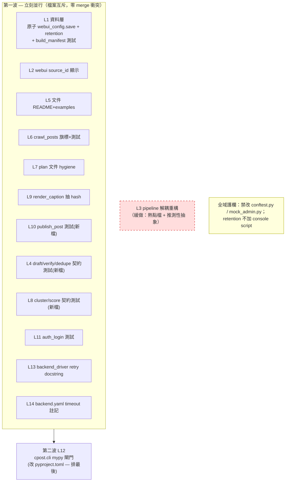

# 並行安全優化路線圖（不撞車）

## Overview

**一句結論**：先扣掉「已經做完只是 checkbox 沒更新」的工作後，現在真正還開著的優化有 **24 項**；經碰撞分析（union-find 連通分量）切成 **14 條檔案互斥的車道**。其中 **12 條可以立刻同時開工、保證不撞車**；只有 **L12（mypy 閘門）需排在最後**、**L3（pipeline 解耦）建議直接緩做**。再加 2 條全域護欄（不准動共用測試基建、retention 不要加新 console script）。

**這份計畫不是「要做哪些優化」，而是「哪些優化的精確檔案集互不重疊，可以放心並行」** —— 因為這個 repo 背景會換 PR 內容（記憶：PR #29 被換、refs 會被移動），「不撞車」是硬約束。

> 目的前置：你給的題目是「分析代碼庫找到現在並行不會撞車的部分 + 完整優化建議，前提是不能撞車」。所以本文交付的是**一張可直接派工的並行地圖**：每條車道一個 owner（人或 agent）、一個 PR，車道之間零檔案重疊。

## Problem Frame

擁有者在 ultracode 模式下要把剩餘優化「並行加速」，但這個 repo 有真實的並行危害史（背景自動化會移 refs、換掉 PR 內容；見記憶 `feedback_concurrent_git_automation`）。因此並行的價值完全取決於一件事：**兩條同時進行的工作流不能改到同一個檔案**（否則 merge 撞車、或被背景流程吃掉）。

本計畫用程式化方法保證這點：把每一項待優化的「精確檔案集」抓出來，凡是共用任一檔案的優化就併進同一條車道（同一 owner、序列化處理）；不共用檔案的優化分到不同車道，**由建構方式保證跨車道零 merge 衝突**。

## Requirements Trace

- **R1（硬約束）**：任兩條「可並行」車道的「修改/新建檔案集」必須完全不相交（含測試檔）。撞車 = 失敗。
- **R2**：不重做已完成工作。先對**實際代碼**驗證每項優化的真實狀態（不信 plan checkbox、不信 commit message），排除 already-done。
- **R3**：對每條開著的車道給出完整、可執行的優化建議（檔案、做法、測試情境、價值/風險）。
- **R4**：標出無法並行的部分（熱點檔、共用基建、CI 閘門排序）與其原因，給序列化方案。

## Scope Boundaries

- **不在本計畫實作任何代碼**（ce:plan 產物是決策與派工地圖，不是 patch）。各車道的實作交給 `ce:work` 或各 owner。
- **不改動發布/安全不變量**（人工 `--approve` 閘門、reviewed-content binding、publish 冪等）—— 這些已是核心不變量，任何車道不得削弱。
- **不做對外發佈 blocker**（命名空間撞名、LICENSE）—— 延後項，非本輪。
- **不追求把所有 24 項都做完**——本計畫只負責**安全地切割與排序**；價值排序見各車道 `價值` 標記，低價值車道（L3、L12 的嚴格化、L13/L14）可選做。

## Context & Research

### 已驗證「做完了，只是 checkbox 沒同步」（從並行素材中排除）

對實際代碼 grep/讀檔驗證，以下**全部已落地**（commit 證據在 fan-out 報告）。**不要對它們開並行工作，會撞既有代碼**：

| 來源 | 項目 | 證據 |
|---|---|---|
| bug-sweep U1–U20 | 全 20 單元 | commit `47fc969`/`5351364` 實改 cluster/url_utils/crawl_posts/filesystem/manifest/db/auth/backend_driver…；plan checkbox 是 stale |
| 成熟度 R1 | `sources` 一級設定 | `webui_config.py:45-50` DEFAULTS + `_validate_sources:192-227` |
| 成熟度 R2 | 多來源爬取 + 逐源可見 | `pipeline.py:98-136 crawl_all_sources` + `routers/crawl.py:40-42 on_source` |
| 成熟度 R5 | 砍信心軸 | `scoring_config.py:28-32 weight_confidence=0.0` |
| 成熟度 R7 | TypedDict 契約 | `schema.py:38-216`（含 PackageInput/Manifest） |
| 成熟度 R12 | LLM HTTP 錯誤覆蓋 | `tests/test_llm.py:61-255`（14 測試） |
| 成熟度 R14 | 型別化 BackendInvocation + stage runner | `backend_args.py:38-57` + `pipeline.py:286-402 _run_stage` |
| 母計畫 P2.2/P2.3 | mypy 阻斷 + core.* 嚴格 | `pyproject.toml:63-78` + CI gate |
| 母計畫 P3.1/3.2/3.3 | 測試分層 + Make targets + CI | `Makefile` test-fast/slow/full + `.github/workflows/ci.yml` |
| 母計畫 P4.2/P4.3 | runs migration + jobs TTL/lock | `runs.py:19-36 _MIGRATIONS` + `jobs.py:23-71 _prune_locked` |
| 母計畫 P5.3 | 可注入 poll 間隔 | `pipeline.py:33/100/127 poll_sec` |
| 母計畫 P6.1–P6.4 | dashboard/run_id link/failure viewer/驗證 UX | `dashboard.py`/`actions.py`/`detail.html`/`settings_auth.py` |
| U14（auth 部分） | storage_state 原子寫 | `browser/auth.py:52-60` tempfile+os.replace（**已做**） |
| U15 | backend driver 強化 | `tests/test_backend_driver_resilience.py` 15 測試綠 |

> 實際測試數已是 **552**（非舊文件寫的 273/381）。

### 碰撞模型（怎麼保證不撞車）

把每項優化看成節點，**只要兩項共用任一「會被修改/新建的檔案」就連一條邊**；連通分量 = 一條車道。

- **同車道**內的優化共用檔案 → 必須**同一 owner、序列化**（同一 PR 或同分支）。
- **跨車道**的優化**保證**不共用任何檔案 → 由建構方式得證**零 merge 衝突**，可放心並行。

碰撞分析輸入 25 項（其中 1 項 L3 為觀察到的重構），輸出 14 車道、20 條檔案重疊邊。詳見「High-Level Technical Design」的矩陣。

### 熱點檔（序列化瓶頸 — 改它就擋住別人）

import 耦合圖顯示這些檔案被最多模組依賴 / 被最多優化想碰，是天然的序列化點：

- `cpost/core/pipeline.py` — 被 `_auto_pipeline`、`routers/crawl`、`scoop_pipeline` 依賴；**L3 想重構它 → 風險最廣**。
- `cpost/core/webui_config.py`、`cpost/core/schema.py`、`cpost/core/db.py` — core 共用地基；L1 獨佔。
- `cpost/webui/_helpers.py`、`routers/_ctx.py`、`templates/base.html` — webui 共用；本輪僅 L2 碰 `_helpers.py`（且不碰 `_ctx.py`/`base.html`）。
- `README.md`、`pyproject.toml` — 文件/設定熱點；分別由 L5、L12 獨佔。

### 共用測試基建（全域禁區）

`tests/conftest.py`（14 行，定義 markers + sys.path）與 `tests/mock_admin.py`（175 行，被 test_auth_login/test_browser_flow/test_webui_actions 共用）**不屬任何車道**。多條測試車道若同時改它們 → 撞車。**護欄：任何並行車道不得修改這兩個檔**；若某車道需要新 fixture，須先作為**序列化前置**單獨提交。

## Key Technical Decisions

- **以「精確檔案集 + union-find」決定並行邊界**，而非以「子系統」或「主題」。理由：撞車是檔案級事件，主題級切割會漏掉跨主題共用檔（例：retention 與 atomic-write 都碰 `webui_config.py`）。
- **測試檔算進碰撞面**。兩條車道改同一個 `test_*.py` 也是撞車，故新測試一律建**獨立新檔**（contract 測試車道 L4/L8/L10 全走新檔）。
- **語意依賴 ≠ merge 撞車**。對抗驗證抓到大量「A 讀 B 改的模組」屬唯讀消費；只要 B 不改函式簽名（本輪 L1 只加欄位/原子性、不改簽名），就**不撞車也不破壞**，無需序列化，至多 CI 會抓到邏輯破。只有「改同一檔」與「CI 閘門全域生效」才是真並行阻擋。
- **L12（對 `cpost.cli.*` 開 mypy 嚴格）排到最後或用寬鬆旗標**。理由：若一上來就開嚴格，CI 立刻紅（驗證估 ~57 個既有未標註錯誤），會擋住所有改 CLI 的車道（L6/L9）。
- **L1 的 retention 不要新增 console script**。理由：新增 `[project.scripts]` 會改 `pyproject.toml` → 撞 L12。改用「auto-pipeline 內呼叫」或既有入口旗標暴露；若一定要 script，把那一行 pyproject 編輯併進 L12。
- **L3（pipeline 解耦重構）緩做**。理由：它重構最熱的檔、且是「為解耦而解耦」的推測性抽象（違反全域規則「No speculative abstractions / 簡單優先」）；價值低、阻擋面大。要做就單獨做、不與任何碰 pipeline.py 的工作並行。

## Open Questions

### Resolved During Planning

- 「哪些優化已完成？」→ 已對實際代碼逐項驗證（見上表），排除。
- 「L1 原子寫殘留範圍？」→ 經查 `manifest.save` 已原子、`browser/auth.py` 已原子，**只剩 `webui_config.save:156` 裸 `write_text`** 一個檔。
- 「retention 真休眠？」→ `purge_before` 在 `audit.py:10`/`runs.py:115` 有定義，全 repo **零呼叫**，確認休眠。

### Deferred to Implementation

- L1 retention 的觸發點（auto-pipeline 尾段 vs 既有入口旗標）與設定鍵命名（`audit_retention_days` / `max_audit_bytes`）——實作時定，避免新 console script。
- L12 嚴格度（嚴格 vs 寬鬆基線）——實作時先跑 `mypy` 看 CLI 既有錯誤數再決定；本計畫只定「排最後」。
- L9 `make_content_hash` 抽出後的公開簽名——須保持 `render_record`/`load_template` 對外簽名不變（L3/pipeline 唯讀消費它們）。

## High-Level Technical Design

> *以下為審查用的方向性示意，非實作規格。實作者把它當脈絡，不是要照抄的代碼。*

### 車道相依與排序（mermaid）

### 碰撞矩陣（第一波車道 × 修改檔案；空格 = 不碰 = 不撞）

| 車道 | 主要修改檔（merge 衝突面） | 新建測試檔 | 共用熱點？ |
|---|---|---|---|
| **L1** | `core/webui_config.py`, `core/audit.py`, `core/runs.py`, `core/manifest.py` | test_audit/test_runs/test_build_manifest/test_filesystem/test_generate_article | 獨佔 webui_config/runs |
| **L2** | `webui/_helpers.py`, `webui/routers/packages.py`, `templates/_packages_table.html`, `templates/detail.html` | test_webui_packages | 獨佔 _helpers（不碰 _ctx/base） |
| **L5** | `README.md`, `examples/scheduling.md` | — | 獨佔 README |
| **L6** | `cli/crawl_posts.py` | test_crawl_posts | 獨佔 crawl_posts |
| **L7** | `docs/plans/2026-06-22-002-…bug-sweep…md`, `docs/plans/ACTIVE.md`(新) | — | 純文件 |
| **L9** | `cli/render_caption.py` | test_render_caption | 獨佔 |
| **L10** | — | **test_publish_post.py(新)** | 純新測試 |
| **L4** | — | **3 個新契約測試檔** | 純新測試 |
| **L8** | — | **2 個新契約測試檔** | 純新測試 |
| **L11** | — | test_auth_login | 純測試 |
| **L13** | `browser/backend_driver.py` | — | 獨佔 |
| **L14** | `configs/backend.yaml` | — | 獨佔 |

> 任兩列的「修改檔 ∪ 新建測試檔」交集為空 → 第一波 12 條保證不撞車。唯一需人盯的全域面是 `conftest.py`/`mock_admin.py`（見護欄）。

## Implementation Units

> 每個 Unit = 一條車道 = 一個 owner / 一個 PR。第一波（L1,L2,L4,L5,L6,L7,L8,L9,L10,L11,L13,L14）可同時派發；L12 排第二波；L3 緩做。

### 第一波（立刻並行）

- [ ] **L1 — 資料層：補原子寫殘留 + 啟用 retention（最高價值）**

**Goal:** 修掉唯一仍非原子的耐久寫入，並把休眠的保留/輪替功能接上線。
**價值:** 高（durability 正確性 + 無人值守成熟度）。**Requirements:** R2, R3。**Dependencies:** 無。
**Files:**
- Modify: `cpost/core/webui_config.py`（`save:156` 裸 `write_text` → 改用 `core/filesystem.atomic_write_text`）
- Modify: `cpost/core/audit.py`, `cpost/core/runs.py`（把既有 `purge_before` 接上觸發點 + 設定鍵）
- Test: `tests/test_filesystem.py`, `tests/test_build_manifest.py`, `tests/test_audit.py`, `tests/test_runs.py`, `tests/test_generate_article.py`
**Approach:**
- 原子寫：`webui_config.save` 改走 `atomic_write_text`（helper 已存在且有測試）；`manifest.save`、`browser/auth.py` 已原子，**不重做**。
- Retention：`purge_before` 已存在但零呼叫；加設定鍵（`audit_retention_days`/`max_audit_bytes`，進 `webui_config.DEFAULTS`）+ 在 auto-pipeline 尾段或既有入口呼叫。**不新增 console script**（避免撞 L12 的 pyproject.toml）。
- **不含** P2.4 sqlite row 型別（低價值，剔除以免把 db/state/reviewed/library 也拉進本車道，徒增碰撞面）。
**Patterns to follow:** `cpost/core/filesystem.py:atomic_write_text`（tempfile + `os.replace`）；`browser/auth.py:52-60` 是同模式範例。
**Test scenarios:**
- Happy: `webui_config.save` 寫入後內容正確、可 round-trip load。
- Edge: 寫入過程模擬崩潰（temp 存在但未 replace）→ 原檔不被截斷。
- Happy: `purge_before(cutoff)` 刪掉早於 cutoff 的 audit 行 / run 記錄，保留之後的。
- Edge: retention 設定缺省（未設）→ 不刪任何東西（向後相容）。
- Integration: auto-pipeline 跑完後 retention 觸發、audit log 行數受 `max_audit_bytes`/天數界限。
**Verification:** `webui_config.save` 不再出現裸 `write_text`；`grep purge_before` 出現真實呼叫點；`make test-fast` 綠。

- [ ] **L2 — WebUI：在 /packages 列表與詳情顯示 source_id（多來源出處）**

**Goal:** 把已存在於 manifest 的 `source.source_id` 顯示到包列表與詳情（純顯示/篩選，非評分）。
**價值:** 中高（多來源主線的可見性缺口）。**Requirements:** R3（成熟度 R4 出處顯示）。**Dependencies:** 無（manifest 已帶 source_id）。
**Files:**
- Modify: `cpost/webui/_helpers.py`（`_scan_packages` row dict 加 `source_id`）、`cpost/webui/routers/packages.py`（詳情 context 加 `source_id`）、`cpost/webui/templates/_packages_table.html`、`cpost/webui/templates/detail.html`
- Test: `tests/test_webui_packages.py`
**Approach:** 從 `manifest['source']['source_id']` 取值，缺省走 `.get()`（向後相容，dashboard/actions 用 `.get` 不破）。**不碰** `_ctx.py`/`base.html`（保持與其他 webui 工作互斥）。
**Patterns to follow:** `schema.py:empty_manifest` 的 `ManifestSource` 形狀；現有 `_scan_packages` row 欄位。
**Test scenarios:**
- Happy: 包含 source_id 的 manifest → 列表列與詳情頁顯示該 id。
- Edge: 舊 manifest 無 `source` 區塊 → 顯示空/`—`，不報錯。
- Integration: 兩個不同 source_id 的包並存 → 各自顯示正確出處。
**Verification:** `/packages` 與詳情頁渲染出 source_id；`tests/test_webui_packages.py` 綠。

- [ ] **L4 — CLI 契約測試：draft-post / verify-draft / dedupe-posts（純新檔）**

**Goal:** 補三個發布路徑 CLI 的錯誤契約測試（exit code / stdout / stderr）。
**價值:** 中（填補「約 1/3 指令零契約測試」缺口；發布路徑優先）。**Requirements:** R3（母計畫 P1.4）。**Dependencies:** 無。
**Files:** Create/Test: `tests/test_draft_post_cli_contract.py`, `tests/test_verify_draft_cli_contract.py`, `tests/test_dedupe_posts_cli_contract.py`
**Approach:** 對每個指令的 `_parse()/_run()` 餵各種參數；**只建新檔，不改被測模組、不改 conftest/mock_admin**。
**Test scenarios（每指令）:** Happy（成功 exit 0 + 正確 stdout）；Error（缺/壞輸入 → exit 2 + stderr + 空 stdout）；Error（外部/瀏覽器失敗 → exit 4）。
**Verification:** 三新檔測試綠；`make test-fast` 不變慢於既有基線。

- [ ] **L5 — 文件對齊：README + examples/scheduling.md（純文件）**

**Goal:** 補上未文件化的 console script 與 cron 範例連結；剔除過時敘述。
**價值:** 中（便宜、建立信任、降低新操作者門檻）。**Requirements:** R3（成熟度 R9/R10）。**Dependencies:** 無。
**Files:** Modify: `README.md`, `examples/scheduling.md`
**Approach:** README 加「可跑範例」段落連到 `examples/scheduling.md`；確認 scheduling.md 的 10 個指令都在 `pyproject [project.scripts]`（已查證存在）；**剔除 DOC-07（封面/concurrency 敘述，封面已於 #31 移除，屬過時）**；mypy 政策 README 已有，不重複。
**Test scenarios:** `Test expectation: none — 純文件`（人工核對指令名與 pyproject scripts 一致）。
**Verification:** README 有指向 scheduling.md 的連結；scheduling.md 無 command-not-found 風險指令。

- [ ] **L6 — crawl-posts：補 `--download-delay` 旗標 + 邊界測試**

**Goal:** 完成 CLI/config parity（`download_delay` 在 CONFIG_DEFAULTS 卻無旗標）；補 crawl timeout 與壞 selector fallback 的測試。
**價值:** 中（cheap parity + 補既有功能的測試）。**Requirements:** R3（母計畫 P1.3）。**Dependencies:** 無。
**Files:** Modify: `cpost/cli/crawl_posts.py`；Test: `tests/test_crawl_posts.py`
**Approach:** 仿 `--min-text-chars`（已存在的同模式）加 `--download-delay`，pass-through 到 opts/Scrapy。新增測試覆蓋 wall-clock timeout（exit 4、stdout 純 NDJSON）與壞 CSS selector 靜默 fallback。
**Test scenarios:** Happy（旗標值傳到 Scrapy DOWNLOAD_DELAY）；Edge（超 `max_runtime_sec` → 子程序被殺、exit 4、stdout 空）；Edge（來源給壞 selector → 退回內建抽取、stderr 不噪音）。
**Verification:** `crawl-posts --download-delay 1.0` 生效；`tests/test_crawl_posts.py` 綠。

- [ ] **L7 — 計畫文件 hygiene：同步 stale checkbox + 建 ACTIVE.md 索引（純文件）**

**Goal:** 把 bug-sweep 計畫 U4–U20 的 stale `[ ]` 改成 `[x]`（代碼已落地）；建立 `docs/plans/ACTIVE.md` 區分 active/已歸檔。
**價值:** 中（直接消除「checkbox 與現實不符」這個一直在咬人的 drift）。**Requirements:** R2, R4。**Dependencies:** 無。
**Files:** Modify: `docs/plans/2026-06-22-002-fix-codebase-bug-sweep-plan.md`；Create: `docs/plans/ACTIVE.md`
**Approach:** 對照 commit `47fc969` 勾掉 U4–U20；ACTIVE.md 列出仍 active 的計畫（含本計畫 003）與已 merged/superseded 清單。
**Test scenarios:** `Test expectation: none — 純文件`。
**Verification:** bug-sweep 計畫無殘留 stale `[ ]`；ACTIVE.md 存在且與 `git log` 大型 merge 一致。

- [ ] **L8 — CLI 契約測試：cluster-scoops / score-scoops（純新檔）**

**Goal:** 補兩個 scoop 軌唯讀查詢指令的 CLI 契約測試。
**價值:** 中。**Requirements:** R3（P1.4）。**Dependencies:** 無（語意上消費 `library.py`，但 L1 不改 library 簽名 → 不破）。
**Files:** Create/Test: `tests/test_cluster_scoops_cli_contract.py`, `tests/test_score_scoops_cli_contract.py`
**Approach:** 對 `_run()` 餵缺 `--state`/壞 SQLite/壞 config；**只建新檔**。
**Test scenarios:** Happy（exit 0 + 合法 JSON/NDJSON stdout）；Error（缺 state → exit 2）；Error（壞 SQLite → exit 4）。
**Verification:** 兩新檔綠。

- [ ] **L9 — render-caption：抽出 `make_content_hash` 提升可測性**

**Goal:** 把 inline 的 content_hash 計算抽成獨立函式，便於測試與重用（它是 publish 去重的關鍵）。
**價值:** 中低（可測性/可重用）。**Requirements:** R3。**Dependencies:** 無。
**Files:** Modify: `cpost/cli/render_caption.py`；Test: `tests/test_render_caption.py`
**Approach:** 抽 `make_content_hash(item) -> str`，內部呼叫 `url_utils.content_hash`。**保持 `render_record`/`load_template` 公開簽名不變**（pipeline 唯讀消費）。
**Test scenarios:** Happy（同輸入 → 穩定 hash）；Edge（缺欄位 → 明確行為，不崩）；Regression（抽出後 `render_record` 輸出與抽出前一致）。
**Verification:** `tests/test_render_caption.py` 綠；pipeline 端到端不變。

- [ ] **L10 — publish-post：補完整錯誤契約測試（純新檔，高價值）**

**Goal:** 為**最高風險、不可逆**的發布階段補 CLI 契約測試（目前無專屬 `test_publish_post.py`）。
**價值:** 高（發布是不可逆動作，卻零專屬 CLI 測試）。**Requirements:** R3。**Dependencies:** 無（mock 既有簽名）。
**Files:** Create/Test: `tests/test_publish_post.py`
**Approach:** mock `backend_driver.session/publish_draft`、`manifest`、`state`、`audit`、`runs`；**只建新檔，不改被測模組**。
**Test scenarios:** Error（缺 `--approve` → 拒發）；Error（manifest 狀態錯/JSON 壞 → exit 2）；Error（state 寫入 SQLite lock → exit 4）；Integration（re-entry 冪等：重跑已發布不重複發、不重複記錄）；Integration（U4 混合狀態恢復）。
**Verification:** `tests/test_publish_post.py` 綠且涵蓋上述分支；不削弱任何發布閘門。

- [ ] **L11 — auth-login：補 CLI 契約測試**

**Goal:** 補登入指令的 exit code / 憑證落地 / storage_state 原子性測試。
**價值:** 中。**Requirements:** R3。**Dependencies:** 無。**護欄:** **不得修改 `tests/mock_admin.py`**（共用）；只改 `tests/test_auth_login.py`。
**Files:** Modify/Test: `tests/test_auth_login.py`
**Test scenarios:** Happy（成功存憑證 exit 0）；Error（壞 URL/帳號 → exit 2）；Error（未處理錯誤 → exit 5）；Edge（登入中斷 → storage_state 不留半寫檔，呼應 auth.py 已原子）。
**Verification:** `tests/test_auth_login.py` 綠；未改 mock_admin.py。

- [ ] **L13 — backend_driver：retry 策略 docstring（純文件級代碼註解）**

**Goal:** 補 backend_driver retry（線性 backoff）的模組/函式 docstring 與調參指引。
**價值:** 低（純文件 polish）。**Requirements:** R3（P5.4）。**Dependencies:** 無。
**Files:** Modify: `cpost/browser/backend_driver.py`（僅 docstring/註解，不改邏輯）
**Test scenarios:** `Test expectation: none — 純註解`。
**Verification:** 模組 docstring 說明 retry 公式與 timeout 互動；測試不受影響。

- [ ] **L14 — backend.yaml：補 timeout 設定說明（純設定文件）**

**Goal:** 在 `configs/backend.yaml` 範例補上 `timeout_ms` 的契約說明（目前只記 retry）。
**價值:** 低。**Requirements:** R3。**Dependencies:** 無（與 L13 不同檔，可並行；二者皆小，亦可指派同一 owner 一起做）。
**Files:** Modify: `configs/backend.yaml`
**Test scenarios:** `Test expectation: none — 純設定註解`。
**Verification:** backend.yaml 範例含 timeout 說明，與 `draft_post.py:--timeout-ms` 一致。

### 第二波（排在 CLI 車道之後）

- [ ] **L12 — 對 `cpost.cli.*` 開 mypy 閘門（pyproject.toml，排最後）**

**Goal:** 把 `cpost.cli.*` 納入 mypy 嚴格（目前只 `cpost.core.*` 嚴格）。
**價值:** 中（型別安全擴面），但**排序敏感**。**Requirements:** R3（P2.2 延伸）, R4。
**Dependencies（排序，非 merge）:** 須在 **L6、L9 之後**落地——它們改 CLI，若 mypy 先變嚴格，CI 會對未標註代碼變紅，擋住 L6/L9。
**Files:** Modify: `pyproject.toml`（`[tool.mypy.overrides]` 加 `cpost.cli.*`）
**Approach:** 實作時先 `python -m mypy` 量既有 CLI 錯誤數；若多，先用寬鬆旗標記錄基線、另開「CLI 型別清理」單獨車道，再轉嚴格。**唯一 pyproject 編輯者**——若 L1 retention 真要加 console script，把那一行併進本車道。
**Test scenarios:** `Test expectation: none — CI 設定`（驗收 = CI lint job 綠）。
**Verification:** `make typecheck` 綠且涵蓋 cpost.cli；CI 不因本變更轉紅。

### 緩做 / 不建議本輪做

- [ ] **L3 — pipeline.py 解耦重構（DEFERRED）**

**Goal（原提案）:** 把 `crawl_all_sources` 抽到共用 crawl 模組以「降低 pipeline.py 耦合」。
**為何緩做:** ① `pipeline.py` 是最熱的檔（被 3+ 模組依賴），改它阻擋面最廣；② 屬「為解耦而解耦」的推測性抽象，違反「No speculative abstractions / 簡單優先」；③ 對抗驗證判定它與任何碰 pipeline 的工作都需協調。
**若仍要做:** 單獨一條車道、**不與任何碰 `pipeline.py`/`scoop_pipeline.py` 的工作並行**，且須保持 `crawl_all_sources`/`run_pipeline`/`run_auto_pipeline` 公開簽名不變。

## System-Wide Impact

- **Interaction graph / 熱點:** `pipeline.py`（最熱，L3 才碰，故緩做）、`webui_config.py`/`runs.py`（L1 獨佔）、`README.md`（L5 獨佔）、`pyproject.toml`（L12 獨佔）。第一波刻意避開所有跨車道共享。
- **共用基建禁區:** `tests/conftest.py`、`tests/mock_admin.py` —— 任何並行車道不得改；需改則作序列化前置（影響 L4/L8/L10/L11）。
- **隱藏碰撞點（真）:** L1 retention **若**新增 `[project.scripts]` → 撞 L12 的 `pyproject.toml`。緩解：retention 走程式呼叫不加 script，或把該行併進 L12。
- **語意（非 merge）依賴:** L8/L10/L11/L4 唯讀消費 L1 改的模組；L1 只加欄位/原子性、不改簽名 → 不破。寫測試時對**當前**公開簽名寫；若 L1 改簽名，由 L1 自己更新其檔（不同檔，不撞）。
- **CI 閘門全域性:** mypy/ruff/pytest 經 `pyproject.toml`/CI 對全 repo 生效 → 這是 L12 必須最後落地的根因（唯一能「跨車道全域變紅」的面）。
- **不變量未動:** 發布人工閘門、reviewed-content binding、publish 冪等、`crawl_all_sources` 逐源隔離 —— 所有車道明確不改。

## Risks & Dependencies

| 風險 | 緩解 |
|---|---|
| 背景自動化移 refs / 換 PR 內容（記憶在案） | 每條車道獨立分支 + 小 PR；owner 只碰自己車道檔；不碰非自建檔 |
| L1 retention 加 console script 撞 L12 | 決策：retention 不加 script（程式呼叫）；必要時併入 L12 |
| L12 先嚴格 → CI 全紅擋住 L6/L9 | L12 排最後；先量錯誤數，必要時寬鬆基線 + 另開型別清理車道 |
| 多測試車道同改 conftest/mock_admin | 全域禁區；需共用 fixture 時序列化前置 |
| L3 重構熱點檔擴大爆炸半徑 | 緩做；要做就單獨、不並行、保簽名 |
| 語意依賴造成「各自綠、合併紅」 | 測試對當前簽名寫；CI 全量 `pytest` 為最終防線；L1 不改簽名 |

## 派工建議（怎麼真的開並行）

1. **同時派發第一波 12 條**（L1,L2,L4,L5,L6,L7,L8,L9,L10,L11,L13,L14）——各一分支、一 PR、一 owner/agent。L1 最大，給最強 owner。
2. **第一波 CLI 車道（L6/L9）合併後，再派 L12**（mypy 閘門）。
3. **L3 不排入本輪**；如要做，等第一波清空、單獨進行。
4. **全程護欄廣播給所有 owner**：不准碰 `tests/conftest.py`、`tests/mock_admin.py`、`cpost/core/pipeline.py`；retention 不加 console script。
5. 建議用 `isolation: worktree`（每 agent 獨立 git worktree）跑第一波，物理隔離寫入，呼應碰撞分析的保證。

## Sources & References

- **Origin:** `docs/brainstorms/2026-06-22-multi-source-aggregation-maturity-requirements.md`
- 母計畫（superseded，仍提供開項清單）：`docs/plans/2026-06-16-004-deep-optimization-master-plan.md`
- bug-sweep（checkbox stale，代碼已落地）：`docs/plans/2026-06-22-002-fix-codebase-bug-sweep-plan.md`（commit `47fc969`/`5351364`）
- 並行危害記憶：`feedback_concurrent_git_automation`、`bug-sweep-2026-06-22`
- 碰撞分析：fan-out workflow（22 agents / 14 lanes / 20 overlap edges），結果存於本 session task `w2wz8lute`
- 關鍵代碼錨點：`core/webui_config.py:156`（非原子）、`core/audit.py:10`+`core/runs.py:115`（purge_before 休眠）、`browser/auth.py:52-60`（已原子）、`pyproject.toml:25-39`（14 scripts，無 maintenance）、`tests/conftest.py`+`tests/mock_admin.py`（共用基建）
