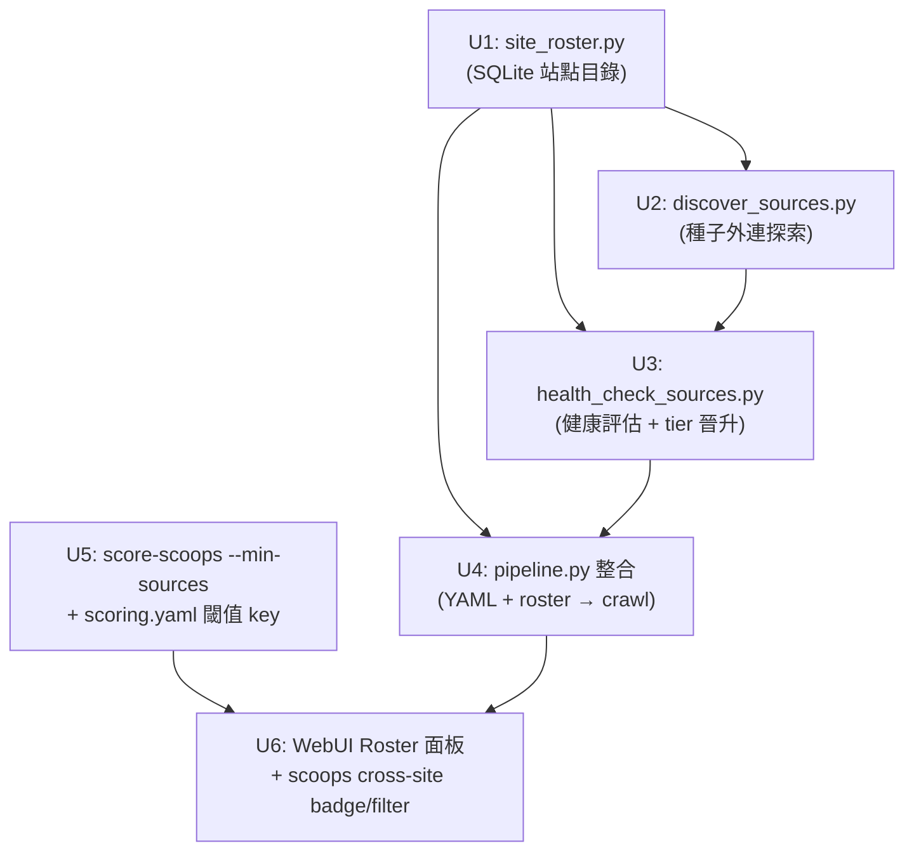

# feat: Auto Source Discovery + Cross-Site Topic Heat

## Overview

目前的來源清單靠手動在 `configs/webui.yaml` 填寫 `sources:`，是「餵飯工具」。本計畫把 cpost 改成自動化工具：從已知種子站爬取外連，發現新站點 → 健康評估與鏡像偵測 → 自動晉升為 active tier → 合併進爬取流程。同時，把「多站交集」轉化為 WebUI/CLI 可篩選的 **cross-site heat** 信號，讓用戶一眼找到值得操作的議題。

## Problem Frame

用戶要的是自動化：每次跑 pipeline 都能拿到多個獨立站點的內容 → 聚類後找到「多站都有報導」的議題 → 這些題材最值得操作（多源佐證、獨立覆蓋）。

三個子問題：
1. **站點發現**：種子站 → 外連域名 → 候選池（目前完全手動）
2. **站點健康管理**：候選 → 評估（有無內容？是否鏡像？）→ 自動晉升 active / 標記鏡像
3. **交集呈現**：cluster 的 `source_count` 已存在但被中性化；需要在 UI/CLI 把「多站題材」浮出來

## Requirements Trace

- R1. `crawl_all_sources` 能自動從 roster DB 讀出 active 站點並爬取，不依賴手動 YAML 更新
- R2. `discover-sources` CLI 從種子站外連爬取候選域名，寫入 roster，不需人工操作
- R3. 健康評估自動判定鏡像（canonical URL 重疊 >60% → 標記 is_mirror），鏡像不計入 cross-site heat
- R4. `score-scoops --min-sources N` 篩選 source_count ≥ N 的 scoops（actionable 過濾）
- R5. WebUI scoops 面板有「多站交集」badge 與篩選器，方便快速識別熱點議題
- R6. WebUI 有 Source Roster 唯讀面板，顯示所有站點的 tier / health / 最後爬取時間

## Scope Boundaries

- **不做**：將站點列表寫入 YAML（roster 站點資料完全用 DB 管理；YAML `sources` 繼續作為永久種子；`roster_path` 在 YAML 只是一個 config 指標 key，不是站點清單）
- **不做**：跨 session 的鏡像深度分析（只做快速 canonical URL 重疊比對）
- **不做**：搜尋引擎探索（因 adult 內容被 safe search 過濾）
- **不做**：re-enable `weight_confidence`（改用前端篩選，不改排序邏輯，避免行為漂移）
- **不做**：自動 publish / 全自動 pipeline（discovery 是 pipeline 前置步驟，不觸碰 publish 流程）

## Context & Research

### Relevant Code and Patterns

- `cpost/core/db.py:connect()` — 所有 SQLite module 共用的 WAL + busy_timeout + schema/migration pattern，`site_roster.py` 完全照抄
- `cpost/core/state.py` — `_SCHEMA` 定義方式、`connect()` 包裝模式的標準範本
- `cpost/cli/crawl_posts.py` — subprocess spawn pattern（Scrapy reactor 不可在同進程重啟）；`health_check_sources` 的取樣爬取沿用此 subprocess 模式；`discover_sources` 使用 stdlib HTTP（無 subprocess，不涉及 Scrapy）
- `cpost/core/pipeline.py:crawl_all_sources()` — 讀 `enabled_sources(webui_cfg)` 再逐一 `crawl_items()`；roster 整合就是在這裡加一個 DB 來源路徑
- `cpost/core/pipeline.py:_PER_SOURCE_OVERRIDE_KEYS` — 只允許爬取相關 key 被 per-source 覆蓋；roster 的 per-site 設定遵循相同 allowlist
- `cpost/core/cluster.py:_summarize()` — `source_count` 已計算 distinct source_ids；cross-site heat 直接讀這個欄位
- `configs/scoring.yaml` — `weight_confidence: 0.0` 是刻意的（鏡像塌縮說明）；本計畫不改此值，改在 UI 層加篩選

### Institutional Learnings

- 鏡像因共用 canonical URL 會在 library 中塌縮 → `source_count` 在鏡像環境下無意義（2026-06-22 決策；`weight_confidence=0` 是必要設計，不是 bug）
- 背景自動化會搶 refs、移動 worktree（feedback_concurrent_git_automation）；PR 推後要比對 SHA，本計畫新增的 DB 是 side-effect-safe（WAL mode）
- `_PER_SOURCE_OVERRIDE_KEYS` 白名單保護基礎設施 key（B4）；roster 的 per-site override 必須遵循相同 allowlist
- `db.py:connect()` 已有 savepoint-based migration，可直接用版本化遷移管理 roster schema 演進

## Key Technical Decisions

- **Roster 用獨立 DB 檔案**（`state/roster.sqlite`）而非加表到 `published.sqlite`：publish state 與 site catalog 是不相關的 concerns；分開避免耦合，且 `roster_path` 是 optional config key（不動既有 `state_path`）。

- **Discovery 用 stdlib (`urllib.request` + `html.parser`) 而非 Scrapy**：發現新站只需 fetch homepage + 幾個已知的友鏈頁面（/links/, /friends/）並抽取外部 `<a>` 標籤，不需要爬取管線；stdlib 無新依賴、無子進程複雜度。Scrapy subprocess pattern 留給 `crawl_items`（內容爬取）。

- **鏡像偵測用 canonical URL 重疊率（閾值 0.6）**：候選站健康評估時，用 `crawl_items(limit=10)` 爬取少量內容，計算 canonical URL 與 library 中 existing active 站的重疊率；> 0.6 → `is_mirror=True`。0.6 的依據：實測資料（見 scoring.yaml 注記）顯示 51cg1(30 items) vs 91cg1(1 item) 的重疊率接近 1.0（轉載源），而真正獨立站的重疊率應接近 0；0.6 留出樣本誤差（limit=10 可能恰好有少量轉載），同時避免把少量巧合重疊的真實獨立站誤判為鏡像。此閾值設為 `mirror_overlap_threshold: 0.6` 放到 `scoring.yaml`（可調）。

- **Tier 狀態機 (candidate → monitored → active / mirror / failed / inactive)**：candidate = 剛發現；monitored = 有內容且非鏡像，**1 次健康通過即晉升 active**（不等 3 次，避免議題週期 24-48h 內錯過）；active = 正常爬取；inactive = active 站連續失敗 3 次標記（保留備查，與 failed 區分）；mirror = 已標鏡像；failed = candidate/monitored 失敗 3 次。

- **Cross-site heat 不改 scoring 排序**：`weight_confidence` 保持 0，避免改變現有排序行為。改用 UI 篩選層（`score_scoops --min-sources N`、WebUI badge/filter）讓用戶自己決定閾值。這是功能疊加，不是行為替換。

- **Pipeline 整合方式：roster 補充 YAML，不取代**：YAML `sources` 繼續是永久種子（必爬），roster active 是動態補充。`crawl_all_sources` 先爬 YAML，再爬 roster active 中不在 YAML 的站；兩者都出現時以 YAML 設定為準（避免 roster 覆蓋手工微調的 selectors）。

## Open Questions

### Resolved During Planning

- Q: 用搜尋引擎還是外連追蹤？→ 外連追蹤（使用者選定，adult 內容被 safe search 過濾掉；外連是成人站生態的主要流量分發機制）
- Q: 鏡像如何偵測？→ canonical URL 重疊率（已有 `url_utils.normalize_url`；比起 content fingerprint 更快且不需 full crawl）
- Q: 要不要 re-enable weight_confidence？→ 不改（保持 0），改在 UI 層加篩選，避免改動已驗證的排序邏輯

### Deferred to Implementation

- 友鏈頁面路徑應該爬哪幾個（/links, /friends, /tuijian, etc.）→ 實作時讀各種子站首頁判斷；可做成可配置的 `discovery_link_paths` list
- 健康評估的 `crawl_items(limit=10)` 的 timeout 設定 → 實作時參考 `DEFAULT_CRAWL_MAX_RUNTIME_SEC` 並縮短（健康評估只要少量樣本）
- WebUI Roster panel 的具體 HTML template 結構 → 參考現有 `sources` panel（PR #34 加的）

## High-Level Technical Design

> *這是方向性設計，供審閱者驗證意圖，不是實作規格。*

```
       ┌─────────────────────────────────────────────────────────┐
       │  webui.yaml sources (永久種子，手動維護)                  │
       └─────────────────────────────┬───────────────────────────┘
                                     │
                    ┌────────────────▼────────────────┐
                    │  discover-sources CLI             │
                    │  (stdlib HTTP + html.parser)      │
                    │  seed homepage → external links   │
                    │       → roster.sqlite             │
                    └────────────────┬────────────────┘
                                     │ candidates
                    ┌────────────────▼────────────────┐
                    │  health-check-sources CLI         │
                    │  crawl_items(limit=10) 取樣        │
                    │  canonical overlap → mirror check │
                    │  tier 狀態機 (fail_count 計數器)   │
                    └──────┬──────────────┬────────────┘
                    active │              │ mirror/failed
           ┌───────────────▼──────────────▼──────────────┐
           │           roster.sqlite                       │
           │  domain | tier | is_mirror | fail_count | ... │
           └───────────────┬──────────────────────────────┘
                           │ active sites
       ┌───────────────────▼───────────────────────────────┐
       │  crawl_all_sources (pipeline.py)                   │
       │  YAML sources (全爬) + roster active (補充，不重複)  │
       └───────────────────┬───────────────────────────────┘
                           │ raw items
                    ┌──────▼──────┐
                    │ cluster →   │  source_count 已有
                    │ score_scoops│  (多站覆蓋 = 高 heat)
                    └──────┬──────┘
                           │
         ┌─────────────────▼──────────────────┐
         │  WebUI Scoops 面板                  │
         │  🔥 badge: source_count ≥ threshold │
         │  filter: 只看多站 scoops            │
         └─────────────────────────────────────┘
```

## Implementation Units



---

- [ ] **U1: `cpost/core/site_roster.py` — 站點目錄 SQLite store**

**Goal:** 提供 roster 的完整 CRUD 接口，讓 U2/U3/U4 可以讀寫站點狀態。

**Requirements:** R1, R2, R3, R6

**Dependencies:** 無（只依賴 `cpost/core/db.py`）

**Files:**
- Create: `cpost/core/site_roster.py`
- Create: `tests/test_site_roster.py`

**Approach:**
- Schema: `sites` table，columns: `domain TEXT PRIMARY KEY`, `start_url TEXT`, `source_id TEXT`, `tier TEXT`, `is_mirror INTEGER DEFAULT 0`, `fail_count INTEGER DEFAULT 0`, `monitored_ok_count INTEGER DEFAULT 0`, `item_regex TEXT`, `body_selector TEXT`, `last_checked_at TEXT`, `last_crawled_at TEXT`, `notes TEXT`
- Tier 值（字串常數）：`CANDIDATE = "candidate"`, `MONITORED = "monitored"`, `ACTIVE = "active"`, `MIRROR = "mirror"`, `FAILED = "failed"`, `INACTIVE = "inactive"`（active 站點連續 3 次失敗後標記為 inactive，與 failed 區分保留備查）
- 函數：`upsert_site(path, domain, start_url, ...)`, `list_by_tier(path, tier)`, `update_health(path, domain, *, fail_count, monitored_ok_count, last_checked_at)`, `update_crawled_at(path, domain, *, last_crawled_at)`, `set_tier(path, domain, tier)`, `list_active(path)` → list[dict]
- 完全照 `cpost/core/state.py` 的 `connect()` 包裝模式；`connect()` 參數傳給 `cpost/core/db.py:connect()`
- `upsert_site` 用 `INSERT OR REPLACE`（domain 是 PK，重複插入更新欄位）

**Patterns to follow:**
- `cpost/core/state.py` 的 `_SCHEMA`, `connect()`, `@contextmanager` 結構
- `cpost/core/db.py:connect()` 的 `WAL + busy_timeout + schema + migrations` 呼叫方式

**Test scenarios:**
- Happy path: upsert 一個 site → list_active 回傳它（tier=active）
- Happy path: upsert 兩個 site，一個 active 一個 mirror → list_active 只回傳 active
- Happy path: update_health 增加 fail_count → 再 list_by_tier 驗證更新
- Edge case: 同一 domain upsert 兩次（第二次 start_url 不同）→ 用最新值（INSERT OR REPLACE 語意）
- Edge case: DB 路徑不存在 → parent dir 自動建立（db.py 行為，驗證不 crash）
- Error path: tier 值為 None → 存 NULL，list_by_tier(ACTIVE) 不回傳它

**Verification:**
- `tests/test_site_roster.py` 全綠
- mypy strict 不報新錯誤（pure sqlite, 無外部型別）

---

- [ ] **U2: `cpost/cli/discover_sources.py` — 種子外連探索 CLI**

**Goal:** 從 YAML sources 的 start_url 爬取首頁與常見友鏈頁，抽取外部域名，寫入 roster 為 candidate。

**Requirements:** R2

**Dependencies:** U1 (site_roster)

**Files:**
- Create: `cpost/cli/discover_sources.py`
- Modify: `cpost/core/validators.py` — 加 `is_safe_external_host(hostname: str) -> bool`（RFC-1918/loopback/link-local 過濾）
- Modify: `pyproject.toml` — 加 `discover-sources = "cpost.cli.discover_sources:main"` entry point
- Create: `tests/test_discover_sources.py`

**Approach:**
- 純 stdlib：`urllib.request.urlopen(Request(url, headers={"User-Agent": ...}))` + `html.parser.HTMLParser` 子類抽取 `<a href>`
- 探索路徑策略：對每個種子站，嘗試 `start_url`（首頁）+ 常見友鏈路徑 `["/links/", "/friends/", "/tuijian/", "/link.html"]`（404 時跳過）
- 過濾邏輯：外部域名（`host_of(href) != seed_host`）→ `is_safe_external_host(hostname)` 通過（過濾 RFC-1918 私有段 10/8、172.16/12、192.168/16、loopback 127/8、link-local 169.254/16）→ 非 roster 已知域名 → 非 YAML sources 已有域名 → HTTP HEAD 可通（不 4xx/5xx）
- 候選數量上限：`--max-candidates-per-seed INT`（default=20）、`--max-total-candidates INT`（default=50），達上限後 log warning 停止，防止被污染種子站暴增候選
- 寫入 roster：`upsert_site(domain, start_url=scheme+domain, tier=CANDIDATE, source_id=derived_from_domain)`；source_id 推導公式：`re.sub(r'[^a-z0-9-]', '-', domain.lower())[:64]`（sanitize + 截斷，確保和 cluster source_count 的 distinct key 一致）
- CLI interface：`--sources-yaml PATH` 讀 webui.yaml；`--roster-path PATH`；`--dry-run` 只印不寫
- 輸出：每行印 `[CANDIDATE] domain` 或 `[SKIP] domain reason`（to stderr）

**Patterns to follow:**
- `cpost/core/url_utils.host_of()` 做 domain 提取
- `cpost/core/cli.py` 的 argparse 包裝模式
- 不用 Scrapy（不需要 subprocess），用 stdlib HTTP

**Test scenarios:**
- Happy path: mock urlopen 回傳含外部連結的 HTML → 候選域名出現在 roster（tier=candidate）
- Happy path: `--dry-run` → roster 無寫入，只印候選到 stderr
- Edge case: 種子站首頁 404 → 跳過，不 crash，其他種子繼續
- Edge case: 候選域名已在 YAML sources → skip（不重複加入 roster）
- Edge case: 候選域名 HEAD 請求 timeout → skip，記錄 SKIP reason
- Edge case: 友鏈頁路徑全 404 → 只從首頁抓，不 crash
- Error path: `--sources-yaml` 指向不存在的檔案 → clean error message（exit non-zero）

**Verification:**
- `--dry-run` 模式跑完不修改任何檔案
- 對一個已知種子站（測試用 mock）能找到 ≥1 個外部候選域名

---

- [ ] **U3: `cpost/cli/health_check_sources.py` — 健康評估 + tier 晉升 CLI**

**Goal:** 對 roster 中 candidate/monitored 站點進行健康評估：取樣爬取、鏡像偵測、tier 狀態機轉換。

**Requirements:** R3

**Dependencies:** U1 (site_roster), U2 (discover_sources 提供候選)；間接依賴 `crawl_posts.crawl_items`

**Files:**
- Create: `cpost/cli/health_check_sources.py`
- Modify: `pyproject.toml` — 加 `health-check-sources = "cpost.cli.health_check_sources:main"` entry point
- Modify: `configs/scoring.yaml` — 加 `mirror_overlap_threshold: 0.6`（U3 的鏡像偵測用；與 `actionable_min_sources` 一起放在新的「# --- 站點管理 ---」區塊）
- Modify: `cpost/core/scoring_config.py` — DEFAULTS 加 `"mirror_overlap_threshold": 0.6`
- Create: `tests/test_health_check_sources.py`

**Approach:**
- 對每個 candidate/monitored site 建立 opts（`CONFIG_DEFAULTS` merge，設 `opts['start_urls'] = [site['start_url']]`、`opts['source_id'] = site['source_id']`、`opts['limit'] = 10`），再執行 `crawl_posts.crawl_items(opts, max_runtime_sec=60)`（`limit` 必須在 opts 內，不是 kwarg）
- 取樣後計算：
  1. `item_count` ≥ 2 → 有內容
  2. 最新 `published_at` 距今 < 72h → fresh（無 published_at 時降級為 `item_count` ≥ 3）
  3. **鏡像偵測**：用 `cpost/core/url_utils.normalize_url` 把取樣的 canonical URL 與 library DB 中 existing active 站的 URL 做集合交集；重疊率 = `|intersection| / |sample|`；重疊率 > 0.6 → `is_mirror=True`
- Tier 轉換邏輯：
  - candidate + 通過（有內容 + fresh + 非鏡像）→ `MONITORED`，reset fail_count
  - candidate + 鏡像 → `MIRROR`
  - candidate + 失敗（unreachable / no items）→ fail_count += 1；fail_count ≥ 3 → `FAILED`
  - monitored + 通過（1 次即晉升）→ `ACTIVE`；`monitored_ok_count` 欄位保留供未來彈性調整，此版本設為 1
  - monitored + 失敗 → fail_count += 1；monitored_ok_count 不變（本版無連續計數需求）；fail_count ≥ 3 → `FAILED`
  - active + 失敗 → fail_count += 1；≥ 3 → `INACTIVE`（不是 FAILED，保留備查）
- CLI interface：`--roster-path PATH`；`--library-db PATH`（用於鏡像比對）；`--tier candidate,monitored`（限定評估哪些 tier）；`--dry-run`

**Patterns to follow:**
- `cpost/core/pipeline.py:crawl_items()` 的 `opts` 構造方式（`CONFIG_DEFAULTS` merge）
- `cpost/core/url_utils.normalize_url` 做 canonical URL 正規化
- 健康評估失敗不應 crash 整個 CLI（per-site try/except，記錄錯誤繼續下一個）

**Test scenarios:**
- Happy path: mock crawl_items 回傳 5 個新鮮 items，non-mirror → site tier 從 candidate 升到 monitored
- Happy path: monitored site 3 次連續通過 → 升到 active
- Happy path: candidate 鏡像（>60% canonical 重疊）→ tier 設 MIRROR，is_mirror=1
- Edge case: crawl_items 回傳 0 items → fail_count += 1，tier 不變（還未到 3 次）
- Edge case: fail_count = 2 → crawl 又失敗 → fail_count = 3 → tier = FAILED
- Error path: 某個 site 的 crawl_items 拋 ExternalError → 記錄但繼續評估其他 sites
- Edge case: `--dry-run` → roster 不更新，但印出評估結果

**Verification:**
- 對 mock 鏡像站的 canonical overlap > 0.6 時 is_mirror 設為 1
- 狀態機轉換測試覆蓋所有邊（candidate→monitored, monitored→active, active→inactive, candidate→mirror, candidate→failed）

---

- [ ] **U4: `cpost/core/pipeline.py` — Roster 自動整合進爬取來源**

**Goal:** `crawl_all_sources` 除了讀 YAML `sources`，也讀 roster active sites，合併爬取。YAML 優先（種子設定不被 roster 覆蓋）。

**Requirements:** R1

**Dependencies:** U1 (site_roster), U3 (roster 有 active sites 才有意義)

**Files:**
- Modify: `cpost/core/pipeline.py`
- Modify: `cpost/core/webui_config.py` — `roster_path` 加入 `DEFAULTS`（default=`''`）和 `_PATH_FIELDS`（確保 load_raw 不靜默丟棄，save 不覆蓋）
- Modify: `configs/webui.yaml` — 加 `roster_path: ../state/roster.sqlite`（可選，空值時跳過 roster）
- Create: `tests/test_pipeline_roster.py`

**Approach:**
- 在 `crawl_all_sources()` 中，讀 `webui_cfg.get("roster_path")` → 若有值，呼叫 `site_roster.list_active(path)`
- 去重：把 YAML sources 的 `start_url` host 集合建成 set，roster active sites 中 host 不在此 set 的才加入爬取清單
- roster active site 爬取完成後（`crawl_items` 回傳 status['done']）→ 呼叫 `site_roster.update_crawled_at(path, domain, last_crawled_at=now_iso)` 更新最後爬取時間
- Roster site 的 per-source override keys（item_regex, body_selector 等）從 roster row 讀取，受 `_PER_SOURCE_OVERRIDE_KEYS` allowlist 管控
- 如果 roster DB 不存在（檔案不在）→ 靜默跳過（graceful degradation），不 crash
- 如果 `roster_path` 為 None/empty → 跳過 roster 讀取（向後相容，現有 yaml 不需改）
- 若同一 domain 同時存在於 YAML sources 和 roster active，且 per-source keys（item_regex, body_selector 等）不同 → 以 YAML 為準，並 log warning 提示 config 分歧（`logger.warning("roster site %s overridden by YAML source: %s", domain, key_diffs)`）

**Patterns to follow:**
- `cpost/core/pipeline.py:enabled_sources()` 的驗證模式
- `cpost/core/pipeline.py:_PER_SOURCE_OVERRIDE_KEYS` allowlist 應用邏輯
- `cpost/core/site_roster.list_active()` → roster active 轉成跟 YAML sources entry 相同的 dict shape

**Test scenarios:**
- Happy path: roster 有 2 個 active sites，YAML 有 1 個 → crawl_all_sources 爬 3 個
- Happy path: roster active site 的 host 跟 YAML source 重複 → 只爬一次（YAML 設定優先）
- Happy path: `roster_path` 為 None → 只爬 YAML sources，行為跟現在一致
- Edge case: roster DB 檔案不存在（路徑有設但 DB 尚未建立）→ 靜默跳過，繼續爬 YAML
- Edge case: roster active site 的 item_regex 欄位是 non-allowlist key → 忽略（不進 merged config）
- Integration: roster + YAML sources 合併後，`on_source` callback 每個源都被呼叫一次

**Verification:**
- 現有 `tests/test_auto_pipeline.py`, `test_prep_pipeline.py` 全綠（不破壞既有行為）
- 新增 `tests/test_pipeline_roster.py` 覆蓋合併邏輯

---

- [ ] **U5: `score-scoops --min-sources` + `scoring.yaml` actionable 閾值**

**Goal:** CLI 和 scoring config 支援 "actionable" 過濾：`--min-sources N` 只輸出 source_count ≥ N 的 scoops，讓用戶從命令列直接找到多站交集議題。

**Requirements:** R4

**Dependencies:** 無（獨立於 U1-U4，可先做）

**Files:**
- Modify: `cpost/cli/score_scoops.py`
- Modify: `configs/scoring.yaml` — 加 `actionable_min_sources: 2` 說明 key
- Modify: `cpost/core/scoring_config.py` — 加 `actionable_min_sources` 到 DEFAULTS
- Modify: `tests/test_score_scoops_cli_contract.py` — 補 `--min-sources` 合約測試

**Approach:**
- `score-scoops` 加 `--min-sources INTEGER`（default=0 = 不過濾）
- 過濾在 scoring 完成後、輸出前：`[s for s in scored if s["source_count"] >= min_sources]`
- `scoring.yaml` 加 `actionable_min_sources: 2` 作為文件性 key，CLI 可讀（`--min-sources` 若未給值，讀此 key）
- DEFAULTS 加 `"actionable_min_sources": 0`（預設不過濾，保持向後相容）
- `scoring_config.py` 的 DEFAULTS dict 加此 key

**Patterns to follow:**
- `cpost/cli/score_scoops.py` 現有 argparse 結構
- `cpost/core/scoring_config.py:DEFAULTS` 擴充模式

**Test scenarios:**
- Happy path: `--min-sources 2`，有 source_count=1 和 source_count=2 的 scoop → 只輸出後者
- Happy path: `--min-sources 0`（預設）→ 全部輸出（現有行為不變）
- Edge case: `--min-sources` 大於所有 scoop 的 source_count → 輸出空（不 crash）
- Edge case: scoop 無 source_count 欄位（舊格式）→ 視為 0，被 `--min-sources 2` 過濾掉

**Verification:**
- `test_score_scoops_cli_contract.py` 新增 `--min-sources` 合約測試通過
- 現有 `tests/test_score_scoops.py` 全綠

---

- [ ] **U6: WebUI Source Roster 面板 + Scoops Cross-Site Badge/Filter**

**Goal:** WebUI 兩處改動：(1) Source Roster 唯讀面板（顯示站點 tier/health）；(2) Scoops 面板加「多站交集」badge 和 source_count ≥ N 篩選器。

**Requirements:** R5, R6

**Dependencies:** U1, U4（roster 要存在才能顯示）, U5（actionable_min_sources config key）

**Files:**
- Create: `cpost/webui/routers/roster.py`
- Modify: `cpost/webui/app.py` — register `/roster` router
- Modify: `cpost/webui/templates/` — roster.html (唯讀面板)
- Modify: `cpost/webui/templates/scoops.html` — 加 badge + filter UI
- Modify: `cpost/webui/routers/scoops.py` — 接受 `min_sources` query param
- Create: `tests/test_webui_roster.py`
- Modify: `tests/test_webui_scoops.py` — 補 min_sources filter 測試

**Approach:**
- **Roster 面板** (`GET /roster`):
  - 讀 `roster_path`（從 webui_cfg）→ `site_roster.list_by_tier()` 全部 tier
  - 回傳 HTML table：domain | tier badge | is_mirror | fail_count | last_checked_at | last_crawled_at
  - Tier badge 顏色：active=綠、monitored=藍、candidate=灰、mirror=橙、failed=紅、inactive=深灰
  - 若 `roster_path` 未設或 DB 不存在 → 顯示 "尚無自動發現站點" 空白面板
- **Scoops cross-site badge/filter**:
  - 後端 `GET /scoops?min_sources=N` → 讀 `actionable_min_sources`（預設）或 query param
  - 每個 scoop 加 `multi_source` flag（source_count ≥ min_sources）
  - 前端：multi_source=True 的 scoop 顯示 🔥 badge；filter toggle button "只看多站"（切換 `?min_sources=2`）
  - badge/filter 只影響顯示，不改 score 排序

**Patterns to follow:**
- 現有 `cpost/webui/routers/crawl.py` 的 router 結構
- 現有 Sources 唯讀面板（PR #34 加的）的 HTML template 風格
- 現有 `cpost/webui/routers/scoops.py` 的 query param 讀取方式

**Test scenarios:**
- Happy path: `GET /roster` 有 roster DB → HTML 回傳含已知域名的 table row
- Happy path: `GET /roster` 無 roster DB / roster_path 未設 → 200 回傳空面板（不 500）
- Happy path: `GET /scoops?min_sources=2` → 只回傳 source_count ≥ 2 的 scoops
- Happy path: `GET /scoops`（無 param）→ 全部 scoops（現有行為不變）
- Happy path: source_count=3 的 scoop → HTML 含 🔥 badge
- Edge case: min_sources param 為非數字 → 422 / fallback 到預設值（不 500）

**Verification:**
- `tests/test_webui_roster.py` 全綠
- `GET /roster` 不存在 DB 時回傳 200（graceful empty state）
- `GET /scoops?min_sources=2` 正確過濾（unit test + 至少一個 integration test）

---

## System-Wide Impact

- **Interaction graph:** `crawl_all_sources` 是 pipeline 的核心入口；U4 改動影響所有 pipeline 相關測試（`test_prep_pipeline.py`, `test_auto_pipeline.py`）。Roster DB 是新的 side-effect，test isolation 需要 `tmp_path` fixture。`health_check_sources` 內部呼叫 `crawl_posts.crawl_items()`，而 crawl_items 使用 multiprocessing subprocess spawn（Scrapy reactor 不可在進程內重啟）；健康評估因此也是 subprocess-based，測試時需 mock `crawl_posts.crawl_items` 而非直接 patch Scrapy。
- **Error propagation:** Roster DB 不存在 → U4 靜默 skip（不拋 exception），避免 roster 失效影響現有爬取
- **State lifecycle risks:** Roster 是新的持久化狀態；`discover_sources` + `health_check_sources` 是 idempotent 操作（upsert），重複執行安全；Roster path 在測試中必須用 `tmp_path` 隔離
- **API surface parity:** `score-scoops` 加新 flag（`--min-sources`）是向後相容 extension；`GET /scoops` 的 `min_sources` query param 是新 optional param；兩者預設值均不改現有行為
- **Integration coverage:** U4 的 roster + YAML merge 邏輯，需要整合測試（不只 unit mock）確認 `crawl_all_sources` 確實爬了 roster active sites
- **Unchanged invariants:** `published.sqlite` / publish 流程 / `weight_confidence=0` scoring 排序 → 本計畫完全不動；WebUI auth / scoop 生成邏輯不變

## Risks & Dependencies

| Risk | Mitigation |
|------|------------|
| 自動發現的站點是鏡像（轉載）而非獨立來源，導致 cross-site heat 信號無意義 | 鏡像偵測（canonical URL 重疊 >60%）加標記；is_mirror=True 的站不進爬取，不計入 source_count |
| Discovery spider 被種子站 block（User-Agent 過濾、rate limit） | stdlib urllib 設 User-Agent header；每個頁面間加 0.5s 延遲；發現失敗 → 靜默記 SKIP，不 crash |
| Roster DB 腐敗（WAL crash）影響 pipeline | `db.py:connect()` 已有 WAL + busy_timeout；Roster 讀取失敗 → U4 fallback 到 YAML-only（graceful degradation）|
| 健康評估爬取被誤計入生產爬取量（觸碰目標站的 rate limit） | `health_check_sources` 用 `limit=10, max_runtime_sec=60`，頻率每日一次，不在主 pipeline 中自動觸發（CLI 手動或 cron） |
| 背景自動化搶 commit（已知 feedback）| Roster DB 是 side-effect file，不在 git；無此問題 |

## End-to-End Success Criteria

**功能目標達成的驗收標準（不只是測試通過）：**

1. 跑 `discover-sources` 後，roster 有 ≥ 1 個 candidate（種子站外連成功探索）
2. 跑 `health-check-sources` 後，≥ 1 個 candidate 晉升為 active（健康評估 + tier 轉換有效）
3. 跑完整 pipeline (`crawl_all_sources`) 後，DB 中 items 有來自 ≥ 2 個不同 source_id 的條目
4. `score-scoops --min-sources 2` 輸出非空（找到多站交集議題）
5. WebUI `GET /scoops` 有 🔥 badge 出現、filter toggle 可用

## Documentation / Operational Notes

- 新增兩個 CLI entry points：`discover-sources`、`health-check-sources`；建議加進 Makefile 或 cron 定時呼叫（每週 discover、每日 health-check）
- `configs/webui.yaml` 加 `roster_path: ../state/roster.sqlite`（可選）讓 WebUI + pipeline 感知 roster
- `configs/scoring.yaml` 加 `actionable_min_sources: 2` 說明 key；documentation comment 解釋此 key 被 WebUI 的 default filter 讀取
- 首次使用前需先跑 `discover-sources --sources-yaml configs/webui.yaml --roster-path state/roster.sqlite`，再跑 `health-check-sources` 評估候選站，才會有 active roster sites

## Sources & References

- Origin decisions: `docs/brainstorms/2026-06-22-multi-source-aggregation-maturity-requirements.md` (多來源匯整方向)
- Memory: `cpost-reuse-direction-2026-06-22` (weight_confidence=0 決策原由)
- Related code: `cpost/core/pipeline.py:crawl_all_sources`, `cpost/core/cluster.py:_summarize`, `cpost/core/db.py:connect`
- Related PRs: #34 (WebUI sources 面板 + multi-source 爬取基礎)
