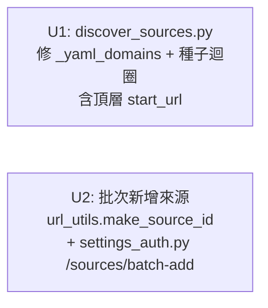

# feat: Source List Continuous Expansion

## Overview

來源清單目前有兩個相互獨立的限制：

1. **Bug（遺漏種子）**：`discover_sources.py` 的種子迴圈只讀 `sources:` 清單，忽略了 webui.yaml 頂層的 `start_url`（51cg）。實際上只有 91cg 一個站被用來探索外連，另一個主力站形同沒有參與。
2. **UI 缺口**：Settings 頁只有單筆新增來源的表單；roster 面板是唯讀的。想新增多個種子、或把 roster 中的 active 站升格為常態種子，必須手動修改 YAML，體驗差。

本計畫修復這兩個問題，讓來源清單可以持續擴充：先修正 discover 以充分利用所有已知主來源，再提供 WebUI 批次操作入口。

## Problem Frame

webui.yaml 的架構是「頂層主來源 + `sources:` 清單副來源」兩段式設計：

```yaml
source_id: 51cg          # 頂層主來源（直接爬取，但不被 discover 當種子）
start_url: https://51cg1.com/
sources:
- enabled: true
  source_id: 91cg        # 清單副來源（discover 讀這裡找種子）
  start_url: https://www.91cg1.com/
```

`discover_sources.py` 的 `_yaml_domains()`（收集「已知域名」集合）和種子迴圈都只讀 `sources:` 清單，兩個後果：
- 51cg1.com 不被當成種子 → 它的外連域名從未被探索
- 51cg1.com 不在「已知域名」集合 → 萬一其他站連到它，可能被誤列為 candidate

修正方向：讓 discover 把頂層 `start_url` 視為第 0 個種子，與 `sources:` 清單合併後一起探索。不改 YAML 架構（頂層設計有向後相容需求），只改 discover 讀取邏輯。

## Requirements Trace

- R1. `discover-sources` 把頂層 `start_url` + `sources:` 清單的所有站點都當種子使用（修 bug）
- R2. 頂層 `start_url` 的 hostname 在「已知域名」集合中，不會被 discover 誤列為候選（防漏洞）
- R3. WebUI 支援批次貼上多個 URL，一次新增多個來源到 `sources:` 清單
- R4. ~~WebUI Roster 面板有「加入種子」按鈕~~ → **延後至獨立計畫 feat: roster-to-seed-promotion**（超出本計畫核心目標 R1-R3）
- R5. 現有單筆新增 / 編輯 / 刪除 / 切換流程不受影響（向後相容）

## Scope Boundaries

- **不做**：統一頂層 `start_url` 與 `sources:` 為單一清單（架構重構，另計）
- **不做**：roster → seeds 升格（含手動按鈕）→ 延後至獨立計畫（roster promote 超出本計畫核心目標）
- **不做**：爬取深度設定（discover 深度已在計畫 001 決策為「首頁 + 友鏈頁」）
- **不做**：CSV/批次匯入 CSV 格式（textarea 一行一個 URL 已足夠）

## Context & Research

### Relevant Code and Patterns

- `cpost/cli/discover_sources.py:_yaml_domains()` — 只讀 `data.get("sources", [])` 缺頂層 start_url；需補 `data.get("start_url", "")`
- `cpost/cli/discover_sources.py:discover()` — 種子迴圈 `for src in sources:` 缺頂層來源；需在迴圈前注入一筆 `{"start_url": top_url, "source_id": top_sid}` 合成項目
- `cpost/webui/routers/settings_auth.py:_save_sources()` — 已有可複用的「合併覆蓋 raw config 並 save」工具函數；U2/U3 直接調用
- `cpost/webui/routers/settings_auth.py:_sources_partial()` — HTMX fragment 回傳，U2 批次新增後同樣回傳此 fragment
- `cpost/webui/templates/_sources_list.html` — 現有單筆 `<details>` 表單；批次表單以相同 `<details>` 結構追加
- `cpost/core/url_utils.host_of()` — 從 URL 抽 hostname，discover 和批次 add 都已用此函數
- `cpost/cli/discover_sources.py:_make_source_id` — 推導 source_id 的邏輯，U2 前置步驟移到 `url_utils.make_source_id` 共用
- `tests/test_discover_sources.py:_make_yaml()` — 目前只建 `{"sources": sources}` 不帶頂層欄位；需補一個帶頂層 start_url 的 YAML fixture

### Institutional Learnings

- `_save_sources()` 用 `load_raw()` 而非 `load()` merge，確保相對路徑不被展開為絕對路徑（#3 可攜性規則）
- HTMX swap target 是 `#sources-panel`，roster 目前沒有對應的 partial；U3 可複用 `/roster` GET 整頁刷新，或單獨建 `_roster_panel.html` partial

## Key Technical Decisions

- **頂層 start_url 注入 discover 種子清單，不改 YAML**：在 `discover()` 函數開頭，把頂層 `{"start_url": data.get("start_url"), "source_id": data.get("source_id", "")}` 合成一筆 dict，prepend 到種子清單。種子去重以 `host_of(start_url)` 為 key，確保頂層和 sources: 清單中相同 host 不重複爬。

- **批次新增用 textarea（一行一個 URL）**：最小實作成本，不需要新的資料格式。source_id 由 `host_of(url)` 推導（與 discover 邏輯一致）。invalid URL 和重複 source_id 各自記錄到回傳訊息，不 crash 整個批次。

- **source_id 推導邏輯立即抽出共用函數**：U2 batch-add 與 `discover_sources._make_source_id` 用相同邏輯，已有 2 個消費者，直接把 `_make_source_id` 移到 `cpost.core.url_utils`（或 `cpost.webui._helpers`）並讓兩個呼叫點都 import 共用版，消除 drift 風險。

## Open Questions

### Resolved During Planning

- Q: 頂層種子是否應該可被 skip（例如頂層 start_url 就是自己的站）？→ 不需要特別處理；種子本身的 hostname 會因為「外部域名過濾（seed_host != cand_host）」而不被自己發現為候選，邏輯正確。
- Q: 批次新增遇到重複 source_id 如何處理？→ 跟現有單筆新增一致，拋 ValidationError，但批次時只 skip 該行，繼續處理其他行（不 abort 整個批次）。
- Q: roster.py 能否直接 import settings_auth._save_sources？→ **確認無循環**：`settings_auth.py` 只 import `cpost.core.*` 和 `cpost.webui.routers._ctx`；`roster.py` 只 import `cpost.core.site_roster` 和 `cpost.webui.routers._ctx`。兩者無交叉依賴，直接 import 安全（relevant to future roster-to-seed-promotion plan）。

### Deferred to Implementation

（無）

## Implementation Units



U1 是獨立 bug fix，U2 是獨立 UI 功能，兩組可並行。Roster promote（原 U3）延後至獨立計畫。

---

- [ ] **U1: 修 `discover_sources.py` — 頂層種子補漏**

**Goal:** 讓 `discover-sources` 把頂層 `start_url` 也當作種子，並把它的 hostname 加入「已知域名」集合，修正只有一個有效種子的 bug。

**Requirements:** R1, R2

**Dependencies:** 無

**Files:**
- Modify: `cpost/cli/discover_sources.py`
- Modify: `tests/test_discover_sources.py`

**Approach:**
- `_yaml_domains(data)` 加一行：`if (top := host_of(str(data.get("start_url", "")))):  domains.add(top)`
- `discover()` 中，在 `sources = data.get("sources", [])` 之後，建立 `seeds` list：先從頂層組一筆 `{"start_url": data.get("start_url", ""), "source_id": data.get("source_id", "")}` 如果頂層 `start_url` 非空，prepend 到 `sources` 複本中。以 `host_of(start_url)` 為 key 去重（頂層和 sources: 清單的相同 host 只出現一次）。去重衝突時以頂層（先插入）為準（sources: 清單的同 host 項目丟棄）。
- 其餘迴圈邏輯不變，只是 `for src in sources:` 改為 `for src in seeds:`

**Patterns to follow:**
- `cpost/core/url_utils.host_of()` 做 hostname 抽取
- 現有 `_yaml_domains()` 的 dict 結構遍歷模式

**Test scenarios:**
- Happy path: YAML 只有頂層 `start_url`（無 `sources:` 清單）→ 頂層站被當種子，能探索到外部候選
- Happy path: YAML 頂層 + `sources:` 清單各一個站 → 兩個站都被當種子（各自的外連都被探索）
- **Critical: YAML 只有頂層 `start_url`（無 `sources:` 清單），另一個種子的頁面連到頂層 host → 頂層 host 已在 known，不被 emit 為候選（`already-known` 訊息）** — 這是 U1 主要修正的 correctness 場景
- Edge case: 頂層 `start_url` 和 `sources:` 清單中有相同 host → 去重後只爬一次（頂層設定優先）
- Edge case: 頂層 `start_url` 為空 → 不 crash，只用 `sources:` 清單中的種子（現有行為不變）
- Edge case: `max_total` 在頂層種子耗完前已達上限 → 後面的 `sources:` 種子 skip，log warning

**Verification:**
- `tests/test_discover_sources.py` 全綠（含新增的頂層種子測試）
- `discover()` 以只含頂層 start_url 的 YAML 呼叫，回傳值非空（至少一個候選）

---

- [ ] **U2: WebUI 批次新增來源**

**Goal:** 在 `_sources_list.html` 加一個批次貼上 textarea，讓使用者一次輸入多個 URL 並全部加入 `sources:` 清單。

**Requirements:** R3, R5

**Dependencies:** 無（獨立 UI 功能）

**Files:**
- Modify: `cpost/core/url_utils.py` — 新增 `make_source_id(host: str) -> str`（從 discover_sources 移入）
- Modify: `cpost/cli/discover_sources.py` — 更新 import，從 `cpost.core.url_utils` 使用 `make_source_id`
- Modify: `cpost/webui/templates/_sources_list.html` — 追加批次表單 `<details>` 區塊
- Modify: `cpost/webui/routers/settings_auth.py` — 新增 `POST /sources/batch-add` endpoint
- Modify: `tests/test_webui_settings.py` — 補 batch-add 測試
- Modify: `tests/test_url_utils.py` — 補 `make_source_id` 單元測試

**Approach:**
- HTML：在現有 `<details class="sources-add-form">` 下方加 `<details class="sources-batch-form"><summary>批次新增多個來源</summary>` 內含 `<textarea name="urls" placeholder="每行一個完整 URL，例：https://example.com/">` + submit，HTMX target 同為 `#sources-panel`
- **前置步驟（移動共用函數）**：把 `discover_sources._make_source_id` 移到 `cpost.core.url_utils.make_source_id`（signature 不變：`(host: str) -> str`）；更新 `discover_sources.py` 的 import，U2 endpoint 也 import 同一函數
- 後端 `sources_batch_add(urls: str = Form(""))`:
  1. 按 `\n` 拆行，strip 空白，過濾空行
  2. 每行呼叫 `host_of(line)`；若回傳空字串（例如純域名 `example.com` 缺 scheme）→ 記入 skipped list，附 "無效 URL" per-line 提示
  3. `host_of` 有值 → 呼叫 `is_safe_external_host(host)`；回傳 False（RFC-1918 / link-local / loopback 等）→ 記入 skipped list，附 "私有/保留位址" 提示
  4. 安全主機 → 呼叫 `make_source_id(host)` 推導 source_id；若 source_id 在現有 sources 清單中已存在 → skip，記入 skipped list
  5. 通過的條目用 `_save_sources(config_path, [...existing, *new_entries])` 一次 save
  6. 回傳 `_sources_partial(request)` 並帶 added/skipped 計數 hint（inline span 在面板頂部，下次 sources 操作自然覆蓋）

**Patterns to follow:**
- `settings_auth.py:sources_add()` 的 `_save_sources` + `_sources_partial` 回傳模式
- `_sources_list.html` 的 `<details>` 摺疊表單樣式

**Test scenarios:**
- Happy path: POST 3 個有效 URL（含 scheme）→ sources 清單增加 3 筆，source_id 從 host 推導
- Happy path: 其中一行重複 source_id → 該行 skip，其餘 2 筆成功新增；回傳 hint 說明 skipped
- Edge case: 全空 textarea → sources 清單不變（200，not 500）
- Edge case: 含空行和多餘空白 → 過濾後只處理非空行
- **Edge case: 某行為裸域名（`example.com` 無 scheme）→ `host_of` 回傳空，記入 skipped，回傳可見 "無效 URL" hint**（不默默丟棄）
- **Edge case: 某行為私有/保留位址（`http://192.168.1.1/` 或 `http://169.254.169.254/`）→ `is_safe_external_host` 回傳 False，記入 skipped，回傳可見 "私有/保留位址" hint**
- Error path: 全部行都重複或無效 → 回傳 200 but added=0，skipped hint 顯示

**Verification:**
- POST `/sources/batch-add` 帶 3 個不同含 scheme URL → GET `/settings` 顯示 3 個新來源在 sources 清單
- POST 帶裸域名 → 回傳 HTML 含 "跳過" 或 "無效" 提示，sources 清單不增加該條目

---

## System-Wide Impact

- **Interaction graph:** U1 改 discover_sources.py，只影響 CLI；不觸碰 pipeline.py 或 crawl 流程，現有 test_auto_pipeline / test_prep_pipeline 不受影響。U2 改 WebUI + url_utils，不觸碰 pipeline 或 scoring 邏輯。
- **Error propagation:** `_save_sources()` 失敗（ValidationError）→ U2 回傳 4xx HTML fragment，不 crash 整個 WebUI 進程。
- **State lifecycle risks:** U2 透過 `_save_sources()` 寫 YAML，與現有 `sources_add`/`sources_delete` 相同路徑，無新的並發寫入風險。
- **API surface parity:** 新增 `POST /sources/batch-add` endpoint；新增，不修改現有 endpoint 合約。
- **Unchanged invariants:** 頂層 `start_url`/`source_id` 欄位的語意不變；`sources:` 清單現有 CRUD 流程不變；roster DB schema 不變；discover 的輸出結果仍是 candidate tier，不直接 promote 為 active。

## Risks & Dependencies

| Risk | Mitigation |
|------|------------|
| 批次新增的 source_id 推導與 discover 不一致（drift） | **已決策**：把 `_make_source_id` 移到 `cpost.core.url_utils.make_source_id`，兩者共用同一函數，無 drift 風險 |
| U2 batch-add：使用者貼入裸域名（無 scheme）→ 默默丟棄無反饋 | 明確 per-line error hint；`host_of` 空字串 → 視為 invalid，回傳使用者可見訊息 |
| U2 batch-add：使用者貼入私有/保留位址（SSRF） | 呼叫 `is_safe_external_host(host)` 預驗，False 時記入 skipped 並顯示提示；co-locate 安全邏輯在寫入路徑 |
| U1 修改讓頂層 start_url 被自己的爬取結果誤加為 candidate | 頂層 hostname 已在 `_yaml_domains` 回傳的 known 集合，discover 的去重邏輯會 skip，測試明確覆蓋此 critical scenario |
| `max_total` 在頂層種子耗盡前已達上限，後續 sources: 種子靜默 skip | U1 種子清單頂層 prepend（頂層優先）+ `max_total` 達到時 log warning；行為符合使用者預期（頂層站比 sources: 清單更重要）|
| U2 重複 source_id 檢查範圍：只查 YAML sources，不查 roster | 與現有 `sources_add` 行為一致（roster 是動態站，YAML sources 是種子，兩者分開管理）|

## Sources & References

- Related plan: `docs/plans/2026-06-23-001-feat-auto-source-discovery-plan.md` (discover-sources 原始設計)
- Related code: `cpost/cli/discover_sources.py:_yaml_domains`, `cpost/cli/discover_sources.py:discover`
- Related code: `cpost/webui/routers/settings_auth.py:_save_sources`, `_sources_partial`
- Related code: `cpost/webui/templates/_sources_list.html` (現有單筆新增表單模式)
