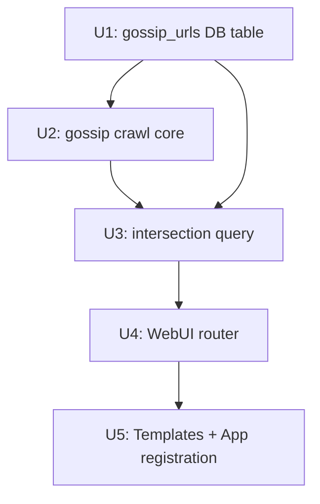

# feat: 吃瓜素材 — User URL Submission + On-Demand Crawl + Library Intersection

## Overview

在 WebUI 新增「吃瓜素材」工作區：用戶可自由投入 URL，系統爬取該 URL（使用現有 Scrapy 爬蟲）並把結果收進共用 library；同時對用戶投入的素材與自動化 pipeline（roster 來源）已爬到的瓜做**交集比對**，找出「市場上也在報」的話題，讓素材越積累越有力。

SQLite 新增 `gossip_urls` 表，記錄用戶歷次投入 + 爬取狀態，形成可持續累積的「素材庫」。

## Problem Frame

現有 `/scoops`（瓜清單）顯示的是 **roster 來源**自動爬到的瓜，用戶沒辦法把外部發現的「市場熱門頁面」直接丟進來比對。
用戶想要的工作流：
1. 在市場上發現某個吃瓜頁面/來源網站
2. 把 URL 丟到吃瓜素材頁面，一鍵爬取
3. 系統把爬到的文章收進 library，與自動化來源的瓜聚類對比
4. 「這篇瓜，我們自動化來源也爬到了」= 有**多源交集**，值得操作

每次投入 URL 都累積在 SQLite → 工具越用越強（歷史記錄 + 交集面越來越廣）。

## Requirements Trace

- R1. 用戶可在 `/gossip-materials` 頁面提交任意 URL（站點首頁或單篇文章）
- R2. 提交後可一鍵觸發爬取（使用 jobs 系統非同步執行，不阻塞 UI）
- R3. 爬到的文章以 `source_id = "user:{domain}"` 寫入 `library_items`，與 roster 來源共用聚類庫
- R4. `gossip_urls` 表持久記錄所有提交 URL、狀態、最後爬取時間、收到幾筆
- R5. 交集面板：列出同時有「用戶來源成員」+ 「roster 自動來源成員」的 cluster（多源交集）
- R6. 歷史素材清單：顯示所有曾提交的 URL + 爬取狀態 + 收到文章數，可重新觸發爬取
- R7. 單篇文章 URL（路徑不為根）→ 單頁抽取模式；站點首頁 URL → 多頁爬取模式（最多 `max_pages` 限制）

## Scope Boundaries

- **不做** WebUI 端刪除 gossip_url 記錄（避免意外清掉歷史；CLI 手動清 DB 即可）
- **不做** gossip 來源獨立的 item_regex / body_selector 覆寫 UI（沿用爬蟲 config defaults）
- **不做** 定時自動重新爬取（手動觸發即可）
- **不做** gossip 來源進入 site_roster（它們是用戶臨時投入，不納入自動 discover/monitor 流程）
- **不做** 更改現有 `/today` 或 `/scoops` 路由行為

## Context & Research

### Relevant Code and Patterns

- `cpost/core/library.py:_SCHEMA + _MIGRATIONS` — 標準 migration 模式（版本用 100+ offset 避碰）；`gossip_urls` 表用 migration 103 加入，與現有 library 同個 SQLite state file
- `cpost/core/library.py:upsert()` — 收新文章的入口，接受 `source_id` 參數；用戶來源以 `"user:{domain}"` 標記
- `cpost/cli/crawl_posts.py:CONFIG_DEFAULTS` — 爬取設定的 key 集合；`crawl_items()` 是 process-level 爬取函數，在 `cpost/core/pipeline.py` 中被 `crawl_all_sources()` 呼叫
- `cpost/core/pipeline.py:crawl_all_sources()` + `crawl_items()` — 目前的多源爬取入口，per-source 失敗隔離；`gossip_crawl.py` 包裝單 URL 爬取時採相同 subprocess 模式
- `cpost/core/scoop_pipeline.py:run_prep_pipeline()` — 爬取 → normalize → ingest → cluster → score 的標準串接；gossip crawl 呼叫相同的 normalize + ingest，但不重跑 cluster/score（cluster 保持 lazy：下次 prep 自動包進去）
- `cpost/core/jobs.py` — 非同步 job 系統（submit/get/set_current/report）；crawl job 完全照 `/today/prep` 的 `jobs.submit(_work)` 模式
- `cpost/webui/routers/scoops.py` + `scoops.html` — 現有的 cluster 列表 router + template 範本；`/gossip-materials` 的 intersection panel 採相同 HTML table 結構
- `cpost/webui/routers/_ctx.py:cfg_from_request()` — 從 request state 取 cfg dict，所有 router 共用模式
- `cpost/webui/app.py` — router 註冊入口

### Institutional Learnings

- Scrapy Twisted reactor 不能在同進程重啟 → 每次爬取必須走 subprocess（crawl_posts.py 已封裝好，直接用 `crawl_items()`）
- `library.py:upsert()` ON CONFLICT 保留首次 `ingested_at`，不覆寫 source_id（見 coalesce 邏輯）→ 用戶來源第一次入庫的 source_id 會被保留；若同 URL 已被 roster 源爬過，`source_id` 不會被 `"user:"` 前綴覆蓋
- WAL mode + busy_timeout 已在 `db.connect()` 設好；並行爬取/prep 不會互相鎖死

## Key Technical Decisions

- **共用 library，不建獨立表**：用戶來源文章寫入現有 `library_items`，以 `source_id = "user:{domain}"` 區分，cluster/score 邏輯不變；交集查詢只需在現有 cluster 表上做 JOIN。理由：避免雙庫維護，且 cluster 本就設計為跨源聚合。
- **不即時重跑 cluster/score**：爬取後只做 normalize + ingest；cluster/score 留給下次「開始備稿」或用戶手動觸發。理由：cluster 是批次計算，即時重跑代價高；用戶可在看完交集後點「開始備稿」得到更新的排名。
- **單頁 vs. 多頁以路徑深度判斷**：URL 路徑 = `/` 或空 → 多頁爬取模式（max_pages=50，較保守）；URL 有深路徑 → `max_pages=1`（只抓這一頁）。實作放在 `gossip_crawl.py:crawl_url()`。
- **source_id 格式**：`"user:{urlparse(url).netloc}"` — 域名加 `user:` 前綴，確保不與 roster source_id 撞名；roster source_id 由 YAML 設定，通常是短 slug（如 `51cg1`）。

## Open Questions

### Resolved During Planning

- **交集定義**：cluster 裡同時有 `source_id LIKE 'user:%'` 的成員 AND `source_id NOT LIKE 'user:%'` 的成員 → 就算交集。最簡單且直接反映「我投入的瓜，系統也爬到過」。
- **`gossip_urls` 放哪個 DB**：放 `state_path`（與 library 同一個 SQLite 檔），migration 103。理由：不增加新 DB 檔，連線管理最簡單，且 gossip_urls 與 library_items 同屬素材層。
- **爬取後是否自動聚類**：否，ingest 後不重跑 cluster/score，交集以現有 cluster 資料呈現。下次 prep 自動更新。

### Deferred to Implementation

- **`upsert()` 對 `source_id` 的 COALESCE 行為**：若同一篇文章已被 roster 源爬過（相同 canonical_url），再被用戶投入時 source_id 不會被 `"user:..."` 覆蓋（COALESCE 保留舊值）。這是預期行為——實作時驗證 COALESCE 方向是否符合「保留最早 source_id」的語意。

## High-Level Technical Design

> *下圖說明意圖，是方向性參考，非實作規格。*

```
用戶提交 URL（WebUI）
       │
       ▼
gossip_urls 表（submitted_at, status=pending）
       │
  點「爬取」
       │
       ▼
jobs.submit(gossip_crawl.crawl_url)
       │  subprocess Scrapy
       ▼
crawl_items() → NDJSON items
       │
       ▼
normalize_items.normalize_one() × N
       │
       ▼
library.upsert(source_id="user:{domain}")
       │
gossip_urls.item_count += N, status=done
       │
       ▼
交集查詢（不重跑 cluster/score）
  SELECT clusters 有 user:* 成員 AND 有非user:* 成員
       │
       ▼
/gossip-materials 頁面渲染交集清單
```

## Implementation Units



---

- [ ] **Unit 1: gossip_urls 表 + library.py 擴充**

**Goal:** 在現有 `library.py` 加入 `gossip_urls` 表及對應 CRUD，並加 migration 103。

**Requirements:** R4

**Dependencies:** 無

**Files:**
- Modify: `cpost/core/library.py`
- Test: `tests/test_library_store.py`（現有，擴充）

**Approach:**
- 在 `_SCHEMA` 末尾加入 `gossip_urls` table DDL（`url TEXT PRIMARY KEY`, `label TEXT`, `source_id TEXT`, `submitted_at TEXT NOT NULL`, `last_crawled_at TEXT`, `crawl_status TEXT DEFAULT 'pending'`, `item_count INTEGER DEFAULT 0`, `error_msg TEXT`）
- `_MIGRATIONS` 加 migration 103（ALTER 不適用新表，直接在 schema DDL 裡含 `CREATE TABLE IF NOT EXISTS` 即可）
- 新增函數：`submit_gossip_url(conn, url, label, source_id, now)`、`list_gossip_urls(conn)`、`update_gossip_crawl_status(conn, url, status, item_count, error_msg, now)`
- `list_gossip_urls` 回傳 list[dict]，按 submitted_at DESC 排序

**Patterns to follow:**
- `cpost/core/library.py:upsert()` — Row factory + Row dict 的標準寫法
- `cpost/core/site_roster.py:upsert_site()` — INSERT OR REPLACE 模式

**Test scenarios:**
- Happy path: `submit_gossip_url` 寫入後 `list_gossip_urls` 能回撈，欄位正確
- Edge case: 同 URL 第二次 submit → INSERT OR IGNORE（不覆蓋 submitted_at）
- `update_gossip_crawl_status` 更新 status/item_count/last_crawled_at 正確
- `list_gossip_urls` 在空表回傳空 list（不例外）

**Verification:** `test_library_store.py` 中 gossip_url 相關測試全過；`library.connect()` 可在含 migration 103 的 DB 上正常開啟。

---

- [ ] **Unit 2: gossip crawl core**

**Goal:** 封裝「爬單 URL → normalize → ingest」為一個可被 jobs 系統呼叫的函數。

**Requirements:** R2, R3, R7

**Dependencies:** Unit 1

**Files:**
- Create: `cpost/core/gossip_crawl.py`
- Test: `tests/test_gossip_crawl.py`（新建）

**Approach:**
- `crawl_url(url, cfg, progress_cb, now)` — 入口函數
- 單頁 vs. 多頁判斷：`urlparse(url).path in ('', '/')` → `max_pages=50`；否則 `max_pages=1`
- 組 per-source config dict（沿用 `crawl_posts.CONFIG_DEFAULTS`，覆寫 `start_url`, `source_id`, `max_pages`）
- `source_id = "user:" + urlparse(url).netloc`
- 呼叫 `pipeline.crawl_items(source_cfg, progress_cb=...)` 取得 raw items
- 逐一 `normalize_items.normalize_one(item)` → 失敗記 failed 清單，不中斷
- `library.upsert()` 寫入（需 `library.connect(cfg["state_path"])`）
- 回傳 `{"item_count": int, "failed": int}`
- 更新 `gossip_urls` 表狀態（`update_gossip_crawl_status`）

**Patterns to follow:**
- `cpost/core/scoop_pipeline.py:run_prep_pipeline()` — 相同的 normalize + ingest + failed 隔離模式
- `cpost/core/pipeline.py:crawl_items()` — 使用方式參考 `crawl_all_sources()`

**Test scenarios:**
- Happy path: mock `crawl_items` 回傳 2 篇 NDJSON → 驗 `library.upsert` 被呼叫 2 次，source_id 含 `user:` 前綴
- 單頁模式：路徑為 `/2024/article-title` → max_pages=1 被傳入 `crawl_items`
- 多頁模式：路徑為 `/` → max_pages=50
- normalize 失敗不中斷：1 篇 normalize 丟例外 → 另 1 篇仍入庫，回傳 `{"failed": 1}`
- `crawl_items` 例外（ExternalError）→ 整批失敗，status 更新為 `"failed"`，error_msg 記錄

**Verification:** 新測試全過；`gossip_crawl.crawl_url` 不寫任何 print 或 sys.stdout（同 crawl_posts 合約）。

---

- [ ] **Unit 3: intersection query**

**Goal:** 在 `library.py` 加一個函數，找出同時含用戶來源成員 + roster 來源成員的 cluster。

**Requirements:** R5

**Dependencies:** Unit 1（schema + CRUD）、Unit 2（`library_items` 需有 `user:` source_id 記錄才能產生交集結果）

**Files:**
- Modify: `cpost/core/library.py`
- Test: `tests/test_library_store.py`（擴充）

**Approach:**
- `list_intersection_clusters(conn)` → `list[dict]`
- SQL：
  ```sql
  SELECT c.* FROM clusters c
  WHERE EXISTS (
    SELECT 1 FROM library_items li
    WHERE li.cluster_id = c.cluster_id
      AND li.source_id LIKE 'user:%'
  )
  AND EXISTS (
    SELECT 1 FROM library_items li2
    WHERE li2.cluster_id = c.cluster_id
      AND (li2.source_id IS NULL OR li2.source_id NOT LIKE 'user:%')
  )
  ORDER BY COALESCE(c.score, 0) DESC
  ```
- 回傳與 `list_clusters()` 相同結構的 dict list（讓 template 可重用）
- 同時 attach `sources` 欄位（distinct source_ids），與 `_scoops()` 的邏輯一致

**Patterns to follow:**
- `cpost/core/library.py:list_clusters()` — row_factory + Row dict 轉換模式

**Test scenarios:**
- Happy path: cluster 有 `user:foo.com` + `51cg1` 兩個成員 → 出現在結果
- 無交集：cluster 只有 `user:foo.com` → 不出現
- 無交集：cluster 只有 `51cg1` → 不出現
- 空庫回傳空 list（不例外）
- 多個交集 cluster 按 score DESC 排序正確

**Verification:** 測試全過；函數在空 gossip_urls 環境下不影響現有 `list_clusters()` 行為。

---

- [ ] **Unit 4: WebUI router**

**Goal:** 新增 `/gossip-materials` endpoint 群組，處理 URL 提交、爬取 job 啟動、job 狀態輪詢。

**Requirements:** R1, R2, R6

**Dependencies:** Unit 2, Unit 3

**Files:**
- Create: `cpost/webui/routers/gossip_materials.py`
- Modify: `cpost/webui/app.py`（register router）
- Test: `tests/test_webui_gossip_materials.py`（新建）

**Approach:**
- `GET /gossip-materials` — 讀 `list_gossip_urls()` + `list_intersection_clusters()`，渲染 `gossip_materials.html`
- `POST /gossip-materials/submit` — 接收 Form `url`, `label`；呼叫 `submit_gossip_url()`；redirect to GET（PRG 模式，同現有 roster.py）
- `POST /gossip-materials/crawl` — 接收 Form `url`；`jobs.submit(_work)` 啟動 gossip_crawl；回傳 `_gossip_job.html`（HTMX swap）
- `GET /gossip-materials/jobs/{job_id}` — job 狀態輪詢，回傳 `_gossip_job.html`（同 `_today_job.html` 模式）
- `_work(job)` closure：呼叫 `gossip_crawl.crawl_url(url, cfg, progress_cb=lambda m: jobs.report(job, m), now=utcnow())`

**Patterns to follow:**
- `cpost/webui/routers/scoops.py` — `cfg_from_request(request)` + templates pattern
- `cpost/webui/routers/scoops.py:start_prep()` — jobs.submit + `_today_job.html` 回傳模式

**Test scenarios:**
- Happy path GET：空 gossip_urls → 頁面渲染正常（200, 含 "吃瓜素材" heading）
- POST /submit：有效 URL 寫入 DB，redirect 到 GET
- POST /submit：空 URL 或非 http/https → 400 + 錯誤訊息
- POST /crawl：啟動 job，回傳含 job_id 的 HTML（狀態 pending）
- GET /jobs/{id}：job 不存在 → 404
- Integration: submit URL → crawl → GET 頁面含該 URL 記錄（status 欄位可見）

**Verification:** 所有 route 回傳 200/302/400，job 系統正常啟動；`test_webui_gossip_materials.py` 全過。

---

- [ ] **Unit 5: Templates + 導覽整合**

**Goal:** 建立 gossip materials 頁面 templates，並在 base.html 導覽列加入入口連結。

**Requirements:** R1, R5, R6

**Dependencies:** Unit 4

**Files:**
- Create: `cpost/webui/templates/gossip_materials.html`
- Create: `cpost/webui/templates/_gossip_job.html`（job 狀態 partial）
- Modify: `cpost/webui/templates/base.html`（加導覽連結）
- Test: Unit 4 的 `test_webui_gossip_materials.py` 已覆蓋渲染

**Approach:**
- `gossip_materials.html` extends `base.html`，三個區塊：
  1. **URL 投入區**：`<form hx-post="/gossip-materials/crawl">` URL 輸入 + label + submit 按鈕；下方顯示 job status（HTMX swap target）
  2. **素材清單**：table 列出 `gossip_urls` 記錄（URL、label、狀態、文章數、最後爬取時間、「重新爬取」按鈕）
  3. **瓜交集**：table 列出 `intersection_clusters`（同 `_scoop_list.html` 的欄位：代表標題 / 來源數 / 品質分 / 來源）；無交集時顯示 hint「尚無多源交集，爬取更多素材後再試」
- `_gossip_job.html`：完全照 `_today_job.html` 結構，只換文案
- `base.html`：在現有導覽列加 `<a href="/gossip-materials">吃瓜素材</a>`

**Patterns to follow:**
- `cpost/webui/templates/today.html` + `_today_job.html` — job 狀態 HTMX 輪詢模式
- `cpost/webui/templates/scoops.html` + `_scoop_list.html` — cluster table 結構

**Test scenarios:**
- `Test expectation: none` — 純 template/HTML；U4 的整合測試已驗渲染正確性
- （手動驗）URL 表單送出 → job status 出現 → 完成後 item_count 更新 → 交集面板出現新條目

**Verification:** 瀏覽器打開 `/gossip-materials`，三個區塊正確渲染；投入 URL → 爬取完成後交集面板更新（下次 prep 後）。

## System-Wide Impact

- **Interaction graph:** 新 router 只讀 `library.py`（gossip_url CRUD + intersection query）和 `jobs.py`；不修改現有 `/today`、`/scoops`、`crawl_all_sources` 路徑
- **Error propagation:** gossip crawl 例外 → `gossip_urls.crawl_status = "failed"` + `error_msg`；不拋到 UI，job 完成狀態顯示錯誤訊息
- **State lifecycle risks:** `library.upsert` ON CONFLICT 保留舊 `source_id`——若同篇文章已被 roster 源爬過，source_id 不會被 `user:` 覆蓋，交集統計可能低估。這是已知行為（見 Deferred Questions）
- **Unchanged invariants:** `/today`、`/scoops`、prep/generate pipeline 完全不變；`library_items` 表不加新欄位；現有測試不受影響
- **Integration coverage:** Unit 4 需含 submit → crawl（mock crawl_url）→ GET 的完整路徑測試

## Risks & Dependencies

| Risk | Mitigation |
|------|------------|
| 用戶投入惡意 URL（SSRF） | 驗證 URL scheme 必須 `http/https`；crawl_posts 只爬同 host（item_regex + allow_regex），不跟出站外連 |
| 爬取大型站點（max_pages 太多） | 用戶提交首頁時 max_pages=50（較現有 prep 的 200 保守）；可後續在 UI 加 max_pages 選項 |
| `user:` source_id 與 roster source_id 撞名 | roster source_id 是短 slug（如 `51cg1`），不含 `:`；LIKE `'user:%'` 判斷安全 |
| 交集面板顯示舊資料（ingest 後未重跑 cluster） | 文案說明「交集以目前 cluster 快照為準，開始備稿後更新」；屬預期行為 |

## Sources & References

- 現有 scoop pipeline: `cpost/core/scoop_pipeline.py`, `cpost/core/pipeline.py`
- 爬取模式: `cpost/cli/crawl_posts.py:CONFIG_DEFAULTS`, `pipeline.crawl_items()`
- Library/Cluster 結構: `cpost/core/library.py`
- Job 系統: `cpost/core/jobs.py`
- 參考 router: `cpost/webui/routers/scoops.py`
